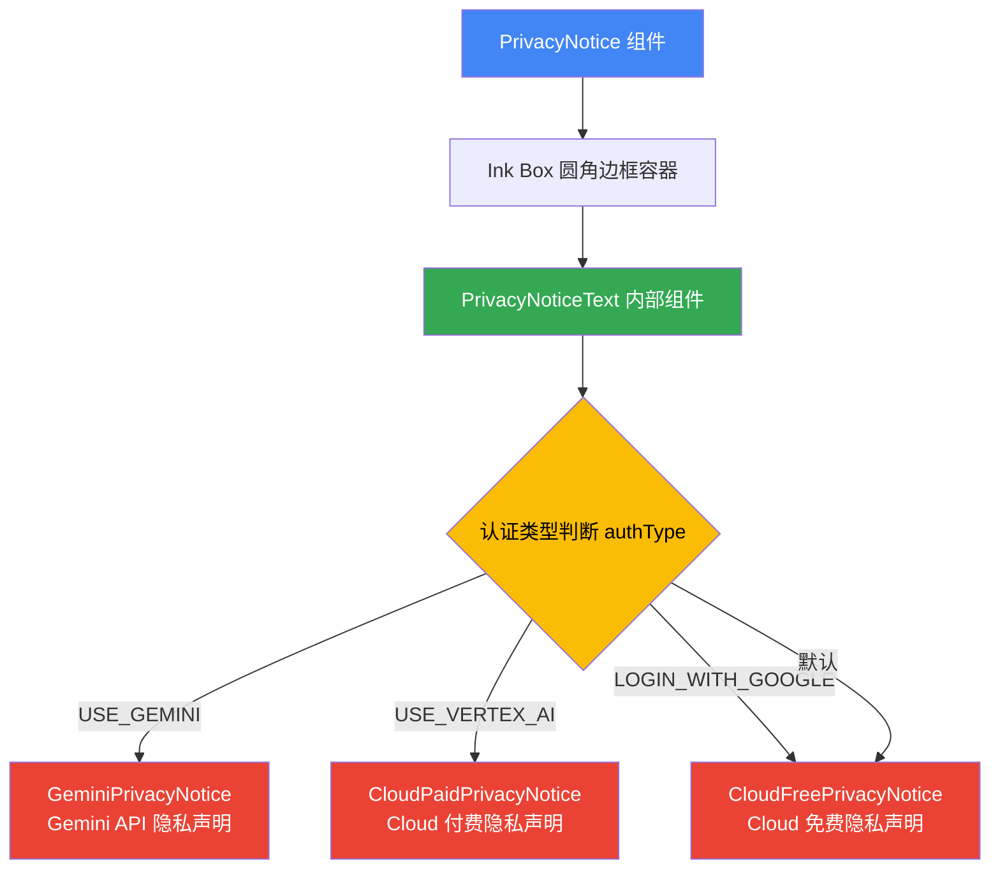

# PrivacyNotice.tsx

## 概述

`PrivacyNotice` 是隐私声明模块的**顶层路由组件**，它根据用户当前的认证类型（`AuthType`）动态选择并渲染对应的隐私声明子组件。该组件充当了一个策略分发器的角色：根据配置中的认证方式，将用户引导到 Gemini API 隐私声明、Vertex AI（Cloud 付费）隐私声明或 Cloud 免费隐私声明中的某一个。

## 架构图（Mermaid）



## 核心组件

### 1. PrivacyNoticeProps 接口

```typescript
interface PrivacyNoticeProps {
  onExit: () => void;
  config: Config;
}
```

| 属性 | 类型 | 说明 |
|------|------|------|
| `onExit` | `() => void` | 退出隐私声明界面时的回调函数 |
| `config` | `Config` | 应用配置对象，用于获取当前的认证类型 |

### 2. PrivacyNoticeText（内部组件）

这是一个**未导出**的内部函数组件，负责核心的路由逻辑。它从 `config` 中提取 `authType`，然后通过 `switch` 语句选择对应的隐私声明组件。

#### 认证类型与组件映射

| AuthType 枚举值 | 渲染组件 | 说明 |
|-----------------|---------|------|
| `AuthType.USE_GEMINI` | `GeminiPrivacyNotice` | 使用 Gemini API 密钥认证 |
| `AuthType.USE_VERTEX_AI` | `CloudPaidPrivacyNotice` | 使用 Vertex AI（Google Cloud 付费服务）认证 |
| `AuthType.LOGIN_WITH_GOOGLE` | `CloudFreePrivacyNotice` | 使用 Google 账号登录（免费层级） |
| 默认（未匹配） | `CloudFreePrivacyNotice` | 默认回退到 Cloud 免费隐私声明 |

#### 关键逻辑

```typescript
const authType = config.getContentGeneratorConfig()?.authType;
```

通过 `config.getContentGeneratorConfig()` 获取内容生成器配置，再从中提取 `authType`。使用了可选链操作符 `?.`，确保在配置为空时不会报错。

### 3. PrivacyNotice（导出组件）

这是对外导出的主组件，职责非常简单：

- 提供一个带圆角边框（`borderStyle="round"`）、内边距为 1（`padding={1}`）的 `Box` 容器。
- 在容器内渲染 `PrivacyNoticeText` 组件。

```typescript
export const PrivacyNotice = ({ onExit, config }: PrivacyNoticeProps) => (
  <Box borderStyle="round" padding={1} flexDirection="column">
    <PrivacyNoticeText config={config} onExit={onExit} />
  </Box>
);
```

## 依赖关系

### 内部依赖

| 模块 | 路径 | 用途 |
|------|------|------|
| `GeminiPrivacyNotice` | `./GeminiPrivacyNotice.js` | Gemini API 密钥认证的隐私声明组件 |
| `CloudPaidPrivacyNotice` | `./CloudPaidPrivacyNotice.js` | Vertex AI 付费认证的隐私声明组件 |
| `CloudFreePrivacyNotice` | `./CloudFreePrivacyNotice.js` | Google 免费登录认证的隐私声明组件 |

### 外部依赖

| 包名 | 导入项 | 用途 |
|------|--------|------|
| `ink` | `Box` | Ink 框架的布局容器组件 |
| `@google/gemini-cli-core` | `Config` (type), `AuthType` | 核心包中的配置类型和认证类型枚举 |

## 关键实现细节

1. **策略模式（Strategy Pattern）**：组件采用策略模式，通过 `authType` 动态选择不同的隐私声明实现。这种设计使得新增认证类型时只需添加新的 `case` 分支和对应的组件。

2. **内部组件分离**：`PrivacyNoticeText` 作为内部组件未被导出，它负责纯逻辑（路由选择），而导出的 `PrivacyNotice` 负责外观（边框容器）。这是一种关注点分离的良好实践。

3. **默认回退策略**：`switch` 语句中 `LOGIN_WITH_GOOGLE` 和 `default` 共用同一个分支，意味着当认证类型未知或未设置时，默认展示 Cloud 免费层级的隐私声明。这是一种安全的降级策略。

4. **Props 透传**：`onExit` 回调被透传到每个子隐私声明组件中，保证每个子组件都能独立处理退出逻辑。注意 `CloudFreePrivacyNotice` 除了 `onExit` 外还额外接收 `config` 属性，说明该组件可能需要更多配置信息来展示内容。

5. **可选链安全访问**：`config.getContentGeneratorConfig()?.authType` 使用可选链确保即使 `getContentGeneratorConfig()` 返回 `undefined` 或 `null`，也不会抛出异常，而是 `authType` 为 `undefined`，从而走入 `default` 分支。
