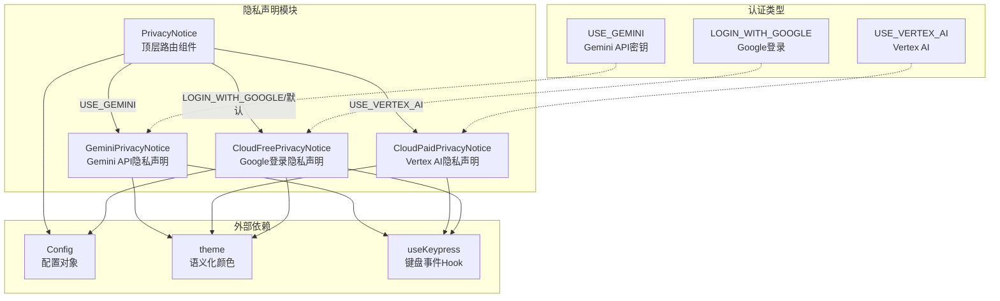
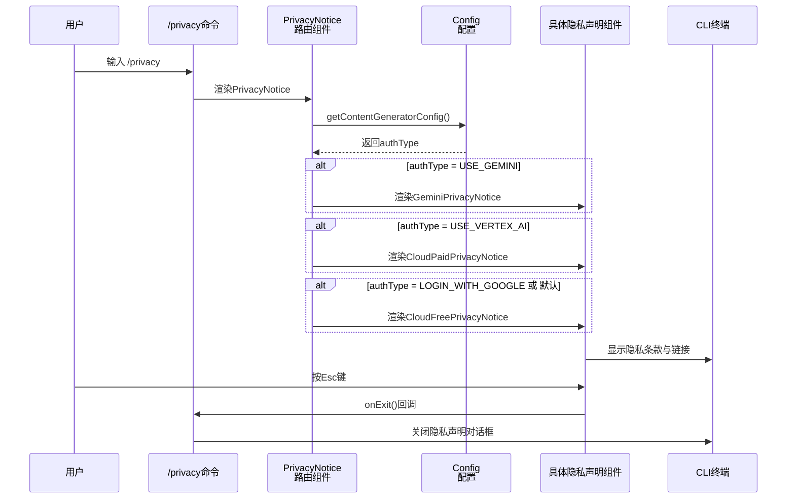

# privacy - 隐私声明模块

## 概述

`privacy` 目录实现了 Gemini CLI 的隐私声明 UI 组件。根据用户选择的不同认证方式（Gemini API Key、Vertex AI、Google 登录），展示对应的隐私政策和服务条款通知。该模块采用策略模式，由顶层 `PrivacyNotice` 组件根据认证类型自动分发到具体的隐私声明子组件。

## 目录结构

```
privacy/
├── PrivacyNotice.tsx                   # 顶层路由组件，按认证类型分发
├── PrivacyNotice.test.tsx              # PrivacyNotice 单元测试
├── GeminiPrivacyNotice.tsx             # Gemini API Key 隐私声明
├── GeminiPrivacyNotice.test.tsx        # GeminiPrivacyNotice 单元测试
├── CloudPaidPrivacyNotice.tsx          # Vertex AI（付费云服务）隐私声明
├── CloudPaidPrivacyNotice.test.tsx     # CloudPaidPrivacyNotice 单元测试
├── CloudFreePrivacyNotice.tsx          # Google 登录（免费云服务）隐私声明
└── CloudFreePrivacyNotice.test.tsx     # CloudFreePrivacyNotice 单元测试
```

## 架构图



## 核心组件

### PrivacyNotice.tsx - 顶层路由组件

接收 `config` 和 `onExit` 回调，通过 `config.getContentGeneratorConfig()?.authType` 获取当前认证类型，使用 `switch` 语句分发到对应的隐私声明组件：

| 认证类型 | 对应组件 |
|---------|---------|
| `AuthType.USE_GEMINI` | `GeminiPrivacyNotice` |
| `AuthType.USE_VERTEX_AI` | `CloudPaidPrivacyNotice` |
| `AuthType.LOGIN_WITH_GOOGLE` / 默认 | `CloudFreePrivacyNotice` |

外层使用 Ink 的 `Box` 组件包裹，统一应用圆角边框和内边距样式。

### GeminiPrivacyNotice.tsx - Gemini API 隐私声明

展示使用 Gemini API 时的法律条款通知，包含以下引用链接：
- Gemini API 概述文档
- Google AI Studio
- Google API 服务条款
- Gemini API 附加服务条款

使用 `useKeypress` Hook 监听 Esc 键退出。

### CloudPaidPrivacyNotice.tsx - Vertex AI 隐私声明

展示使用 Vertex AI（付费云服务）时的隐私政策通知，内容针对企业级付费用户。

### CloudFreePrivacyNotice.tsx - Google 登录隐私声明

展示通过 Google 账号登录（免费层级）时的隐私政策通知，额外接收 `config` 参数以获取与免费账户相关的配置信息。

## 依赖关系

| 依赖 | 用途 |
|------|------|
| `@google/gemini-cli-core` | `Config` 配置类、`AuthType` 认证类型枚举 |
| `ink` | `Box`、`Text`、`Newline` 组件用于 CLI 渲染 |
| `../semantic-colors.js` | `theme` 主题颜色系统 |
| `../hooks/useKeypress.js` | `useKeypress` Hook 监听键盘退出事件 |

## 数据流


