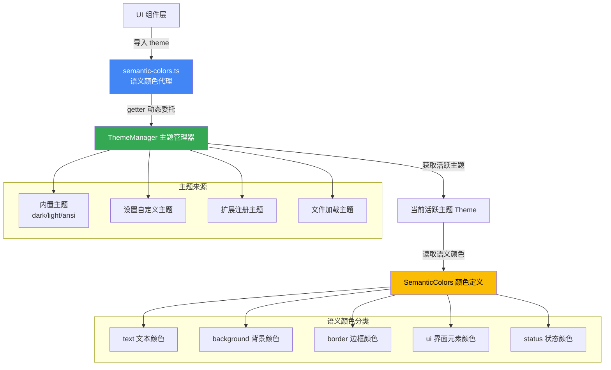

# semantic-colors.ts

## 概述

`semantic-colors.ts` 是 Gemini CLI 主题系统的**语义颜色代理层**。它导出一个全局的 `theme` 对象，作为整个 UI 层访问颜色的唯一入口。该对象通过 JavaScript 的 getter 属性实现了**动态代理模式**，每次访问颜色属性时都会从 `ThemeManager` 单例中实时获取当前活跃主题的语义颜色，从而确保主题切换时所有组件能自动获取最新的颜色值，无需重新赋值或订阅事件。

## 架构图（Mermaid）



## 核心组件

### 1. theme 导出对象

```typescript
export const theme: SemanticColors = {
  get text()       { return themeManager.getSemanticColors().text; },
  get background() { return themeManager.getSemanticColors().background; },
  get border()     { return themeManager.getSemanticColors().border; },
  get ui()         { return themeManager.getSemanticColors().ui; },
  get status()     { return themeManager.getSemanticColors().status; },
};
```

该对象实现了 `SemanticColors` 接口，包含 5 个 getter 属性，每个 getter 在被访问时都会实时调用 `themeManager.getSemanticColors()` 获取最新值。

### 2. SemanticColors 接口结构

`theme` 对象遵循的类型定义（来自 `semantic-tokens.ts`）：

#### text（文本颜色）

| 属性 | 类型 | 语义说明 |
|------|------|---------|
| `primary` | `string` | 主要文本颜色，用于正文内容 |
| `secondary` | `string` | 次要文本颜色，用于辅助信息、提示文字 |
| `link` | `string` | 链接文本颜色 |
| `accent` | `string` | 强调文本颜色，用于标题、高亮关键词 |
| `response` | `string` | AI 响应文本颜色 |

#### background（背景颜色）

| 属性 | 类型 | 语义说明 |
|------|------|---------|
| `primary` | `string` | 主背景颜色 |
| `message` | `string` | 消息区域背景颜色 |
| `input` | `string` | 输入框背景颜色 |
| `focus` | `string` | 聚焦状态背景颜色 |
| `diff.added` | `string` | Diff 新增内容背景色 |
| `diff.removed` | `string` | Diff 删除内容背景色 |

#### border（边框颜色）

| 属性 | 类型 | 语义说明 |
|------|------|---------|
| `default` | `string` | 默认边框颜色 |

#### ui（界面元素颜色）

| 属性 | 类型 | 语义说明 |
|------|------|---------|
| `comment` | `string` | 注释文本颜色 |
| `symbol` | `string` | 符号/图标颜色 |
| `active` | `string` | 激活状态颜色 |
| `dark` | `string` | 深色元素颜色 |
| `focus` | `string` | 聚焦指示颜色 |
| `gradient` | `string[] \| undefined` | 渐变色数组（可选） |

#### status（状态颜色）

| 属性 | 类型 | 语义说明 |
|------|------|---------|
| `error` | `string` | 错误状态颜色（红色系） |
| `success` | `string` | 成功状态颜色（绿色系） |
| `warning` | `string` | 警告状态颜色（黄色系） |

## 依赖关系

### 内部依赖

| 模块 | 路径 | 用途 |
|------|------|------|
| `themeManager` | `./themes/theme-manager.js` | 主题管理器单例，提供 `getSemanticColors()` 方法获取当前活跃主题的语义颜色 |
| `SemanticColors` (type) | `./themes/semantic-tokens.js` | 语义颜色的 TypeScript 接口定义 |

### 外部依赖

无外部依赖。

## 关键实现细节

1. **动态代理模式（Proxy-like Pattern）**：`theme` 对象的所有属性都使用 `get` 访问器（getter）而非静态值。这意味着每次读取 `theme.text.primary` 时，都会经历以下调用链：
   - 触发 `text` getter
   - 调用 `themeManager.getSemanticColors()`
   - `ThemeManager` 检查缓存，若命中则返回缓存值
   - 从返回的 `SemanticColors` 对象中提取 `.text` 子对象
   - 最终访问 `.primary` 属性

2. **主题热切换支持**：由于使用 getter 而非静态赋值，当用户通过 `themeManager.setActiveTheme()` 切换主题时，所有引用了 `theme` 对象的组件在下一次渲染时自动获取新主题的颜色，无需任何额外的状态管理或事件订阅机制。

3. **ThemeManager 的缓存机制**：虽然每次属性访问都调用 `getSemanticColors()`，但 `ThemeManager` 内部实现了基于 `cacheKey`（`${themeName}:${terminalBackground}`）的缓存策略。只有在主题切换或终端背景色变化时才会重新计算颜色，避免了重复计算的性能开销。

4. **终端背景色自适应**：`ThemeManager.getSemanticColors()` 在计算颜色时会考虑终端的实际背景色（`terminalBackground`）。如果终端背景色与当前主题兼容，会动态调整 `background`、`border` 和 `ui` 类别中的某些颜色值，通过颜色插值（`interpolateColor`）生成与终端背景色协调的衍生色。

5. **模块级单例**：`theme` 是一个模块级常量（`export const`），整个应用中只存在一个实例。所有 UI 组件通过 `import { theme } from '../semantic-colors.js'` 引用同一个对象。

6. **类型安全**：`theme` 对象被显式标注为 `SemanticColors` 类型，确保 TypeScript 编译器能够对所有颜色属性的访问进行类型检查，防止拼写错误或使用不存在的属性。
