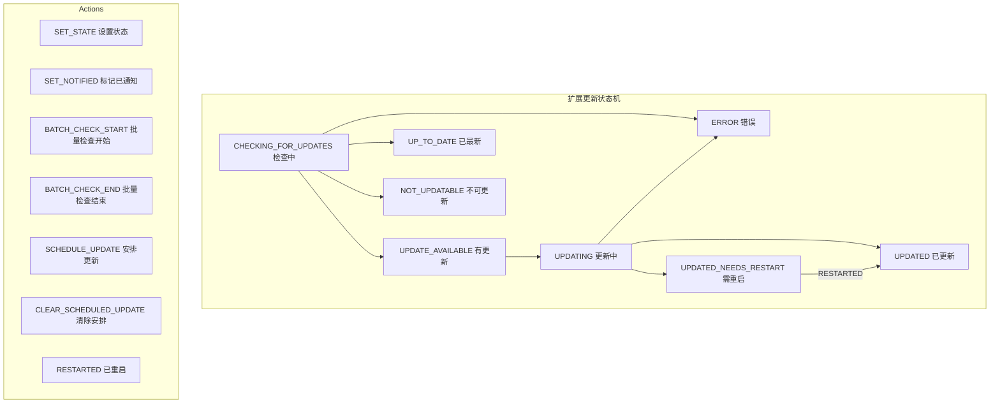

# state

## 概述

`state` 目录包含 UI 层的状态管理模块，使用 Reducer 模式管理复杂的状态变更逻辑。目前主要包含扩展更新状态的管理。

## 目录结构

```
state/
└── extensions.ts  # 扩展更新状态管理（Reducer）
```

## 架构图



## 核心组件

### `ExtensionUpdateState` 枚举

定义扩展更新的所有可能状态：

| 状态 | 说明 |
|------|------|
| `CHECKING_FOR_UPDATES` | 正在检查更新 |
| `UPDATE_AVAILABLE` | 有可用更新 |
| `UPDATING` | 正在更新 |
| `UPDATED` | 更新完成 |
| `UPDATED_NEEDS_RESTART` | 更新完成但需要重启 |
| `UP_TO_DATE` | 已是最新版本 |
| `ERROR` | 更新出错 |
| `NOT_UPDATABLE` | 不支持更新 |
| `UNKNOWN` | 未知状态 |

### `ExtensionUpdatesState` 接口

```typescript
interface ExtensionUpdatesState {
  extensionStatuses: Map<string, ExtensionUpdateStatus>;  // 每个扩展的状态
  batchChecksInProgress: number;  // 正在进行的批量检查数
  scheduledUpdate: ScheduledUpdate | null;  // 已安排的更新任务
}
```

### `extensionUpdatesReducer`

Reducer 函数，处理以下 Action 类型：

| Action | 说明 |
|--------|------|
| `SET_STATE` | 设置指定扩展的更新状态 |
| `SET_NOTIFIED` | 标记扩展的更新通知已显示 |
| `BATCH_CHECK_START` | 批量检查开始（计数 +1） |
| `BATCH_CHECK_END` | 批量检查结束（计数 -1） |
| `SCHEDULE_UPDATE` | 安排一个更新任务（可合并多个） |
| `CLEAR_SCHEDULED_UPDATE` | 清除已安排的更新 |
| `RESTARTED` | 扩展重启完成，将 `UPDATED_NEEDS_RESTART` 转为 `UPDATED` |

关键设计：
- 使用不可变更新模式（每次返回新对象）
- 对比前后状态避免不必要的更新
- 安排的更新支持合并（多个 `SCHEDULE_UPDATE` 合并为一个）
- `onCompleteCallbacks` 支持多个回调在更新完成后执行

## 依赖关系

### 内部依赖
- `../../config/extension.ts`: `ExtensionUpdateInfo` 类型
- `@google/gemini-cli-core`: `checkExhaustive` 穷尽检查

### 外部依赖
- 无

## 数据流

### 扩展更新流程
1. 应用启动时 `useExtensionUpdates` hook 触发批量检查
2. Dispatch `BATCH_CHECK_START`
3. 对每个扩展检查更新，dispatch `SET_STATE` 设置各自状态
4. Dispatch `BATCH_CHECK_END`
5. 如果有可用更新，显示通知并 dispatch `SET_NOTIFIED`
6. 用户确认更新 -> dispatch `SCHEDULE_UPDATE`
7. 执行更新 -> dispatch `SET_STATE(UPDATING)` -> `SET_STATE(UPDATED)`
8. 需要重启的扩展等待重启 -> dispatch `RESTARTED`
