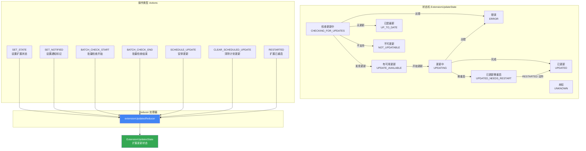

# extensions.ts

## 概述

`extensions.ts` 是 Gemini CLI 扩展更新状态管理模块，采用经典的 **Redux 风格 Reducer 模式** 管理所有扩展的更新状态。该模块定义了扩展更新的完整状态机（9 种状态）、7 种操作类型（Action）、状态数据结构以及纯函数 reducer。它是 UI 层中扩展更新功能的核心状态逻辑，负责跟踪每个扩展的更新检查、下载、安装、重启等全生命周期状态。

## 架构图（Mermaid）



## 核心组件

### 1. ExtensionUpdateState 枚举

定义扩展更新的 9 种可能状态：

```typescript
export enum ExtensionUpdateState {
  CHECKING_FOR_UPDATES = 'checking for updates',
  UPDATED_NEEDS_RESTART = 'updated, needs restart',
  UPDATED = 'updated',
  UPDATING = 'updating',
  UPDATE_AVAILABLE = 'update available',
  UP_TO_DATE = 'up to date',
  ERROR = 'error',
  NOT_UPDATABLE = 'not updatable',
  UNKNOWN = 'unknown',
}
```

| 枚举值 | 字符串值 | 说明 |
|--------|---------|------|
| `CHECKING_FOR_UPDATES` | `'checking for updates'` | 正在检查该扩展是否有可用更新 |
| `UPDATE_AVAILABLE` | `'update available'` | 检测到有可用更新 |
| `UPDATING` | `'updating'` | 正在执行更新操作 |
| `UPDATED_NEEDS_RESTART` | `'updated, needs restart'` | 更新完成但需要重启才能生效 |
| `UPDATED` | `'updated'` | 更新完成且已生效 |
| `UP_TO_DATE` | `'up to date'` | 已是最新版本，无需更新 |
| `ERROR` | `'error'` | 更新过程中发生错误 |
| `NOT_UPDATABLE` | `'not updatable'` | 该扩展不支持更新（如本地开发扩展） |
| `UNKNOWN` | `'unknown'` | 状态未知 |

### 2. 数据接口

#### ExtensionUpdateStatus

单个扩展的更新状态记录：

```typescript
export interface ExtensionUpdateStatus {
  status: ExtensionUpdateState;  // 当前更新状态
  notified: boolean;             // 是否已向用户发出通知
}
```

#### ExtensionUpdatesState

全局扩展更新状态：

```typescript
export interface ExtensionUpdatesState {
  extensionStatuses: Map<string, ExtensionUpdateStatus>;  // 扩展名 → 状态映射
  batchChecksInProgress: number;                          // 正在进行的批量检查数
  scheduledUpdate: ScheduledUpdate | null;                // 计划中的更新任务
}
```

| 字段 | 类型 | 说明 |
|------|------|------|
| `extensionStatuses` | `Map<string, ExtensionUpdateStatus>` | 以扩展名为 key 的状态映射表 |
| `batchChecksInProgress` | `number` | 当前正在执行的批量更新检查计数器（支持嵌套） |
| `scheduledUpdate` | `ScheduledUpdate \| null` | 当前排队等待执行的更新任务，为 null 表示无待执行更新 |

#### ScheduledUpdate

计划更新任务的描述：

```typescript
export interface ScheduledUpdate {
  names: string[] | null;               // 待更新的扩展名列表
  all: boolean;                         // 是否更新所有扩展
  onCompleteCallbacks: OnCompleteUpdate[]; // 更新完成后的回调函数列表
}
```

#### ScheduleUpdateArgs

调度更新的参数：

```typescript
export interface ScheduleUpdateArgs {
  names: string[] | null;
  all: boolean;
  onComplete: OnCompleteUpdate;
}
```

#### OnCompleteUpdate

更新完成回调类型：

```typescript
type OnCompleteUpdate = (updateInfos: ExtensionUpdateInfo[]) => void;
```

### 3. initialExtensionUpdatesState（初始状态）

```typescript
export const initialExtensionUpdatesState: ExtensionUpdatesState = {
  extensionStatuses: new Map(),
  batchChecksInProgress: 0,
  scheduledUpdate: null,
};
```

空映射表、零计数器、无计划更新 -- 表示应用启动时没有任何扩展更新活动。

### 4. ExtensionUpdateAction（联合类型）

定义了 7 种操作类型的可辨识联合（Discriminated Union）：

| Action 类型 | Payload | 说明 |
|-------------|---------|------|
| `SET_STATE` | `{ name: string; state: ExtensionUpdateState }` | 设置指定扩展的更新状态 |
| `SET_NOTIFIED` | `{ name: string; notified: boolean }` | 标记指定扩展的通知状态 |
| `BATCH_CHECK_START` | 无 | 批量检查计数器 +1 |
| `BATCH_CHECK_END` | 无 | 批量检查计数器 -1 |
| `SCHEDULE_UPDATE` | `ScheduleUpdateArgs` | 安排一次扩展更新任务 |
| `CLEAR_SCHEDULED_UPDATE` | 无 | 清除当前计划的更新任务 |
| `RESTARTED` | `{ name: string }` | 标记扩展已完成重启 |

### 5. extensionUpdatesReducer（Reducer 函数）

纯函数 reducer，接收当前状态和 action，返回新状态。

```typescript
export function extensionUpdatesReducer(
  state: ExtensionUpdatesState,
  action: ExtensionUpdateAction,
): ExtensionUpdatesState
```

#### 各 case 详细行为

**SET_STATE**：
- 如果扩展当前状态已与目标状态相同，直接返回原 state（避免不必要的重渲染）
- 否则创建新的 Map，设置新状态，`notified` 重置为 `false`

**SET_NOTIFIED**：
- 如果扩展不存在于映射表中，或 `notified` 值未变化，返回原 state
- 否则创建新的 Map，仅更新 `notified` 字段

**BATCH_CHECK_START / BATCH_CHECK_END**：
- 简单地对 `batchChecksInProgress` 计数器进行 +1 / -1 操作

**SCHEDULE_UPDATE**：
- **合并策略**：如果已有计划更新，新调度会与已有调度合并：
  - `all` 字段取 OR（任一为 true 则为 true）
  - `names` 列表进行数组合并
  - `onCompleteCallbacks` 列表追加新回调

**CLEAR_SCHEDULED_UPDATE**：
- 将 `scheduledUpdate` 设为 `null`

**RESTARTED**：
- 仅在扩展当前状态为 `UPDATED_NEEDS_RESTART` 时生效
- 将状态转换为 `UPDATED`
- 如果当前状态不是 `UPDATED_NEEDS_RESTART`，则忽略此操作

**default**：
- 调用 `checkExhaustive(action)` 确保穷举性检查，如果有遗漏的 action 类型会在编译期报错

## 依赖关系

### 内部依赖

| 模块 | 路径 | 用途 |
|------|------|------|
| `ExtensionUpdateInfo` (type) | `../../config/extension.js` | 扩展更新信息的类型定义，用于更新完成回调的参数类型 |

### 外部依赖

| 包名 | 导入项 | 用途 |
|------|--------|------|
| `@google/gemini-cli-core` | `checkExhaustive` | 穷举性检查工具函数，确保 switch 语句覆盖了所有 action 类型 |

## 关键实现细节

1. **不可变状态更新**：所有状态变更都遵循不可变数据原则。`extensionStatuses` 使用 `new Map(state.extensionStatuses)` 创建浅拷贝后再修改，顶层对象使用展开运算符 `{ ...state, ... }` 创建新引用。这确保了 React 的 `useReducer` 能正确检测到状态变化并触发重渲染。

2. **短路优化**：`SET_STATE` 和 `SET_NOTIFIED` 操作在检测到状态未变化时直接返回原 state 引用（而非创建新对象），避免不必要的 React 重渲染。这是 reducer 中常见的性能优化手段。

3. **计划更新的合并策略**：`SCHEDULE_UPDATE` 不会覆盖已有的计划更新，而是智能合并。多个组件或流程可以独立安排更新，它们的需求会被累积到一个统一的更新计划中。`all` 使用 OR 语义（只要有一方要求更新全部，就更新全部）；`names` 使用追加语义；回调函数列表也是追加的，确保每个调度方都能收到完成通知。

4. **穷举性编译检查**：`default` 分支调用 `checkExhaustive(action)`，这是一个利用 TypeScript `never` 类型的技巧。如果将来有人在 `ExtensionUpdateAction` 联合类型中添加了新的 action 类型但忘记在 reducer 中处理，TypeScript 编译器会报错，从而在编译期而非运行时发现遗漏。

5. **RESTARTED 的守卫条件**：`RESTARTED` 操作只在扩展当前处于 `UPDATED_NEEDS_RESTART` 状态时才会执行状态转换。这是一种状态机守卫（guard），防止在不合法的状态下进行转换。

6. **批量检查计数器的信号量模式**：`batchChecksInProgress` 使用计数器（而非布尔值）来跟踪批量检查状态，支持多个并发的批量检查操作。只有当计数器归零时，才表示所有批量检查都已完成。这是经典的信号量（Semaphore）模式。
