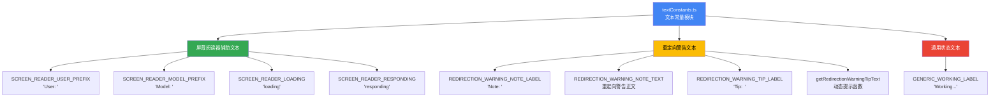

# textConstants.ts

## 概述

`textConstants.ts` 是 Gemini CLI UI 层的**文本常量集中管理模块**。它将所有在终端界面中显示的静态文本字符串和文本生成函数统一定义在一个文件中，避免在组件代码中硬编码字符串。该模块主要包含两大类常量：**屏幕阅读器（Screen Reader）无障碍辅助文本**和**重定向警告提示文本**，以及一个通用的加载状态标签。

## 架构图（Mermaid）



## 核心组件

### 1. 屏幕阅读器无障碍文本（Screen Reader）

这些常量用于为屏幕阅读器提供上下文信息，增强 CLI 工具的无障碍访问性。

```typescript
export const SCREEN_READER_USER_PREFIX = 'User: ';
export const SCREEN_READER_MODEL_PREFIX = 'Model: ';
export const SCREEN_READER_LOADING = 'loading';
export const SCREEN_READER_RESPONDING = 'responding';
```

| 常量名 | 值 | 用途 |
|--------|-----|------|
| `SCREEN_READER_USER_PREFIX` | `'User: '` | 用户消息前缀，帮助屏幕阅读器区分消息来源 |
| `SCREEN_READER_MODEL_PREFIX` | `'Model: '` | AI 模型响应前缀，帮助屏幕阅读器区分消息来源 |
| `SCREEN_READER_LOADING` | `'loading'` | 加载状态的无障碍标签 |
| `SCREEN_READER_RESPONDING` | `'responding'` | AI 正在响应时的无障碍标签 |

### 2. 重定向警告文本

当用户执行的命令包含 shell 重定向操作符（如 `>`, `>>`, `|` 等）时，这组常量用于显示警告和提示信息。

```typescript
export const REDIRECTION_WARNING_NOTE_LABEL = 'Note: ';
export const REDIRECTION_WARNING_NOTE_TEXT =
  'Command contains redirection which can be undesirable.';
export const REDIRECTION_WARNING_TIP_LABEL = 'Tip:  '; // Padded to align with "Note: "
export const getRedirectionWarningTipText = (shiftTabHint: string) =>
  `Toggle auto-edit (${shiftTabHint}) to allow redirection in the future.`;
```

| 常量/函数名 | 值/签名 | 用途 |
|-------------|---------|------|
| `REDIRECTION_WARNING_NOTE_LABEL` | `'Note: '` | 警告标签，"Note: " 带尾随空格 |
| `REDIRECTION_WARNING_NOTE_TEXT` | `'Command contains redirection which can be undesirable.'` | 警告正文，提示命令中包含可能不理想的重定向 |
| `REDIRECTION_WARNING_TIP_LABEL` | `'Tip:  '` | 提示标签，"Tip:  " 带两个尾随空格以与 "Note: " 对齐 |
| `getRedirectionWarningTipText` | `(shiftTabHint: string) => string` | 动态生成提示文本的函数，插入快捷键提示 |

#### getRedirectionWarningTipText 函数

```typescript
export const getRedirectionWarningTipText = (shiftTabHint: string) =>
  `Toggle auto-edit (${shiftTabHint}) to allow redirection in the future.`;
```

这是模块中唯一的函数（而非纯常量），它接收一个 `shiftTabHint` 参数（如 `"Shift+Tab"`），并将其嵌入到提示文本中，告知用户如何切换自动编辑模式以允许重定向操作。

**调用示例**：
```typescript
getRedirectionWarningTipText('Shift+Tab')
// => 'Toggle auto-edit (Shift+Tab) to allow redirection in the future.'
```

### 3. 通用状态文本

```typescript
export const GENERIC_WORKING_LABEL = 'Working...';
```

| 常量名 | 值 | 用途 |
|--------|-----|------|
| `GENERIC_WORKING_LABEL` | `'Working...'` | 通用的"处理中"状态标签，用于表示系统正在执行某操作 |

## 依赖关系

### 内部依赖

无。该模块是纯常量定义文件，不依赖项目中的其他模块。

### 外部依赖

无。该模块不导入任何外部包。

## 关键实现细节

1. **字符串对齐技巧**：`REDIRECTION_WARNING_TIP_LABEL` 的值为 `'Tip:  '`（两个空格），注释中明确说明这是为了与 `'Note: '`（一个空格）在终端显示中实现视觉对齐。`"Note: "` 共 6 个字符，`"Tip:  "` 也是 6 个字符，这样两行的正文内容可以左对齐。

2. **纯常量模块无副作用**：该文件仅包含 `export const` 声明和一个箭头函数，不执行任何副作用操作。这使得它可以被安全地 tree-shaking，未使用的常量不会被打包进最终产物。

3. **屏幕阅读器无障碍设计**：`SCREEN_READER_*` 系列常量体现了项目对无障碍访问（Accessibility, a11y）的重视。在终端 CLI 工具中提供屏幕阅读器支持是较少见但值得称赞的做法，特别是对于视障用户。

4. **动态文本生成函数**：`getRedirectionWarningTipText` 采用函数而非模板字符串常量，是因为快捷键提示（`shiftTabHint`）可能因平台或配置不同而变化（如 macOS 与 Linux 的快捷键差异），需要在运行时动态注入。

5. **集中管理便于国际化**：虽然当前所有文本均为英文，但将文本常量集中管理的模式为未来的国际化（i18n）提供了良好的基础。如果需要支持多语言，只需替换此模块的实现即可，无需修改引用这些常量的组件代码。

6. **命名约定**：常量使用 `SCREAMING_SNAKE_CASE`（全大写下划线分隔），函数使用 `camelCase`，符合 TypeScript 社区的命名惯例。所有导出均为具名导出（named export）。
