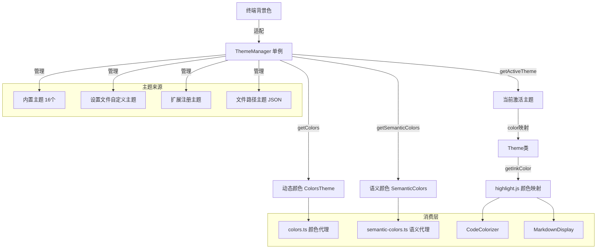

# themes

## 概述

`themes` 目录实现了 Gemini CLI 的完整主题系统。它支持内置主题（暗色/亮色/ANSI）、自定义主题（通过设置文件或 JSON 文件）和扩展主题。主题系统管理代码高亮颜色映射、语义化颜色分组、终端背景色适配等功能，并通过 `ThemeManager` 单例统一管理主题的加载、切换和颜色查询。

## 目录结构

```
themes/
├── theme.ts              # Theme 类定义、颜色主题接口、主题创建和验证
├── theme-manager.ts      # ThemeManager 单例，管理所有主题的加载和切换
├── semantic-tokens.ts    # 语义化颜色接口和预设（text/background/border/ui/status）
├── color-utils.ts        # 颜色工具函数（验证、背景检测、主题切换判断）
│
├── builtin/              # 内置主题
│   ├── dark/             # 暗色系主题
│   │   ├── default-dark.ts
│   │   ├── atom-one-dark.ts
│   │   ├── ayu-dark.ts
│   │   ├── dracula-dark.ts
│   │   ├── github-dark.ts
│   │   ├── holiday-dark.ts
│   │   ├── shades-of-purple-dark.ts
│   │   ├── solarized-dark.ts
│   │   └── ansi-dark.ts
│   ├── light/            # 亮色系主题
│   │   ├── default-light.ts
│   │   ├── ayu-light.ts
│   │   ├── github-light.ts
│   │   ├── googlecode-light.ts
│   │   ├── solarized-light.ts
│   │   ├── xcode-light.ts
│   │   └── ansi-light.ts
│   └── no-color.ts       # NO_COLOR 环境变量支持
```

## 架构图



## 核心组件

### `Theme` 类 (`theme.ts`)

主题的核心数据模型：
- **`colors: ColorsTheme`**: 基础颜色定义（前景、背景、强调色、Diff 色等）
- **`semanticColors: SemanticColors`**: 语义化颜色分组
- **`_colorMap`**: highlight.js 类名到 Ink 颜色的映射
- **`getInkColor(hljsClass)`**: 查询代码高亮颜色
- **`defaultColor`**: 默认前景色

### `ThemeManager` (`theme-manager.ts`)

主题管理器单例：
- **`availableThemes`**: 16 个内置主题
- **`settingsThemes`**: 从 settings.json 加载的自定义主题
- **`extensionThemes`**: 扩展注册的主题
- **`fileThemes`**: 从 JSON 文件加载的主题
- **`setActiveTheme(name)`**: 切换主题
- **`getColors()`**: 获取颜色（考虑终端背景色适配）
- **`getSemanticColors()`**: 获取语义颜色（带缓存）
- **`setTerminalBackground(color)`**: 设置终端背景色以适配颜色

### `SemanticColors` (`semantic-tokens.ts`)

语义化颜色接口，按用途分组：
- **`text`**: 主要文本、次要文本、链接、强调、响应
- **`background`**: 主背景、消息背景、输入背景、焦点背景、Diff 背景
- **`border`**: 默认边框色
- **`ui`**: 注释色、符号色、活跃色、深色、焦点色、渐变色
- **`status`**: 错误红、成功绿、警告黄

### 颜色工具 (`color-utils.ts`)

- **`isValidColor(color)`**: 验证颜色字符串是否合法
- **`getSafeLowColorBackground(bg)`**: 获取低色彩终端的安全背景色
- **`shouldSwitchTheme()`**: 基于亮度的主题切换判断（带滞后防闪烁）
- **`parseColor(r, g, b)`**: 解析 X11 RGB 字符串为 hex

## 依赖关系

### 内部依赖
- `../constants.ts`: 默认透明度常量
- `@google/gemini-cli-core`: CustomTheme 类型、homedir、debugLogger

### 外部依赖
- `tinygradient`: 颜色渐变计算
- `tinycolor2`: 颜色解析、亮度计算、格式转换
- `node:fs` / `node:path`: 文件主题加载

## 数据流

### 主题加载流程
1. 应用启动时，`ThemeManager` 初始化 16 个内置主题
2. 加载用户设置中的自定义主题（`loadCustomThemes`）
3. 扩展初始化时注册扩展主题（`registerExtensionThemes`）
4. 根据用户设置或自动检测设置活跃主题
5. 如果检测到终端背景色，动态调整颜色

### 终端背景色适配流程
1. `TerminalCapabilityManager` 通过 OSC 11 查询终端背景色
2. 结果传给 `ThemeManager.setTerminalBackground()`
3. `getColors()` 检查主题与背景色是否兼容
4. 兼容时基于实际背景色重新计算动态颜色（边框、输入框背景等）
5. 颜色结果带缓存，主题或背景色变化时清除

### 主题切换流程
1. 用户通过 `/theme` 命令或设置对话框选择主题
2. `useThemeCommand` 调用 `themeManager.setActiveTheme(name)`
3. 清除颜色缓存
4. 持久化到用户设置
5. UI 组件通过 `Colors` 和 `theme` 代理自动获取新颜色
