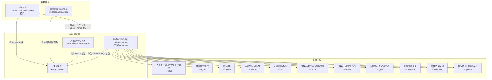

# ansi-dark.ts

## 概述

`ansi-dark.ts` 是 Gemini CLI 主题系统中的一个内置暗色主题文件，定义了名为 **ANSI** 的暗色终端主题。该主题的核心设计理念是**仅使用标准 ANSI 终端颜色名称**（如 `blue`、`cyan`、`green`、`yellow`、`red`、`magenta`、`gray`、`white`、`black`、`bluebright`），而非 HEX 色值，从而确保在所有支持 ANSI 颜色的终端模拟器中具有最佳的兼容性。

该主题包含两大配置部分：
1. **颜色调色板**（`ansiColors`）- 定义 UI 层通用的语义化颜色
2. **代码高亮映射**（hljs 样式）- 定义 highlight.js 语法高亮类到 ANSI 颜色的映射

主题最终通过 `Theme` 类实例化并导出为常量 `ANSI`，可被主题选择器使用。

## 架构图（Mermaid）



## 核心组件

### 1. ANSI 颜色调色板（`ansiColors`）

类型为 `ColorsTheme`，定义了 UI 层使用的语义化颜色。所有颜色值均使用 ANSI 终端颜色名称（除了 `DiffAdded` 和 `DiffRemoved` 使用 HEX 值）。

| 属性 | 值 | 用途说明 |
|------|-----|---------|
| `type` | `'dark'` | 主题类型标识 |
| `Background` | `'black'` | 背景色 |
| `Foreground` | `''`（空字符串） | 前景色，留空表示使用终端默认前景色 |
| `LightBlue` | `'bluebright'` | 浅蓝色，用于链接和属性 |
| `AccentBlue` | `'blue'` | 强调蓝，用于关键字等 |
| `AccentPurple` | `'magenta'` | 强调紫，用于变量 |
| `AccentCyan` | `'cyan'` | 强调青，用于内置类型 |
| `AccentGreen` | `'green'` | 强调绿，用于数字和成功状态 |
| `AccentYellow` | `'yellow'` | 强调黄，用于字符串和警告 |
| `AccentRed` | `'red'` | 强调红，用于正则和错误 |
| `DiffAdded` | `'#003300'` | Diff 新增背景色（深绿） |
| `DiffRemoved` | `'#4D0000'` | Diff 删除背景色（深红） |
| `Comment` | `'gray'` | 注释颜色 |
| `Gray` | `'gray'` | 灰色 |
| `DarkGray` | `'gray'` | 深灰色（此处与 Gray 相同） |
| `FocusBackground` | `'black'` | 聚焦背景色 |
| `GradientColors` | `['cyan', 'green']` | 渐变色数组 |

**设计特点**：
- `Foreground` 设为空字符串，这意味着文本将使用终端自身的默认前景色，最大程度适配用户的终端配色方案。
- `DiffAdded` 和 `DiffRemoved` 是仅有的两个使用 HEX 色值的属性，因为 ANSI 标准颜色中没有合适的深绿/深红色用于 Diff 背景。
- `Gray` 和 `DarkGray` 使用相同的 `'gray'`，因为 ANSI 标准色中没有区分度足够的两种灰色。

### 2. 代码高亮映射（hljs 样式）

定义了 highlight.js 语法高亮类名到 ANSI 颜色的完整映射，覆盖 30+ 个 hljs 类名。每个映射项都有注释标注其对应的原始 HEX 色值（来源于 VS Code 等编辑器的主题映射）。

#### 颜色映射分组

| 颜色 | 对应的 hljs 类 | 原始 HEX 参考 |
|------|---------------|--------------|
| `blue` | `hljs-keyword`, `hljs-literal`, `hljs-symbol`, `hljs-name`, `hljs-link` | `#569CD6` |
| `cyan` | `hljs-built_in`, `hljs-type` | `#4EC9B0` |
| `green`（数字） | `hljs-number`, `hljs-class` | `#B8D7A3` |
| `yellow`（字符串） | `hljs-string`, `hljs-meta-string` | `#D69D85` |
| `red` | `hljs-regexp`, `hljs-template-tag` | `#9A5334` |
| `white` | `hljs-subst`, `hljs-function`, `hljs-title`, `hljs-params`, `hljs-formula` | `#DCDCDC` |
| `green`（注释） | `hljs-comment`, `hljs-quote`, `hljs-doctag` | `#57A64A` / `#608B4E` |
| `gray` | `hljs-meta`, `hljs-meta-keyword`, `hljs-tag` | `#9B9B9B` |
| `magenta` | `hljs-variable`, `hljs-template-variable` | `#BD63C5` |
| `bluebright` | `hljs-attr`, `hljs-attribute`, `hljs-builtin-name` | `#9CDCFE` |
| `yellow`（选择器） | `hljs-section`, `hljs-bullet`, `hljs-selector-tag/id/class/attr/pseudo` | `#D7BA7D` / `gold` |

#### 被忽略的 CSS 属性

以下 CSS 属性在注释中明确标注"被 Theme 类忽略"：
- `textDecoration`（`hljs-link`）
- `fontStyle`（`hljs-comment`、`hljs-quote`、`hljs-emphasis`）
- `fontWeight`（`hljs-strong`）

这是因为终端渲染引擎（Ink）不支持这些样式属性，Theme 类仅提取 `color` 属性。

### 3. Theme 实例（`ANSI`）

通过 `Theme` 类构造函数创建，传入四个参数：

```typescript
export const ANSI: Theme = new Theme(
  'ANSI',           // 主题名称
  'dark',           // 主题类型
  { ... },          // hljs 样式映射（rawMappings）
  ansiColors,       // 颜色调色板
  darkSemanticColors, // 暗色语义颜色
);
```

`Theme` 构造函数内部会：
1. 将 `rawMappings` 中的 CSS 颜色值解析为 Ink 兼容的颜色字符串，构建内部 `_colorMap`
2. 提取 `hljs` 基础样式中的 `color` 属性作为 `defaultColor`
3. 存储 `semanticColors` 用于 UI 组件的语义化颜色查询

## 依赖关系

### 内部依赖

| 导入项 | 来源模块 | 说明 |
|--------|---------|------|
| `ColorsTheme`（类型） | `../../theme.js` | 颜色调色板接口定义 |
| `Theme`（类） | `../../theme.js` | 主题类，用于实例化主题对象 |
| `darkSemanticColors` | `../../semantic-tokens.js` | 暗色主题的语义化颜色预设 |

### 外部依赖

无直接外部依赖。所有外部库依赖（如 `tinycolor2`、`tinygradient`）由 `theme.ts` 间接引入。

## 关键实现细节

1. **纯 ANSI 颜色策略**: 该主题的设计哲学是尽可能只使用 ANSI 标准终端颜色名称（`blue`、`cyan`、`green`、`yellow`、`red`、`magenta`、`gray`、`white`、`black`、`bluebright`），确保在任何支持 ANSI 颜色的终端中都能正确显示。这与其他暗色主题（如 `atom-one-dark`、`ayu-dark`）使用精确 HEX 值的做法形成鲜明对比。

2. **前景色留空**: `Foreground` 设为空字符串 `''`，表示不覆盖终端默认前景色。这使得主题能够自然融入用户已有的终端配色方案。

3. **HEX 颜色的有限使用**: 仅 `DiffAdded`（`#003300`）和 `DiffRemoved`（`#4D0000`）使用 HEX 颜色值，因为 Diff 背景需要低饱和度的深色，而 ANSI 标准色无法提供此类颜色。

4. **hljs 基础样式**: `hljs` 块级样式设置了 `background: 'black'` 和 `color: 'white'`，这些值会被 `Theme` 类解析。`display`、`overflowX`、`padding` 等布局属性在终端环境中无效，保留仅作为与 react-syntax-highlighter 主题格式的兼容。

5. **注释中的原始色值映射**: 每个 hljs 类的颜色值旁都有注释标注"Mapped from #XXXXXX"，记录了该 ANSI 颜色对应的原始 HEX 色值。这些注释来源于 VS Code 风格的主题（如 Dark+ 主题），帮助开发者理解颜色映射的设计意图。

6. **语义颜色复用**: 通过传入 `darkSemanticColors`（来自 `semantic-tokens.ts`），ANSI 主题复用了标准暗色主题的语义颜色配置，避免重复定义。这些语义颜色控制了文本、背景、边框、UI 元素和状态指示器的颜色。

7. **渐变色配置**: `GradientColors` 设置为 `['cyan', 'green']`，与其他暗色主题使用的 HEX 渐变色（如 `['#4796E4', '#847ACE', '#C3677F']`）不同，保持了纯 ANSI 颜色的一致性。
