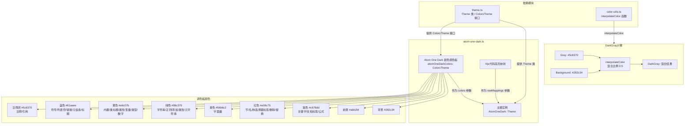

# atom-one-dark.ts

## 概述

`atom-one-dark.ts` 是 Gemini CLI 主题系统中的一个内置暗色主题文件，定义了名为 **Atom One** 的暗色主题。该主题忠实再现了广受欢迎的 **Atom One Dark** 编辑器配色方案（最初来自 GitHub 的 Atom 编辑器），使用精确的 HEX 色值来确保颜色的准确性和一致性。

与 ANSI 主题不同，Atom One Dark 主题使用了精确的 HEX 颜色代码（如 `#282c34`、`#abb2bf`、`#61aeee` 等），提供了更丰富、更精细的视觉体验。该主题的配色方案以深蓝灰色为背景（`#282c34`），柔和的前景色（`#abb2bf`）为基调，搭配鲜明但不刺眼的强调色。

该主题与其他暗色主题的一个显著区别是，它没有传入外部的 `darkSemanticColors`，而是让 `Theme` 构造函数根据颜色调色板自动推导语义颜色。

## 架构图（Mermaid）



## 核心组件

### 1. Atom One Dark 颜色调色板（`atomOneDarkColors`）

类型为 `ColorsTheme`，所有颜色值均使用精确的 HEX 色值。

| 属性 | 值 | 用途说明 |
|------|-----|---------|
| `type` | `'dark'` | 主题类型标识 |
| `Background` | `'#282c34'` | 背景色 - Atom One Dark 标志性的深蓝灰色 |
| `Foreground` | `'#abb2bf'` | 前景色 - 柔和的浅灰色文本 |
| `LightBlue` | `'#61aeee'` | 浅蓝色 |
| `AccentBlue` | `'#61aeee'` | 强调蓝（与 LightBlue 相同） |
| `AccentPurple` | `'#c678dd'` | 强调紫 - 用于关键字 |
| `AccentCyan` | `'#56b6c2'` | 强调青 - 用于字面量 |
| `AccentGreen` | `'#98c379'` | 强调绿 - 用于字符串 |
| `AccentYellow` | `'#e6c07b'` | 强调黄 - 用于类型和变量 |
| `AccentRed` | `'#e06c75'` | 强调红 - 用于 HTML 标签名 |
| `DiffAdded` | `'#39544E'` | Diff 新增背景色（暗绿） |
| `DiffRemoved` | `'#562B2F'` | Diff 删除背景色（暗红） |
| `Comment` | `'#5c6370'` | 注释颜色 - 低对比度灰色 |
| `Gray` | `'#5c6370'` | 灰色（与 Comment 相同） |
| `DarkGray` | `interpolateColor('#5c6370', '#282c34', 0.5)` | 深灰色 - Gray 和 Background 的 50% 混合 |
| `GradientColors` | `['#61aeee', '#98c379']` | 渐变色 - 从蓝到绿 |

**设计特点**：
- `LightBlue` 和 `AccentBlue` 共用同一色值 `#61aeee`，这与原版 Atom One Dark 主题一致。
- `DarkGray` 使用 `interpolateColor` 函数动态计算，取 `Gray`（`#5c6370`）和 `Background`（`#282c34`）的中间色，生成一个介于两者之间的灰色调。
- 没有设置 `InputBackground`、`MessageBackground`、`FocusBackground` 和 `FocusColor`，这些将由 `Theme` 构造函数通过 `interpolateColor` 自动推导。

### 2. 代码高亮映射（hljs 样式）

覆盖了约 30 个 hljs 类名，颜色值直接引用 `atomOneDarkColors` 对象的属性，保证高亮配色与调色板一致。

#### 颜色映射分组

| 颜色 | HEX 值 | 对应的 hljs 类 |
|------|--------|---------------|
| **紫色（关键字）** | `#c678dd` | `hljs-doctag`, `hljs-keyword`, `hljs-formula` |
| **红色（标签名/节）** | `#e06c75` | `hljs-section`, `hljs-name`, `hljs-selector-tag`, `hljs-deletion`, `hljs-subst` |
| **青色（字面量）** | `#56b6c2` | `hljs-literal` |
| **绿色（字符串）** | `#98c379` | `hljs-string`, `hljs-regexp`, `hljs-addition`, `hljs-attribute`, `hljs-meta-string` |
| **黄色（类型/变量）** | `#e6c07b` | `hljs-built_in`, `hljs-class .hljs-title`, `hljs-attr`, `hljs-variable`, `hljs-template-variable`, `hljs-type`, `hljs-selector-class`, `hljs-selector-attr`, `hljs-selector-pseudo`, `hljs-number` |
| **蓝色（函数/标识符）** | `#61aeee` | `hljs-symbol`, `hljs-bullet`, `hljs-link`, `hljs-meta`, `hljs-selector-id`, `hljs-title` |
| **注释灰** | `#5c6370` | `hljs-comment`, `hljs-quote` |

#### 与 ANSI 主题的颜色映射差异

| hljs 类 | ANSI 主题 | Atom One Dark |
|---------|----------|---------------|
| `hljs-keyword` | `blue` | `AccentPurple`（紫色） |
| `hljs-name` | `blue` | `AccentRed`（红色） |
| `hljs-subst` | `white` | `AccentRed`（红色） |
| `hljs-literal` | `blue` | `AccentCyan`（青色） |
| `hljs-built_in` | `cyan` | `AccentYellow`（黄色） |
| `hljs-number` | `green` | `AccentYellow`（黄色） |
| `hljs-variable` | `magenta` | `AccentYellow`（黄色） |
| `hljs-doctag` | `green` | `AccentPurple`（紫色） |

### 3. Theme 实例（`AtomOneDark`）

```typescript
export const AtomOneDark: Theme = new Theme(
  'Atom One',           // 主题名称
  'dark',               // 主题类型
  { ... },              // hljs 样式映射
  atomOneDarkColors,    // 颜色调色板
  // 注意：没有传入第五个参数 semanticColors
);
```

**关键差异**：与 `ansi-dark.ts` 不同，此处没有传入 `darkSemanticColors` 作为第五个参数。`Theme` 构造函数会自动根据 `atomOneDarkColors` 调色板推导出语义颜色，这使得语义颜色与调色板保持完美一致（例如 `text.primary` 自动使用 `#abb2bf` 而非默认暗色主题的 `#FFFFFF`）。

## 依赖关系

### 内部依赖

| 导入项 | 来源模块 | 说明 |
|--------|---------|------|
| `ColorsTheme`（类型） | `../../theme.js` | 颜色调色板接口定义 |
| `Theme`（类） | `../../theme.js` | 主题类，用于实例化主题对象 |
| `interpolateColor` | `../../color-utils.js` | 颜色插值函数，用于计算 `DarkGray` 混合色 |

### 外部依赖

无直接外部依赖。

## 关键实现细节

1. **忠实于 Atom One Dark 配色**: 所有 HEX 色值（`#282c34`、`#abb2bf`、`#c678dd`、`#e06c75`、`#56b6c2`、`#98c379`、`#e6c07b`、`#61aeee`、`#5c6370`）均来源于原版 Atom One Dark 主题，确保视觉效果与编辑器中一致。

2. **DarkGray 的动态计算**: `DarkGray` 不是硬编码的固定值，而是通过 `interpolateColor('#5c6370', '#282c34', 0.5)` 动态计算得出 `Gray` 和 `Background` 的 50% 中间色。这确保了边框和次要 UI 元素的颜色在视觉上介于注释灰和背景色之间，形成良好的层次感。

3. **语义颜色自动推导**: 该主题没有传入 `darkSemanticColors`，而是依赖 `Theme` 构造函数的默认逻辑根据 `ColorsTheme` 调色板自动生成语义颜色。这意味着：
   - `text.primary` = `#abb2bf`（而非默认暗色主题的 `#FFFFFF`）
   - `text.secondary` = `#5c6370`（而非默认暗色主题的 `#AFAFAF`）
   - `background.primary` = `#282c34`（而非默认暗色主题的 `#000000`）
   - 等等...

4. **颜色复用模式**: 调色板直接通过属性引用传入 hljs 映射（如 `color: atomOneDarkColors.AccentPurple`），而非硬编码 HEX 值。这确保了调色板与高亮映射的一致性，同时修改调色板会自动传播到所有高亮规则。

5. **嵌套选择器**: `'hljs-class .hljs-title'` 是一个嵌套 CSS 选择器，表示在 `hljs-class` 内部的 `hljs-title` 元素。这是 Atom One Dark 主题特有的规则，用于区分普通标题和类名标题的颜色。

6. **Diff 背景色设计**: `DiffAdded`（`#39544E`）和 `DiffRemoved`（`#562B2F`）选择了与背景色（`#282c34`）协调的暗色调，既能清晰区分添加和删除的代码行，又不会在深色背景上显得突兀。

7. **渐变色配置**: `GradientColors` 设为 `['#61aeee', '#98c379']`（蓝到绿），与主题的蓝色和绿色强调色呼应，用于 UI 中的渐变效果（如加载指示器、进度条等）。

8. **`interpolateColor` 的导入来源**: 该文件从 `../../color-utils.js` 导入 `interpolateColor`，而非从 `../../theme.js` 导入。这表明颜色工具函数可能已被重构到独立模块中，实现了更好的关注点分离。
