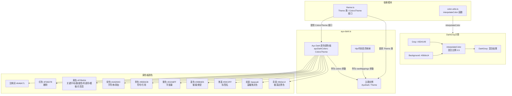

# ayu-dark.ts

## 概述

`ayu-dark.ts` 是 Gemini CLI 主题系统中的一个内置暗色主题文件，定义了名为 **Ayu** 的暗色主题。该主题移植自广受欢迎的 **Ayu Dark** 编辑器配色方案（最初由 Ike Ku 为 Sublime Text 设计，后移植到 VS Code 等多个编辑器）。

Ayu Dark 以极深的近黑色背景（`#0b0e14`）为基底，搭配温暖的橙黄色调为主要强调色（`#FFB454`），形成了独特的暖色调暗色主题风格。与 Atom One Dark 的冷色调（蓝紫为主）形成鲜明对比，Ayu Dark 的配色偏向暖色系，使用大量黄橙色作为语法高亮的主色调。

该主题的 hljs 映射数量较少（约 22 个类），保持了简洁，且同样不传入外部语义颜色，由 `Theme` 构造函数自动推导。

## 架构图（Mermaid）



## 核心组件

### 1. Ayu Dark 颜色调色板（`ayuDarkColors`）

类型为 `ColorsTheme`，使用精确的 HEX 色值，体现 Ayu Dark 特有的暖色调风格。

| 属性 | 值 | 用途说明 |
|------|-----|---------|
| `type` | `'dark'` | 主题类型标识 |
| `Background` | `'#0b0e14'` | 背景色 - 极深的近黑色，比 Atom One Dark 更暗 |
| `Foreground` | `'#aeaca6'` | 前景色 - 温暖的浅灰色，带微弱暖色调 |
| `LightBlue` | `'#59C2FF'` | 浅蓝色 - 用于标签名 |
| `AccentBlue` | `'#39BAE6'` | 强调蓝 - 用于链接和类型 |
| `AccentPurple` | `'#D2A6FF'` | 强调紫 - 用于字面量 |
| `AccentCyan` | `'#95E6CB'` | 强调青 - 用于符号 |
| `AccentGreen` | `'#AAD94C'` | 强调绿 - 鲜亮的黄绿色，用于字符串 |
| `AccentYellow` | `'#FFB454'` | 强调黄/橙 - Ayu 标志性暖橙色，用途最广 |
| `AccentRed` | `'#F26D78'` | 强调红 - 柔和的珊瑚红 |
| `DiffAdded` | `'#293022'` | Diff 新增背景色（极暗绿） |
| `DiffRemoved` | `'#3D1215'` | Diff 删除背景色（极暗红） |
| `Comment` | `'#646A71'` | 注释颜色 - 中等灰色 |
| `Gray` | `'#3D4149'` | 灰色 - 比注释色更暗 |
| `DarkGray` | `interpolateColor('#3D4149', '#0b0e14', 0.5)` | 深灰色 - Gray 和 Background 的 50% 混合 |
| `GradientColors` | `['#FFB454', '#F26D78']` | 渐变色 - 从橙色到珊瑚红 |

**设计特点**：
- `LightBlue`（`#59C2FF`）和 `AccentBlue`（`#39BAE6`）使用**不同**的蓝色值，这是 Ayu 主题的特点之一，区分了标签名（更亮的蓝）和语义链接/类型（稍暗的蓝）。
- `AccentGreen`（`#AAD94C`）是一个鲜亮的黄绿色，与其他暗色主题的绿色有明显区别。
- `Gray`（`#3D4149`）与 `Comment`（`#646A71`）使用不同的值。`Gray` 更暗，主要用于 UI 元素（边框、次要文本等），而 `Comment` 稍亮，用于代码注释以保持可读性。
- `GradientColors` 使用暖色系渐变 `['#FFB454', '#F26D78']`（橙到珊瑚红），与主题整体暖色调一致。

### 2. 代码高亮映射（hljs 样式）

覆盖了约 22 个 hljs 类名，比 ANSI 和 Atom One Dark 主题更简洁。颜色值引用 `ayuDarkColors` 调色板属性。

#### 颜色映射分组

| 颜色 | HEX 值 | 对应的 hljs 类 |
|------|--------|---------------|
| **黄橙色（关键字/主色）** | `#FFB454` | `hljs-keyword`, `hljs-function .hljs-keyword`, `hljs-title`, `hljs-attribute`, `hljs-bullet`, `hljs-template-tag`, `hljs-template-variable`, `hljs-meta` |
| **绿色（字符串）** | `#AAD94C` | `hljs-string`, `hljs-addition` |
| **浅蓝色（标签名）** | `#59C2FF` | `hljs-name` |
| **蓝色（链接/类型）** | `#39BAE6` | `hljs-link`, `hljs-type` |
| **紫色（字面量）** | `#D2A6FF` | `hljs-literal` |
| **青色（符号/引用）** | `#95E6CB` | `hljs-symbol`, `hljs-quote` |
| **红色（删除）** | `#F26D78` | `hljs-deletion` |
| **前景色（默认文本）** | `#aeaca6` | `hljs-subst`, `hljs-variable` |
| **注释灰** | `#646A71` | `hljs-comment` |
| **无颜色（仅样式）** | 无 | `hljs-doctag`（粗体）, `hljs-strong`（粗体）, `hljs-emphasis`（斜体） |

#### Ayu Dark 特有的颜色分配

与其他暗色主题相比，Ayu Dark 的颜色分配有几个显著特点：

| 特点 | 说明 |
|------|------|
| **黄橙色主导** | `AccentYellow`（`#FFB454`）被分配给最多的 hljs 类（8个），是该主题使用最广泛的颜色 |
| **变量使用前景色** | `hljs-variable` 使用 `Foreground` 而非独立的强调色，使变量在视觉上更低调 |
| **引用与注释分色** | `hljs-quote` 使用 `AccentCyan`（青色），而 `hljs-comment` 使用 `Comment`（灰色），两者颜色不同 |
| **文档标签无颜色** | `hljs-doctag` 仅设置 `fontWeight: 'bold'`，不设颜色，使用默认前景色 |
| **嵌套选择器** | `hljs-function .hljs-keyword` 精确控制函数内关键字的颜色 |

### 3. Theme 实例（`AyuDark`）

```typescript
export const AyuDark: Theme = new Theme(
  'Ayu',              // 主题名称
  'dark',             // 主题类型
  { ... },            // hljs 样式映射
  ayuDarkColors,      // 颜色调色板
  // 未传入 semanticColors，由 Theme 构造函数自动推导
);
```

与 Atom One Dark 相同，没有传入外部 `darkSemanticColors`，语义颜色由 `Theme` 构造函数根据 `ayuDarkColors` 调色板自动推导。

## 依赖关系

### 内部依赖

| 导入项 | 来源模块 | 说明 |
|--------|---------|------|
| `ColorsTheme`（类型） | `../../theme.js` | 颜色调色板接口定义 |
| `Theme`（类） | `../../theme.js` | 主题类，用于实例化主题对象 |
| `interpolateColor` | `../../color-utils.js` | 颜色插值函数，用于计算 `DarkGray` 混合色 |

### 外部依赖

无直接外部依赖。

## 关键实现细节

1. **Ayu 风格的暖色调设计**: 该主题的核心设计语言是暖色调。`AccentYellow`（`#FFB454`）作为主题的"主色"被应用于关键字、标题、属性、列表符、模板标签、模板变量和元信息等 8 个 hljs 类，形成了统一的视觉风格。这与 Atom One Dark（蓝紫主色）和默认暗色主题形成鲜明对比。

2. **极深背景色**: `Background`（`#0b0e14`）是所有内置暗色主题中最暗的，接近纯黑（`#000000`）。这为高饱和度的强调色提供了最大的对比度空间。

3. **Gray 与 Comment 的分离**: 不同于其他主题中 `Gray` 和 `Comment` 共用同一色值，Ayu Dark 中 `Gray`（`#3D4149`）比 `Comment`（`#646A71`）暗很多。`Gray` 主要用于 UI 边框等结构性元素（需要低调），`Comment` 用于代码注释（需要可读性）。

4. **DarkGray 的动态计算**: 与 Atom One Dark 相同，`DarkGray` 通过 `interpolateColor('#3D4149', '#0b0e14', 0.5)` 计算，取 `Gray` 和 `Background` 的中间值。由于 Ayu Dark 的 `Gray` 和 `Background` 都非常暗，混合结果会产生一个非常微妙的深灰色，适用于边框线等需要与背景区分但又不过于突出的元素。

5. **简洁的 hljs 映射**: 该主题只定义了约 22 个 hljs 类的映射，明显少于 ANSI 主题（30+）和 Atom One Dark（30+）。一些常见的类（如 `hljs-number`、`hljs-class`、`hljs-regexp`、`hljs-built_in`、`hljs-params`、`hljs-selector-tag` 等）未定义映射，将使用默认前景色 `#aeaca6`。这符合 Ayu 主题注重简洁的设计理念。

6. **嵌套 CSS 选择器**: `'hljs-function .hljs-keyword'` 是一个嵌套选择器，表示在函数上下文中的关键字使用黄橙色（`#FFB454`）。这为函数定义中的 `function` 关键字提供了独特的视觉标识。

7. **LightBlue 与 AccentBlue 的区分**: Ayu Dark 中 `LightBlue`（`#59C2FF`）和 `AccentBlue`（`#39BAE6`）使用不同的蓝色值。`LightBlue` 更亮更饱和，用于 `hljs-name`（标签名）；`AccentBlue` 稍暗，用于 `hljs-link` 和 `hljs-type`。这种差异在其他主题中通常不存在（ANSI 和 Atom One Dark 的这两个属性共用同一色值）。

8. **暖色系渐变**: `GradientColors` 设为 `['#FFB454', '#F26D78']`（橙色到珊瑚红），这是所有内置暗色主题中唯一使用暖色系渐变的主题，与 Ayu 的整体暖色调设计语言保持一致。

9. **Diff 背景色与背景的协调**: `DiffAdded`（`#293022`）和 `DiffRemoved`（`#3D1215`）选择了非常暗的色调，与极深的背景色（`#0b0e14`）形成微妙的对比。相比 Atom One Dark 的 Diff 色（`#39544E`、`#562B2F`），Ayu 的 Diff 背景色更暗、更内敛。
