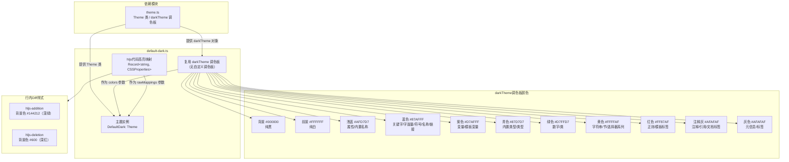

# default-dark.ts

## 概述

`default-dark.ts` 是 Gemini CLI 主题系统中的**默认暗色主题**文件，定义了名为 **Default** 的暗色主题。作为系统的默认暗色主题，它在所有内置暗色主题中扮演着"基准参考"的角色。

该主题直接复用了 `theme.ts` 中预定义的 `darkTheme` 颜色调色板对象，而不像 Atom One Dark 和 Ayu Dark 那样定义独立的调色板。这使得 Default Dark 成为所有内置暗色主题中**最简洁**的实现 -- 它不需要导入 `interpolateColor`，不需要定义自己的 `ColorsTheme` 对象，也不需要导入 `darkSemanticColors`，一切都依赖 `darkTheme` 预设和 `Theme` 构造函数的自动推导。

Default Dark 的配色方案使用纯黑背景（`#000000`）和纯白前景（`#FFFFFF`），搭配高对比度的粉彩风格强调色，提供清晰易读的代码高亮体验。

## 架构图（Mermaid）



## 核心组件

### 1. 复用 `darkTheme` 调色板

Default Dark 主题**不定义自己的调色板**，直接引用 `theme.ts` 中导出的 `darkTheme` 全局常量。`darkTheme` 的完整配色如下：

| 属性 | 值 | 用途说明 |
|------|-----|---------|
| `type` | `'dark'` | 主题类型标识 |
| `Background` | `'#000000'` | 纯黑背景 |
| `Foreground` | `'#FFFFFF'` | 纯白前景 |
| `LightBlue` | `'#AFD7D7'` | 浅蓝绿色 - 用于属性 |
| `AccentBlue` | `'#87AFFF'` | 粉蓝色 - 用于关键字 |
| `AccentPurple` | `'#D7AFFF'` | 淡紫色 - 用于变量 |
| `AccentCyan` | `'#87D7D7'` | 浅青色 - 用于内置类型 |
| `AccentGreen` | `'#D7FFD7'` | 浅绿色 - 用于数字 |
| `AccentYellow` | `'#FFFFAF'` | 浅黄色 - 用于字符串 |
| `AccentRed` | `'#FF87AF'` | 粉红色 - 用于正则 |
| `DiffAdded` | `'#005F00'` | Diff 新增背景色 |
| `DiffRemoved` | `'#5F0000'` | Diff 删除背景色 |
| `Comment` | `'#AFAFAF'` | 注释灰 |
| `Gray` | `'#AFAFAF'` | 灰色（与 Comment 相同） |
| `DarkGray` | `'#878787'` | 深灰色 |
| `InputBackground` | `'#5F5F5F'` | 输入框背景 |
| `MessageBackground` | `'#5F5F5F'` | 消息背景 |
| `FocusBackground` | `'#005F00'` | 聚焦背景 |
| `GradientColors` | `['#4796E4', '#847ACE', '#C3677F']` | 三色渐变（蓝→紫→粉） |

**设计特点**：
- 纯黑/纯白的背景/前景组合提供了最大对比度。
- 所有强调色都是高亮度的粉彩风格（pastel），在纯黑背景上非常醒目。
- `Comment` 和 `Gray` 共用 `#AFAFAF`。
- `DarkGray`（`#878787`）是独立定义的固定值，不像 Atom One Dark 和 Ayu Dark 使用 `interpolateColor` 动态计算。
- `darkTheme` 包含了完整的 `InputBackground`、`MessageBackground`、`FocusBackground` 属性，而 Atom One Dark 和 Ayu Dark 的调色板中没有这些属性。
- `GradientColors` 是三色渐变 `['#4796E4', '#847ACE', '#C3677F']`（蓝→紫→粉），比其他暗色主题的二色渐变更丰富。

### 2. 代码高亮映射（hljs 样式）

覆盖了约 35 个 hljs 类名，是所有内置暗色主题中映射最完整的。颜色值直接引用 `darkTheme` 对象的属性。

#### 颜色映射分组

| 颜色 | HEX 值 | 对应的 hljs 类 |
|------|--------|---------------|
| **蓝色（关键字）** | `#87AFFF` | `hljs-keyword`, `hljs-literal`, `hljs-symbol`, `hljs-name`, `hljs-link` |
| **青色（内置类型）** | `#87D7D7` | `hljs-built_in`, `hljs-type` |
| **绿色（数字）** | `#D7FFD7` | `hljs-number`, `hljs-class` |
| **黄色（字符串）** | `#FFFFAF` | `hljs-string`, `hljs-meta-string` |
| **红色（正则）** | `#FF87AF` | `hljs-regexp`, `hljs-template-tag` |
| **白色（默认文本）** | `#FFFFFF` | `hljs-subst`, `hljs-function`, `hljs-title`, `hljs-params`, `hljs-formula` |
| **注释灰** | `#AFAFAF` | `hljs-comment`, `hljs-quote`, `hljs-doctag` |
| **灰色（元信息）** | `#AFAFAF` | `hljs-meta`, `hljs-meta-keyword`, `hljs-tag` |
| **紫色（变量）** | `#D7AFFF` | `hljs-variable`, `hljs-template-variable` |
| **浅蓝（属性）** | `#AFD7D7` | `hljs-attr`, `hljs-attribute`, `hljs-builtin-name` |
| **黄色（选择器）** | `#FFFFAF` | `hljs-section`, `hljs-bullet`, `hljs-selector-tag/id/class/attr/pseudo` |

#### 行内 Diff 样式

Default Dark 主题是唯一一个在 hljs 映射中包含**行内 Diff 背景色**的暗色主题：

| hljs 类 | 背景色 | 附加样式 |
|---------|--------|---------|
| `hljs-addition` | `#144212`（深绿） | `display: 'inline-block'`, `width: '100%'` |
| `hljs-deletion` | `#600`（深红，简写） | `display: 'inline-block'`, `width: '100%'` |

注意 `#600` 是 `#660000` 的三位简写。这些 Diff 样式使用 `backgroundColor` 而非 `color`，为整行添加背景色高亮。

#### 与 ANSI 主题的映射对比

Default Dark 与 ANSI 主题的 hljs 映射结构**完全相同**（两者都覆盖相同的 hljs 类并使用相同的语义分组），唯一区别是颜色值：ANSI 使用终端颜色名称，Default Dark 使用 HEX 色值。

### 3. Theme 实例（`DefaultDark`）

```typescript
export const DefaultDark: Theme = new Theme(
  'Default',      // 主题名称
  'dark',         // 主题类型
  { ... },        // hljs 样式映射
  darkTheme,      // 直接传入 darkTheme 全局调色板
  // 未传入 semanticColors，由 Theme 构造函数自动推导
);
```

**关键特点**：
- 主题名称为 `'Default'`，在主题选择 UI 中显示为默认选项。
- 不传入 `semanticColors`，由 `Theme` 构造函数根据 `darkTheme` 自动推导。
- 由于 `darkTheme` 本身包含了完整的 `InputBackground`、`MessageBackground`、`FocusBackground` 属性，自动推导的语义颜色会使用这些预设值，而非像 Atom One Dark 和 Ayu Dark 那样通过 `interpolateColor` 动态计算。

## 依赖关系

### 内部依赖

| 导入项 | 来源模块 | 说明 |
|--------|---------|------|
| `darkTheme` | `../../theme.js` | 预定义的暗色主题调色板对象 |
| `Theme`（类） | `../../theme.js` | 主题类，用于实例化主题对象 |

### 外部依赖

无直接外部依赖。

**注意**：该主题是所有内置暗色主题中**依赖最少**的，不需要导入 `ColorsTheme` 类型、`interpolateColor` 函数或 `darkSemanticColors` 语义颜色。

## 关键实现细节

1. **最简实现模式**: Default Dark 是所有内置暗色主题中最简洁的实现。它不定义自己的调色板，直接引用全局 `darkTheme` 对象。整个文件仅有一个导出常量 `DefaultDark`，没有任何中间变量或辅助导入。这体现了"约定优于配置"的设计原则 -- 默认主题应该是最简单、最少自定义的。

2. **darkTheme 的完整性**: 由于 `darkTheme` 已经包含了所有可选属性（`InputBackground`、`MessageBackground`、`FocusBackground`），`Theme` 构造函数在推导语义颜色时无需调用 `interpolateColor` 计算。这意味着 Default Dark 的语义颜色完全由预定义值决定，不存在运行时的颜色计算。

3. **粉彩风格的强调色**: 所有强调色（`#87AFFF`、`#D7AFFF`、`#87D7D7`、`#D7FFD7`、`#FFFFAF`、`#FF87AF`）都是高亮度、中等饱和度的粉彩色调。这些颜色的设计参考了 xterm-256 调色板，确保在大多数现代终端中能准确渲染。

4. **纯黑/纯白的极端对比**: `Background`（`#000000`）和 `Foreground`（`#FFFFFF`）构成了最大对比度组合。这在某些场景下可能导致"光晕效应"（halation），但确保了在任何显示设备上的可读性。

5. **行内 Diff 的独特实现**: Default Dark 是唯一在 hljs 映射中包含 `hljs-addition` 和 `hljs-deletion` 背景色样式的暗色主题。其他主题（ANSI、Atom One Dark、Ayu Dark）要么不包含这些映射，要么只设置了 `color` 而非 `backgroundColor`。`display: 'inline-block'` 和 `width: '100%'` 的组合确保背景色覆盖整行。

6. **`#600` 的色值简写**: `hljs-deletion` 的 `backgroundColor` 使用了 `'#600'` 这一三位 HEX 简写形式，等价于 `'#660000'`。这是该文件中唯一使用简写的 HEX 值，其他所有色值都来自 `darkTheme` 的完整六位 HEX 值。

7. **与 ANSI 主题的结构对称性**: Default Dark 的 hljs 映射结构与 ANSI 主题几乎完全对称 -- 两者覆盖相同的 hljs 类名集合，使用相同的语义分组（关键字→蓝、内置类型→青、数字→绿、字符串→黄、正则→红等）。Default Dark 额外包含了 `hljs-addition` 和 `hljs-deletion` 的 Diff 样式。这暗示 Default Dark 可能是其他暗色主题的参考模板。

8. **三色渐变**: `GradientColors` 使用三色渐变 `['#4796E4', '#847ACE', '#C3677F']`（蓝→紫→粉），比 Atom One Dark 的二色渐变（蓝→绿）和 Ayu Dark 的二色渐变（橙→红）更复杂，提供了更丰富的视觉效果。

9. **作为系统默认**: 当用户未指定主题或终端检测为暗色背景时，系统会自动选择此主题。`pickDefaultThemeName` 函数在 `theme.ts` 中的实现会在无法匹配精确背景色时回退到此默认暗色主题。
