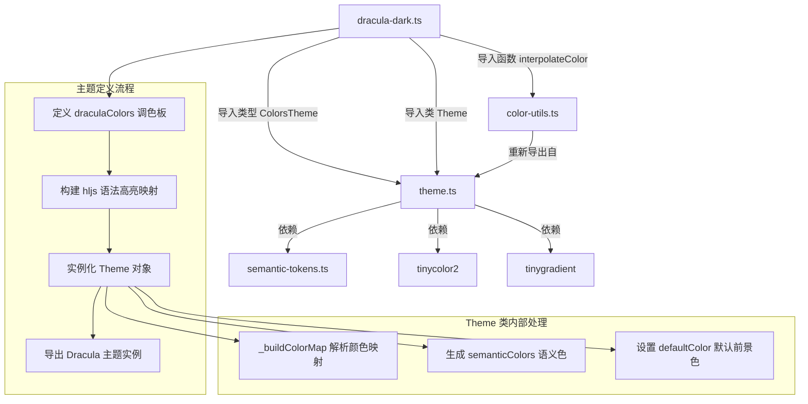

# dracula-dark.ts

## 概述

`dracula-dark.ts` 是 Gemini CLI 项目中内置的 **Dracula 深色主题** 定义文件。Dracula 是一款广受欢迎的深色配色方案，最初由 Zeno Rocha 设计，以其柔和的对比度和丰富的色彩搭配著称。本文件将 Dracula 调色板适配为 Gemini CLI 终端界面所需的 `ColorsTheme` 和 highlight.js 语法高亮样式映射，最终通过 `Theme` 类导出一个可直接使用的主题实例 `Dracula`。

该文件位于 `packages/cli/src/ui/themes/builtin/dark/` 目录下，属于内置深色主题集合的一部分。

## 架构图（Mermaid）



## 核心组件

### 1. `draculaColors` 调色板对象

类型为 `ColorsTheme`，定义了 Dracula 主题的全部基础颜色：

| 属性名 | 色值 | 说明 |
|--------|------|------|
| `type` | `'dark'` | 主题类型，标识为深色主题 |
| `Background` | `#282a36` | Dracula 标志性的深紫灰色背景 |
| `Foreground` | `#a3afb7` | 柔和的浅灰蓝色前景文字 |
| `LightBlue` | `#8be9fd` | 浅蓝色（Dracula Cyan） |
| `AccentBlue` | `#8be9fd` | 强调蓝色，与 LightBlue 相同 |
| `AccentPurple` | `#ff79c6` | 强调粉紫色（Dracula Pink） |
| `AccentCyan` | `#8be9fd` | 强调青色（Dracula Cyan） |
| `AccentGreen` | `#50fa7b` | 强调绿色（Dracula Green） |
| `AccentYellow` | `#fff783` | 强调黄色，接近 Dracula Yellow 的变体 |
| `AccentRed` | `#ff5555` | 强调红色（Dracula Red） |
| `DiffAdded` | `#11431d` | Diff 新增内容的深绿色背景 |
| `DiffRemoved` | `#6e1818` | Diff 删除内容的深红色背景 |
| `Comment` | `#6272a4` | 注释颜色（Dracula Comment） |
| `Gray` | `#6272a4` | 灰色，与 Comment 相同 |
| `DarkGray` | `interpolateColor('#6272a4', '#282a36', 0.5)` | 深灰色，由 Comment 色和背景色按 50% 比例插值生成 |
| `GradientColors` | `['#ff79c6', '#8be9fd']` | 渐变色数组，从粉紫过渡到青色 |

**特别说明**：`DarkGray` 不是静态色值，而是通过 `interpolateColor` 函数在 `Comment (#6272a4)` 和 `Background (#282a36)` 之间以 50% 的比例动态计算得出的中间色。该函数内部使用 `tinygradient` 库进行 RGB 颜色空间的线性插值。

### 2. `Dracula` 主题实例

通过 `new Theme(name, type, rawMappings, colors)` 构造，导出为命名常量 `Dracula`。

构造参数：
- **name**: `'Dracula'` - 主题显示名称
- **type**: `'dark'` - 主题类型
- **rawMappings**: highlight.js CSS 样式映射对象（详见下文）
- **colors**: `draculaColors` 调色板对象

### 3. highlight.js 语法高亮映射

该主题为以下 highlight.js CSS 类名定义了颜色和字体样式：

#### 青色系（AccentBlue / Cyan `#8be9fd`）- 关键字与结构
| CSS 类名 | 颜色 | 加粗 | 说明 |
|----------|------|------|------|
| `hljs-keyword` | `#8be9fd` | 是 | 语言关键字（如 `if`, `return`） |
| `hljs-selector-tag` | `#8be9fd` | 是 | CSS 选择器标签 |
| `hljs-literal` | `#8be9fd` | 是 | 字面量（如 `true`, `false`） |
| `hljs-section` | `#8be9fd` | 是 | 章节标题 |
| `hljs-link` | `#8be9fd` | 否 | 链接 |

#### 粉紫色（AccentPurple `#ff79c6`）- 函数关键字
| CSS 类名 | 颜色 | 说明 |
|----------|------|------|
| `hljs-function .hljs-keyword` | `#ff79c6` | 函数内部的关键字 |

#### 黄色系（AccentYellow `#fff783`）- 字符串与标识符
| CSS 类名 | 颜色 | 加粗 | 说明 |
|----------|------|------|------|
| `hljs-string` | `#fff783` | 否 | 字符串字面量 |
| `hljs-title` | `#fff783` | 是 | 标题（如函数名） |
| `hljs-name` | `#fff783` | 是 | 名称标识符 |
| `hljs-type` | `#fff783` | 是 | 类型名称 |
| `hljs-attribute` | `#fff783` | 否 | 属性名 |
| `hljs-symbol` | `#fff783` | 否 | 符号 |
| `hljs-bullet` | `#fff783` | 否 | 列表项目符号 |
| `hljs-variable` | `#fff783` | 否 | 变量名 |
| `hljs-template-tag` | `#fff783` | 否 | 模板标签 |
| `hljs-template-variable` | `#fff783` | 否 | 模板变量 |

#### 绿色（AccentGreen `#50fa7b`）- 新增内容
| CSS 类名 | 颜色 | 说明 |
|----------|------|------|
| `hljs-addition` | `#50fa7b` | Diff 新增行 |

#### 灰蓝色（Comment `#6272a4`）- 注释与元信息
| CSS 类名 | 颜色 | 说明 |
|----------|------|------|
| `hljs-comment` | `#6272a4` | 代码注释 |
| `hljs-quote` | `#6272a4` | 引用文本 |
| `hljs-meta` | `#6272a4` | 元信息 |

#### 红色（AccentRed `#ff5555`）- 删除内容
| CSS 类名 | 颜色 | 说明 |
|----------|------|------|
| `hljs-deletion` | `#ff5555` | Diff 删除行 |

#### 前景色（Foreground `#a3afb7`）- 普通文本
| CSS 类名 | 颜色 | 说明 |
|----------|------|------|
| `hljs-subst` | `#a3afb7` | 替换表达式 |

#### 仅样式（无颜色指定）
| CSS 类名 | 样式 | 说明 |
|----------|------|------|
| `hljs-doctag` | `fontWeight: 'bold'` | 文档标签加粗 |
| `hljs-strong` | `fontWeight: 'bold'` | 强调文本加粗 |
| `hljs-emphasis` | `fontStyle: 'italic'` | 斜体强调 |

### 4. 基础样式 (`hljs`)

```typescript
hljs: {
  display: 'block',
  overflowX: 'auto',
  padding: '0.5em',
  background: '#282a36',  // Dracula 背景色
  color: '#a3afb7',       // Dracula 前景色
}
```

此基础样式定义了代码块的整体外观：块级显示、水平溢出自动滚动、内边距半个 em，以及背景和前景颜色。

## 依赖关系

### 内部依赖

| 模块 | 导入内容 | 用途 |
|------|---------|------|
| `../../theme.js` | `ColorsTheme`（类型）, `Theme`（类） | `ColorsTheme` 定义调色板接口结构；`Theme` 类用于将调色板和 hljs 映射组装成完整主题实例 |
| `../../color-utils.js` | `interpolateColor`（函数） | 在两个颜色之间进行线性插值，用于动态计算 `DarkGray` 颜色值 |

**注意**：`color-utils.ts` 实际上是一个重新导出（re-export）模块，其 `interpolateColor` 函数的真正实现位于 `theme.ts` 中，内部依赖 `tinygradient` 库进行 RGB 渐变计算。

### 外部依赖

本文件不直接导入外部 npm 包，但通过 `Theme` 类和 `interpolateColor` 函数间接依赖：

| 包名 | 版本 | 用途 |
|------|------|------|
| `tinygradient` | - | 颜色渐变插值计算（`interpolateColor` 内部使用） |
| `tinycolor2` | - | 颜色解析、转换与亮度计算（`Theme._resolveColor` 内部使用） |

## 关键实现细节

### 1. 颜色复用策略

Dracula 主题大量复用同一颜色值，体现了经典 Dracula 调色板的简洁设计理念：
- `LightBlue`、`AccentBlue`、`AccentCyan` 三个属性均使用 `#8be9fd`（Dracula Cyan）
- `Comment` 和 `Gray` 均使用 `#6272a4`（Dracula Comment）
- 这种复用意味着在 UI 的语义色（semantic colors）系统中，链接色、活跃状态色和符号色都将呈现为相同的青色

### 2. DarkGray 动态插值

```typescript
DarkGray: interpolateColor('#6272a4', '#282a36', 0.5),
```

`DarkGray` 通过在 Comment 色 (`#6272a4`) 和 Background 色 (`#282a36`) 之间取 50% 中间值来生成。`interpolateColor` 的工作流程如下：
1. 创建从 `color1` 到 `color2` 的 tinygradient 渐变
2. 调用 `gradient.rgbAt(factor)` 获取指定位置的颜色
3. 将结果转换为 hex 字符串返回
4. 如果计算异常，回退返回 `color1`

这种设计确保 `DarkGray` 在视觉上介于注释文本和背景之间，适合用于不太显眼的 UI 元素（如边框）。

### 3. 语义色自动派生

由于构造 `Theme` 时未传入第五个参数 `semanticColors`，Theme 构造函数会自动从 `draculaColors` 调色板派生出完整的语义色体系（`SemanticColors`），包括：
- **文本色**：primary（前景色）、secondary（灰色）、link（蓝色）、accent（紫色）、response（前景色）
- **背景色**：primary（背景色）、message/input（通过插值从背景色和灰色计算）、focus（通过插值从背景色和绿色计算）
- **边框色**：default（DarkGray）
- **UI 色**：comment（灰色）、symbol（青色）、active（蓝色）、dark（DarkGray）、focus（绿色）、gradient（渐变色数组）
- **状态色**：error（红色）、success（绿色）、warning（黄色）

### 4. 可选属性缺省

`draculaColors` 中未定义 `InputBackground`、`MessageBackground`、`FocusBackground` 和 `FocusColor` 这些可选属性。Theme 构造函数在生成语义色时会使用 `interpolateColor` 函数和默认透明度常量（`DEFAULT_INPUT_BACKGROUND_OPACITY`、`DEFAULT_SELECTION_OPACITY`）来自动计算这些缺省值。

### 5. 颜色映射构建过程

`Theme` 构造函数内部调用 `_buildColorMap(rawMappings)` 方法：
1. 遍历所有以 `hljs-` 或 `hljs` 开头的键
2. 提取每个样式对象的 `color` 属性
3. 通过 `resolveColor` 将颜色字符串解析为 Ink 终端兼容的格式（hex 或命名色）
4. 忽略非颜色属性（如 `fontWeight`、`fontStyle`、`background` 等）
5. 将结果冻结为不可变映射

这意味着在实际终端渲染中，只有颜色信息会被应用，而 `fontWeight: 'bold'` 和 `fontStyle: 'italic'` 等样式属性虽然在映射定义中存在，但不会被 `_buildColorMap` 处理。这些样式可能由渲染层的其他机制处理。

### 6. 渐变色配置

```typescript
GradientColors: ['#ff79c6', '#8be9fd'],
```

渐变色数组定义了两个端点颜色：Dracula Pink (`#ff79c6`) 和 Dracula Cyan (`#8be9fd`)，用于 UI 中的渐变效果（如加载动画、进度条等）。这两个颜色也是 Dracula 调色板中最具标志性的色彩。
