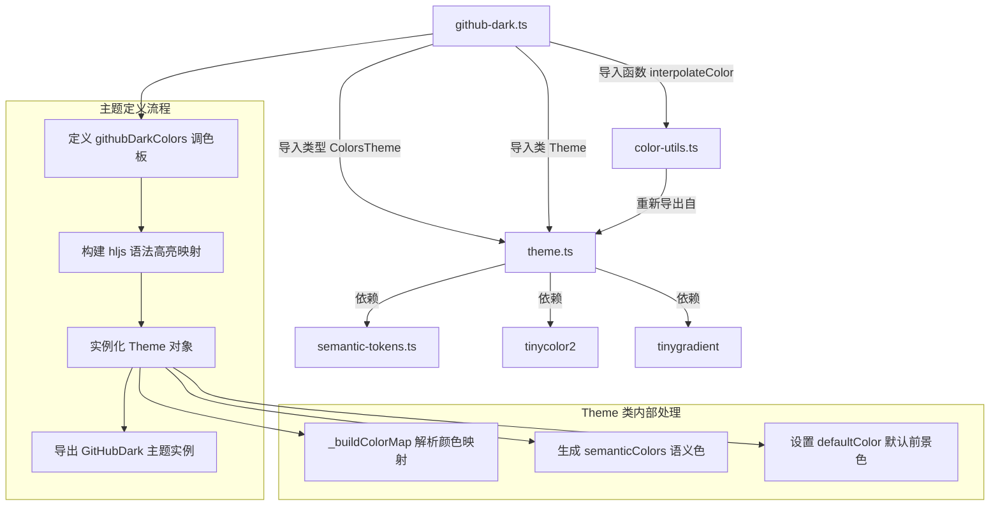

# github-dark.ts

## 概述

`github-dark.ts` 是 Gemini CLI 项目中内置的 **GitHub 深色主题** 定义文件。GitHub Dark 是模仿 GitHub 网站深色模式配色方案的主题，以其低对比度、专业化的色彩搭配著称，广泛应用于代码编辑器和终端工具中。本文件将 GitHub Dark 调色板适配为 Gemini CLI 终端界面所需的 `ColorsTheme` 和 highlight.js 语法高亮样式映射，最终通过 `Theme` 类导出一个可直接使用的主题实例 `GitHubDark`。

该文件位于 `packages/cli/src/ui/themes/builtin/dark/` 目录下，属于内置深色主题集合的一部分。

## 架构图（Mermaid）



## 核心组件

### 1. `githubDarkColors` 调色板对象

类型为 `ColorsTheme`，定义了 GitHub Dark 主题的全部基础颜色：

| 属性名 | 色值 | 说明 |
|--------|------|------|
| `type` | `'dark'` | 主题类型，标识为深色主题 |
| `Background` | `#24292e` | GitHub Dark 标志性的深灰蓝色背景 |
| `Foreground` | `#c0c4c8` | 柔和的浅灰色前景文字 |
| `LightBlue` | `#79B8FF` | 浅蓝色（GitHub 数字/属性色） |
| `AccentBlue` | `#79B8FF` | 强调蓝色，与 LightBlue 相同 |
| `AccentPurple` | `#B392F0` | 强调紫色（GitHub 函数名色） |
| `AccentCyan` | `#9ECBFF` | 强调青色（GitHub 字符串色） |
| `AccentGreen` | `#85E89D` | 强调绿色（GitHub 类型/标签色） |
| `AccentYellow` | `#FFAB70` | 强调橙黄色（GitHub 变量色） |
| `AccentRed` | `#F97583` | 强调粉红色（GitHub 关键字色） |
| `DiffAdded` | `#3C4636` | Diff 新增内容的深绿色背景 |
| `DiffRemoved` | `#502125` | Diff 删除内容的深红色背景 |
| `Comment` | `#6A737D` | 注释颜色（GitHub 灰色） |
| `Gray` | `#6A737D` | 灰色，与 Comment 相同 |
| `DarkGray` | `interpolateColor('#6A737D', '#24292e', 0.5)` | 深灰色，由 Comment 色和背景色按 50% 比例插值生成 |
| `GradientColors` | `['#79B8FF', '#85E89D']` | 渐变色数组，从蓝色过渡到绿色 |

### 2. `GitHubDark` 主题实例

通过 `new Theme(name, type, rawMappings, colors)` 构造，导出为命名常量 `GitHubDark`。

构造参数：
- **name**: `'GitHub'` - 主题显示名称
- **type**: `'dark'` - 主题类型
- **rawMappings**: highlight.js CSS 样式映射对象（详见下文）
- **colors**: `githubDarkColors` 调色板对象

### 3. highlight.js 语法高亮映射

该主题为以下 highlight.js CSS 类名定义了颜色和字体样式：

#### 粉红色（AccentRed `#F97583`）- 关键字
| CSS 类名 | 颜色 | 加粗 | 说明 |
|----------|------|------|------|
| `hljs-keyword` | `#F97583` | 是 | 语言关键字（如 `if`, `return`） |
| `hljs-selector-tag` | `#F97583` | 是 | CSS 选择器标签 |

#### 浅蓝色（LightBlue `#79B8FF`）- 数字与内置函数
| CSS 类名 | 颜色 | 加粗 | 说明 |
|----------|------|------|------|
| `hljs-number` | `#79B8FF` | 否 | 数字字面量 |
| `hljs-literal` | `#79B8FF` | 否 | 字面量（如 `true`, `null`） |
| `hljs-attribute` | `#79B8FF` | 否 | HTML/XML 属性名 |
| `hljs-built_in` | `#79B8FF` | 否 | 内置函数/对象 |
| `hljs-builtin-name` | `#79B8FF` | 否 | 内置名称 |
| `hljs-meta` | `#79B8FF` | 是 | 元信息（如预处理器指令） |

#### 橙黄色（AccentYellow `#FFAB70`）- 变量
| CSS 类名 | 颜色 | 说明 |
|----------|------|------|
| `hljs-variable` | `#FFAB70` | 变量名 |
| `hljs-template-variable` | `#FFAB70` | 模板变量 |
| `hljs-tag .hljs-attr` | `#FFAB70` | 标签内的属性 |

#### 青色（AccentCyan `#9ECBFF`）- 字符串与正则
| CSS 类名 | 颜色 | 说明 |
|----------|------|------|
| `hljs-string` | `#9ECBFF` | 字符串字面量 |
| `hljs-doctag` | `#9ECBFF` | 文档标签 |
| `hljs-regexp` | `#9ECBFF` | 正则表达式 |
| `hljs-link` | `#9ECBFF` | 链接 |

#### 紫色（AccentPurple `#B392F0`）- 标题与标识符
| CSS 类名 | 颜色 | 加粗 | 说明 |
|----------|------|------|------|
| `hljs-title` | `#B392F0` | 是 | 标题（如函数名） |
| `hljs-section` | `#B392F0` | 是 | 章节标题 |
| `hljs-selector-id` | `#B392F0` | 是 | CSS ID 选择器 |
| `hljs-symbol` | `#B392F0` | 否 | 符号 |
| `hljs-bullet` | `#B392F0` | 否 | 列表项目符号 |

#### 绿色（AccentGreen `#85E89D`）- 类型与标签
| CSS 类名 | 颜色 | 加粗 | 说明 |
|----------|------|------|------|
| `hljs-type` | `#85E89D` | 是 | 类型名称 |
| `hljs-class .hljs-title` | `#85E89D` | 是 | 类名标题 |
| `hljs-tag` | `#85E89D` | 否 | HTML/XML 标签 |
| `hljs-name` | `#85E89D` | 否 | 名称标识符 |

#### 灰色（Comment `#6A737D`）- 注释
| CSS 类名 | 颜色 | 斜体 | 说明 |
|----------|------|------|------|
| `hljs-comment` | `#6A737D` | 是 | 代码注释 |
| `hljs-quote` | `#6A737D` | 是 | 引用文本 |

#### Diff 相关（带背景色）
| CSS 类名 | 文字颜色 | 背景色 | 说明 |
|----------|---------|--------|------|
| `hljs-deletion` | `#F97583` | `#86181D` | Diff 删除行（深红背景 + 粉红文字） |
| `hljs-addition` | `#85E89D` | `#144620` | Diff 新增行（深绿背景 + 绿色文字） |

#### 前景色（Foreground `#c0c4c8`）
| CSS 类名 | 颜色 | 说明 |
|----------|------|------|
| `hljs-subst` | `#c0c4c8` | 替换表达式 |

#### 仅样式（无颜色指定）
| CSS 类名 | 样式 | 说明 |
|----------|------|------|
| `hljs-emphasis` | `fontStyle: 'italic'` | 斜体强调 |
| `hljs-strong` | `fontWeight: 'bold'` | 加粗强调 |

### 4. 基础样式 (`hljs`)

```typescript
hljs: {
  display: 'block',
  overflowX: 'auto',
  padding: '0.5em',
  color: '#c0c4c8',       // GitHub Dark 前景色
  background: '#24292e',   // GitHub Dark 背景色
}
```

## 依赖关系

### 内部依赖

| 模块 | 导入内容 | 用途 |
|------|---------|------|
| `../../theme.js` | `ColorsTheme`（类型）, `Theme`（类） | `ColorsTheme` 定义调色板接口结构；`Theme` 类用于将调色板和 hljs 映射组装成完整主题实例 |
| `../../color-utils.js` | `interpolateColor`（函数） | 在两个颜色之间进行线性插值，用于动态计算 `DarkGray` 颜色值 |

### 外部依赖

本文件不直接导入外部 npm 包，但通过 `Theme` 类和 `interpolateColor` 函数间接依赖：

| 包名 | 用途 |
|------|------|
| `tinygradient` | 颜色渐变插值计算（`interpolateColor` 内部使用） |
| `tinycolor2` | 颜色解析、转换与亮度计算（`Theme._resolveColor` 内部使用） |

## 关键实现细节

### 1. 与 Dracula 主题的设计差异

GitHub Dark 主题与 Dracula 主题在颜色分配策略上有显著差异：

| 语法元素 | GitHub Dark | Dracula |
|----------|-------------|---------|
| 关键字 | 粉红色 `#F97583` | 青色 `#8be9fd` |
| 字符串 | 青色 `#9ECBFF` | 黄色 `#fff783` |
| 函数名/标题 | 紫色 `#B392F0` | 黄色 `#fff783` |
| 类型名 | 绿色 `#85E89D` | 黄色 `#fff783` |
| 变量 | 橙黄色 `#FFAB70` | 黄色 `#fff783` |

GitHub Dark 使用了更多样化的颜色分配，不同语法元素有更清晰的颜色区分，而 Dracula 则大量使用黄色覆盖多种语法元素。

### 2. Diff 样式的独特处理

GitHub Dark 主题为 `hljs-deletion` 和 `hljs-addition` 同时定义了 **背景色** 和 **文字颜色**，这是与其他主题的一个显著区别：

```typescript
'hljs-deletion': {
  background: '#86181D',     // 独立的深红色背景
  color: githubDarkColors.AccentRed,  // 粉红色文字
},
'hljs-addition': {
  background: '#144620',     // 独立的深绿色背景
  color: githubDarkColors.AccentGreen,  // 绿色文字
},
```

值得注意的是，Diff 行的背景色（`#86181D` 和 `#144620`）与 `ColorsTheme` 中定义的 `DiffRemoved`（`#502125`）和 `DiffAdded`（`#3C4636`）使用了 **不同的色值**。`ColorsTheme` 中的 Diff 颜色用于 UI 层面的语义色系统，而 hljs 映射中的背景色则直接用于语法高亮渲染。但需注意 `_buildColorMap` 方法只提取 `color` 属性，`background` 属性不会被纳入颜色映射。

### 3. 嵌套选择器的使用

GitHub Dark 主题使用了嵌套的 CSS 类选择器：

```typescript
'hljs-tag .hljs-attr': { color: githubDarkColors.AccentYellow },
'hljs-class .hljs-title': { color: githubDarkColors.AccentGreen, fontWeight: 'bold' },
```

这些嵌套选择器在 `_buildColorMap` 处理时会被跳过（因为键不是以 `hljs-` 开头也不等于 `hljs`，而是包含空格的复合选择器），所以这些样式定义主要是为了保持与标准 highlight.js 主题格式的兼容性，在实际的 Ink 终端渲染中可能不会生效。

### 4. DarkGray 动态插值

与 Dracula 主题相同的模式：

```typescript
DarkGray: interpolateColor('#6A737D', '#24292e', 0.5),
```

在 Comment 色 (`#6A737D`) 和 Background 色 (`#24292e`) 之间取 50% 中间值。

### 5. 注释的斜体样式

GitHub Dark 对注释类（`hljs-comment` 和 `hljs-quote`）同时应用了颜色和斜体样式：

```typescript
'hljs-comment': {
  color: githubDarkColors.Comment,
  fontStyle: 'italic',
},
```

虽然 `_buildColorMap` 只处理 `color` 属性，但斜体样式的定义保留了主题的完整设计意图。

### 6. 渐变色配置

```typescript
GradientColors: ['#79B8FF', '#85E89D'],
```

GitHub Dark 的渐变色从蓝色 (`#79B8FF`) 过渡到绿色 (`#85E89D`)，色调偏向清新自然，与 GitHub 品牌的蓝绿配色一致。

### 7. 语义色自动派生

与 Dracula 主题相同，构造 `Theme` 时未传入 `semanticColors` 参数，所有语义色由 `Theme` 构造函数自动从 `githubDarkColors` 调色板派生。
