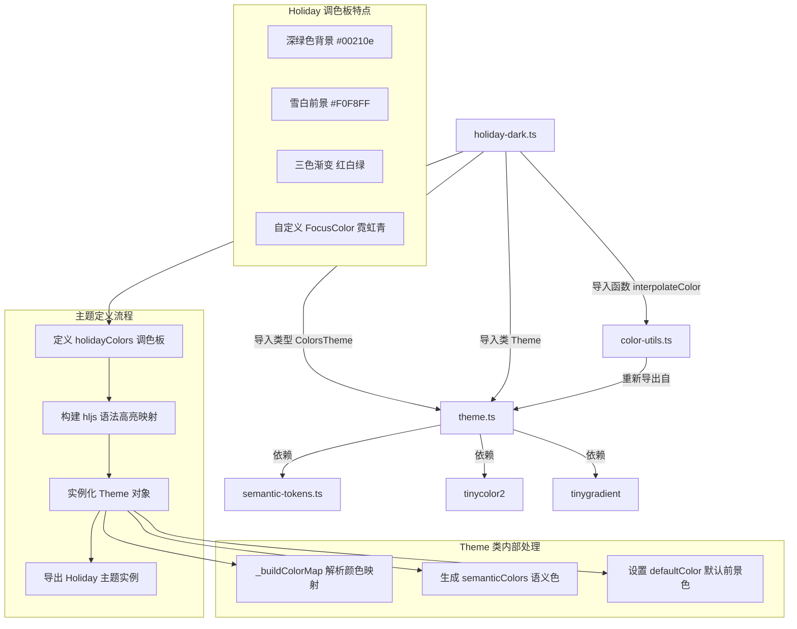
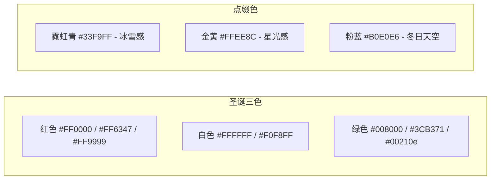

# holiday-dark.ts

## 概述

`holiday-dark.ts` 是 Gemini CLI 项目中内置的 **Holiday（节日）深色主题** 定义文件。Holiday 主题以圣诞节的经典红绿白配色为灵感，将节日氛围融入代码编辑体验。深绿色的背景搭配雪白色的前景文字，辅以红色、绿色、青色等鲜明的强调色，营造出浓厚的节日感。该主题还独特地配置了三色渐变（红、白、绿），呼应了圣诞节的传统色彩。

该文件位于 `packages/cli/src/ui/themes/builtin/dark/` 目录下，属于内置深色主题集合的一部分。

## 架构图（Mermaid）



## 核心组件

### 1. `holidayColors` 调色板对象

类型为 `ColorsTheme`，定义了 Holiday 主题的全部基础颜色：

| 属性名 | 色值 | 说明 |
|--------|------|------|
| `type` | `'dark'` | 主题类型，标识为深色主题 |
| `Background` | `#00210e` | 极深的森林绿背景，接近黑色但带有明显绿色调 |
| `Foreground` | `#F0F8FF` | Alice Blue（爱丽丝蓝），近白色带微蓝调，模拟雪白效果 |
| `LightBlue` | `#B0E0E6` | Powder Blue（粉蓝色），用于属性名 |
| `AccentBlue` | `#3CB371` | Medium Sea Green（中海绿），尽管名为 "Blue" 实际使用绿色，与 AccentGreen 相同 |
| `AccentPurple` | `#FF9999` | 浅珊瑚红/粉色，模拟圣诞装饰品色 |
| `AccentCyan` | `#33F9FF` | 霓虹青色，极高饱和度的青色 |
| `AccentGreen` | `#3CB371` | Medium Sea Green（中海绿） |
| `AccentYellow` | `#FFEE8C` | 柔和的金黄色，模拟星光/烛光效果 |
| `AccentRed` | `#FF6347` | Tomato Red（番茄红），鲜明的暖红色 |
| `DiffAdded` | `#2E8B57` | Sea Green（海绿色），Diff 新增背景 |
| `DiffRemoved` | `#CD5C5C` | Indian Red（印度红），Diff 删除背景 |
| `Comment` | `#8FBC8F` | Dark Sea Green（暗海绿），柔和的绿灰色 |
| `Gray` | `#D7F5D3` | 极浅的薄荷绿/绿白色 |
| `DarkGray` | `interpolateColor('#D7F5D3', '#151B18', 0.5)` | 深灰绿色，由浅绿灰色和深灰色按 50% 插值生成 |
| `FocusColor` | `#33F9FF` | 焦点色，与 AccentCyan 相同，霓虹青色 |
| `GradientColors` | `['#FF0000', '#FFFFFF', '#008000']` | 三色渐变：纯红、纯白、纯绿（圣诞三色） |

### 2. `Holiday` 主题实例

通过 `new Theme(name, type, rawMappings, colors)` 构造，导出为命名常量 `Holiday`。

构造参数：
- **name**: `'Holiday'` - 主题显示名称
- **type**: `'dark'` - 主题类型
- **rawMappings**: highlight.js CSS 样式映射对象
- **colors**: `holidayColors` 调色板对象

### 3. highlight.js 语法高亮映射

该主题覆盖了丰富的 highlight.js CSS 类名，颜色分配如下：

#### 绿色（AccentBlue/AccentGreen `#3CB371`）- 关键字与数字
| CSS 类名 | 颜色 | 说明 |
|----------|------|------|
| `hljs-keyword` | `#3CB371` | 语言关键字 |
| `hljs-literal` | `#3CB371` | 字面量 |
| `hljs-symbol` | `#3CB371` | 符号 |
| `hljs-name` | `#3CB371` | 名称标识符 |
| `hljs-link` | `#3CB371` | 链接（含下划线样式） |
| `hljs-number` | `#3CB371` | 数字字面量 |
| `hljs-class` | `#3CB371` | 类名 |

#### 霓虹青色（AccentCyan `#33F9FF`）- 内置类型
| CSS 类名 | 颜色 | 说明 |
|----------|------|------|
| `hljs-built_in` | `#33F9FF` | 内置函数/对象 |
| `hljs-type` | `#33F9FF` | 类型名称 |

#### 金黄色（AccentYellow `#FFEE8C`）- 字符串与选择器
| CSS 类名 | 颜色 | 说明 |
|----------|------|------|
| `hljs-string` | `#FFEE8C` | 字符串字面量 |
| `hljs-meta-string` | `#FFEE8C` | 元字符串 |
| `hljs-section` | `#FFEE8C` | 章节标题 |
| `hljs-bullet` | `#FFEE8C` | 列表项目符号 |
| `hljs-selector-tag` | `#FFEE8C` | CSS 选择器标签 |
| `hljs-selector-id` | `#FFEE8C` | CSS ID 选择器 |
| `hljs-selector-class` | `#FFEE8C` | CSS 类选择器 |
| `hljs-selector-attr` | `#FFEE8C` | CSS 属性选择器 |
| `hljs-selector-pseudo` | `#FFEE8C` | CSS 伪选择器 |

#### 番茄红色（AccentRed `#FF6347`）- 正则与模板
| CSS 类名 | 颜色 | 说明 |
|----------|------|------|
| `hljs-regexp` | `#FF6347` | 正则表达式 |
| `hljs-template-tag` | `#FF6347` | 模板标签 |

#### 粉色（AccentPurple `#FF9999`）- 变量
| CSS 类名 | 颜色 | 说明 |
|----------|------|------|
| `hljs-variable` | `#FF9999` | 变量名 |
| `hljs-template-variable` | `#FF9999` | 模板变量 |

#### 粉蓝色（LightBlue `#B0E0E6`）- 属性
| CSS 类名 | 颜色 | 说明 |
|----------|------|------|
| `hljs-attr` | `#B0E0E6` | 属性名 |
| `hljs-attribute` | `#B0E0E6` | 属性 |
| `hljs-builtin-name` | `#B0E0E6` | 内置名称 |

#### 暗海绿色（Comment `#8FBC8F`）- 注释
| CSS 类名 | 颜色 | 斜体 | 说明 |
|----------|------|------|------|
| `hljs-comment` | `#8FBC8F` | 是 | 代码注释 |
| `hljs-quote` | `#8FBC8F` | 是 | 引用文本 |
| `hljs-doctag` | `#8FBC8F` | 否 | 文档标签 |

#### 浅绿灰色（Gray `#D7F5D3`）- 元信息
| CSS 类名 | 颜色 | 说明 |
|----------|------|------|
| `hljs-meta` | `#D7F5D3` | 元信息 |
| `hljs-meta-keyword` | `#D7F5D3` | 元关键字 |
| `hljs-tag` | `#D7F5D3` | 标签 |

#### 前景色（Foreground `#F0F8FF`）- 普通文本
| CSS 类名 | 颜色 | 说明 |
|----------|------|------|
| `hljs-subst` | `#F0F8FF` | 替换表达式 |
| `hljs-function` | `#F0F8FF` | 函数 |
| `hljs-title` | `#F0F8FF` | 标题 |
| `hljs-params` | `#F0F8FF` | 参数 |
| `hljs-formula` | `#F0F8FF` | 公式 |

#### Diff 相关（仅背景色，无文字色）
| CSS 类名 | 背景色 | 说明 |
|----------|--------|------|
| `hljs-addition` | `#2E8B57`（Sea Green） | Diff 新增行 |
| `hljs-deletion` | `#CD5C5C`（Indian Red） | Diff 删除行 |

#### 仅样式（无颜色指定）
| CSS 类名 | 样式 | 说明 |
|----------|------|------|
| `hljs-emphasis` | `fontStyle: 'italic'` | 斜体强调 |
| `hljs-strong` | `fontWeight: 'bold'` | 加粗强调 |

### 4. 基础样式 (`hljs`)

```typescript
hljs: {
  display: 'block',
  overflowX: 'auto',
  padding: '0.5em',
  background: '#00210e',   // 极深森林绿背景
  color: '#F0F8FF',        // Alice Blue 前景色
}
```

## 依赖关系

### 内部依赖

| 模块 | 导入内容 | 用途 |
|------|---------|------|
| `../../theme.js` | `ColorsTheme`（类型）, `Theme`（类） | `ColorsTheme` 定义调色板接口结构；`Theme` 类用于将调色板和 hljs 映射组装成完整主题实例 |
| `../../color-utils.js` | `interpolateColor`（函数） | 在两个颜色之间进行线性插值，用于动态计算 `DarkGray` 颜色值 |

### 外部依赖

本文件不直接导入外部 npm 包，但通过 `Theme` 类和 `interpolateColor` 函数间接依赖：

| 包名 | 用途 |
|------|------|
| `tinygradient` | 颜色渐变插值计算（`interpolateColor` 内部使用） |
| `tinycolor2` | 颜色解析、转换与亮度计算（`Theme._resolveColor` 内部使用） |

## 关键实现细节

### 1. 圣诞主题的色彩设计

Holiday 主题的配色方案完全围绕圣诞节的经典三色展开：



### 2. AccentBlue 使用绿色的特殊设计

Holiday 主题中 `AccentBlue` 被有意设置为 `#3CB371`（中海绿），与 `AccentGreen` 完全相同。这是一个刻意的设计选择，使得在 UI 的语义色系统中，原本应为蓝色的元素（如链接、活跃状态）也呈现为绿色，从而增强整体的绿色圣诞氛围。

### 3. DarkGray 插值的不同基色

```typescript
DarkGray: interpolateColor('#D7F5D3', '#151B18', 0.5),
```

与其他主题不同的是，Holiday 主题的 `DarkGray` 插值使用的第二个颜色 `#151B18` 并非 `Background` 色 (`#00210e`)，而是一个独立的深灰色。这意味着 DarkGray 的色调更偏中性灰，而非背景色的深绿。

### 4. 三色渐变配置

```typescript
GradientColors: ['#FF0000', '#FFFFFF', '#008000'],
```

Holiday 是唯一使用 **三个渐变端点** 的主题（其他主题通常只有两个），直接对应圣诞节的红、白、绿三色。这个三色渐变将在 UI 的渐变效果中产生从红色经过白色过渡到绿色的独特视觉效果。

### 5. FocusColor 的显式定义

```typescript
FocusColor: '#33F9FF', // AccentCyan for neon pop
```

Holiday 主题是少数显式定义了 `FocusColor` 可选属性的主题之一。注释说明了选择霓虹青色的意图是为了产生 "neon pop"（霓虹弹出效果），在深绿色背景上提供极高对比度的焦点指示。这个值会在 `Theme` 构造函数生成语义色时被直接使用，而非默认的 `AccentGreen`。

### 6. Diff 样式使用 backgroundColor 而非 color

Holiday 主题的 `hljs-addition` 和 `hljs-deletion` 使用 `backgroundColor` 而非 `color` 属性：

```typescript
'hljs-addition': {
  backgroundColor: holidayColors.DiffAdded,
  display: 'inline-block',
  width: '100%',
},
```

由于 `_buildColorMap` 只提取 `color` 属性，这些 Diff 相关的样式不会被纳入颜色映射。但 `display: 'inline-block'` 和 `width: '100%'` 的设置暗示了这些样式是为了让背景色覆盖整行。

### 7. 覆盖范围最广的映射

Holiday 主题的 hljs 映射覆盖了几乎所有标准的 highlight.js 类名（共计 30+ 个），包括 `hljs-selector-attr`、`hljs-selector-pseudo`、`hljs-meta-keyword`、`hljs-formula`、`hljs-params` 等在其他主题中通常被省略的类名。这使得 Holiday 主题在各种编程语言的语法高亮中都能提供更一致的色彩体验。

### 8. 语义色派生中 FocusColor 的影响

由于 Holiday 显式设置了 `FocusColor: '#33F9FF'`，在 `Theme` 构造函数自动派生语义色时：
- `semanticColors.ui.focus` 将使用 `#33F9FF` 而非默认的 `AccentGreen (#3CB371)`
- `semanticColors.background.focus` 将使用 `interpolateColor(Background, FocusColor, DEFAULT_SELECTION_OPACITY)` 计算，即背景色和霓虹青色的混合
