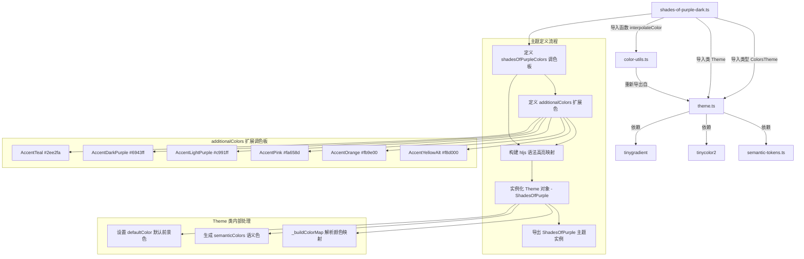

# shades-of-purple-dark.ts

## 概述

`shades-of-purple-dark.ts` 是 Gemini CLI 项目中内置的 **Shades of Purple 深色主题** 定义文件。Shades of Purple 是由 Ahmad Awais 设计的一款广受欢迎的紫色系深色配色方案，最初作为 VS Code 主题发布。该主题以深邃的紫蓝色背景为基础，搭配多种紫色调变体和鲜明的强调色，打造出极具视觉冲击力的编码体验。

本文件是所有五个深色主题中**最复杂**的一个，包含了一个额外的 `additionalColors` 对象来扩展标准 `ColorsTheme` 接口的颜色集，并定义了超过 50 个 highlight.js 样式映射规则，涵盖了语言特定的语法元素（如 Python 装饰器、Ruby 符号、SQL 关键字、JSON 键等），以及行号、选中区域、高亮行等高级 UI 样式。

该文件位于 `packages/cli/src/ui/themes/builtin/dark/` 目录下，属于内置深色主题集合的一部分。

## 架构图（Mermaid）



## 核心组件

### 1. `shadesOfPurpleColors` 调色板对象

类型为 `ColorsTheme`，定义了 Shades of Purple 主题的全部基础颜色：

| 属性名 | 色值 | 说明 |
|--------|------|------|
| `type` | `'dark'` | 主题类型，标识为深色主题 |
| `Background` | `#1e1e3f` | 深紫蓝色背景，Shades of Purple 的标志性底色 |
| `Foreground` | `#e3dfff` | 柔和的淡紫白色前景文字 |
| `LightBlue` | `#847ace` | 淡蓝紫色强调色 |
| `AccentBlue` | `#a599e9` | 中紫色，用于边框和二级蓝色元素 |
| `AccentPurple` | `#ac65ff` | 亮紫色，用于注释 |
| `AccentCyan` | `#a1feff` | 浅青色，用于名称标识符 |
| `AccentGreen` | `#A5FF90` | 亮黄绿色，用于字符串和大量语法元素 |
| `AccentYellow` | `#fad000` | 金黄色，用于标题和类型 |
| `AccentRed` | `#ff628c` | 粉红色，用于错误和删除 |
| `DiffAdded` | `#383E45` | Diff 新增内容背景色（深灰） |
| `DiffRemoved` | `#572244` | Diff 删除内容背景色（深紫红） |
| `Comment` | `#B362FF` | 注释颜色，比 AccentPurple 更亮的紫色 |
| `Gray` | `#726c86` | 灰紫色 |
| `DarkGray` | `interpolateColor('#726c86', '#2d2b57', 0.5)` | 深灰紫色，由灰色和深紫色按 50% 插值生成 |
| `GradientColors` | `['#4d21fc', '#847ace', '#ff628c']` | 三色渐变：深紫、淡紫、粉红 |

### 2. `additionalColors` 扩展调色板

这是一个本地常量对象，包含了 `ColorsTheme` 接口所不支持的额外颜色，用于丰富语法高亮的颜色层次：

| 属性名 | 色值 | 说明 |
|--------|------|------|
| `AccentYellowAlt` | `#f8d000` | 属性黄色的微变体，与 `AccentYellow (#fad000)` 极其接近 |
| `AccentOrange` | `#fb9e00` | 橙色，用于关键字、内置函数、元信息 |
| `AccentPink` | `#fa658d` | 粉色，用于数字和字面量 |
| `AccentLightPurple` | `#c991ff` | 浅紫色，用于函数参数和属性 |
| `AccentDarkPurple` | `#6943ff` | 深紫色，用于运算符 |
| `AccentTeal` | `#2ee2fa` | 青蓝色，用于内置名称和装饰器 |

### 3. `ShadesOfPurple` 主题实例

通过 `new Theme(name, type, rawMappings, colors)` 构造，导出为命名常量 `ShadesOfPurple`。

构造参数：
- **name**: `'Shades Of Purple'` - 主题显示名称
- **type**: `'dark'` - 主题类型
- **rawMappings**: 超过 50 条 highlight.js CSS 样式映射规则
- **colors**: `shadesOfPurpleColors` 调色板对象

### 4. highlight.js 语法高亮映射（完整分类）

该主题的映射极为丰富，以下按颜色分组列出：

#### 橙色（additionalColors.AccentOrange `#fb9e00`）- 关键字与内置函数
| CSS 类名 | 颜色 | 其他样式 | 说明 |
|----------|------|----------|------|
| `hljs-keyword` | `#fb9e00` | fontWeight: normal | 语言关键字 |
| `hljs-built_in` | `#fb9e00` | - | 内置函数/对象 |
| `hljs-selector-tag` | `#fb9e00` | fontWeight: normal | CSS 选择器标签 |
| `hljs-section` | `#fb9e00` | - | 章节标题 |
| `hljs-meta` | `#fb9e00` | - | 元信息 |
| `hljs-meta-string` | `#fb9e00` | - | 元字符串 |
| `hljs-meta-keyword` | `#fb9e00` | fontWeight: bold | 元关键字 |
| `hljs-function .hljs-keyword` | `#fb9e00` | - | 函数内关键字（嵌套选择器） |
| `hljs-keyword.sql` | `#fb9e00` | textTransform: uppercase | SQL 关键字（语言特定） |

#### 亮黄绿色（AccentGreen `#A5FF90`）- 字符串及相关元素
| CSS 类名 | 颜色 | 说明 |
|----------|------|------|
| `hljs-string` | `#A5FF90` | 字符串字面量 |
| `hljs-attribute` | `#A5FF90` | 属性值 |
| `hljs-symbol` | `#A5FF90` | 符号 |
| `hljs-bullet` | `#A5FF90` | 列表项目符号 |
| `hljs-addition` | `#A5FF90` | Diff 新增行 |
| `hljs-code` | `#A5FF90` | 行内代码 |
| `hljs-regexp` | `#A5FF90` | 正则表达式 |
| `hljs-selector-class` | `#A5FF90` | CSS 类选择器 |
| `hljs-selector-attr` | `#A5FF90` | CSS 属性选择器 |
| `hljs-selector-pseudo` | `#A5FF90` | CSS 伪选择器 |
| `hljs-template-tag` | `#A5FF90` | 模板标签 |
| `hljs-quote` | `#A5FF90` | 引用文本 |
| `hljs-template-variable` | `#A5FF90` | 模板变量 |
| `hljs-char` | `#A5FF90` | 字符字面量 |

#### 金黄色（AccentYellow `#fad000`）- 标题与类型
| CSS 类名 | 颜色 | 其他样式 | 说明 |
|----------|------|----------|------|
| `hljs-title` | `#fad000` | fontWeight: normal | 标题（如函数名） |
| `hljs-type` | `#fad000` | fontWeight: normal | 类型名称 |
| `hljs-variable` | `#fad000` | - | 变量名 |
| `hljs-selector-id` | `#fad000` | fontWeight: bold | CSS ID 选择器 |
| `hljs-section.markdown` | `#fad000` | fontWeight: bold | Markdown 章节（语言特定） |

#### 浅青色（AccentCyan `#a1feff`）- 名称与类
| CSS 类名 | 颜色 | 其他样式 | 说明 |
|----------|------|----------|------|
| `hljs-name` | `#a1feff` | fontWeight: normal | 名称标识符 |
| `hljs-class` | `#a1feff` | fontWeight: bold | 类定义 |
| `hljs-function` | `#a1feff` | - | 函数定义 |
| `hljs-module` | `#a1feff` | - | 模块 |
| `hljs-formula` | `#a1feff` | fontStyle: italic | 公式（如 LaTeX） |
| `hljs-attr.json` | `#a1feff` | - | JSON 键名（语言特定） |

#### 亮紫色（AccentPurple `#ac65ff`）- 注释
| CSS 类名 | 颜色 | 说明 |
|----------|------|------|
| `hljs-comment` | `#ac65ff` | 代码注释 |

#### 粉色（additionalColors.AccentPink `#fa658d`）- 数字与字面量
| CSS 类名 | 颜色 | 其他样式 | 说明 |
|----------|------|----------|------|
| `hljs-literal` | `#fa658d` | fontWeight: normal | 字面量 |
| `hljs-number` | `#fa658d` | - | 数字 |
| `hljs-escape` | `#fa658d` | fontWeight: bold | 转义序列 |
| `hljs-symbol.ruby` | `#fa658d` | - | Ruby 符号（语言特定） |

#### 粉红色（AccentRed `#ff628c`）- 删除与重要标记
| CSS 类名 | 颜色 | 其他样式 | 说明 |
|----------|------|----------|------|
| `hljs-deletion` | `#ff628c` | - | Diff 删除行 |
| `hljs-important` | `#ff628c` | fontWeight: bold | 重要标注 |
| `hljs-tag .hljs-name` | `#ff628c` | - | HTML/XML 标签名（嵌套选择器） |

#### 中紫色（AccentBlue `#a599e9`）- 属性与 Diff
| CSS 类名 | 颜色 | 说明 |
|----------|------|------|
| `hljs-property` | `#a599e9` | 对象属性 |
| `hljs-meta.hljs-diff` | `#a599e9` | Diff 元信息（嵌套选择器） |

#### 淡蓝紫色（LightBlue `#847ace`）- 链接与命名空间
| CSS 类名 | 颜色 | 说明 |
|----------|------|------|
| `hljs-link` | `#847ace` | 链接 |
| `hljs-namespace` | `#847ace` | 命名空间 |

#### 浅紫色（additionalColors.AccentLightPurple `#c991ff`）- 参数
| CSS 类名 | 颜色 | 其他样式 | 说明 |
|----------|------|----------|------|
| `hljs-params` | `#c991ff` | fontStyle: italic | 函数参数 |

#### 深紫色（additionalColors.AccentDarkPurple `#6943ff`）- 运算符
| CSS 类名 | 颜色 | 说明 |
|----------|------|------|
| `hljs-operator` | `#6943ff` | 运算符 |

#### 青蓝色（additionalColors.AccentTeal `#2ee2fa`）- 内置名称与装饰器
| CSS 类名 | 颜色 | 其他样式 | 说明 |
|----------|------|----------|------|
| `hljs-builtin-name` | `#2ee2fa` | - | 内置名称 |
| `hljs-decorator` | `#2ee2fa` | fontWeight: bold | Python 装饰器（语言特定） |

#### 属性黄色变体（additionalColors.AccentYellowAlt `#f8d000`）- 属性名
| CSS 类名 | 颜色 | 其他样式 | 说明 |
|----------|------|----------|------|
| `hljs-attr` | `#f8d000` | fontStyle: italic | HTML/XML 属性名 |
| `hljs-tag .hljs-attr` | `#f8d000` | - | 标签内属性（嵌套选择器） |

#### 灰紫色（Gray `#726c86`）- 辅助元素
| CSS 类名 | 颜色 | 说明 |
|----------|------|------|
| `hljs-punctuation` | `#726c86` | 标点符号 |
| `hljs-ln` | `#726c86` | 行号 |

#### 前景色（Foreground `#e3dfff`）- 普通文本
| CSS 类名 | 颜色 | 说明 |
|----------|------|------|
| `hljs-subst` | `#e3dfff` | 替换表达式 |
| `hljs-tag` | `#e3dfff` | 标签 |
| `hljs-diff` | `#e3dfff` | Diff 普通行 |

#### 仅样式（无颜色指定）
| CSS 类名 | 样式 | 说明 |
|----------|------|------|
| `hljs-doctag` | `fontWeight: 'bold'` | 文档标签加粗 |
| `hljs-emphasis` | `fontStyle: 'italic'` | 斜体强调 |
| `hljs-strong` | `fontWeight: 'bold'` | 加粗强调 |

#### 高级 UI 样式（行号、选中区域、高亮行）
| CSS 类名 | 样式 | 说明 |
|----------|------|------|
| `hljs.hljs-line-numbers` | `borderRight: 1px solid #726c86` | 行号区域右边框 |
| `hljs.hljs-line-numbers .hljs-ln-numbers` | `color: #726c86, paddingRight: 1em` | 行号数字样式 |
| `hljs.hljs-line-numbers .hljs-ln-code` | `paddingLeft: 1em` | 代码区域左内边距 |
| `hljs::selection` | `background: #a599e940` | 选中区域背景（25% 透明度） |
| `hljs ::-moz-selection` | `background: #a599e940` | Firefox 选中区域背景 |
| `hljs .hljs-highlight` | `background: #ac65ff20, display: block, width: 100%` | 高亮行背景（12.5% 透明度） |

### 5. 基础样式 (`hljs`)

```typescript
hljs: {
  display: 'block',
  overflowX: 'auto',
  background: '#1e1e3f',   // 深紫蓝色背景
  color: '#e3dfff',        // 淡紫白色前景
}
```

注意：与其他主题不同，此基础样式没有定义 `padding` 属性。

## 依赖关系

### 内部依赖

| 模块 | 导入内容 | 用途 |
|------|---------|------|
| `../../theme.js` | `ColorsTheme`（类型）, `Theme`（类） | `ColorsTheme` 定义调色板接口结构；`Theme` 类用于将调色板和 hljs 映射组装成完整主题实例 |
| `../../color-utils.js` | `interpolateColor`（函数） | 在两个颜色之间进行线性插值，用于动态计算 `DarkGray` 颜色值 |

### 外部依赖

本文件不直接导入外部 npm 包，但通过 `Theme` 类和 `interpolateColor` 函数间接依赖：

| 包名 | 用途 |
|------|------|
| `tinygradient` | 颜色渐变插值计算（`interpolateColor` 内部使用） |
| `tinycolor2` | 颜色解析、转换与亮度计算（`Theme._resolveColor` 内部使用） |

## 关键实现细节

### 1. 扩展调色板模式 (additionalColors)

Shades of Purple 是唯一使用 **扩展调色板** 的主题。由于 `ColorsTheme` 接口只预定义了有限的颜色槽位（如 AccentBlue、AccentRed 等），而该主题需要更丰富的颜色层次，因此定义了一个独立的 `additionalColors` 对象：

```typescript
const additionalColors = {
  AccentYellowAlt: '#f8d000',
  AccentOrange: '#fb9e00',
  AccentPink: '#fa658d',
  AccentLightPurple: '#c991ff',
  AccentDarkPurple: '#6943ff',
  AccentTeal: '#2ee2fa',
};
```

这些扩展色不参与 `Theme` 构造函数的语义色自动派生，仅在 hljs 映射中直接使用。这意味着：
- 语义色系统无法感知橙色、粉色、浅紫色、深紫色和青蓝色
- 这些扩展色只影响代码语法高亮，不影响 UI 元素的颜色

### 2. DarkGray 插值的不同基色

```typescript
DarkGray: interpolateColor('#726c86', '#2d2b57', 0.5),
```

与其他主题不同，插值的第二个颜色 `#2d2b57` 不是 `Background (#1e1e3f)`，而是一个独立的深紫色。这确保 DarkGray 保持在紫色调性内，与主题的整体紫色美学一致。

### 3. 三色渐变配置

```typescript
GradientColors: ['#4d21fc', '#847ace', '#ff628c'],
```

与 Holiday 主题类似，Shades of Purple 也使用三色渐变，从深紫色 (`#4d21fc`) 经淡紫色 (`#847ace`) 到粉红色 (`#ff628c`)，完美呼应了主题的紫色调性。

### 4. 语言特定的样式规则

该主题是唯一定义了语言特定样式的主题，包括：

```typescript
'hljs-symbol.ruby': { color: additionalColors.AccentPink },           // Ruby 符号
'hljs-keyword.sql': { color: additionalColors.AccentOrange, textTransform: 'uppercase' },  // SQL 关键字
'hljs-section.markdown': { color: shadesOfPurpleColors.AccentYellow, fontWeight: 'bold' },  // Markdown 章节
'hljs-attr.json': { color: shadesOfPurpleColors.AccentCyan },         // JSON 键名
```

这些带有语言后缀的选择器（如 `.ruby`、`.sql`）在 `_buildColorMap` 处理时会被跳过（键不以 `hljs-` 开头或包含 `.` 分隔符导致不匹配），但保留了与原始 CSS 主题的兼容性。

### 5. 嵌套选择器的广泛使用

该主题大量使用嵌套选择器：

```typescript
'hljs-function .hljs-keyword': { ... },
'hljs-tag .hljs-name': { ... },
'hljs-tag .hljs-attr': { ... },
'hljs-meta.hljs-diff': { ... },
'hljs.hljs-line-numbers': { ... },
'hljs .hljs-highlight': { ... },
```

这些嵌套选择器在 `_buildColorMap` 中大多会被过滤掉（因为包含空格或不符合 `hljs-` 前缀规则），但它们记录了完整的主题设计意图。

### 6. CSS 透明度表示法

选中区域和高亮行使用了 hex+alpha 的透明度表示：

```typescript
'hljs::selection': {
  background: shadesOfPurpleColors.AccentBlue + '40', // 40 = 25% opacity
},
'hljs .hljs-highlight': {
  background: shadesOfPurpleColors.AccentPurple + '20', // 20 = 12.5% opacity
},
```

通过字符串拼接在 hex 颜色值后添加两位十六进制透明度值（`40` = 25% 不透明度，`20` = 12.5% 不透明度）。

### 7. Comment 与 AccentPurple 的双紫色

主题定义了两个不同的紫色用于注释相关元素：
- `AccentPurple: '#ac65ff'` - 用于 hljs 映射中的 `hljs-comment`
- `Comment: '#B362FF'` - 用于语义色系统

这两个色值接近但不完全相同，`Comment (#B362FF)` 比 `AccentPurple (#ac65ff)` 稍微偏蓝且更亮。

### 8. fontWeight: 'normal' 的显式声明

多处样式显式设置 `fontWeight: 'normal'`：

```typescript
'hljs-title': { color: shadesOfPurpleColors.AccentYellow, fontWeight: 'normal' },
'hljs-keyword': { color: additionalColors.AccentOrange, fontWeight: 'normal' },
```

这是为了覆盖某些 highlight.js 默认主题中可能存在的加粗设置，确保这些元素不会被意外加粗。

### 9. 基础样式缺少 padding

与其他所有主题不同，`hljs` 基础样式中没有 `padding: '0.5em'`。这可能是有意为之（让代码块更紧凑），也可能是一个遗漏。

### 10. 映射规则数量对比

| 主题 | 映射规则数量 |
|------|-------------|
| Dracula | ~24 条 |
| GitHub Dark | ~27 条 |
| Holiday | ~30 条 |
| **Shades of Purple** | **~55 条** |
| Solarized Dark | 待统计 |

Shades of Purple 的映射规则数量约为其他主题的两倍，体现了该主题对语法高亮细节的极致追求。
