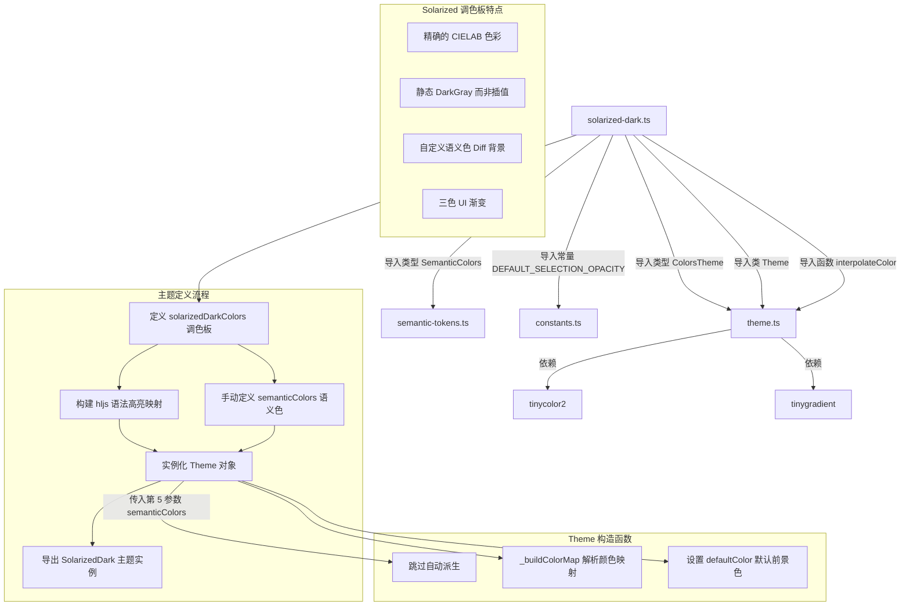

# solarized-dark.ts

## 概述

`solarized-dark.ts` 是 Gemini CLI 项目中内置的 **Solarized Dark 深色主题** 定义文件。Solarized 是由 Ethan Schoonover 精心设计的一款配色方案，其核心理念是通过精确的色彩科学（基于 CIELAB 色彩空间的对称亮度关系）来减少视觉疲劳，同时保持良好的语法区分度。Solarized 配色方案分为 Light 和 Dark 两个变体，共享同一套 16 色调色板，仅在基础色和内容色之间交换角色。

本文件是所有五个深色主题中**唯一自定义了完整 `SemanticColors` 语义色体系**的主题。其他四个主题依赖 `Theme` 构造函数自动从调色板派生语义色，而 Solarized Dark 则手动定义了每一个语义色值，确保 UI 层面的色彩与 Solarized 设计规范完全一致。

该文件位于 `packages/cli/src/ui/themes/builtin/dark/` 目录下，属于内置深色主题集合的一部分。

## 架构图（Mermaid）



## 核心组件

### 1. `solarizedDarkColors` 调色板对象

类型为 `ColorsTheme`，定义了 Solarized Dark 主题的全部基础颜色。以下色值均严格遵循 Solarized 官方调色板规范：

| 属性名 | 色值 | Solarized 名称 | 说明 |
|--------|------|----------------|------|
| `type` | `'dark'` | - | 主题类型 |
| `Background` | `#002b36` | base03 | Solarized Dark 的最深背景色 |
| `Foreground` | `#839496` | base0 | 正文前景色（内容色） |
| `LightBlue` | `#268bd2` | blue | 蓝色 |
| `AccentBlue` | `#268bd2` | blue | 蓝色，与 LightBlue 相同 |
| `AccentPurple` | `#6c71c4` | violet | 紫罗兰色 |
| `AccentCyan` | `#2aa198` | cyan | 青色 |
| `AccentGreen` | `#859900` | green | 绿色（偏黄绿） |
| `AccentYellow` | `#d0b000` | yellow (调整) | 黄色，比原版 `#b58900` 稍亮 |
| `AccentRed` | `#dc322f` | red | 红色 |
| `DiffAdded` | `#859900` | green | Diff 新增背景色，与 AccentGreen 相同 |
| `DiffRemoved` | `#dc322f` | red | Diff 删除背景色，与 AccentRed 相同 |
| `Comment` | `#586e75` | base01 | 注释色（次要内容色） |
| `Gray` | `#586e75` | base01 | 灰色，与 Comment 相同 |
| `DarkGray` | `#073642` | base02 | 深灰色（高亮背景色），**静态值** |
| `GradientColors` | `['#268bd2', '#2aa198']` | blue, cyan | 蓝色到青色的双色渐变 |

**关键特点**：`DarkGray` 使用的是 Solarized 调色板中的 `base02 (#073642)`，这是一个**静态定义**的色值，而非像其他主题那样通过 `interpolateColor` 动态计算。这体现了 Solarized 调色板中每个色值都经过精确设计的理念。

### 2. `semanticColors` 语义色体系

这是 Solarized Dark 主题的**独有特性**。手动定义了完整的 `SemanticColors` 接口实例：

#### text（文本色）
| 属性 | 色值 | Solarized 名称 | 说明 |
|------|------|----------------|------|
| `primary` | `#839496` | base0 | 主文本色 |
| `secondary` | `#586e75` | base01 | 次要文本色 |
| `link` | `#268bd2` | blue | 链接色 |
| `accent` | `#268bd2` | blue | 强调色（注意：使用蓝色而非紫色） |
| `response` | `#839496` | base0 | 响应文本色 |

#### background（背景色）
| 属性 | 色值 | 说明 |
|------|------|------|
| `primary` | `#002b36` | 主背景色（base03） |
| `message` | `#073642` | 消息背景色（base02） |
| `input` | `#073642` | 输入框背景色（base02） |
| `focus` | `interpolateColor('#002b36', '#859900', 0.2)` | 焦点背景色，由背景和绿色按 20% 混合 |
| `diff.added` | `#00382f` | Diff 新增行背景，自定义的深青绿色 |
| `diff.removed` | `#3d0115` | Diff 删除行背景，自定义的深红色 |

#### border（边框色）
| 属性 | 色值 | 说明 |
|------|------|------|
| `default` | `#073642` | 默认边框色（base02） |

#### ui（UI 元素色）
| 属性 | 色值 | 说明 |
|------|------|------|
| `comment` | `#586e75` | 注释色（base01） |
| `symbol` | `#93a1a1` | 符号色（base1，比 base0 更亮） |
| `active` | `#268bd2` | 活跃状态色（blue） |
| `dark` | `#073642` | 深色 UI 元素（base02） |
| `focus` | `#859900` | 焦点色（green） |
| `gradient` | `['#268bd2', '#2aa198', '#859900']` | **三色渐变**：蓝、青、绿 |

#### status（状态色）
| 属性 | 色值 | 说明 |
|------|------|------|
| `success` | `#859900` | 成功状态（green） |
| `warning` | `#d0b000` | 警告状态（yellow 调整版） |
| `error` | `#dc322f` | 错误状态（red） |

### 3. `SolarizedDark` 主题实例

通过 `new Theme(name, type, rawMappings, colors, semanticColors)` 构造，使用了**五个参数**（包含自定义 semanticColors），导出为命名常量 `SolarizedDark`。

构造参数：
- **name**: `'Solarized Dark'` - 主题显示名称
- **type**: `'dark'` - 主题类型
- **rawMappings**: highlight.js CSS 样式映射对象
- **colors**: `solarizedDarkColors` 调色板对象
- **semanticColors**: 手动定义的 `semanticColors` 语义色对象

### 4. highlight.js 语法高亮映射

#### 蓝色（AccentBlue `#268bd2`）- 关键字与标识符
| CSS 类名 | 颜色 | 说明 |
|----------|------|------|
| `hljs-keyword` | `#268bd2` | 语言关键字 |
| `hljs-literal` | `#268bd2` | 字面量 |
| `hljs-symbol` | `#268bd2` | 符号 |
| `hljs-name` | `#268bd2` | 名称标识符 |
| `hljs-link` | `#268bd2` | 链接（含下划线样式） |
| `hljs-attr` | `#268bd2` | 属性名 |
| `hljs-attribute` | `#268bd2` | 属性 |
| `hljs-builtin-name` | `#268bd2` | 内置名称 |

#### 青色（AccentCyan `#2aa198`）- 内置类型
| CSS 类名 | 颜色 | 说明 |
|----------|------|------|
| `hljs-built_in` | `#2aa198` | 内置函数/对象 |
| `hljs-type` | `#2aa198` | 类型名称 |

#### 绿色（AccentGreen `#859900`）- 数字与类
| CSS 类名 | 颜色 | 说明 |
|----------|------|------|
| `hljs-number` | `#859900` | 数字字面量 |
| `hljs-class` | `#859900` | 类名 |

#### 黄色（AccentYellow `#d0b000`）- 字符串与选择器
| CSS 类名 | 颜色 | 说明 |
|----------|------|------|
| `hljs-string` | `#d0b000` | 字符串字面量 |
| `hljs-meta-string` | `#d0b000` | 元字符串 |
| `hljs-section` | `#d0b000` | 章节标题 |
| `hljs-bullet` | `#d0b000` | 列表项目符号 |
| `hljs-selector-tag` | `#d0b000` | CSS 选择器标签 |
| `hljs-selector-id` | `#d0b000` | CSS ID 选择器 |
| `hljs-selector-class` | `#d0b000` | CSS 类选择器 |
| `hljs-selector-attr` | `#d0b000` | CSS 属性选择器 |
| `hljs-selector-pseudo` | `#d0b000` | CSS 伪选择器 |

#### 红色（AccentRed `#dc322f`）- 正则与模板
| CSS 类名 | 颜色 | 说明 |
|----------|------|------|
| `hljs-regexp` | `#dc322f` | 正则表达式 |
| `hljs-template-tag` | `#dc322f` | 模板标签 |

#### 紫罗兰色（AccentPurple `#6c71c4`）- 变量
| CSS 类名 | 颜色 | 说明 |
|----------|------|------|
| `hljs-variable` | `#6c71c4` | 变量名 |
| `hljs-template-variable` | `#6c71c4` | 模板变量 |

#### 注释色（Comment `#586e75`）- 注释与元信息
| CSS 类名 | 颜色 | 斜体 | 说明 |
|----------|------|------|------|
| `hljs-comment` | `#586e75` | 是 | 代码注释 |
| `hljs-quote` | `#586e75` | 是 | 引用文本 |
| `hljs-doctag` | `#586e75` | 否 | 文档标签 |
| `hljs-meta` | `#586e75` | 否 | 元信息 |
| `hljs-meta-keyword` | `#586e75` | 否 | 元关键字 |
| `hljs-tag` | `#586e75` | 否 | 标签 |

#### 前景色（Foreground `#839496`）- 普通文本
| CSS 类名 | 颜色 | 说明 |
|----------|------|------|
| `hljs-subst` | `#839496` | 替换表达式 |
| `hljs-function` | `#839496` | 函数 |
| `hljs-title` | `#839496` | 标题 |
| `hljs-params` | `#839496` | 参数 |
| `hljs-formula` | `#839496` | 公式 |

#### Diff 相关（仅背景色，无文字色）
| CSS 类名 | 背景色 | 说明 |
|----------|--------|------|
| `hljs-addition` | `#00382f`（深青绿） | Diff 新增行 |
| `hljs-deletion` | `#3d0115`（深红） | Diff 删除行 |

#### 仅样式（无颜色指定）
| CSS 类名 | 样式 | 说明 |
|----------|------|------|
| `hljs-emphasis` | `fontStyle: 'italic'` | 斜体强调 |
| `hljs-strong` | `fontWeight: 'bold'` | 加粗强调 |

### 5. 基础样式 (`hljs`)

```typescript
hljs: {
  display: 'block',
  overflowX: 'auto',
  padding: '0.5em',
  background: '#002b36',   // Solarized base03
  color: '#839496',        // Solarized base0
}
```

## 依赖关系

### 内部依赖

| 模块 | 导入内容 | 用途 |
|------|---------|------|
| `../../theme.js` | `ColorsTheme`（类型）, `Theme`（类）, `interpolateColor`（函数） | 调色板接口、主题实例化、焦点背景色插值计算 |
| `../../semantic-tokens.js` | `SemanticColors`（类型） | 语义色接口定义，用于手动构建语义色对象 |
| `../../../constants.js` | `DEFAULT_SELECTION_OPACITY`（常量，值为 `0.2`） | 焦点背景色的混合透明度 |

**关键差异**：Solarized Dark 从 `theme.js` 直接导入 `interpolateColor`，而不是从 `color-utils.js` 导入。这两种导入路径最终指向同一个函数实现，但 Solarized Dark 选择了更直接的路径。此外，它是唯一导入 `SemanticColors` 类型和 `DEFAULT_SELECTION_OPACITY` 常量的主题文件。

### 外部依赖

本文件不直接导入外部 npm 包，但通过 `Theme` 类和 `interpolateColor` 函数间接依赖：

| 包名 | 用途 |
|------|------|
| `tinygradient` | 颜色渐变插值计算（`interpolateColor` 内部使用） |
| `tinycolor2` | 颜色解析、转换与亮度计算（`Theme._resolveColor` 内部使用） |

## 关键实现细节

### 1. 唯一自定义 SemanticColors 的主题

Solarized Dark 是五个深色主题中唯一将 `semanticColors` 作为第五个参数传入 `Theme` 构造函数的主题：

```typescript
export const SolarizedDark: Theme = new Theme(
  'Solarized Dark',
  'dark',
  { /* hljs mappings */ },
  solarizedDarkColors,
  semanticColors,        // <-- 第五个参数，其他主题不传此参数
);
```

当 `Theme` 构造函数接收到 `semanticColors` 参数时，会直接使用该值而不是自动派生：

```typescript
// Theme 构造函数中的逻辑
this.semanticColors = semanticColors ?? { /* 自动派生 */ };
```

这让 Solarized Dark 能够精确控制每一个语义色值，而不受自动派生逻辑的限制。

### 2. 语义色与调色板的差异

自定义语义色中有几个值与直接从调色板派生时会不同的结果：

| 语义色属性 | 自定义值 | 若自动派生的值 | 差异说明 |
|-----------|---------|---------------|---------|
| `text.accent` | `#268bd2`（蓝色） | `#6c71c4`（紫色，来自 AccentPurple） | 使用蓝色而非紫色作为强调色 |
| `background.message` | `#073642`（base02） | 通过插值计算的中间色 | 使用精确的 Solarized base02 |
| `background.input` | `#073642`（base02） | 通过插值计算的中间色 | 同上 |
| `background.diff.added` | `#00382f` | `#859900`（AccentGreen） | 自定义的深青绿色而非绿色 |
| `background.diff.removed` | `#3d0115` | `#dc322f`（AccentRed） | 自定义的深红色而非亮红色 |
| `ui.symbol` | `#93a1a1`（base1） | `#586e75`（Gray/base01） | 使用更亮的 base1 |
| `ui.gradient` | `['#268bd2', '#2aa198', '#859900']`（三色） | `['#268bd2', '#2aa198']`（双色） | 语义色中增加了绿色端点 |

### 3. 静态 DarkGray 值

```typescript
DarkGray: '#073642',  // Solarized base02
```

Solarized Dark 是唯一不使用 `interpolateColor` 来计算 `DarkGray` 的主题。它直接使用 Solarized 调色板中的 `base02` 色值。这是因为 Solarized 调色板的每个色值都经过 CIELAB 色彩空间的精确计算，插值可能会偏离原始设计。

### 4. 导入路径的差异

```typescript
import { type ColorsTheme, Theme, interpolateColor } from '../../theme.js';
import { type SemanticColors } from '../../semantic-tokens.js';
import { DEFAULT_SELECTION_OPACITY } from '../../../constants.js';
```

与其他四个主题的导入模式不同：
- 其他主题从 `color-utils.js` 导入 `interpolateColor`，Solarized Dark 从 `theme.js` 直接导入
- 其他主题不导入 `SemanticColors` 和 `DEFAULT_SELECTION_OPACITY`
- 这三个额外导入全部服务于手动构建语义色的需求

### 5. Diff 背景色的精心设计

hljs 映射中的 Diff 背景色与语义色中的 Diff 背景色使用了**相同的自定义色值**：

```typescript
// hljs 映射
'hljs-addition': { backgroundColor: '#00382f' },
'hljs-deletion': { backgroundColor: '#3d0115' },

// 语义色
diff: {
  added: '#00382f',
  removed: '#3d0115',
},
```

这些色值 (`#00382f` 深青绿色、`#3d0115` 深红色) 与 `ColorsTheme` 中的 `DiffAdded (#859900)` 和 `DiffRemoved (#dc322f)` **完全不同**。后者使用的是 Solarized 的亮色（green 和 red），而这里使用的是专门为 Diff 背景设计的暗色变体，以确保在深色背景上不会过于刺眼。

### 6. AccentYellow 的调整

```typescript
AccentYellow: '#d0b000',
```

官方 Solarized 黄色为 `#b58900`，但此处使用了 `#d0b000`，这是一个更亮、更鲜艳的黄色变体。这可能是为了在终端环境中提高黄色的可读性和辨识度。

### 7. LightBlue 和 AccentBlue 的统一

```typescript
LightBlue: '#268bd2',
AccentBlue: '#268bd2',
```

两者均使用 Solarized blue (`#268bd2`)。在语义色中，`text.accent` 也被设为相同的蓝色（而非 AccentPurple 的紫色），这意味着 Solarized Dark 主题中蓝色占据了更主导的地位，链接色和强调色视觉上完全一致。

### 8. 三色 UI 渐变

语义色中的 UI 渐变使用了三个端点：

```typescript
ui: {
  gradient: ['#268bd2', '#2aa198', '#859900'],  // 蓝 -> 青 -> 绿
}
```

而 `ColorsTheme` 中的渐变只有两个端点：

```typescript
GradientColors: ['#268bd2', '#2aa198'],  // 蓝 -> 青
```

这意味着在实际渲染中，如果使用的是语义色体系的渐变，效果将是蓝色经青色过渡到绿色的三色渐变；而使用调色板级渐变则只有蓝色到青色的双色渐变。

### 9. Solarized 调色板完整对照

以下是本文件中使用的色值与 Solarized 官方 16 色调色板的对照：

| Solarized 名称 | 官方色值 | 本文件使用处 | 本文件色值 |
|----------------|---------|-------------|-----------|
| base03 | `#002b36` | Background | `#002b36` |
| base02 | `#073642` | DarkGray, border, message/input bg | `#073642` |
| base01 | `#586e75` | Comment, Gray | `#586e75` |
| base00 | `#657b83` | 未使用 | - |
| base0 | `#839496` | Foreground | `#839496` |
| base1 | `#93a1a1` | semanticColors.ui.symbol | `#93a1a1` |
| base2 | `#eee8d5` | 未使用 | - |
| base3 | `#fdf6e3` | 未使用 | - |
| yellow | `#b58900` | AccentYellow（调整版） | `#d0b000` |
| orange | `#cb4b16` | 未使用 | - |
| red | `#dc322f` | AccentRed | `#dc322f` |
| magenta | `#d33682` | 未使用 | - |
| violet | `#6c71c4` | AccentPurple | `#6c71c4` |
| blue | `#268bd2` | AccentBlue, LightBlue | `#268bd2` |
| cyan | `#2aa198` | AccentCyan | `#2aa198` |
| green | `#859900` | AccentGreen | `#859900` |
