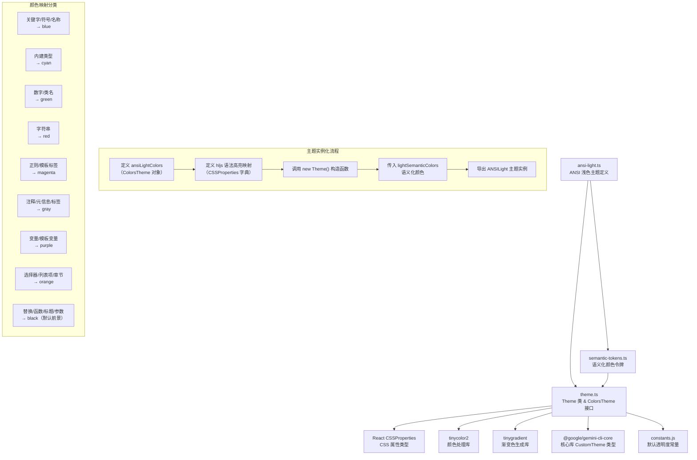
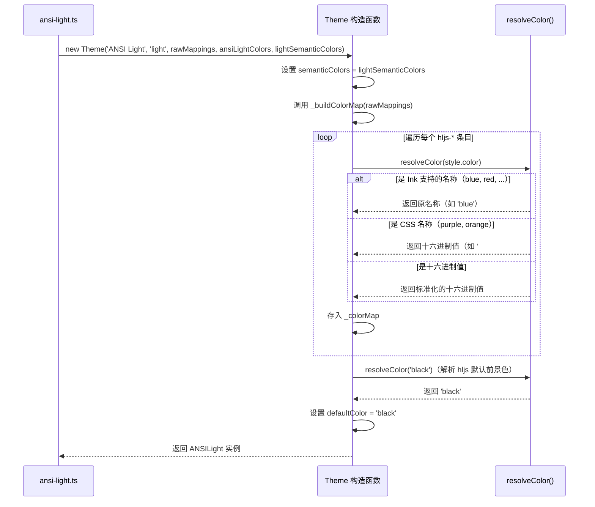

# ansi-light.ts

## 概述

`ansi-light.ts` 是 Gemini CLI 项目中一个内置的浅色终端主题定义文件。该主题名为 **"ANSI Light"**，专门为浅色背景终端环境设计，使用标准 ANSI 终端颜色名称（如 `blue`、`red`、`green` 等）而非十六进制颜色码作为主要配色方案。这使得该主题能在各种终端模拟器中自适应地使用终端自身定义的 ANSI 颜色，而不是强制指定精确的颜色值。

该文件位于 `packages/cli/src/ui/themes/builtin/light/` 目录下，是项目主题系统中浅色主题家族的成员之一。

## 架构图（Mermaid）



## 核心组件

### 1. `ansiLightColors` 颜色配置对象

类型为 `ColorsTheme`，定义了主题的基础调色板：

| 属性 | 值 | 用途说明 |
|---|---|---|
| `type` | `'light'` | 标识为浅色主题 |
| `Background` | `'white'` | 背景色，使用 ANSI 白色 |
| `Foreground` | `''`（空字符串） | 前景色未指定，使用终端默认 |
| `LightBlue` | `'blue'` | 浅蓝色强调色 |
| `AccentBlue` | `'blue'` | 蓝色强调色 |
| `AccentPurple` | `'purple'` | 紫色强调色（注意：非标准 ANSI 名称 `magenta`，而是 CSS 颜色名 `purple`） |
| `AccentCyan` | `'cyan'` | 青色强调色 |
| `AccentGreen` | `'green'` | 绿色强调色 |
| `AccentYellow` | `'orange'` | 黄色强调色（实际使用 `orange`，非 ANSI 标准名） |
| `AccentRed` | `'red'` | 红色强调色 |
| `DiffAdded` | `'#E5F2E5'` | diff 新增行背景色（淡绿色） |
| `DiffRemoved` | `'#FFE5E5'` | diff 删除行背景色（淡红色） |
| `Comment` | `'gray'` | 注释颜色 |
| `Gray` | `'gray'` | 灰色 |
| `DarkGray` | `'gray'` | 深灰色（与灰色相同） |
| `GradientColors` | `['blue', 'green']` | 渐变色数组，用于 UI 装饰元素 |

**设计特点**：该配色方案大量使用 ANSI 终端标准颜色名称，但也混用了 CSS 颜色名（如 `purple`、`orange`）和十六进制值（如 `#E5F2E5`）。`Foreground` 为空字符串意味着将使用终端默认前景色。

### 2. `ANSILight` 主题实例

通过 `new Theme(...)` 构造函数创建的完整主题对象，是文件的唯一导出项。构造函数接受以下参数：

- **名称**: `'ANSI Light'`
- **类型**: `'light'`
- **hljs 语法高亮映射**: 一个将 highlight.js CSS 类名映射到颜色值的字典
- **颜色配置**: `ansiLightColors`
- **语义化颜色**: `lightSemanticColors`（从 `semantic-tokens.ts` 导入的预定义浅色语义令牌）

### 3. highlight.js 语法高亮颜色映射

该主题定义了完整的 highlight.js 语法高亮样式映射，按颜色分组如下：

#### 蓝色组（`blue`）- 语言关键字与标识符
- `hljs-keyword` — 关键字（如 `if`、`for`、`class`）
- `hljs-literal` — 字面量（如 `true`、`false`、`null`）
- `hljs-symbol` — 符号
- `hljs-name` — 名称（如 HTML 标签名）
- `hljs-link` — 链接
- `hljs-attr` — 属性名
- `hljs-attribute` — 属性
- `hljs-builtin-name` — 内建名称

#### 青色组（`cyan`）- 类型系统
- `hljs-built_in` — 内建函数/类型（如 `console`、`Array`）
- `hljs-type` — 类型声明

#### 绿色组（`green`）- 数值
- `hljs-number` — 数字字面量
- `hljs-class` — 类名

#### 红色组（`red`）- 字符串
- `hljs-string` — 字符串字面量
- `hljs-meta-string` — 元字符串

#### 洋红色组（`magenta`）- 正则与模板
- `hljs-regexp` — 正则表达式
- `hljs-template-tag` — 模板标签

#### 黑色组（`black`）- 默认前景
- `hljs-subst` — 模板替换
- `hljs-function` — 函数
- `hljs-title` — 标题
- `hljs-params` — 参数
- `hljs-formula` — 公式

#### 灰色组（`gray`）- 注释与元数据
- `hljs-comment` — 注释
- `hljs-quote` — 引用
- `hljs-doctag` — 文档标签
- `hljs-meta` — 元信息
- `hljs-meta-keyword` — 元关键字
- `hljs-tag` — 标签

#### 紫色组（`purple`）- 变量
- `hljs-variable` — 变量
- `hljs-template-variable` — 模板变量

#### 橙色组（`orange`）- 选择器与结构
- `hljs-section` — 章节标题
- `hljs-bullet` — 列表项标记
- `hljs-selector-tag` — CSS 标签选择器
- `hljs-selector-id` — CSS ID 选择器
- `hljs-selector-class` — CSS 类选择器
- `hljs-selector-attr` — CSS 属性选择器
- `hljs-selector-pseudo` — CSS 伪类选择器

#### 基础样式（`hljs`）
- `display`: `'block'` — 块级显示
- `overflowX`: `'auto'` — 横向溢出自动滚动
- `padding`: `'0.5em'` — 内边距
- `background`: `'white'` — 白色背景
- `color`: `'black'` — 黑色前景文本

## 依赖关系

### 内部依赖

| 模块 | 导入项 | 用途 |
|---|---|---|
| `../../theme.js` | `ColorsTheme`（类型） | 颜色配置对象的 TypeScript 接口，定义了主题所需的全部颜色属性 |
| `../../theme.js` | `Theme`（类） | 主题类，封装了语法高亮颜色映射的构建逻辑、颜色解析（ANSI 名称 → Ink 兼容格式）等功能 |
| `../../semantic-tokens.js` | `lightSemanticColors` | 浅色主题的预定义语义化颜色令牌，定义了文本、背景、边框、UI 元素、状态等各维度的颜色 |

### 外部依赖

该文件本身不直接引用外部 npm 包，但通过 `Theme` 类间接依赖：

| 包名 | 用途 |
|---|---|
| `react`（类型） | `CSSProperties` 类型定义，用于 hljs 映射的类型约束 |
| `tinycolor2` | 颜色解析与转换库，`Theme` 类用于将 CSS 颜色名解析为 Ink 兼容的十六进制格式 |
| `tinygradient` | 渐变色生成库，用于 `interpolateColor` 函数的颜色插值计算 |
| `@google/gemini-cli-core` | 核心库，提供 `CustomTheme` 类型定义 |

## 关键实现细节

### 1. ANSI 颜色名与 CSS 颜色名的混合使用

该主题的一个显著特点是**混合使用了 ANSI 终端标准颜色名和 CSS 颜色名**：

- **ANSI 标准名称**（被 Ink 终端框架直接支持）：`blue`、`red`、`green`、`cyan`、`gray`、`white`、`black`、`magenta`
- **CSS 颜色名称**（需要通过 `tinycolor2` 解析为十六进制值）：`purple`、`orange`

`Theme` 类的 `_buildColorMap` 方法会调用 `resolveColor()` 对每个颜色值进行解析。对于 `purple` 和 `orange`，由于它们不在 `INK_SUPPORTED_NAMES` 集合中，会被 `tinycolor2` 转换为十六进制格式（分别为 `#800080` 和 `#ffa500`）。

### 2. Foreground 空字符串的含义

`ansiLightColors.Foreground` 设置为空字符串 `''`。在 `Theme` 构造函数中，`defaultColor` 的确定逻辑如下：
```typescript
const rawDefaultColor = rawMappings['hljs']?.color;
this.defaultColor = (rawDefaultColor ? Theme._resolveColor(rawDefaultColor) : undefined) ?? '';
```
虽然 `Foreground` 为空，但 hljs 基础映射中 `color` 被明确设为 `'black'`，因此实际的 `defaultColor` 会被解析为 `'black'`。空的 `Foreground` 主要影响语义化颜色的回退计算。

### 3. 语义化颜色的覆盖策略

该主题通过第五个构造参数传入了 `lightSemanticColors`（来自 `semantic-tokens.ts`），这会**完全覆盖** `Theme` 构造函数中基于 `colors` 对象自动生成的默认语义化颜色。`lightSemanticColors` 使用的是 `lightTheme`（定义在 `theme.ts` 中）的颜色值，这些是精确的十六进制色值（如 `#005FAF`、`#000000` 等），而非 ANSI 名称。

这意味着：
- **语法高亮**使用 ANSI 颜色名（自适应终端配色）
- **UI 语义化元素**（如文字主色、链接色、背景色等）使用固定的十六进制值（来自 `lightTheme`）

### 4. DiffAdded / DiffRemoved 使用十六进制值

虽然其他颜色大量使用 ANSI 名称，但 `DiffAdded`（`#E5F2E5`）和 `DiffRemoved`（`#FFE5E5`）使用了十六进制值。这是因为 diff 背景色需要精确的淡色调，ANSI 标准名称无法提供这种微妙的颜色控制。

### 5. 主题构建流程



### 6. 导出与使用方式

文件通过 `export const ANSILight` 导出一个**不可变的单例** `Theme` 实例。这个实例在主题注册系统中被引用，用户可以在 Gemini CLI 的配置中选择 `'ANSI Light'` 主题来激活此配色方案。`Theme` 类的 `_colorMap` 在构造时通过 `Object.freeze()` 冻结，确保运行时不可篡改。
