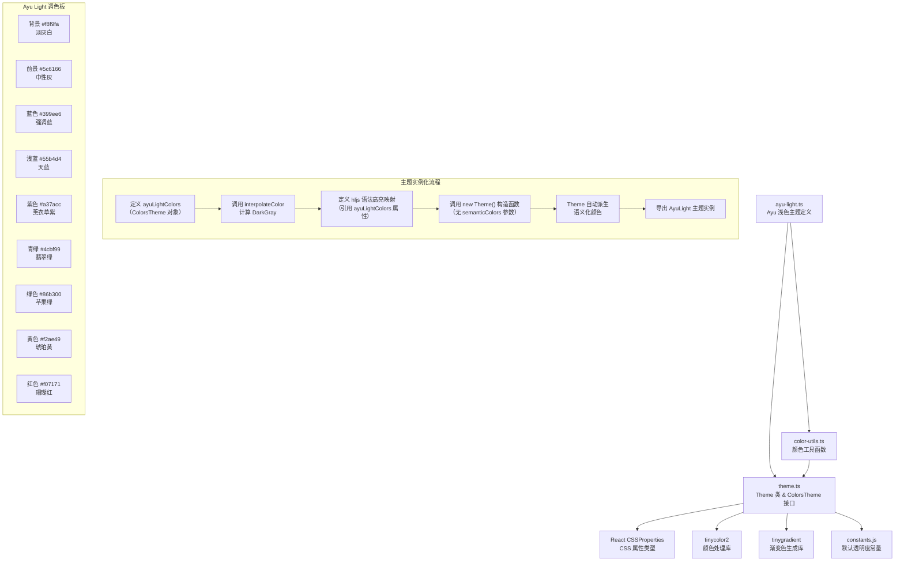

# ayu-light.ts

## 概述

`ayu-light.ts` 是 Gemini CLI 项目中一个内置的浅色主题定义文件，实现了流行的 **Ayu Light** 配色方案。Ayu 是一套知名的编辑器配色主题，最初为 Sublime Text 设计，后广泛移植至 VS Code、JetBrains 等 IDE。该文件将 Ayu Light 的柔和暖色调风格适配到了 Gemini CLI 的终端 UI 中。

与 `ansi-light.ts` 不同，Ayu Light 主题完全使用精确的十六进制颜色值，以确保在所有终端中呈现一致的视觉效果。该主题的背景色为浅灰白色 `#f8f9fa`，前景色为中性灰 `#5c6166`，整体色调柔和温暖。

**重要差异**：该主题**没有**传入 `lightSemanticColors` 作为第五个构造参数，这意味着语义化颜色将由 `Theme` 构造函数根据 `ayuLightColors` 自动派生生成。

## 架构图（Mermaid）



## 核心组件

### 1. `ayuLightColors` 颜色配置对象

类型为 `ColorsTheme`，定义了 Ayu Light 主题的完整调色板：

| 属性 | 值 | 视觉描述 |
|---|---|---|
| `type` | `'light'` | 标识为浅色主题 |
| `Background` | `'#f8f9fa'` | 极淡灰白色背景，比纯白更柔和 |
| `Foreground` | `'#5c6166'` | 中灰色前景文本，降低对比度以减少视觉疲劳 |
| `LightBlue` | `'#55b4d4'` | 天蓝色，用于类型声明、标签、链接等 |
| `AccentBlue` | `'#399ee6'` | 明亮蓝色，用于标题、名称等核心标识符 |
| `AccentPurple` | `'#a37acc'` | 薰衣草紫色，用于数字字面量 |
| `AccentCyan` | `'#4cbf99'` | 翡翠绿色（偏青），用于常量、正则、字面量等 |
| `AccentGreen` | `'#86b300'` | 黄绿色/苹果绿，用于字符串 |
| `AccentYellow` | `'#f2ae49'` | 琥珀黄色，用于关键字、选择器 |
| `AccentRed` | `'#f07171'` | 珊瑚红色，用于内建函数、符号、删除标记 |
| `DiffAdded` | `'#C6EAD8'` | 淡薄荷绿，diff 新增行背景 |
| `DiffRemoved` | `'#FFCCCC'` | 淡粉红色，diff 删除行背景 |
| `Comment` | `'#ABADB1'` | 浅灰色，注释文本 |
| `Gray` | `'#a6aaaf'` | 中灰色，辅助文本 |
| `DarkGray` | `interpolateColor('#a6aaaf', '#f8f9fa', 0.5)` | Gray 与 Background 的 50% 混合色，用于边框等 |
| `GradientColors` | `['#399ee6', '#86b300']` | 蓝色到绿色的渐变，用于 UI 装饰 |

**设计特点**：`DarkGray` 使用 `interpolateColor` 函数动态计算，取灰色和背景色的中间值，确保边框色在视觉上既可见又不突兀。

### 2. `AyuLight` 主题实例

通过 `new Theme(...)` 构造函数创建，仅传入四个参数（没有第五个 `semanticColors`）：

- **名称**: `'Ayu Light'`
- **类型**: `'light'`
- **hljs 语法高亮映射**: 包含完整的 highlight.js 样式定义
- **颜色配置**: `ayuLightColors`

### 3. highlight.js 语法高亮颜色映射

Ayu Light 主题的语法高亮配色独具特色，与其他浅色主题有明显不同：

#### 琥珀黄组（`#f2ae49` AccentYellow）- 关键字与元信息
- `hljs-keyword` — 语言关键字
- `hljs-selector-tag` — CSS 标签选择器
- `hljs-attribute` — HTML 属性
- `hljs-builtin-name` — 内建名称
- `hljs-meta` — 元信息
- `hljs-bullet` — 列表项标记

#### 明亮蓝组（`#399ee6` AccentBlue）- 标识符与标题
- `hljs-title` — 函数/类标题
- `hljs-class .hljs-title` — 类标题（复合选择器）
- `hljs-name` — 名称（如 HTML 标签名）

#### 天蓝组（`#55b4d4` LightBlue）- 类型与标签
- `hljs-type` — 类型声明
- `hljs-tag` — 标签
- `hljs-link` — 链接
- `hljs-variable.language` — 语言特定变量（带斜体样式）

#### 翡翠绿组（`#4cbf99` AccentCyan）- 常量与正则
- `hljs-quote` — 引用（带斜体样式）
- `hljs-constant` — 常量
- `hljs-regexp` — 正则表达式
- `hljs-literal` — 字面量
- `hljs-template-variable` — 模板变量

#### 苹果绿组（`#86b300` AccentGreen）- 字符串与增添
- `hljs-string` — 字符串字面量
- `hljs-section` — 章节标题（带粗体样式）
- `hljs-addition` — diff 新增内容

#### 薰衣草紫组（`#a37acc` AccentPurple）- 数值
- `hljs-number` — 数字字面量

#### 珊瑚红组（`#f07171` AccentRed）- 内建与标记
- `hljs-symbol` — 符号
- `hljs-built_in` — 内建函数/类型
- `hljs-doctag` — 文档标签
- `hljs-selector-id` — CSS ID 选择器
- `hljs-deletion` — diff 删除内容

#### 前景色组（`#5c6166` Foreground）
- `hljs-variable` — 变量（使用默认前景色）

#### 注释色组（`#ABADB1` Comment）
- `hljs-comment` — 注释（带斜体样式）

#### 纯样式组（无颜色，仅样式）
- `hljs-emphasis` — 斜体
- `hljs-strong` — 粗体

#### 基础样式（`hljs`）
- `background`: `#f8f9fa` — 引用 `ayuLightColors.Background`
- `color`: `#5c6166` — 引用 `ayuLightColors.Foreground`
- `display`: `'block'`
- `overflowX`: `'auto'`
- `padding`: `'0.5em'`

## 依赖关系

### 内部依赖

| 模块 | 导入项 | 用途 |
|---|---|---|
| `../../theme.js` | `ColorsTheme`（类型） | 颜色配置对象的 TypeScript 接口 |
| `../../theme.js` | `Theme`（类） | 主题类，封装语法高亮颜色映射构建逻辑与颜色解析 |
| `../../color-utils.js` | `interpolateColor`（函数） | 颜色插值函数，用于计算 `DarkGray` 的混合色值 |

### 外部依赖

该文件本身不直接引用外部 npm 包，但通过依赖链间接使用：

| 包名 | 间接依赖路径 | 用途 |
|---|---|---|
| `react`（类型） | `Theme` → `CSSProperties` | CSS 属性类型约束 |
| `tinycolor2` | `Theme` → `resolveColor` / `color-utils` → `interpolateColor` | 颜色解析与转换 |
| `tinygradient` | `color-utils` → `interpolateColor` | 两色之间的渐变插值 |

## 关键实现细节

### 1. 动态计算 DarkGray

与其他主题直接硬编码 `DarkGray` 不同，Ayu Light 使用 `interpolateColor` 在模块顶层动态计算：

```typescript
DarkGray: interpolateColor('#a6aaaf', '#f8f9fa', 0.5),
```

这个调用将 `Gray`（`#a6aaaf`）和 `Background`（`#f8f9fa`）以 50% 的比例混合，生成一个介于两者之间的颜色。`interpolateColor` 函数内部使用 `tinygradient` 库实现精确的 RGB 颜色空间插值。计算结果大约为 `#cfd1d4`（浅灰色），作为边框和分隔线的颜色，确保在 `#f8f9fa` 背景上既可见又不过于突兀。

### 2. 无显式语义化颜色传参

该主题在调用 `new Theme()` 时**只传入了 4 个参数**，没有提供第五个 `semanticColors` 参数。这意味着 `Theme` 构造函数会执行以下自动派生逻辑：

```typescript
this.semanticColors = semanticColors ?? {
  text: {
    primary: this.colors.Foreground,       // '#5c6166'
    secondary: this.colors.Gray,           // '#a6aaaf'
    link: this.colors.AccentBlue,          // '#399ee6'
    accent: this.colors.AccentPurple,      // '#a37acc'
    response: this.colors.Foreground,      // '#5c6166'
  },
  background: {
    primary: this.colors.Background,       // '#f8f9fa'
    message: interpolateColor(Background, Gray, opacity),
    input: interpolateColor(Background, Gray, opacity),
    focus: interpolateColor(Background, AccentGreen, opacity),
    diff: { added: '#C6EAD8', removed: '#FFCCCC' },
  },
  border: { default: DarkGray },
  ui: { ... },
  status: { error: '#f07171', success: '#86b300', warning: '#f2ae49' },
};
```

自动派生确保了所有 UI 元素（背景、边框、状态色等）与 Ayu Light 调色板保持一致。

### 3. Ayu 特有的颜色语义映射

Ayu Light 的颜色分配与传统编辑器主题有所不同：

- **关键字使用黄色**（而非常见的蓝色/紫色）：`hljs-keyword → #f2ae49`
- **数字使用紫色**（而非常见的绿色）：`hljs-number → #a37acc`
- **字符串使用绿色**（而非常见的红色/黄色）：`hljs-string → #86b300`
- **内建函数使用红色**（而非常见的青色）：`hljs-built_in → #f07171`

这种非传统映射是 Ayu 系列主题的标志性设计，旨在提供更高的颜色区分度。

### 4. 复合 CSS 选择器的使用

该主题使用了复合 CSS 选择器 `'hljs-class .hljs-title'`，这在 `Theme._buildColorMap` 的处理中需要特别注意。由于 `_buildColorMap` 方法会检查 `key.startsWith('hljs-')`，这个复合选择器会被正确识别并处理。然而在终端渲染环境（Ink）中，这种嵌套选择器的颜色可能不会被正确应用，因为 Ink 不支持 CSS 选择器的嵌套匹配。

### 5. 带样式的颜色映射

Ayu Light 对部分条目添加了额外的 CSS 样式：

| 条目 | 额外样式 | 说明 |
|---|---|---|
| `hljs-comment` | `fontStyle: 'italic'` | 注释显示为斜体 |
| `hljs-quote` | `fontStyle: 'italic'` | 引用显示为斜体 |
| `hljs-variable.language` | `fontStyle: 'italic'` | 语言变量（如 `this`、`self`）斜体显示 |
| `hljs-section` | `fontWeight: 'bold'` | 章节标题加粗 |
| `hljs-emphasis` | `fontStyle: 'italic'` | 强调文本斜体 |
| `hljs-strong` | `fontWeight: 'bold'` | 加粗文本 |

需要注意的是，`Theme._buildColorMap` 方法仅提取 `color` 属性，`fontStyle` 和 `fontWeight` 在当前实现中会被忽略，因此这些样式在终端中**不会实际生效**。

### 6. 颜色引用方式

该主题在 hljs 映射中**通过引用 `ayuLightColors` 对象属性**而非硬编码颜色值：

```typescript
'hljs-keyword': { color: ayuLightColors.AccentYellow },  // 引用属性
// 而非
'hljs-keyword': { color: '#f2ae49' },  // 硬编码
```

这种间接引用方式提高了可维护性，修改调色板只需更改 `ayuLightColors` 对象即可全局生效。
