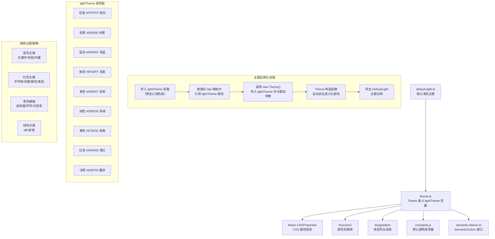

# default-light.ts

## 概述

`default-light.ts` 是 Gemini CLI 项目中的**默认浅色主题**定义文件，主题名为 **"Default Light"**。作为项目的官方基准浅色主题，它直接复用 `theme.ts` 中预定义的 `lightTheme` 调色板常量，风格简洁明快，采用经典的蓝-红双色强调方案。

该主题是所有浅色主题中最精简的实现之一 —— 它不定义自己的颜色配置对象，而是完全依赖已有的 `lightTheme` 常量。这使其成为其他浅色主题的参考基准。

**关键特征**：
- 直接使用 `lightTheme` 全局常量作为颜色配置
- 不定义独立的 `ColorsTheme` 对象
- 不传入自定义 `semanticColors`（由 `Theme` 构造函数自动派生）
- 颜色分配以蓝色（关键字）和红色（字符串/标题）为主轴

## 架构图（Mermaid）



## 核心组件

### 1. 复用 `lightTheme` 全局常量

Default Light 主题**没有定义自己的 `ColorsTheme` 对象**，而是直接导入并使用 `theme.ts` 中的 `lightTheme` 常量。以下是 `lightTheme` 的完整定义（来自 `theme.ts`）：

| 属性 | 值 | 说明 |
|---|---|---|
| `type` | `'light'` | 浅色主题 |
| `Background` | `'#FFFFFF'` | 纯白色背景 |
| `Foreground` | `'#000000'` | 纯黑色前景 |
| `LightBlue` | `'#005FAF'` | 深蓝色 |
| `AccentBlue` | `'#005FAF'` | 深蓝色（与 LightBlue 相同） |
| `AccentPurple` | `'#5F00FF'` | 明亮紫色 |
| `AccentCyan` | `'#005F87'` | 深青色 |
| `AccentGreen` | `'#005F00'` | 深绿色 |
| `AccentYellow` | `'#875F00'` | 深黄/暗金色 |
| `AccentRed` | `'#AF0000'` | 深红色 |
| `DiffAdded` | `'#D7FFD7'` | 淡绿色 diff 背景 |
| `DiffRemoved` | `'#FFD7D7'` | 淡红色 diff 背景 |
| `Comment` | `'#008700'` | 墨绿色注释 |
| `Gray` | `'#5F5F5F'` | 中灰色 |
| `DarkGray` | `'#5F5F5F'` | 深灰色（与 Gray 相同） |
| `InputBackground` | `'#E4E4E4'` | 输入框背景色 |
| `MessageBackground` | `'#FAFAFA'` | 消息背景色 |
| `FocusBackground` | `'#D7FFD7'` | 聚焦背景色（淡绿） |
| `GradientColors` | `['#4796E4', '#847ACE', '#C3677F']` | 三色渐变（蓝-紫-粉） |

### 2. `DefaultLight` 主题实例

唯一导出项，通过 `new Theme(...)` 构造：

- **名称**: `'Default Light'`
- **类型**: `'light'`
- **hljs 语法高亮映射**: 直接引用 `lightTheme` 属性
- **颜色配置**: `lightTheme`（全局常量，非局部定义）

### 3. highlight.js 语法高亮颜色映射

Default Light 采用简洁的双色主轴设计：

#### 蓝色主轴（`#005FAF` AccentBlue）- 语言结构
- `hljs-keyword` — 关键字（`if`、`for`、`return` 等）
- `hljs-selector-tag` — CSS 标签选择器
- `hljs-built_in` — 内建函数/类型（`console`、`Array` 等）
- `hljs-name` — 名称（HTML 标签名等）
- `hljs-tag` — 标签

#### 红色主轴（`#AF0000` AccentRed）- 值与声明
- `hljs-string` — 字符串字面量
- `hljs-title` — 函数/类标题
- `hljs-section` — 章节标题
- `hljs-attribute` — HTML 属性
- `hljs-literal` — 字面量（`true`、`false`、`null`）
- `hljs-template-tag` — 模板标签
- `hljs-template-variable` — 模板变量
- `hljs-type` — 类型声明
- `hljs-attr` — 属性名
- `hljs-deletion` — diff 删除内容
- `hljs-addition` — diff 新增内容（使用 AccentGreen `#005F00`）

#### 青色辅轴（`#005F87` AccentCyan）- 选择器与元信息
- `hljs-selector-attr` — CSS 属性选择器
- `hljs-selector-pseudo` — CSS 伪类选择器
- `hljs-meta` — 元信息
- `hljs-symbol` — 符号
- `hljs-bullet` — 列表项标记
- `hljs-link` — 链接

#### 墨绿注释色（`#008700` Comment）
- `hljs-comment` — 注释
- `hljs-quote` — 引用

#### 灰色（`#5F5F5F` Gray）
- `hljs-doctag` — 文档标签

#### 前景色（`#000000` Foreground）
- `hljs-variable` — 变量（使用黑色前景）

#### 绿色点缀（`#005F00` AccentGreen）
- `hljs-addition` — diff 新增内容

#### 纯样式（无颜色）
- `hljs-emphasis` — `fontStyle: 'italic'`（斜体）
- `hljs-strong` — `fontWeight: 'bold'`（粗体）

#### 基础样式（`hljs`）
- `background`: `'#FFFFFF'` — 纯白背景
- `color`: `'#000000'` — 纯黑前景
- `display`: `'block'`
- `overflowX`: `'auto'`
- `padding`: `'0.5em'`

## 依赖关系

### 内部依赖

| 模块 | 导入项 | 用途 |
|---|---|---|
| `../../theme.js` | `lightTheme` | 预定义的浅色调色板常量（`ColorsTheme` 类型），直接用作颜色配置和 hljs 映射的颜色源 |
| `../../theme.js` | `Theme`（类） | 主题类，负责构建颜色映射和派生语义化颜色 |

**注意**：该文件**没有导入** `ColorsTheme` 类型或 `lightSemanticColors`，是所有浅色主题中导入最少的一个。

### 外部依赖

该文件本身不直接引用任何外部 npm 包，通过 `Theme` 类间接依赖：

| 包名 | 用途 |
|---|---|
| `react`（类型） | `CSSProperties` 类型定义 |
| `tinycolor2` | 颜色解析与验证 |
| `tinygradient` | `interpolateColor` 内部使用的渐变插值 |

## 关键实现细节

### 1. 最小化设计

Default Light 是所有浅色主题中**代码最精简**的实现（107 行），体现了以下设计理念：

- **不重复定义调色板**：直接复用 `lightTheme` 全局常量
- **不覆盖语义化颜色**：让 `Theme` 构造函数自动派生
- **不引入额外依赖**：不需要 `color-utils.ts` 或 `semantic-tokens.ts`

这使得该主题成为理解主题系统工作原理的最佳入口点。

### 2. 自动语义化颜色派生

由于没有传入第五个 `semanticColors` 参数，`Theme` 构造函数会自动基于 `lightTheme` 生成完整的语义化颜色体系：

```
text.primary    → lightTheme.Foreground    (#000000)
text.secondary  → lightTheme.Gray          (#5F5F5F)
text.link       → lightTheme.AccentBlue    (#005FAF)
text.accent     → lightTheme.AccentPurple  (#5F00FF)
background.primary → lightTheme.Background (#FFFFFF)
background.message → lightTheme.MessageBackground (#FAFAFA)
background.input   → lightTheme.InputBackground (#E4E4E4)
background.focus   → lightTheme.FocusBackground (#D7FFD7)
status.error    → lightTheme.AccentRed     (#AF0000)
status.success  → lightTheme.AccentGreen   (#005F00)
status.warning  → lightTheme.AccentYellow  (#875F00)
```

由于 `lightTheme` 提供了 `InputBackground`、`MessageBackground`、`FocusBackground` 等可选属性，`Theme` 构造函数会优先使用这些值，而不是通过 `interpolateColor` 动态计算。

### 3. 蓝-红双色主轴设计

Default Light 的颜色分配高度简化，大量元素被归入蓝色或红色两个主要颜色组：

- **蓝色组**（5 个条目）：语言结构性关键字
- **红色组**（10 个条目）：值、声明和属性

这种设计在视觉上形成鲜明的"结构 vs 数据"二元对比，适合需要快速区分代码结构与数据值的场景。

### 4. 与 ANSI Light 的对比

| 方面 | Default Light | ANSI Light |
|---|---|---|
| 颜色定义方式 | 十六进制精确值 | ANSI 终端颜色名 |
| 调色板来源 | 复用 `lightTheme` 全局常量 | 自定义 `ansiLightColors` 局部对象 |
| 语义化颜色 | 自动派生（无第五参数） | 显式传入 `lightSemanticColors` |
| 颜色丰富度 | 深色调（暗蓝、暗红、暗青） | 标准色（bright blue、red、green） |
| 终端适应性 | 固定视觉效果 | 随终端配色变化 |
| 代码量 | 107 行 | 152 行 |

### 5. 作为项目默认主题的角色

`Default Light` 的名称暗示它是当用户终端被检测为浅色背景时的**默认回退主题**。在 `theme.ts` 的 `pickDefaultThemeName` 函数中，当终端背景亮度超过阈值且没有精确匹配的主题时，会返回 `defaultLightThemeName` 参数对应的主题，通常即为 `'Default Light'`。
