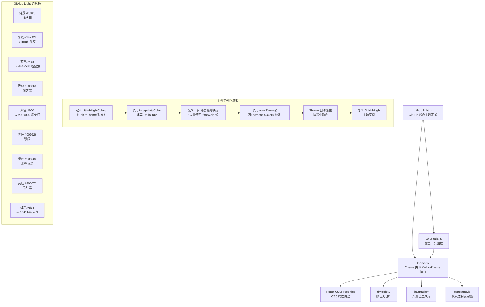

# github-light.ts

## 概述

`github-light.ts` 是 Gemini CLI 项目中一个内置的浅色主题定义文件，实现了 **GitHub Light** 配色方案。该主题忠实还原了 GitHub 网站代码浏览器的经典浅色语法高亮风格，是开发者最为熟悉的代码配色方案之一。

GitHub Light 主题的视觉特征包括：
- 浅灰白色背景（`#f8f8f8`），接近但不是纯白
- 深灰色前景文本（`#24292E`），来自 GitHub 的品牌色
- **大量使用缩写十六进制颜色码**（如 `#458`、`#900`、`#d14`、`#998`），这是 CSS 缩写格式
- 通过 `fontWeight: 'bold'` 对关键字、标题、类型等元素添加粗体效果
- 关键字使用前景色 + 粗体而非特殊颜色

该主题还使用了 `FocusColor` 可选属性来自定义聚焦高亮色，将其设为 GitHub 品牌蓝色。

## 架构图（Mermaid）



## 核心组件

### 1. `githubLightColors` 颜色配置对象

类型为 `ColorsTheme`，定义了 GitHub Light 的完整调色板。该主题大量使用 **CSS 缩写十六进制颜色码**：

| 属性 | 值 | 展开值 | 视觉描述 |
|---|---|---|---|
| `type` | `'light'` | — | 浅色主题 |
| `Background` | `'#f8f8f8'` | — | 极淡灰白色（GitHub 代码块背景） |
| `Foreground` | `'#24292E'` | — | 深灰色（GitHub 品牌文本色） |
| `LightBlue` | `'#0086b3'` | — | 深天蓝色，用于内建函数 |
| `AccentBlue` | `'#458'` | `#445588` | 暗蓝紫色，用于类型和标签 |
| `AccentPurple` | `'#900'` | `#990000` | 深栗红色（注意：名为 Purple 但实际是深红色） |
| `AccentCyan` | `'#009926'` | — | 翠绿色，用于正则和链接 |
| `AccentGreen` | `'#008080'` | — | 水鸭蓝绿色（teal），用于数字和变量 |
| `AccentYellow` | `'#990073'` | — | 品红紫色（注意：名为 Yellow 但实际是品红色） |
| `AccentRed` | `'#d14'` | `#dd1144` | 亮红色，用于字符串 |
| `DiffAdded` | `'#C6EAD8'` | — | 淡薄荷绿 diff 背景 |
| `DiffRemoved` | `'#FFCCCC'` | — | 淡粉红 diff 背景 |
| `Comment` | `'#998'` | `#999988` | 淡灰黄色，注释文本 |
| `Gray` | `'#999'` | `#999999` | 中灰色 |
| `DarkGray` | `interpolateColor(...)` | — | Gray 与 Background 的 50% 混合色 |
| `FocusColor` | `'#458'` | `#445588` | GitHub 品牌蓝色，用于聚焦高亮 |
| `GradientColors` | `['#458', '#008080']` | — | 蓝紫到蓝绿的渐变 |

**语义名称与实际颜色的偏离**：GitHub 主题中部分颜色的语义名称与实际视觉色彩不一致（如 `AccentPurple` 是深红色，`AccentYellow` 是品红紫色）。这是因为 `ColorsTheme` 接口中的字段名是功能性的语义名称，而 GitHub 的配色方案并不遵循这些语义约定。

### 2. `GitHubLight` 主题实例

通过 `new Theme(...)` 构造函数创建，传入 4 个参数：

- **名称**: `'GitHub Light'`
- **类型**: `'light'`
- **hljs 语法高亮映射**: GitHub 风格的代码高亮定义
- **颜色配置**: `githubLightColors`

### 3. highlight.js 语法高亮颜色映射

GitHub Light 主题的配色非常独特，它通过**粗体**来区分代码结构元素，而非依赖丰富的色彩差异。

#### 前景色 + 粗体组（`#24292E` Foreground, bold）- 关键字
- `hljs-keyword` — 关键字（加粗，颜色同前景）
- `hljs-selector-tag` — CSS 标签选择器（加粗）

#### 前景色 + 正常字重组（`#24292E` Foreground, normal）
- `hljs-subst` — 模板替换

#### 水鸭蓝绿组（`#008080` AccentGreen）- 数值与变量
- `hljs-number` — 数字字面量
- `hljs-literal` — 字面量
- `hljs-variable` — 变量
- `hljs-template-variable` — 模板变量
- `hljs-tag .hljs-attr` — 标签属性（复合选择器）

#### 亮红组（`#dd1144` AccentRed）- 字符串
- `hljs-string` — 字符串字面量
- `hljs-doctag` — 文档标签

#### 深栗红 + 粗体组（`#990000` AccentPurple, bold）- 标题与标识
- `hljs-title` — 函数/类标题（加粗）
- `hljs-section` — 章节标题（加粗）
- `hljs-selector-id` — CSS ID 选择器（加粗）

#### 暗蓝紫组（`#445588` AccentBlue）- 类型与标签
- `hljs-type` — 类型声明（加粗）
- `hljs-class .hljs-title` — 类标题（加粗）
- `hljs-tag` — 标签（正常字重）
- `hljs-name` — 名称（正常字重）
- `hljs-attribute` — HTML 属性（正常字重）

#### 翠绿组（`#009926` AccentCyan）- 正则与链接
- `hljs-regexp` — 正则表达式
- `hljs-link` — 链接

#### 品红紫组（`#990073` AccentYellow）- 符号
- `hljs-symbol` — 符号
- `hljs-bullet` — 列表项标记

#### 深天蓝组（`#0086b3` LightBlue）- 内建
- `hljs-built_in` — 内建函数/类型
- `hljs-builtin-name` — 内建名称

#### 灰色组 + 粗体（`#999` Gray, bold）
- `hljs-meta` — 元信息（加粗）

#### 淡灰黄注释组（`#998` Comment, italic）
- `hljs-comment` — 注释（斜体）
- `hljs-quote` — 引用（斜体）

#### 纯背景组（无前景色，仅背景色）
- `hljs-deletion` — `background: '#fdd'`（淡红色背景）
- `hljs-addition` — `background: '#dfd'`（淡绿色背景）

#### 纯样式组
- `hljs-emphasis` — `fontStyle: 'italic'`
- `hljs-strong` — `fontWeight: 'bold'`

#### 基础样式（`hljs`）
- `color`: `#24292E`
- `background`: `#f8f8f8`
- `display`: `'block'`
- `overflowX`: `'auto'`
- `padding`: `'0.5em'`

## 依赖关系

### 内部依赖

| 模块 | 导入项 | 用途 |
|---|---|---|
| `../../theme.js` | `ColorsTheme`（类型） | 颜色配置对象的 TypeScript 接口 |
| `../../theme.js` | `Theme`（类） | 主题类，封装语法高亮颜色映射构建逻辑 |
| `../../color-utils.js` | `interpolateColor`（函数） | 颜色插值函数，用于计算 `DarkGray` |

### 外部依赖

通过依赖链间接使用：

| 包名 | 间接依赖路径 | 用途 |
|---|---|---|
| `react`（类型） | `Theme` → `CSSProperties` | CSS 属性类型约束 |
| `tinycolor2` | `Theme` → `resolveColor` | 颜色解析（含缩写十六进制码展开） |
| `tinygradient` | `color-utils` → `interpolateColor` | 渐变色插值 |

## 关键实现细节

### 1. CSS 缩写十六进制颜色码

GitHub Light 主题大量使用 **3 位缩写十六进制颜色码**：

| 缩写 | 展开 | 说明 |
|---|---|---|
| `#458` | `#445588` | 每位重复：4→44, 5→55, 8→88 |
| `#900` | `#990000` | 深红/栗色 |
| `#d14` | `#dd1144` | 亮红色 |
| `#998` | `#999988` | 灰黄色 |
| `#999` | `#999999` | 中灰色 |
| `#fdd` | `#ffdddd` | 淡红（deletion 背景） |
| `#dfd` | `#ddffdd` | 淡绿（addition 背景） |

这些缩写在 `Theme._buildColorMap` 中通过 `resolveColor()` 函数处理。`resolveColor` 函数检测到 `#` 前缀后会验证是否为合法的 3 位或 6 位十六进制码，3 位码被直接保留（转小写），不会展开为 6 位。

### 2. fontWeight 的广泛使用

GitHub Light 是所有主题中**最重视字重差异**的主题，共有 10 个条目包含 `fontWeight` 属性：

| `fontWeight` | 适用条目 |
|---|---|
| `'bold'` | `hljs-keyword`, `hljs-selector-tag`, `hljs-title`, `hljs-section`, `hljs-selector-id`, `hljs-type`, `hljs-class .hljs-title`, `hljs-meta`, `hljs-strong` |
| `'normal'` | `hljs-subst`, `hljs-tag`, `hljs-name`, `hljs-attribute` |

**重要限制**：`Theme._buildColorMap` 方法仅提取 `color` 属性，`fontWeight` 在当前终端渲染（Ink）实现中**不会被应用**。这意味着 GitHub Light 在终端中的视觉效果与网页版有较大差异，因为失去了粗体这一重要的视觉区分手段。

### 3. FocusColor 自定义

GitHub Light 是少数使用 `FocusColor` 可选属性的主题：

```typescript
FocusColor: '#458', // AccentBlue for GitHub branding
```

这使得聚焦高亮色从默认的 `AccentGreen` 改为 GitHub 品牌蓝色 `#445588`。在 `Theme` 构造函数自动派生语义化颜色时：

```typescript
ui: {
  focus: this.colors.FocusColor ?? this.colors.AccentGreen,
  // → '#458' (GitHub 蓝)
}
background: {
  focus: this.colors.FocusBackground ??
    interpolateColor(Background, FocusColor ?? AccentGreen, DEFAULT_SELECTION_OPACITY),
  // → interpolateColor('#f8f8f8', '#458', opacity)
}
```

### 4. 语义名称与实际颜色的偏离

GitHub 的配色方案并不遵循 `ColorsTheme` 接口的语义命名约定：

| 语义名称 | 期望颜色 | 实际颜色 | 原因 |
|---|---|---|---|
| `AccentPurple` | 紫色调 | `#900`（深栗红） | GitHub 中标题和 section 使用深红色 |
| `AccentYellow` | 黄色调 | `#990073`（品红紫） | GitHub 中符号和 bullet 使用品红色 |
| `AccentGreen` | 绿色调 | `#008080`（水鸭蓝绿） | GitHub 中数值使用 teal 色 |
| `AccentCyan` | 青色调 | `#009926`（翠绿） | GitHub 中正则使用绿色 |

这是 `ColorsTheme` 接口设计的一个折衷 —— 它定义了固定的语义槽位（slot），但每个主题可以自由决定实际填充什么颜色。这些"错位"不影响功能，但在阅读代码时需要注意不要被属性名误导。

### 5. deletion/addition 仅有背景色

GitHub Light 对 `hljs-deletion` 和 `hljs-addition` 只设置了 `background` 属性而非 `color` 属性：

```typescript
'hljs-deletion': { background: '#fdd' },
'hljs-addition': { background: '#dfd' },
```

由于 `_buildColorMap` 仅处理 `color` 属性，这两个条目在最终的 `_colorMap` 中**不会有对应条目**。它们的背景色效果在当前终端渲染中会被忽略。

### 6. 复合 CSS 选择器

该主题使用了两个复合选择器：
- `'hljs-tag .hljs-attr'` — 标签内的属性
- `'hljs-class .hljs-title'` — 类声明内的标题

这些以 `hljs-` 开头，会通过 `_buildColorMap` 的前缀检查，但在 Ink 终端渲染中嵌套选择器匹配**无法生效**。

### 7. DarkGray 动态计算

与 Ayu Light 相同的模式：

```typescript
DarkGray: interpolateColor('#999', '#f8f8f8', 0.5),
```

将 Gray 与 Background 以 50% 比例混合，生成一个柔和的边框色，确保与背景有足够但不过分的对比度。
