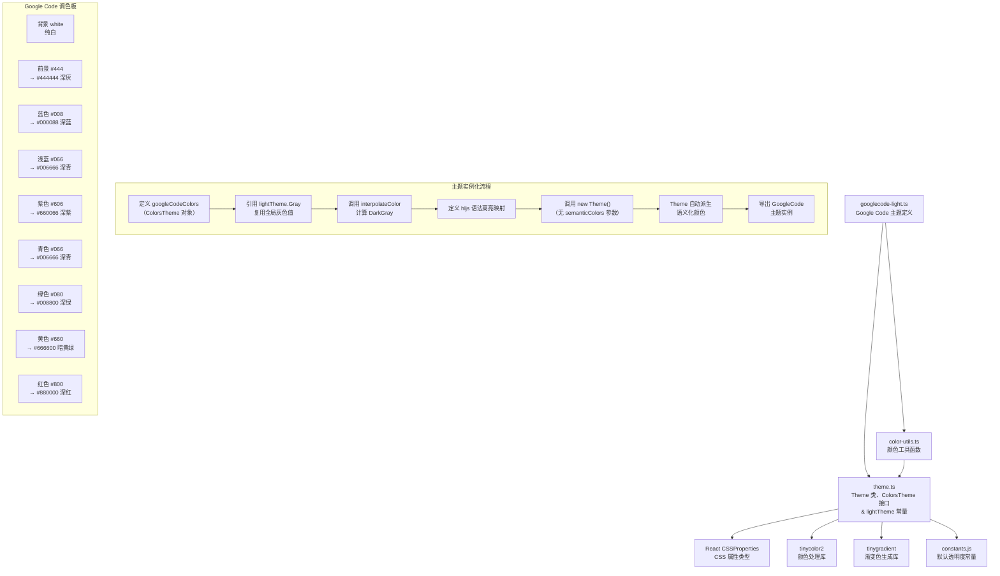
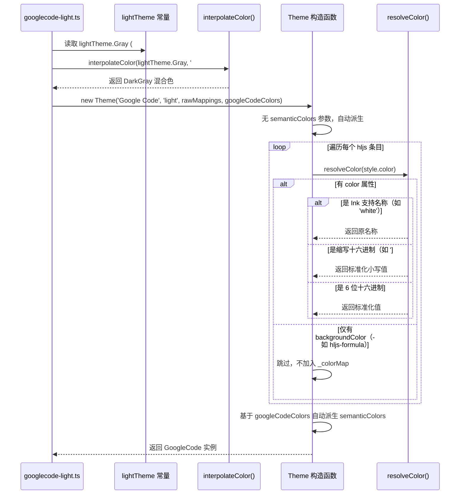

# googlecode-light.ts

## 概述

`googlecode-light.ts` 是 Gemini CLI 项目中一个内置的浅色主题定义文件，实现了 **Google Code** 配色方案。该主题名为 `'Google Code'`，其设计灵感来源于经典的 Google Code 项目托管平台（code.google.com，已于 2016 年关闭）的代码浏览器风格。

Google Code 主题的视觉特征：
- 纯白色背景（使用 CSS 颜色名 `'white'`）
- 深灰色前景文本（`#444`）
- **极度简洁的 3 位缩写十六进制调色板**（如 `#008`、`#080`、`#800`、`#066` 等），颜色非常"纯净"
- 注释使用红色（`#800`）而非常见的灰色/绿色，这是 Google Code 的标志性特征
- 混合引用了 `lightTheme` 全局常量的部分属性（`Gray`），体现了跨主题复用的设计

## 架构图（Mermaid）



## 核心组件

### 1. `googleCodeColors` 颜色配置对象

类型为 `ColorsTheme`，定义了 Google Code 主题的完整调色板。以极简的 3 位十六进制码为主：

| 属性 | 值 | 展开值 | 视觉描述 |
|---|---|---|---|
| `type` | `'light'` | — | 浅色主题 |
| `Background` | `'white'` | — | 纯白色（ANSI 颜色名） |
| `Foreground` | `'#444'` | `#444444` | 深灰色前景 |
| `LightBlue` | `'#066'` | `#006666` | 深青色 |
| `AccentBlue` | `'#008'` | `#000088` | 深蓝色 |
| `AccentPurple` | `'#606'` | `#660066` | 深紫/暗品红色 |
| `AccentCyan` | `'#066'` | `#006666` | 深青色（与 LightBlue 相同） |
| `AccentGreen` | `'#080'` | `#008800` | 深绿色 |
| `AccentYellow` | `'#660'` | `#666600` | 暗黄绿色/橄榄色 |
| `AccentRed` | `'#800'` | `#880000` | 深红色/暗红色 |
| `DiffAdded` | `'#C6EAD8'` | — | 淡薄荷绿 diff 背景 |
| `DiffRemoved` | `'#FEDEDE'` | — | 淡粉红 diff 背景 |
| `Comment` | `'#5f6368'` | — | Google Material 灰色（6 位精确值） |
| `Gray` | `lightTheme.Gray` | `'#5F5F5F'` | 复用全局浅色主题灰色 |
| `DarkGray` | `interpolateColor(...)` | — | lightTheme.Gray 与白色的 50% 混合 |
| `GradientColors` | `['#066', '#606']` | — | 深青到深紫的渐变 |

**设计特点**：

1. **极简 3 位色码**：`#008`、`#080`、`#800`、`#066`、`#606`、`#660` 这组颜色构成了一个非常整齐的"三原色变体"调色板，每个色码只在 RGB 三个通道中的一两个上有值。
2. **LightBlue 与 AccentCyan 完全相同**：都是 `#066`，说明该主题不需要区分这两个语义槽位。
3. **混合引用 lightTheme**：`Gray` 直接引用 `lightTheme.Gray`，`DarkGray` 基于 `lightTheme.Gray` 和 `#ffffff` 插值计算（注意这里使用 `#ffffff` 而非 `googleCodeColors.Background` 的 `'white'`）。
4. **Comment 使用 Google Material Design 灰色**：`#5f6368` 是 Google Material Design 规范中的标准次要文本色。

### 2. `GoogleCode` 主题实例

通过 `new Theme(...)` 构造函数创建，传入 4 个参数：

- **名称**: `'Google Code'`
- **类型**: `'light'`
- **hljs 语法高亮映射**: Google Code 风格的代码高亮定义
- **颜色配置**: `googleCodeColors`

### 3. highlight.js 语法高亮颜色映射

Google Code 主题的配色朴实但有效，最显著的特征是**注释使用红色**。

#### 深蓝组（`#008` AccentBlue）- 关键字与结构
- `hljs-keyword` — 语言关键字
- `hljs-selector-tag` — CSS 标签选择器
- `hljs-section` — 章节标题
- `hljs-name` — 名称（HTML 标签名等）

#### 深紫组（`#606` AccentPurple）- 标识符与类型
- `hljs-title` — 函数/类标题
- `hljs-doctag` — 文档标签（加粗）
- `hljs-type` — 类型声明
- `hljs-attr` — 属性名
- `hljs-built_in` — 内建函数/类型
- `hljs-builtin-name` — 内建名称
- `hljs-params` — 参数

#### 深绿组（`#080` AccentGreen）- 字符串与选择器
- `hljs-string` — 字符串字面量
- `hljs-selector-attr` — CSS 属性选择器
- `hljs-selector-pseudo` — CSS 伪类选择器
- `hljs-regexp` — 正则表达式

#### 深青组（`#066` AccentCyan）- 字面量与数值
- `hljs-literal` — 字面量（`true`、`false`、`null`）
- `hljs-symbol` — 符号
- `hljs-bullet` — 列表项标记
- `hljs-meta` — 元信息
- `hljs-number` — 数字字面量
- `hljs-link` — 链接

#### 暗黄绿组（`#660` AccentYellow）- 变量与选择器
- `hljs-variable` — 变量
- `hljs-template-variable` — 模板变量
- `hljs-selector-id` — CSS ID 选择器
- `hljs-selector-class` — CSS 类选择器

#### 深红组（`#800` AccentRed）- 注释（！）
- `hljs-comment` — 注释
- `hljs-quote` — 引用

#### 前景色组（`#444` Foreground）
- `hljs-attribute` — HTML 属性（注意：与 `hljs-attr` 不同条目使用不同颜色）
- `hljs-subst` — 模板替换

#### 纯背景/样式组（无前景色 `color` 属性）
- `hljs-formula` — 公式（`backgroundColor: '#eee'`，`fontStyle: 'italic'`）
- `hljs-addition` — diff 新增（`backgroundColor: '#baeeba'`）
- `hljs-deletion` — diff 删除（`backgroundColor: '#ffc8bd'`）
- `hljs-strong` — 粗体（`fontWeight: 'bold'`）
- `hljs-emphasis` — 斜体（`fontStyle: 'italic'`）

#### 基础样式（`hljs`）
- `background`: `'white'`（引用 `googleCodeColors.Background`）
- `color`: `'#444'`（引用 `googleCodeColors.Foreground`）
- `display`: `'block'`
- `overflowX`: `'auto'`
- `padding`: `'0.5em'`

## 依赖关系

### 内部依赖

| 模块 | 导入项 | 用途 |
|---|---|---|
| `../../theme.js` | `ColorsTheme`（类型） | 颜色配置对象的 TypeScript 接口 |
| `../../theme.js` | `Theme`（类） | 主题类，封装语法高亮颜色映射构建与颜色解析 |
| `../../theme.js` | `lightTheme`（常量） | 全局浅色调色板常量，复用其 `Gray` 属性值 |
| `../../color-utils.js` | `interpolateColor`（函数） | 颜色插值函数，用于计算 `DarkGray` |

**注意**：该文件是唯一一个**同时导入 `ColorsTheme`、`Theme` 和 `lightTheme` 三项**的浅色主题文件，体现了它对全局主题系统的混合依赖。

### 外部依赖

通过依赖链间接使用：

| 包名 | 间接依赖路径 | 用途 |
|---|---|---|
| `react`（类型） | `Theme` → `CSSProperties` | CSS 属性类型约束 |
| `tinycolor2` | `Theme` → `resolveColor` | 颜色解析与转换 |
| `tinygradient` | `color-utils` → `interpolateColor` | 渐变色插值 |

## 关键实现细节

### 1. 红色注释 —— Google Code 的标志性特征

Google Code 主题最显著的视觉特征是**注释使用红色**（`#800`），而非大多数主题采用的灰色或绿色：

```typescript
'hljs-comment': { color: googleCodeColors.AccentRed },  // #800 深红
'hljs-quote': { color: googleCodeColors.AccentRed },
```

这与 `ColorsTheme` 中 `Comment` 属性设置为灰色（`#5f6368`）形成了有趣的矛盾。`Comment` 属性用于语义化颜色系统（通过 `semanticColors.ui.comment`），而 hljs 映射中的注释颜色直接使用了 `AccentRed`。这意味着：

- **代码语法高亮中的注释** → 红色（`#800`）
- **UI 层面的"注释"文本**（如状态栏、辅助信息等） → Google Material 灰色（`#5f6368`）

### 2. 三原色变体调色板

Google Code 的调色板可以看作是一组基于 RGB 三原色的系统性变体：

```
#008  →  纯蓝通道    (R:0, G:0, B:8)   → 深蓝
#080  →  纯绿通道    (R:0, G:8, B:0)   → 深绿
#800  →  纯红通道    (R:8, G:0, B:0)   → 深红
#066  →  绿+蓝通道   (R:0, G:6, B:6)   → 深青
#606  →  红+蓝通道   (R:6, G:0, B:6)   → 深紫
#660  →  红+绿通道   (R:6, G:6, B:0)   → 暗黄绿
#444  →  均匀灰度    (R:4, G:4, B:4)   → 深灰
```

这种基于三原色组合的调色板设计极为整齐，是一种经典的色彩工程方法。

### 3. 跨主题属性复用

Google Code 是唯一一个在定义自己的 `ColorsTheme` 对象时**引用另一个主题常量属性**的浅色主题：

```typescript
Gray: lightTheme.Gray,                                    // 直接引用 lightTheme 的 Gray (#5F5F5F)
DarkGray: interpolateColor(lightTheme.Gray, '#ffffff', 0.5), // 基于 lightTheme.Gray 计算
```

这种设计确保 Google Code 主题在 UI 辅助元素（灰色文本、边框等）上与默认浅色主题保持一致，同时在代码高亮上使用自己独特的调色板。

**值得注意的是**，`DarkGray` 的计算使用了硬编码的 `'#ffffff'` 而非 `googleCodeColors.Background`（即 `'white'`）。虽然这两者在视觉上等价，但从代码语义上来说，使用 `'#ffffff'` 更加精确（避免了 ANSI 颜色名 `'white'` 在某些终端中可能不是纯白的问题）。

### 4. 无前景色的背景高亮条目

Google Code 有 3 个 hljs 条目仅定义了 `backgroundColor` 而没有 `color`：

| 条目 | 背景色 | 说明 |
|---|---|---|
| `hljs-formula` | `'#eee'` | 数学公式背景（附带斜体） |
| `hljs-addition` | `'#baeeba'` | diff 新增行（淡绿） |
| `hljs-deletion` | `'#ffc8bd'` | diff 删除行（淡粉橙） |

由于 `Theme._buildColorMap` 仅提取 `color` 属性，这些条目在终端渲染中**不会有任何视觉效果**。它们的背景色和样式信息在当前 Ink 渲染实现中被忽略。

### 5. hljs-attr 与 hljs-attribute 的区分

Google Code 主题对这两个相似的条目使用了**不同的颜色**：

```typescript
'hljs-attr':      { color: googleCodeColors.AccentPurple },  // #606 深紫
'hljs-attribute':  { color: googleCodeColors.Foreground },     // #444 深灰
```

在 highlight.js 中：
- `hljs-attr` 通常用于 HTML/XML 的属性名（如 `<div class="...">`中的 `class`）
- `hljs-attribute` 通常用于 CSS 属性名（如 `color: red` 中的 `color`）

这种细粒度的颜色区分体现了 Google Code 主题对不同上下文中属性的语义理解。

### 6. Comment 属性的 Google Material Design 灰色

```typescript
Comment: '#5f6368',
```

`#5f6368` 是 Google Material Design 规范中定义的 **"On Surface Variant"** 颜色，常用于次要文本内容。这个精确的 6 位十六进制值（而非 3 位缩写）来自 Google 的设计系统，暗示该主题在 UI 语义层面遵循了现代 Google 设计规范，而在代码高亮层面保留了经典 Google Code 的风格。

### 7. 主题构建完整流程


