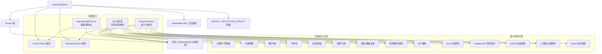

# solarized-light.ts

## 概述

`solarized-light.ts` 是 Gemini CLI 项目中内置的 **Solarized Light** 浅色主题实现文件。Solarized 是一套由 Ethan Schoonover 设计的经典配色方案，以其精心挑选的色彩对比度和对人眼的舒适度而广受欢迎。本文件定义了该主题的完整色彩体系，包括基础调色板、语义化颜色标记以及代码高亮（highlight.js）样式映射，并最终导出一个 `Theme` 实例。

该主题以 Solarized Light 标志性的 `#fdf6e3`（淡黄白色）为背景基底，前景文字使用 `#657b83`（灰蓝色），整体呈现温暖柔和的浅色调风格。

## 架构图（Mermaid）



## 核心组件

### 1. `solarizedLightColors` — 基础调色板

类型为 `ColorsTheme`，定义了整个主题的基础色彩常量：

| 属性名 | 色值 | 说明 |
|---|---|---|
| `type` | `'light'` | 标识为浅色主题 |
| `Background` | `#fdf6e3` | Solarized Light 标志性的淡黄白背景 |
| `Foreground` | `#657b83` | 主文本颜色（灰蓝） |
| `LightBlue` | `#268bd2` | 浅蓝色，用于属性标注 |
| `AccentBlue` | `#268bd2` | 强调蓝色，用于关键字、链接等 |
| `AccentPurple` | `#6c71c4` | 强调紫色，用于变量 |
| `AccentCyan` | `#2aa198` | 强调青色，用于内置类型 |
| `AccentGreen` | `#859900` | 强调绿色，用于数字、类名 |
| `AccentYellow` | `#d0b000` | 强调黄色，用于字符串、选择器 |
| `AccentRed` | `#dc322f` | 强调红色，用于正则、错误 |
| `DiffAdded` | `#859900` | Diff 新增内容颜色 |
| `DiffRemoved` | `#dc322f` | Diff 删除内容颜色 |
| `Comment` | `#93a1a1` | 注释颜色（浅灰蓝） |
| `Gray` | `#93a1a1` | 灰色（与注释同色） |
| `DarkGray` | `#eee8d5` | 深灰色（Solarized base2） |
| `GradientColors` | `['#268bd2', '#2aa198']` | 渐变色数组（蓝→青） |

### 2. `semanticColors` — 语义化颜色映射

类型为 `SemanticColors`，将颜色按照 UI 语义进行分组，提供更高层次的抽象：

#### 2.1 `text` — 文本颜色
- `primary`: `#657b83` — 主要文本颜色
- `secondary`: `#93a1a1` — 次要文本（降低对比度）
- `link`: `#268bd2` — 链接文本
- `accent`: `#268bd2` — 强调文本
- `response`: `#657b83` — AI 响应文本颜色

#### 2.2 `background` — 背景颜色
- `primary`: `#fdf6e3` — 主背景
- `message`: `#eee8d5` — 消息气泡背景
- `input`: `#eee8d5` — 输入框背景
- `focus`: 通过 `interpolateColor('#fdf6e3', '#859900', DEFAULT_SELECTION_OPACITY)` 动态计算的焦点选中背景色，在主背景和绿色之间以默认选择透明度插值
- `diff.added`: `#d7f2d7` — Diff 新增行背景（浅绿）
- `diff.removed`: `#f2d7d7` — Diff 删除行背景（浅红）

#### 2.3 `border` — 边框颜色
- `default`: `#eee8d5` — 默认边框（Solarized base2）

#### 2.4 `ui` — 界面元素颜色
- `comment`: `#93a1a1` — 注释 UI 元素
- `symbol`: `#586e75` — 符号颜色（Solarized base01，较深灰蓝）
- `active`: `#268bd2` — 活动/选中状态
- `dark`: `#eee8d5` — 深色 UI 元素
- `focus`: `#859900` — 焦点指示色（绿色）
- `gradient`: `['#268bd2', '#2aa198', '#859900']` — 三色渐变（蓝→青→绿）

#### 2.5 `status` — 状态颜色
- `success`: `#859900` — 成功状态（绿色）
- `warning`: `#d0b000` — 警告状态（黄色）
- `error`: `#dc322f` — 错误状态（红色）

### 3. highlight.js 代码高亮样式表

完整的 `hljs` 样式映射对象，定义了代码高亮的各个语法元素的颜色和样式：

| 语法分类 | 对应 hljs 类名 | 颜色 | 额外样式 |
|---|---|---|---|
| 关键字/字面量/符号/名称 | `hljs-keyword`, `hljs-literal`, `hljs-symbol`, `hljs-name` | AccentBlue `#268bd2` | — |
| 链接 | `hljs-link` | AccentBlue `#268bd2` | `textDecoration: underline` |
| 内置/类型 | `hljs-built_in`, `hljs-type` | AccentCyan `#2aa198` | — |
| 数字/类 | `hljs-number`, `hljs-class` | AccentGreen `#859900` | — |
| 字符串/元字符串 | `hljs-string`, `hljs-meta-string` | AccentYellow `#d0b000` | — |
| 正则/模板标签 | `hljs-regexp`, `hljs-template-tag` | AccentRed `#dc322f` | — |
| 替换/函数/标题/参数/公式 | `hljs-subst`, `hljs-function`, `hljs-title`, `hljs-params`, `hljs-formula` | Foreground `#657b83` | — |
| 注释/引用 | `hljs-comment`, `hljs-quote` | Comment `#93a1a1` | `fontStyle: italic` |
| 文档标签 | `hljs-doctag` | Comment `#93a1a1` | — |
| 元信息/标签 | `hljs-meta`, `hljs-meta-keyword`, `hljs-tag` | Gray `#93a1a1` | — |
| 变量/模板变量 | `hljs-variable`, `hljs-template-variable` | AccentPurple `#6c71c4` | — |
| 属性 | `hljs-attr`, `hljs-attribute`, `hljs-builtin-name` | LightBlue `#268bd2` | — |
| 章节/列表/选择器 | `hljs-section`, `hljs-bullet`, `hljs-selector-*` | AccentYellow `#d0b000` | — |
| 强调 | `hljs-emphasis` | — | `fontStyle: italic` |
| 加粗 | `hljs-strong` | — | `fontWeight: bold` |
| Diff 新增 | `hljs-addition` | — | `backgroundColor: #d7f2d7`, `display: inline-block`, `width: 100%` |
| Diff 删除 | `hljs-deletion` | — | `backgroundColor: #f2d7d7`, `display: inline-block`, `width: 100%` |

### 4. `SolarizedLight` — 导出的主题实例

通过 `new Theme(...)` 构造并导出的命名主题实例：

```typescript
export const SolarizedLight: Theme = new Theme(
  'Solarized Light',    // 主题名称
  'light',              // 主题类型（浅色）
  { /* hljs 样式表 */ },
  solarizedLightColors, // 基础调色板
  semanticColors,       // 语义化颜色
);
```

## 依赖关系

### 内部依赖

| 模块路径 | 导入项 | 用途 |
|---|---|---|
| `../../theme.js` | `ColorsTheme` (类型) | 基础调色板的类型定义 |
| `../../theme.js` | `Theme` (类) | 主题类，用于构造主题实例 |
| `../../theme.js` | `interpolateColor` (函数) | 颜色插值工具，用于计算 focus 背景色 |
| `../../semantic-tokens.js` | `SemanticColors` (类型) | 语义化颜色标记的类型定义 |
| `../../../constants.js` | `DEFAULT_SELECTION_OPACITY` | 默认选择透明度常量，参与焦点背景色计算 |

### 外部依赖

无直接外部依赖。所有依赖均为项目内部模块。

## 关键实现细节

1. **Solarized 配色忠实度**：文件中使用的色值（如 `#fdf6e3`, `#657b83`, `#93a1a1`, `#eee8d5`, `#586e75`）均为 Solarized 配色方案的标准色值，对应 base3, base00, base1, base2, base01 等角色，确保了与原始 Solarized 设计的一致性。

2. **焦点背景色的动态计算**：`background.focus` 使用 `interpolateColor` 函数在主背景色 `#fdf6e3` 和绿色 `#859900` 之间以 `DEFAULT_SELECTION_OPACITY` 的透明度进行插值混合，而非硬编码固定值。这种做法使焦点色与背景色保持视觉一致性，并通过统一常量控制全局选中态透明度。

3. **三层颜色抽象**：
   - **第一层**：`solarizedLightColors` 基础调色板，定义原始色值常量
   - **第二层**：`semanticColors` 语义化颜色，按功能分组引用基础色值
   - **第三层**：hljs 样式表，将颜色应用到具体的代码高亮 CSS 类名

4. **渐变色配置差异**：基础调色板中 `GradientColors` 为双色渐变（蓝→青），而语义化颜色中 `ui.gradient` 为三色渐变（蓝→青→绿），后者增加了绿色节点，使渐变效果更加丰富。

5. **Diff 颜色的双重定义**：基础调色板中的 `DiffAdded`/`DiffRemoved` 为文本色（`#859900` / `#dc322f`），而语义化颜色和 hljs 样式中的 diff 背景色为更淡的 `#d7f2d7` / `#f2d7d7`，两者分别用于不同的视觉层次。

6. **模块导出模式**：文件使用命名导出（`export const SolarizedLight`），允许外部按需导入特定主题，符合 Tree-shaking 友好的模块设计模式。
