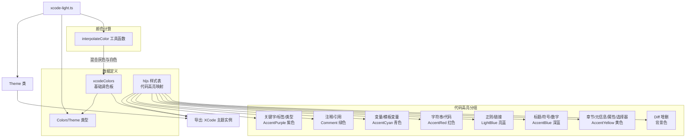

# xcode-light.ts

## 概述

`xcode-light.ts` 是 Gemini CLI 项目中内置的 **Xcode Light** 浅色主题实现文件。该主题的配色灵感来源于 Apple Xcode IDE 的默认浅色编辑器主题，以纯白背景 `#fff` 和深灰前景 `#444` 为基调，配合紫色关键字、绿色注释、红色字符串等经典 Xcode 风格配色。

与其他浅色主题相比，Xcode Light 主题有两个明显特点：一是**没有定义 `semanticColors`**（语义化颜色），仅通过基础调色板和 hljs 样式进行颜色定义；二是基础调色板中的 `DarkGray` 使用了 `interpolateColor` 动态计算，在灰色和白色之间做 50% 混合。

## 架构图（Mermaid）



## 核心组件

### 1. `xcodeColors` — 基础调色板

类型为 `ColorsTheme`，定义了 Xcode Light 主题的全部基础色值：

| 属性名 | 色值 | 说明 |
|---|---|---|
| `type` | `'light'` | 标识为浅色主题 |
| `Background` | `#fff` | 纯白色背景 |
| `Foreground` | `#444` | 深灰色前景文本 |
| `LightBlue` | `#0E0EFF` | 亮蓝色，用于正则和链接 |
| `AccentBlue` | `#1c00cf` | 深蓝紫色，用于标题、符号、数字 |
| `AccentPurple` | `#aa0d91` | 品红/紫色，用于关键字和类型（Xcode 经典关键字色） |
| `AccentCyan` | `#3F6E74` | 暗青色，用于变量 |
| `AccentGreen` | `#007400` | 深绿色，用于通用绿色 |
| `AccentYellow` | `#836C28` | 暗黄色/橄榄色，用于属性和选择器 |
| `AccentRed` | `#c41a16` | 红色，用于字符串 |
| `DiffAdded` | `#C6EAD8` | Diff 新增内容背景色（浅绿） |
| `DiffRemoved` | `#FEDEDE` | Diff 删除内容背景色（浅红） |
| `Comment` | `#007400` | 注释颜色（与 AccentGreen 相同，Xcode 经典注释色） |
| `Gray` | `#c0c0c0` | 灰色 |
| `DarkGray` | `interpolateColor('#c0c0c0', '#fff', 0.5)` | 动态计算：灰色与白色 50% 混合，约为 `#e0e0e0` |
| `FocusColor` | `#1c00cf` | 焦点颜色，同 AccentBlue，备注"为了更强视觉冲击" |
| `GradientColors` | `['#1c00cf', '#007400']` | 渐变色数组（深蓝紫→深绿） |

### 2. highlight.js 代码高亮样式表

完整的 hljs 样式映射，按 Xcode 风格进行语法着色：

| 语法分类 | 对应 hljs 类名 | 颜色/样式 |
|---|---|---|
| XML 元信息 | `xml .hljs-meta` | Gray `#c0c0c0` |
| 注释/引用 | `hljs-comment`, `hljs-quote` | Comment `#007400`（绿色） |
| 标签/属性/关键字/选择器标签/字面量/名称 | `hljs-tag`, `hljs-attribute`, `hljs-keyword`, `hljs-selector-tag`, `hljs-literal`, `hljs-name` | AccentPurple `#aa0d91` |
| 变量/模板变量 | `hljs-variable`, `hljs-template-variable` | AccentCyan `#3F6E74` |
| 代码/字符串/元字符串 | `hljs-code`, `hljs-string`, `hljs-meta-string` | AccentRed `#c41a16` |
| 正则/链接 | `hljs-regexp`, `hljs-link` | LightBlue `#0E0EFF` |
| 标题/符号/列表项/数字 | `hljs-title`, `hljs-symbol`, `hljs-bullet`, `hljs-number` | AccentBlue `#1c00cf` |
| 章节/元信息 | `hljs-section`, `hljs-meta` | AccentYellow `#836C28` |
| 类标题/类型/内置/内置名/参数 | `hljs-class .hljs-title`, `hljs-type`, `hljs-built_in`, `hljs-builtin-name`, `hljs-params` | AccentPurple `#aa0d91` |
| 属性/选择器 ID/选择器类 | `hljs-attr`, `hljs-selector-id`, `hljs-selector-class` | AccentYellow `#836C28` |
| 替换 | `hljs-subst` | Foreground `#444` |
| 公式 | `hljs-formula` | `backgroundColor: #eee`, `fontStyle: italic` |
| Diff 新增 | `hljs-addition` | `backgroundColor: #baeeba` |
| Diff 删除 | `hljs-deletion` | `backgroundColor: #ffc8bd` |
| 文档标签 | `hljs-doctag` | `fontWeight: bold` |
| 加粗 | `hljs-strong` | `fontWeight: bold` |
| 强调 | `hljs-emphasis` | `fontStyle: italic` |

### 3. `XCode` — 导出的主题实例

```typescript
export const XCode: Theme = new Theme(
  'Xcode',              // 主题名称
  'light',              // 主题类型（浅色）
  { /* hljs 样式表 */ },
  xcodeColors,          // 基础调色板
  // 注意：没有传入 semanticColors 参数
);
```

**注意**：与 Solarized Light 主题不同，Xcode Light 主题在构造 `Theme` 实例时**未传入第五个参数 `semanticColors`**。这意味着该主题将使用 `Theme` 类内部的默认语义化颜色逻辑（如果存在的话），或者语义化颜色将为空/由基础调色板自动推导。

## 依赖关系

### 内部依赖

| 模块路径 | 导入项 | 用途 |
|---|---|---|
| `../../theme.js` | `ColorsTheme` (类型) | 基础调色板的类型定义 |
| `../../theme.js` | `Theme` (类) | 主题类，用于构造主题实例 |
| `../../color-utils.js` | `interpolateColor` (函数) | 颜色插值工具，用于计算 DarkGray 色值 |

### 外部依赖

无直接外部依赖。所有依赖均为项目内部模块。

## 关键实现细节

1. **`interpolateColor` 导入来源不同**：与 Solarized Light 主题从 `../../theme.js` 导入 `interpolateColor` 不同，Xcode Light 主题从 `../../color-utils.js` 直接导入该函数。这暗示 `theme.js` 可能是对 `color-utils.js` 的重新导出（re-export），两个文件中存在模块引用的不一致性。

2. **`DarkGray` 的动态计算**：`DarkGray` 使用 `interpolateColor('#c0c0c0', '#fff', 0.5)` 在灰色和白色之间做 50% 混合得到，而非硬编码固定值。这种方式保证了 `DarkGray` 的色值始终与 `Gray` 保持视觉上的关联性。

3. **`FocusColor` 额外属性**：Xcode Light 主题在调色板中额外定义了 `FocusColor` 属性（值为 `#1c00cf`，同 AccentBlue），并附有注释说明"AccentBlue for more vibrance"。这是其他浅色主题中未见的属性，表明 `ColorsTheme` 类型可能包含可选的 `FocusColor` 字段。

4. **无 `semanticColors` 定义**：该主题是目前看到的唯一一个没有显式定义语义化颜色映射的浅色主题。这可能意味着：
   - `Theme` 类有从 `ColorsTheme` 自动生成默认 `SemanticColors` 的能力
   - 或者该主题的语义化颜色功能受限

5. **Xcode 配色忠实度**：关键字使用品红紫色 `#aa0d91`、注释使用绿色 `#007400`、字符串使用红色 `#c41a16` 等配色均与 Apple Xcode IDE 的默认 Light 主题一致，提供了熟悉的开发环境视觉体验。

6. **嵌套 CSS 选择器**：hljs 样式表中出现了 `'xml .hljs-meta'` 和 `'hljs-class .hljs-title'` 这样的嵌套选择器，用于处理特定上下文中的语法元素样式，这是其他主题中较少见的。

7. **Diff 颜色差异**：`hljs-addition` 和 `hljs-deletion` 使用的背景色（`#baeeba` / `#ffc8bd`）与调色板中 `DiffAdded` / `DiffRemoved` 的值（`#C6EAD8` / `#FEDEDE`）不同，存在两套独立的 Diff 颜色配置。
