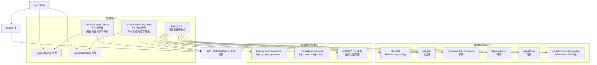

# no-color.ts

## 概述

`no-color.ts` 是 Gemini CLI 项目中内置的 **无颜色主题**（NoColor Theme）实现文件。这是一个特殊用途的主题，其所有颜色值均为**空字符串** `''`，渐变色数组为空数组 `[]`。该主题的设计目的是在终端不支持颜色输出或用户明确要求禁用颜色时使用，确保 CLI 输出不包含任何颜色转义码。

这种设计遵循了 [NO_COLOR 标准](https://no-color.org/) 的理念——当环境不适合彩色输出时，应用程序应当优雅地回退到无色模式。尽管所有颜色被清空，主题仍保留了基本的排版样式（如斜体、粗体、下划线），以确保文本的结构化呈现不会完全丧失。

## 架构图（Mermaid）



## 核心组件

### 1. `noColorColorsTheme` — 空白基础调色板

类型为 `ColorsTheme`，所有颜色属性均设置为空字符串：

| 属性名 | 色值 | 说明 |
|---|---|---|
| `type` | `'ansi'` | 标识为 ANSI 类型（非 light/dark） |
| `Background` | `''` | 空 — 使用终端默认背景 |
| `Foreground` | `''` | 空 — 使用终端默认前景 |
| `LightBlue` | `''` | 空 |
| `AccentBlue` | `''` | 空 |
| `AccentPurple` | `''` | 空 |
| `AccentCyan` | `''` | 空 |
| `AccentGreen` | `''` | 空 |
| `AccentYellow` | `''` | 空 |
| `AccentRed` | `''` | 空 |
| `DiffAdded` | `''` | 空 |
| `DiffRemoved` | `''` | 空 |
| `Comment` | `''` | 空 |
| `Gray` | `''` | 空 |
| `DarkGray` | `''` | 空 |
| `InputBackground` | `''` | 空（额外属性，其他主题中未见） |
| `MessageBackground` | `''` | 空（额外属性，其他主题中未见） |
| `FocusBackground` | `''` | 空（额外属性，其他主题中未见） |

**注意**：该调色板中包含三个在其他主题中未出现的额外属性：`InputBackground`、`MessageBackground`、`FocusBackground`，这些可能是 `ColorsTheme` 类型中的可选字段，用于更精细地控制特定 UI 区域的背景色。

### 2. `noColorSemanticColors` — 空白语义化颜色

类型为 `SemanticColors`，保持了完整的结构但所有值为空：

#### 2.1 `text` — 文本颜色（全部为空字符串）
- `primary`, `secondary`, `link`, `accent`, `response`

#### 2.2 `background` — 背景颜色（全部为空字符串）
- `primary`, `message`, `input`, `focus`
- `diff.added`, `diff.removed`

#### 2.3 `border` — 边框颜色
- `default`: `''`

#### 2.4 `ui` — 界面元素颜色
- `comment`, `symbol`, `active`, `dark`, `focus`: `''`
- `gradient`: `[]`（空数组，无渐变色）

#### 2.5 `status` — 状态颜色（全部为空字符串）
- `error`, `success`, `warning`

### 3. highlight.js 代码高亮样式表

所有 hljs 类名均被声明但大部分为空对象 `{}`，仅保留以下排版样式：

| hljs 类名 | 保留的样式 | 说明 |
|---|---|---|
| `hljs` | `display: block`, `overflowX: auto`, `padding: 0.5em` | 代码块容器基本布局 |
| `hljs-link` | `textDecoration: underline` | 链接保留下划线 |
| `hljs-comment` | `fontStyle: italic` | 注释保留斜体 |
| `hljs-quote` | `fontStyle: italic` | 引用保留斜体 |
| `hljs-emphasis` | `fontStyle: italic` | 强调保留斜体 |
| `hljs-strong` | `fontWeight: bold` | 加粗保留粗体 |
| `hljs-addition` | `display: inline-block`, `width: 100%` | Diff 新增行保留布局 |
| `hljs-deletion` | `display: inline-block`, `width: 100%` | Diff 删除行保留布局 |

以下 hljs 类名被声明为空对象（无颜色、无样式）：
`hljs-keyword`, `hljs-literal`, `hljs-symbol`, `hljs-name`, `hljs-built_in`, `hljs-type`, `hljs-number`, `hljs-class`, `hljs-string`, `hljs-meta-string`, `hljs-regexp`, `hljs-template-tag`, `hljs-subst`, `hljs-function`, `hljs-title`, `hljs-params`, `hljs-formula`, `hljs-doctag`, `hljs-meta`, `hljs-meta-keyword`, `hljs-tag`, `hljs-variable`, `hljs-template-variable`, `hljs-attr`, `hljs-attribute`, `hljs-builtin-name`, `hljs-section`, `hljs-bullet`, `hljs-selector-tag`, `hljs-selector-id`, `hljs-selector-class`, `hljs-selector-attr`, `hljs-selector-pseudo`

### 4. `NoColorTheme` — 导出的主题实例

```typescript
export const NoColorTheme: Theme = new Theme(
  'NoColor',                // 主题名称
  'dark',                   // 主题类型（标记为 dark）
  { /* hljs 样式表 */ },
  noColorColorsTheme,       // 空白基础调色板
  noColorSemanticColors,    // 空白语义化颜色
);
```

**值得注意**：尽管该主题的 `type` 在调色板中标记为 `'ansi'`，但 `Theme` 构造函数的第二个参数传入的却是 `'dark'`。这种不一致可能意味着 `Theme` 类的类型参数和 `ColorsTheme` 的 `type` 属性有不同的用途和语义。

## 依赖关系

### 内部依赖

| 模块路径 | 导入项 | 用途 |
|---|---|---|
| `../theme.js` | `Theme` (类) | 主题类，用于构造主题实例 |
| `../theme.js` | `ColorsTheme` (类型) | 基础调色板的类型定义 |
| `../semantic-tokens.js` | `SemanticColors` (类型) | 语义化颜色标记的类型定义（仅类型导入） |

### 外部依赖

无任何外部依赖。也不依赖 `interpolateColor` 或 `DEFAULT_SELECTION_OPACITY` 等工具函数/常量，因为所有颜色值均为静态空值。

## 关键实现细节

1. **`type: 'ansi'` 的特殊标识**：调色板的 `type` 字段值为 `'ansi'`，而非 `'light'` 或 `'dark'`。这是在已分析的主题中首次出现的第三种类型值，暗示主题系统支持至少三种类型标识：`light`（浅色）、`dark`（深色）、`ansi`（ANSI/无色）。

2. **空字符串策略**：选择空字符串 `''` 而非 `undefined` 或 `null` 作为颜色值是一种有意的设计决策。空字符串在 CSS 上下文中会被忽略（如 `color: ''` 等同于不设置该属性），而在 ANSI 终端颜色处理中可以被视为"不输出颜色代码"的信号。

3. **排版样式的保留**：虽然颜色被完全清空，但斜体（italic）、粗体（bold）和下划线（underline）等排版样式被刻意保留。这是因为这些样式不依赖颜色支持，大多数终端都能正确渲染，保留它们可以在无色模式下仍然提供基本的视觉区分。

4. **额外的背景属性**：`InputBackground`、`MessageBackground`、`FocusBackground` 这三个在其他主题中未出现的属性，表明 `ColorsTheme` 类型定义中这些是可选字段。在 NoColor 主题中显式设为空字符串，可能是为了确保这些属性不会意外回退到某个默认颜色值。

5. **Diff 行的布局保留**：`hljs-addition` 和 `hljs-deletion` 虽然没有背景色，但保留了 `display: inline-block` 和 `width: 100%` 的布局样式，确保 Diff 视图中新增/删除行的布局结构不会因缺少颜色而错乱。

6. **渐变色为空数组**：`ui.gradient` 设为 `[]` 而非空字符串数组，表明当没有可用的渐变色时，系统应处理空数组的情况，相关消费代码需要对此做安全检查。

7. **Theme 构造参数的 `'dark'` 类型**：NoColor 主题在 `Theme` 构造函数中传入 `'dark'` 作为主题类型参数。这可能是一种默认约定——当无法确定主题的明暗类型时，默认使用 `'dark'`，因为大多数终端默认为暗色背景。
