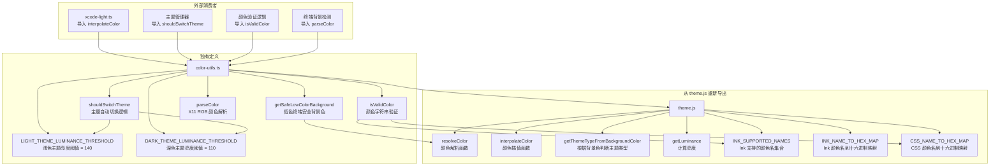

# color-utils.ts

## 概述

`color-utils.ts` 是 Gemini CLI 主题系统中的**颜色工具函数集**，充当颜色处理的公共 API 层。该文件有两个核心职责：

1. **重新导出（Re-export）**：从 `theme.js` 中重新导出一系列底层颜色工具函数和常量（`resolveColor`、`interpolateColor`、`getThemeTypeFromBackgroundColor`、`getLuminance`、`INK_SUPPORTED_NAMES`、`INK_NAME_TO_HEX_MAP`、`CSS_NAME_TO_HEX_MAP`），为外部消费者提供统一的导入入口。

2. **独立功能扩展**：在重新导出的基础上，额外定义了四个独有的函数和两个常量：`isValidColor`（颜色验证）、`getSafeLowColorBackground`（低色终端安全背景色）、`shouldSwitchTheme`（基于亮度的主题自动切换逻辑）、`parseColor`（X11 RGB 颜色解析），以及两个亮度阈值常量。

## 架构图（Mermaid）



## 核心组件

### 1. 重新导出的函数和常量

从 `./theme.js` 导入并原样重新导出的 7 个成员：

| 名称 | 类型 | 说明 |
|---|---|---|
| `resolveColor` | 函数 | 将颜色名称解析为标准化格式（可能是十六进制或 Ink 支持的名称） |
| `interpolateColor` | 函数 | 在两个颜色之间按指定比例进行线性插值混合 |
| `getThemeTypeFromBackgroundColor` | 函数 | 根据背景颜色判断应使用浅色还是深色主题 |
| `getLuminance` | 函数 | 计算颜色的相对亮度值 |
| `INK_SUPPORTED_NAMES` | Set | Ink（React 终端渲染库）支持的颜色名称集合 |
| `INK_NAME_TO_HEX_MAP` | Map/对象 | Ink 颜色名称到十六进制色值的映射表 |
| `CSS_NAME_TO_HEX_MAP` | Map/对象 | CSS 标准颜色名称到十六进制色值的映射表 |

### 2. `isValidColor(color: string): boolean` — 颜色验证函数

验证给定的颜色字符串是否为有效颜色。按以下优先级依次检查三种颜色格式：

```
输入颜色字符串 → 转小写
  ├─ 以 '#' 开头 → 正则匹配十六进制格式 (#RGB 或 #RRGGBB)
  ├─ 在 INK_SUPPORTED_NAMES 集合中 → 有效
  ├─ 在 CSS_NAME_TO_HEX_MAP 中有映射 → 有效
  └─ 均不匹配 → 无效
```

**支持的颜色格式**：
- **十六进制短格式**：`#RGB`（3 位），如 `#f00`
- **十六进制长格式**：`#RRGGBB`（6 位），如 `#ff0000`
- **Ink 颜色名**：终端 Ink 库支持的颜色名称（如 `red`, `green`, `blue` 等）
- **CSS 颜色名**：W3C CSS 标准颜色名称（如 `coral`, `tomato`, `skyblue` 等）

**注意**：正则表达式 `/^#[0-9A-Fa-f]{3}([0-9A-Fa-f]{3})?$/` 不支持 8 位十六进制色值（`#RRGGBBAA` 含透明度），只接受 3 位或 6 位格式。

### 3. `getSafeLowColorBackground(terminalBg: string): string | undefined` — 低色终端安全背景色

在低色终端环境中，为标准黑白背景提供"安全"的替代背景色：

| 终端背景色 | 返回的安全背景色 | 说明 |
|---|---|---|
| `'black'` / `'#000000'` / `'#000'` | `'#1c1c1c'` | 略亮于纯黑的深灰，避免内容与纯黑背景完全融合 |
| `'white'` / `'#ffffff'` / `'#fff'` | `'#eeeeee'` | 略暗于纯白的浅灰，避免内容与纯白背景完全融合 |
| 其他颜色 | `undefined` | 无法提供安全替代色 |

函数首先通过 `resolveColor` 将输入标准化，然后匹配是否为纯黑或纯白。

### 4. 亮度阈值常量

用于实现主题自动切换时的**滞后效应**（Hysteresis），防止背景色在临界值附近时频繁切换主题：

| 常量名 | 值 | 说明 |
|---|---|---|
| `LIGHT_THEME_LUMINANCE_THRESHOLD` | `140` | 从暗色切到浅色的亮度阈值（较高） |
| `DARK_THEME_LUMINANCE_THRESHOLD` | `110` | 从浅色切到暗色的亮度阈值（较低） |

两个阈值之间的差值（140 - 110 = 30）形成了一个"滞后区间"，亮度值在 110-140 之间时不会触发切换，从而避免了因微小亮度变化导致的频繁主题闪烁。

### 5. `shouldSwitchTheme(...)` — 主题自动切换判断

```typescript
shouldSwitchTheme(
  currentThemeName: string | undefined,  // 当前主题名
  luminance: number,                     // 背景亮度 (0-255)
  defaultThemeName: string,              // 默认暗色主题名
  defaultLightThemeName: string,         // 默认浅色主题名
): string | undefined
```

**切换逻辑**：

```
当前为默认暗色主题 + 亮度 > 140 → 切换到浅色主题
当前为默认浅色主题 + 亮度 < 110 → 切换到暗色主题
其他情况 → 不切换（返回 undefined）
```

**关键设计决策**：
- 只在**默认主题**之间切换。如果用户手动选择了非默认主题，则不会触发自动切换。
- `currentThemeName` 为 `undefined` 时视为使用默认暗色主题。
- 滞后机制确保亮度在 110-140 之间的灰色背景不会频繁切换。

### 6. `parseColor(rHex, gHex, bHex): string` — X11 RGB 颜色解析

将 X11 RGB 格式的颜色分量（来自 OSC 11 终端查询响应）解析为标准 `#RRGGBB` 十六进制字符串。

**参数**：每个颜色分量为十六进制字符串，支持 1-4 位精度：

| 输入位数 | 值域 | 转换公式 | 示例 |
|---|---|---|---|
| 1 位 | `0-F` (0-15) | `(val / 15) * 255` | `F` → 255 |
| 2 位 | `00-FF` (0-255) | `val` (直接使用) | `FF` → 255 |
| 3 位 | `000-FFF` (0-4095) | `(val / 4095) * 255` | `FFF` → 255 |
| 4 位 | `0000-FFFF` (0-65535) | `(val / 65535) * 255` | `FFFF` → 255 |

**使用场景**：终端通过 OSC 11（Operating System Command）查询返回的背景色格式为 `rgb:RRRR/GGGG/BBBB`（每通道 4 位十六进制），此函数负责将这种格式转换为标准的 `#RRGGBB` 格式供主题系统使用。

## 依赖关系

### 内部依赖

| 模块路径 | 导入项 | 用途 |
|---|---|---|
| `./theme.js` | `resolveColor` | 颜色解析，在 `getSafeLowColorBackground` 中使用 |
| `./theme.js` | `interpolateColor` | 颜色插值，重新导出供外部使用 |
| `./theme.js` | `getThemeTypeFromBackgroundColor` | 背景色判断主题类型，重新导出 |
| `./theme.js` | `INK_SUPPORTED_NAMES` | Ink 颜色名集合，在 `isValidColor` 中使用 |
| `./theme.js` | `INK_NAME_TO_HEX_MAP` | Ink 颜色映射表，重新导出 |
| `./theme.js` | `getLuminance` | 亮度计算，重新导出 |
| `./theme.js` | `CSS_NAME_TO_HEX_MAP` | CSS 颜色映射表，在 `isValidColor` 中使用 |

### 外部依赖

无直接外部依赖。

## 关键实现细节

1. **门面模式（Facade Pattern）**：该文件作为 `theme.js` 中颜色工具函数的门面层，通过重新导出为外部模块提供更清晰的导入路径。消费者可以选择从 `color-utils.js` 导入颜色工具函数，而非直接依赖 `theme.js`，实现了关注点分离。

2. **颜色验证与解析的一致性**：`isValidColor` 的文档注释明确指出"使用与 Theme 类的 `_resolveColor` 方法相同的验证逻辑"，确保颜色验证结果与实际颜色解析行为一致——验证通过的颜色一定能被正确解析。

3. **滞后效应（Hysteresis）防闪烁**：`shouldSwitchTheme` 使用两个不同的阈值（140 切入浅色，110 切回暗色）形成 30 个亮度单位的缓冲区。这是信号处理中的经典技术，防止背景亮度在临界值附近微小波动时触发频繁的主题切换（视觉闪烁）。

4. **X11 颜色精度处理**：`parseColor` 支持 1-4 位十六进制精度的灵活解析，这是因为不同终端模拟器在响应 OSC 11 查询时可能返回不同精度的颜色值。例如 iTerm2 可能返回 4 位精度（`rgb:FFFF/FFFF/FFFF`），而其他终端可能返回 2 位精度（`rgb:FF/FF/FF`）。

5. **低色终端的安全背景**：`getSafeLowColorBackground` 的设计考虑了低色终端（如 8 色或 16 色终端）的场景，在纯黑/纯白背景上提供微调的替代色，使 UI 元素（如边框、分隔线）在极端背景色上仍然可见。

6. **正则表达式的限制**：`isValidColor` 中的十六进制正则 `/^#[0-9A-Fa-f]{3}([0-9A-Fa-f]{3})?$/` 刻意不支持 `#RRGGBBAA`（8 位含 Alpha 通道）和 `#RGBA`（4 位含 Alpha 通道）格式，这与终端环境不支持透明度的实际情况一致。

7. **导入路径的不一致现象**：前面分析的 Solarized Light 主题从 `../../theme.js` 导入 `interpolateColor`，而 Xcode Light 主题从 `../../color-utils.js` 导入。`color-utils.ts` 的存在正是为了提供这个替代导入路径，但项目中两种导入方式共存表明缺乏统一的导入约定。
