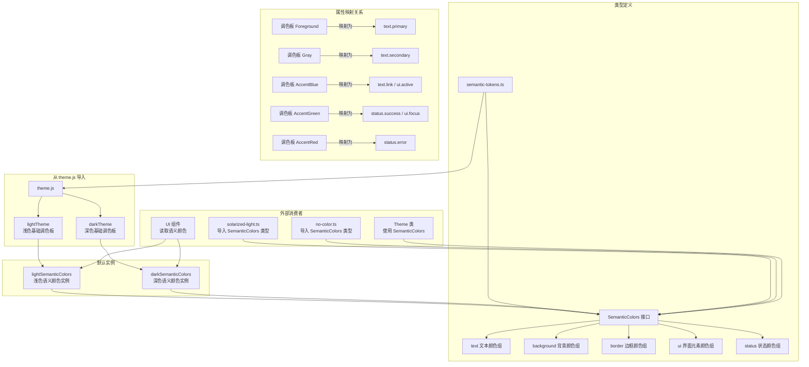

# semantic-tokens.ts

## 概述

`semantic-tokens.ts` 是 Gemini CLI 主题系统中的**语义化颜色标记定义文件**，承担两个核心职责：

1. **类型定义**：导出 `SemanticColors` 接口，定义了整个主题系统中语义化颜色的标准结构。这是所有主题（无论是内置主题还是自定义主题）在定义语义颜色时必须遵循的契约。

2. **默认实例**：提供 `lightSemanticColors` 和 `darkSemanticColors` 两个预构建的语义颜色实例，分别从 `theme.js` 中导入的 `lightTheme` 和 `darkTheme` 基础调色板自动映射而来。这些默认实例为未自行定义语义颜色的主题提供了开箱即用的回退方案。

该文件是主题系统中"基础调色板"到"功能化颜色语义"的桥梁层，将底层的色值常量提升为具有 UI 意义的命名标记。

## 架构图（Mermaid）

## 核心组件

### 1. `SemanticColors` 接口 — 语义化颜色类型契约

定义了五大颜色分组，共 19 个独立颜色属性和 1 个可选渐变数组：

#### 1.1 `text` — 文本颜色组

| 属性 | 类型 | 语义说明 |
|---|---|---|
| `primary` | `string` | 主要文本颜色，用于正文内容 |
| `secondary` | `string` | 次要文本颜色，用于辅助信息、占位符 |
| `link` | `string` | 链接文本颜色 |
| `accent` | `string` | 强调文本颜色，用于高亮显示的重要内容 |
| `response` | `string` | AI 响应文本颜色，专用于模型输出内容 |

#### 1.2 `background` — 背景颜色组

| 属性 | 类型 | 语义说明 |
|---|---|---|
| `primary` | `string` | 主背景颜色 |
| `message` | `string` | 消息气泡/区块背景色 |
| `input` | `string` | 输入区域背景色 |
| `focus` | `string` | 焦点/选中状态背景色 |
| `diff.added` | `string` | Diff 新增内容背景色 |
| `diff.removed` | `string` | Diff 删除内容背景色 |

#### 1.3 `border` — 边框颜色组

| 属性 | 类型 | 语义说明 |
|---|---|---|
| `default` | `string` | 默认边框颜色 |

#### 1.4 `ui` — 界面元素颜色组

| 属性 | 类型 | 语义说明 |
|---|---|---|
| `comment` | `string` | 注释类 UI 元素颜色 |
| `symbol` | `string` | 符号/图标颜色 |
| `active` | `string` | 激活/选中状态指示色 |
| `dark` | `string` | 深色 UI 元素（如阴影、分隔线） |
| `focus` | `string` | 焦点指示色 |
| `gradient` | `string[] \| undefined` | 渐变色数组，可选（可能为 undefined） |

#### 1.5 `status` — 状态颜色组

| 属性 | 类型 | 语义说明 |
|---|---|---|
| `error` | `string` | 错误状态颜色 |
| `success` | `string` | 成功状态颜色 |
| `warning` | `string` | 警告状态颜色 |

### 2. `lightSemanticColors` — 浅色语义颜色实例

从 `lightTheme` 基础调色板自动映射生成的 `SemanticColors` 实例。以下是完整的属性映射关系：

| 语义属性 | 映射自 lightTheme 属性 | 说明 |
|---|---|---|
| `text.primary` | `Foreground` | 前景色作为主文本 |
| `text.secondary` | `Gray` | 灰色作为次要文本 |
| `text.link` | `AccentBlue` | 蓝色作为链接 |
| `text.accent` | `AccentPurple` | 紫色作为强调 |
| `text.response` | `Foreground` | 前景色作为 AI 响应（与主文本相同） |
| `background.primary` | `Background` | 主背景色 |
| `background.message` | `MessageBackground!` | 消息背景（非空断言） |
| `background.input` | `InputBackground!` | 输入背景（非空断言） |
| `background.focus` | `FocusBackground!` | 焦点背景（非空断言） |
| `background.diff.added` | `DiffAdded` | Diff 新增色 |
| `background.diff.removed` | `DiffRemoved` | Diff 删除色 |
| `border.default` | `DarkGray` | 深灰色作为默认边框 |
| `ui.comment` | `Comment` | 注释色 |
| `ui.symbol` | `Gray` | 灰色作为符号色 |
| `ui.active` | `AccentBlue` | 蓝色作为活动状态 |
| `ui.dark` | `DarkGray` | 深灰色 |
| `ui.focus` | `AccentGreen` | 绿色作为焦点色 |
| `ui.gradient` | `GradientColors` | 渐变色数组 |
| `status.error` | `AccentRed` | 红色表示错误 |
| `status.success` | `AccentGreen` | 绿色表示成功 |
| `status.warning` | `AccentYellow` | 黄色表示警告 |

### 3. `darkSemanticColors` — 深色语义颜色实例

与 `lightSemanticColors` 的映射逻辑**完全相同**，唯一的区别是数据源从 `lightTheme` 变为 `darkTheme`。映射关系是对称的：

| 语义属性 | 映射自 darkTheme 属性 |
|---|---|
| `text.primary` | `Foreground` |
| `text.secondary` | `Gray` |
| `text.link` | `AccentBlue` |
| `text.accent` | `AccentPurple` |
| `text.response` | `Foreground` |
| `background.primary` | `Background` |
| `background.message` | `MessageBackground!` |
| `background.input` | `InputBackground!` |
| `background.focus` | `FocusBackground!` |
| `background.diff.added` | `DiffAdded` |
| `background.diff.removed` | `DiffRemoved` |
| `border.default` | `DarkGray` |
| `ui.comment` | `Comment` |
| `ui.symbol` | `Gray` |
| `ui.active` | `AccentBlue` |
| `ui.dark` | `DarkGray` |
| `ui.focus` | `AccentGreen` |
| `ui.gradient` | `GradientColors` |
| `status.error` | `AccentRed` |
| `status.success` | `AccentGreen` |
| `status.warning` | `AccentYellow` |

## 依赖关系

### 内部依赖

| 模块路径 | 导入项 | 用途 |
|---|---|---|
| `./theme.js` | `lightTheme` | 浅色基础调色板，用于构建 `lightSemanticColors` |
| `./theme.js` | `darkTheme` | 深色基础调色板，用于构建 `darkSemanticColors` |

### 外部依赖

无外部依赖。

## 关键实现细节

1. **接口与实例分离**：`SemanticColors` 接口和默认实例定义在同一个文件中，但职责清晰分离。接口定义了"形状"（shape），实例提供了"默认值"（defaults）。内置主题（如 Solarized Light）可以导入接口类型自行定义语义颜色，也可以选择不定义而使用这里的默认实例。

2. **非空断言操作符 `!`**：在构建默认实例时，`MessageBackground!`、`InputBackground!`、`FocusBackground!` 使用了 TypeScript 非空断言。这意味着 `ColorsTheme` 类型中这些属性是**可选的**（`?` 标记），但默认主题保证它们一定存在。非空断言表达了一种运行时假设：默认的 `lightTheme` 和 `darkTheme` 一定提供了这些值。

3. **映射模式的对称性**：浅色和深色语义颜色实例使用完全相同的属性映射逻辑，只是数据源不同。这种对称设计意味着：
   - 所有主题的语义属性到调色板属性的映射关系是固定的
   - 主题之间的差异完全由底层调色板的色值决定
   - 如果某个主题需要不同的映射关系（如 Solarized Light 中 `text.accent` 使用蓝色而非紫色），则需要自行定义 `SemanticColors` 实例

4. **`gradient` 的可选性**：`ui.gradient` 的类型为 `string[] | undefined`，是接口中唯一允许为 `undefined` 的属性。这与 NoColor 主题中 `gradient: []`（空数组）以及各彩色主题中 `gradient: ['...', '...', '...']`（非空数组）的用法一致——无渐变能力时应设为空数组或 undefined。

5. **颜色语义的设计决策**：
   - `text.response` 与 `text.primary` 映射到同一个调色板属性（`Foreground`），但被分离为独立的语义标记。这允许未来在不改变主文本颜色的情况下单独调整 AI 响应文本的外观。
   - `text.accent` 映射到 `AccentPurple`（紫色），而非更常见的 `AccentBlue`（蓝色），这是一个特意的设计选择，使强调文本在视觉上与链接文本区分开来。
   - `ui.active` 和 `text.link` 都映射到 `AccentBlue`，表明活动状态和链接在视觉上共享相同的蓝色指示。

6. **`border.default` 使用 `DarkGray`**：默认边框色使用调色板中的深灰色。这意味着在浅色主题中边框较明显（深灰在浅背景上对比度高），而在深色主题中边框较微妙（深灰在暗背景上对比度低），这是一种常见的 UI 设计模式。

7. **与自定义主题的关系**：对比 Solarized Light 主题中自定义的 `semanticColors` 可以看到：
   - Solarized Light 将 `text.accent` 设为 `#268bd2`（蓝色），而非默认映射中的紫色
   - Solarized Light 的 `ui.symbol` 使用 `#586e75`（更深的灰蓝），而非默认的 `Gray`
   - Solarized Light 的 `background.focus` 使用 `interpolateColor` 动态计算，而非默认的 `FocusBackground`

   这说明自定义 `SemanticColors` 允许主题在保持接口兼容性的同时，灵活调整具体的语义到色值的映射关系。
