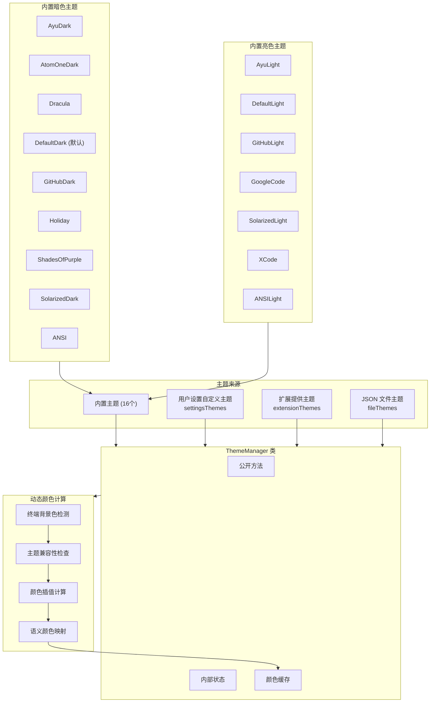

# theme-manager.ts

## 概述

`theme-manager.ts` 是 Gemini CLI 主题系统的核心管理模块。它实现了一个单例模式的 `ThemeManager` 类，负责：

1. **注册和管理所有主题**：包括内置主题（dark/light/ansi）、用户设置自定义主题、扩展提供的主题，以及从 JSON 文件加载的主题。
2. **主题切换**：支持通过名称或文件路径激活不同的主题。
3. **终端背景适配**：根据检测到的终端背景色动态计算颜色插值，生成适配后的颜色方案。
4. **颜色缓存**：对动态计算的颜色和语义颜色进行缓存，避免重复计算。
5. **NO_COLOR 环境变量支持**：遵循 `NO_COLOR` 标准，当该环境变量设置时返回无色主题。

该模块最终导出一个全局单例 `themeManager`，供整个 CLI 应用使用。

## 架构图（Mermaid）



## 核心组件

### 1. `ThemeDisplay` 接口

```typescript
export interface ThemeDisplay {
  name: string;       // 主题名称
  type: ThemeType;    // 主题类型: 'dark' | 'light' | 'ansi' | 'custom'
  isCustom?: boolean; // 是否为自定义主题
}
```

用于在主题列表中展示主题的基本信息，配合 `getAvailableThemes()` 方法使用。

### 2. `ThemeManager` 类

#### 属性

| 属性 | 类型 | 说明 |
|---|---|---|
| `availableThemes` | `Theme[]` | 所有内置主题数组（16个），只读 |
| `activeTheme` | `Theme` | 当前激活的主题，默认为 `DefaultDark` |
| `settingsThemes` | `Map<string, Theme>` | 来自用户设置的自定义主题 |
| `extensionThemes` | `Map<string, Theme>` | 来自扩展的自定义主题 |
| `fileThemes` | `Map<string, Theme>` | 来自 JSON 文件的自定义主题 |
| `terminalBackground` | `string \| undefined` | 检测到的终端背景色 |
| `cachedColors` | `ColorsTheme \| undefined` | 缓存的颜色方案 |
| `cachedSemanticColors` | `SemanticColors \| undefined` | 缓存的语义颜色 |
| `lastCacheKey` | `string \| undefined` | 缓存键（格式 `主题名:终端背景色`） |
| `fs` | `typeof fs` | 文件系统模块（可注入用于测试） |
| `homedir` | `() => string` | 获取用户主目录的函数（可注入用于测试） |

#### 核心方法

##### 主题加载方法

- **`loadCustomThemes(customThemesSettings?)`**：从用户设置加载自定义主题。对每个主题进行校验（`validateCustomTheme`），校验通过后与默认主题颜色合并，然后通过 `createCustomTheme` 创建主题对象并存入 `settingsThemes` Map。如果当前激活主题属于 settings 主题，则自动更新引用。

- **`registerExtensionThemes(extensionName, customThemes?)`**：注册扩展提供的主题。主题名称会被命名空间化为 `"主题名 (扩展名)"` 格式，避免与内置主题冲突。

- **`unregisterExtensionThemes(extensionName, customThemes?)`**：注销指定扩展的主题。

- **`loadThemeFromFile(themePath)`**：（私有方法）从 JSON 文件加载主题。流程：
  1. 使用 `realpathSync` 解析路径（防止符号链接攻击）
  2. 检查缓存
  3. **安全检查**：确保文件路径在用户主目录内
  4. 读取、解析、校验 JSON 内容
  5. 创建主题并缓存

##### 主题查找与切换

- **`setActiveTheme(themeName)`**：设置活动主题，返回 `boolean` 表示是否设置成功。
- **`getActiveTheme()`**：获取当前活动主题。优先检查 `NO_COLOR` 环境变量；然后验证当前主题对象是否仍然有效（内置或自定义中可找到）；如果无效则尝试按名称重新查找；最终回退到默认主题。
- **`findThemeByName(themeName)`**：按名称查找主题。查找优先级：内置主题 > 文件路径主题 > 设置主题 > 扩展主题 > 文件缓存主题。

##### 颜色获取方法

- **`getColors()`**：获取当前主题的颜色方案。若终端背景色已知且与主题兼容，则使用颜色插值动态计算 `Background`、`DarkGray`、`InputBackground`、`MessageBackground`、`FocusBackground` 等颜色。结果会被缓存。

- **`getSemanticColors()`**：获取语义颜色。基于 `getColors()` 的结果，进一步映射到语义级别的颜色（如 `background.primary`、`border.default`、`ui.dark` 等）。同样支持缓存。

##### 终端背景适配

- **`setTerminalBackground(color)`**：设置终端背景色并清除缓存。
- **`isThemeCompatible(activeTheme, terminalBackground)`**：检查主题与终端背景是否兼容。ANSI 主题始终兼容；自定义主题通过解析其 Background 颜色判断明暗；其他主题直接比较类型。

##### 辅助方法

- **`getAvailableThemes()`**：返回排序后的主题列表，排序优先级：暗色 > 亮色 > ANSI > 自定义，同类型按字母排序。
- **`isDefaultTheme(themeName)`**：判断是否为默认主题（DefaultDark 或 DefaultLight）。
- **`isCustomTheme(themeName)`**：判断是否为自定义主题。
- **`getCustomThemeNames()`**：获取所有自定义主题名称。
- **`getAllThemes()`**：获取所有主题（内置 + 自定义）。
- **`isPath(themeName)`**：判断主题名是否为文件路径（以 `.json` 结尾、以 `.` 开头、或为绝对路径）。

##### 测试辅助方法

- **`reinitialize(dependencies)`**：重新注入依赖（fs、homedir）。
- **`resetForTesting(dependencies?)`**：重置所有状态到初始值，用于测试隔离。
- **`clearExtensionThemes()`** / **`clearFileThemes()`**：清除扩展/文件主题。

### 3. 导出的全局单例

```typescript
export const DEFAULT_THEME: Theme = DefaultDark;
export const themeManager = new ThemeManager();
```

`themeManager` 是全局唯一的主题管理器实例，应用中所有需要获取主题信息的模块都通过它访问。

## 依赖关系

### 内部依赖

| 模块 | 导入内容 | 用途 |
|---|---|---|
| `./theme.js` | `Theme`, `ThemeType`, `ColorsTheme`, `CustomTheme`, `createCustomTheme`, `validateCustomTheme`, `interpolateColor`, `getThemeTypeFromBackgroundColor`, `resolveColor` | 主题类型定义和主题创建/校验/颜色工具函数 |
| `./semantic-tokens.js` | `SemanticColors` | 语义颜色类型定义 |
| `../constants.js` | `DEFAULT_BACKGROUND_OPACITY`, `DEFAULT_INPUT_BACKGROUND_OPACITY`, `DEFAULT_SELECTION_OPACITY`, `DEFAULT_BORDER_OPACITY` | 颜色插值的默认透明度常量 |
| `./builtin/dark/*.js` | `AyuDark`, `AtomOneDark`, `Dracula`, `GitHubDark`, `Holiday`, `DefaultDark`, `ShadesOfPurple`, `SolarizedDark`, `ANSI` | 9 个内置暗色主题 |
| `./builtin/light/*.js` | `AyuLight`, `GitHubLight`, `GoogleCode`, `DefaultLight`, `SolarizedLight`, `XCode`, `ANSILight` | 7 个内置亮色主题 |
| `./builtin/no-color.js` | `NoColorTheme` | 无色主题（用于 NO_COLOR 环境变量） |
| `@google/gemini-cli-core` | `debugLogger`, `homedir` | 调试日志和用户主目录获取 |

### 外部依赖

| 模块 | 用途 |
|---|---|
| `node:fs` | 文件系统操作（读取主题 JSON 文件、解析真实路径） |
| `node:path` | 路径处理（`resolve`、`isAbsolute`） |
| `node:process` | 读取 `NO_COLOR` 环境变量 |

## 关键实现细节

### 1. 依赖注入模式

构造函数接受可选的 `dependencies` 参数，允许注入 `fs` 和 `homedir`，方便单元测试时使用 mock：

```typescript
constructor(dependencies?: { fs?: typeof fs; homedir?: () => string }) {
    this.fs = dependencies?.fs ?? fs;
    this.homedir = dependencies?.homedir ?? homedir;
    // ...
}
```

### 2. 缓存策略

颜色计算涉及多次插值运算，因此使用 `cacheKey = "主题名:终端背景色"` 作为缓存键。任何导致缓存失效的操作（切换主题、更改终端背景色）都会调用 `clearCache()` 清除缓存。

### 3. 安全机制

从文件加载主题时实施了两层安全措施：
- **路径规范化**：使用 `realpathSync` 解析符号链接，防止路径遍历攻击。
- **目录限制**：只允许加载用户主目录内的主题文件，超出范围的文件会被拒绝并输出警告。

### 4. 终端背景色适配

当检测到终端背景色时，主题管理器会通过颜色插值（`interpolateColor`）动态计算多个 UI 元素的颜色：
- `Background` → 直接使用终端背景色
- `DarkGray` → 终端背景色与灰色混合（边框透明度）
- `InputBackground` → 终端背景色与灰色混合（输入框透明度）
- `MessageBackground` → 终端背景色与灰色混合（消息背景透明度）
- `FocusBackground` → 终端背景色与焦点色混合（选中透明度）

这确保了 UI 在不同终端配色方案下都能保持视觉一致性。

### 5. 扩展主题命名空间化

扩展提供的主题名称会被自动加上扩展名后缀 `"主题名 (扩展名)"`，避免不同扩展之间的命名冲突，也避免与内置主题冲突。

### 6. 主题查找优先级

`findThemeByName` 的查找顺序：
1. 内置主题（`availableThemes` 数组）
2. 文件路径（如果名称看起来像路径，调用 `loadThemeFromFile`）
3. 用户设置主题（`settingsThemes` Map）
4. 扩展主题（`extensionThemes` Map）
5. 文件主题缓存（`fileThemes` Map）

### 7. NO_COLOR 标准支持

`getActiveTheme()` 方法首先检查 `process.env['NO_COLOR']`，如果设置则直接返回 `NoColorTheme`，遵循了 [NO_COLOR](https://no-color.org/) 标准。
