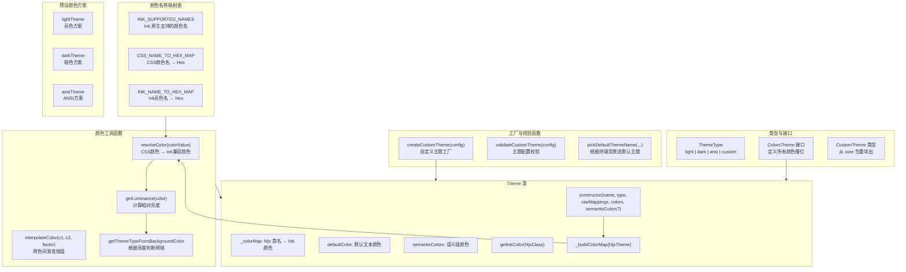

# theme.ts

## 概述

`theme.ts` 是 Gemini CLI 主题系统的基础模块，定义了主题的核心类型、颜色体系、以及颜色处理工具函数。它是整个主题架构的基石，主要功能包括：

1. **颜色类型定义**：定义了 `ColorsTheme`、`ThemeType`、`CustomTheme` 等核心类型。
2. **颜色解析与转换**：提供 CSS 颜色名称到 Ink 终端兼容格式的转换（`resolveColor`）。
3. **颜色插值**：基于渐变算法在两个颜色之间进行插值（`interpolateColor`）。
4. **亮度计算**：根据 WCAG 2.0 标准计算颜色亮度，用于判断明暗主题。
5. **Theme 类**：核心主题类，将 highlight.js 的 CSS 样式映射转换为 Ink 终端兼容的颜色映射。
6. **自定义主题工厂**：`createCustomTheme` 函数，将用户自定义配置转换为完整的 Theme 实例。
7. **预设颜色方案**：提供 `lightTheme`、`darkTheme`、`ansiTheme` 三套预设颜色方案。

## 架构图（Mermaid）



## 核心组件

### 1. 颜色名称映射表

#### `INK_SUPPORTED_NAMES`
Ink 框架原生支持的颜色名称集合，共 18 个，包括基础色（black, red, green 等）及其亮色变体（blackbright, redbright 等）。

```typescript
export const INK_SUPPORTED_NAMES = new Set([
  'black', 'red', 'green', 'yellow', 'blue', 'cyan', 'magenta', 'white',
  'gray', 'grey', 'blackbright', 'redbright', 'greenbright', 'yellowbright',
  'bluebright', 'cyanbright', 'magentabright', 'whitebright',
]);
```

#### `CSS_NAME_TO_HEX_MAP`
从 tinycolor2 的内置 CSS 颜色名称表中提取，**排除** Ink 已支持的颜色名称，将剩余的 CSS 颜色名映射为 `#hex` 格式。这样可以处理如 `darkkhaki`、`cornflowerblue` 等 CSS 命名颜色。

#### `INK_NAME_TO_HEX_MAP`
Ink 亮色变体名称到 Hex 的映射表（8个），因为 tinycolor 不认识 `blackbright`、`redbright` 等 Ink 特有的名称，需要手动映射才能进行亮度计算等操作。

### 2. 颜色工具函数

#### `resolveColor(colorValue: string): string | undefined`

将任意 CSS 颜色值解析为 Ink 兼容的颜色字符串。解析策略：

1. 如果以 `#` 开头 → 验证是否为合法 3位或6位 hex，合法则返回小写形式
2. 如果是纯 hex 数字（无 `#`） → 补上 `#` 前缀返回
3. 如果是 Ink 支持的颜色名 → 直接返回名称
4. 使用 tinycolor 解析为 hex → 返回 hex 字符串
5. 以上均失败 → 返回 `undefined`

#### `interpolateColor(color1: string, color2: string, factor: number): string`

基于 `tinygradient` 库在两个颜色之间进行线性插值。`factor` 为 0 返回 `color1`，为 1 返回 `color2`，介于 0-1 之间则返回渐变中间值的 hex 字符串。此函数被广泛用于计算 `InputBackground`、`MessageBackground`、`FocusBackground` 等动态颜色。

#### `getLuminance(color: string): number`

计算颜色的相对亮度，遵循 WCAG 2.0 标准。返回值范围 0-255。先检查 `INK_NAME_TO_HEX_MAP` 解析 Ink 亮色名，然后使用 tinycolor 计算亮度。

#### `getThemeTypeFromBackgroundColor(backgroundColor: string | undefined): 'light' | 'dark' | undefined`

根据背景色的亮度判断主题类型：亮度 > 128 为 `'light'`，否则为 `'dark'`。背景色无效时返回 `undefined`。

### 3. `ColorsTheme` 接口

定义主题的完整颜色槽位：

| 属性 | 说明 | 是否必选 |
|---|---|---|
| `type` | 主题类型 | 是 |
| `Background` | 背景色 | 是 |
| `Foreground` | 前景色（文本） | 是 |
| `LightBlue` | 浅蓝色 | 是 |
| `AccentBlue` | 强调蓝色 | 是 |
| `AccentPurple` | 强调紫色 | 是 |
| `AccentCyan` | 强调青色 | 是 |
| `AccentGreen` | 强调绿色 | 是 |
| `AccentYellow` | 强调黄色 | 是 |
| `AccentRed` | 强调红色 | 是 |
| `DiffAdded` | Diff 新增背景色 | 是 |
| `DiffRemoved` | Diff 删除背景色 | 是 |
| `Comment` | 注释颜色 | 是 |
| `Gray` | 灰色 | 是 |
| `DarkGray` | 深灰色 | 是 |
| `InputBackground` | 输入框背景色 | 可选 |
| `MessageBackground` | 消息背景色 | 可选 |
| `FocusBackground` | 焦点/选中背景色 | 可选 |
| `FocusColor` | 焦点颜色 | 可选 |
| `GradientColors` | 渐变颜色数组 | 可选 |

### 4. 预设颜色方案

模块预定义了三套颜色方案：

- **`lightTheme`**：白色背景、黑色前景，适合亮色终端
- **`darkTheme`**：黑色背景、白色前景，适合暗色终端
- **`ansiTheme`**：使用 ANSI 颜色名称（如 `'black'`、`'red'`），不使用 hex 值，最大兼容性

### 5. `Theme` 类

核心主题类，负责将 highlight.js 的 CSS 样式映射转换为终端可用的颜色映射。

#### 构造函数参数

| 参数 | 类型 | 说明 |
|---|---|---|
| `name` | `string` | 主题名称 |
| `type` | `ThemeType` | 主题类型 |
| `rawMappings` | `Record<string, CSSProperties>` | highlight.js 的 CSS 样式映射 |
| `colors` | `ColorsTheme` | 颜色方案 |
| `semanticColors` | `SemanticColors?` | 可选的语义颜色，缺省时自动从 colors 推导 |

#### 内部逻辑

构造时执行以下操作：
1. 如果未提供 `semanticColors`，则从 `colors` 自动推导出完整的语义颜色映射（包括 text、background、border、ui、status 五大类）
2. 调用 `_buildColorMap(rawMappings)` 将 CSS 样式映射转换为 `hljs 类名 → Ink 颜色` 的扁平映射，只提取 `color` 属性，忽略 `background`、`fontStyle` 等
3. 冻结颜色映射（`Object.freeze`）使其不可变
4. 从 `hljs` 基础样式中提取默认前景色

#### 关键方法

- **`getInkColor(hljsClass: string): string | undefined`**：根据 hljs 类名获取对应的 Ink 颜色
- **`_buildColorMap(hljsTheme)`**：遍历 rawMappings，只处理 `hljs-*` 和 `hljs` 键，提取 `color` 属性并通过 `resolveColor` 转换

### 6. `createCustomTheme(customTheme: CustomTheme): Theme`

自定义主题工厂函数。处理流程：

1. **颜色方案构建**：支持两种配置格式，优先读取语义化格式（如 `customTheme.text.primary`），回退到扁平格式（如 `customTheme.Foreground`）。对于衍生颜色（`InputBackground`、`MessageBackground` 等）通过 `interpolateColor` 动态计算。

2. **hljs 映射生成**：基于颜色方案自动生成完整的 highlight.js CSS 属性映射（约 40 个 hljs 类名），涵盖关键字、字符串、数字、注释、变量、选择器等所有语法元素。

3. **语义颜色映射**：构建完整的 `SemanticColors` 对象，同样支持语义化和扁平格式的配置回退。

4. **实例化**：调用 `new Theme(name, 'custom', rawMappings, colors, semanticColors)` 创建主题实例。

#### hljs 类名到颜色的映射关系

| 颜色槽位 | 对应的 hljs 类名 |
|---|---|
| `AccentBlue` | hljs-keyword, hljs-literal, hljs-symbol, hljs-name, hljs-link |
| `AccentCyan` | hljs-built_in, hljs-type |
| `AccentGreen` | hljs-number, hljs-class |
| `AccentYellow` | hljs-string, hljs-meta-string, hljs-section, hljs-bullet, hljs-selector-* |
| `AccentRed` | hljs-regexp, hljs-template-tag |
| `AccentPurple` | hljs-variable, hljs-template-variable |
| `LightBlue` | hljs-attr, hljs-attribute, hljs-builtin-name |
| `Foreground` | hljs-subst, hljs-function, hljs-title, hljs-params, hljs-formula |
| `Comment` | hljs-comment, hljs-quote, hljs-doctag |
| `Gray` | hljs-meta, hljs-meta-keyword, hljs-tag |

### 7. `validateCustomTheme(customTheme: Partial<CustomTheme>)`

校验自定义主题配置。当前校验逻辑较简单：仅验证主题名称（非空且长度不超过 50）。返回包含 `isValid`、`error`、`warning` 字段的校验结果对象。

### 8. `pickDefaultThemeName(...)`

根据终端背景色自动选择默认主题名称。策略：
1. 先在所有可用主题中查找背景色完全匹配的主题
2. 找不到则根据亮度判断使用默认亮色或暗色主题

## 依赖关系

### 内部依赖

| 模块 | 导入内容 | 用途 |
|---|---|---|
| `./semantic-tokens.js` | `SemanticColors` | 语义颜色类型定义 |
| `../constants.js` | `DEFAULT_INPUT_BACKGROUND_OPACITY`, `DEFAULT_SELECTION_OPACITY`, `DEFAULT_BORDER_OPACITY` | 颜色插值的默认透明度常量 |
| `@google/gemini-cli-core` | `CustomTheme` | 自定义主题类型定义（重导出） |

### 外部依赖

| 模块 | 用途 |
|---|---|
| `react` | 仅导入 `CSSProperties` 类型（用于 hljs 样式映射的类型注解） |
| `tinycolor2` | 颜色解析、亮度计算、CSS 颜色名映射（核心颜色处理库） |
| `tinygradient` | 两色之间的渐变插值计算 |

## 关键实现细节

### 1. 双格式配置兼容

`createCustomTheme` 同时支持语义化配置格式和扁平配置格式，通过 `??`（空值合并）运算符实现回退：

```typescript
Foreground: customTheme.text?.primary ?? customTheme.Foreground ?? '',
```

这允许用户使用直观的语义化键名（`text.primary`），同时保持对旧格式（`Foreground`）的向后兼容。

### 2. 颜色映射冻结

`_colorMap` 在构造时通过 `Object.freeze` 冻结，确保主题实例创建后颜色映射不可变，避免运行时意外修改：

```typescript
this._colorMap = Object.freeze(this._buildColorMap(rawMappings));
```

### 3. 亮度阈值

亮度判断使用 128 作为分界点（0-255 范围的中值）。大于 128 判定为亮色背景，小于等于 128 判定为暗色背景。

### 4. 默认语义颜色推导

当 Theme 构造函数未接收到 `semanticColors` 参数时，会从 `ColorsTheme` 自动推导出完整的 `SemanticColors`，映射关系如下：
- `text.primary` ← `Foreground`
- `text.secondary` ← `Gray`
- `text.link` ← `AccentBlue`
- `background.primary` ← `Background`
- `background.message` ← `MessageBackground` 或插值计算
- `border.default` ← `DarkGray`
- `status.error/success/warning` ← `AccentRed/AccentGreen/AccentYellow`

### 5. ANSI 主题的特殊设计

`ansiTheme` 使用 ANSI 颜色名称而非 hex 值，Foreground 设为空字符串（使用终端默认前景色），确保在任何终端配色方案下都能正常显示。
