# types.ts

## 概述

`types.ts` 是 Gemini CLI 用户界面层的核心类型定义文件，位于 `packages/cli/src/ui/` 目录下。该文件定义了 UI 层所需的全部枚举、接口、类型别名和类型守卫函数，是整个 CLI 用户界面的类型基础设施。它涵盖了以下几个主要领域：

1. **认证状态管理** - 定义用户认证流程中的各种状态
2. **流式响应状态** - 管理 Gemini 模型响应的流式传输状态
3. **工具调用系统** - 定义工具调用的状态、事件和显示结构
4. **历史记录系统** - 定义多达 20+ 种不同类型的历史条目，用于构建会话历史 UI
5. **消息系统** - 定义内部命令反馈的消息结构
6. **斜杠命令处理** - 定义斜杠命令的处理结果类型
7. **确认请求系统** - 定义各种用户确认对话框的数据结构
8. **MCP 服务器相关类型** - 定义 MCP（Model Context Protocol）服务器的 JSON 友好数据模型

## 架构图（Mermaid）

```mermaid
graph TD
    subgraph 外部依赖
        Core["@google/gemini-cli-core"]
        GenAI["@google/genai"]
        React["react"]
    end

    subgraph 枚举定义
        AuthState["认证状态枚举<br/>AuthState"]
        StreamingState["流式状态枚举<br/>StreamingState"]
        GeminiEventType["Gemini事件类型枚举<br/>GeminiEventType"]
        ToolCallStatus["工具调用状态枚举<br/>ToolCallStatus"]
        MessageType["消息类型枚举<br/>MessageType"]
    end

    subgraph 核心接口
        ToolCallEvent["工具调用事件<br/>ToolCallEvent"]
        IndividualToolCallDisplay["单个工具调用显示<br/>IndividualToolCallDisplay"]
        CompressionProps["压缩属性<br/>CompressionProps"]
        ConfirmationRequest["确认请求<br/>ConfirmationRequest"]
        ToolDefinition["工具定义<br/>ToolDefinition"]
    end

    subgraph 历史记录类型系统
        HistoryItemBase["历史条目基类<br/>HistoryItemBase"]
        HistoryItemUser["用户消息"]
        HistoryItemGemini["Gemini回复"]
        HistoryItemInfo["信息消息"]
        HistoryItemError["错误消息"]
        HistoryItemToolGroup["工具组"]
        HistoryItemAbout["关于信息"]
        HistoryItemMcpStatus["MCP状态"]
        HistoryItemWithoutId["无ID历史条目联合类型"]
        HistoryItem["历史条目(含ID)"]
    end

    subgraph MCP类型
        JsonMcpTool["MCP工具"]
        JsonMcpPrompt["MCP提示"]
        JsonMcpResource["MCP资源"]
    end

    subgraph 斜杠命令
        SlashCommandProcessorResult["斜杠命令处理结果"]
        SubmitPromptResult["提交提示结果"]
    end

    subgraph 函数
        mapCoreStatusToDisplayStatus["核心状态→显示状态映射"]
        isTodoList["TodoList类型守卫"]
        isAnsiOutput["AnsiOutput类型守卫"]
    end

    Core -->|导入类型| 枚举定义
    Core -->|导入类型| 核心接口
    GenAI -->|PartListUnion| 斜杠命令
    React -->|ReactNode| ConfirmationRequest

    HistoryItemBase --> HistoryItemUser
    HistoryItemBase --> HistoryItemGemini
    HistoryItemBase --> HistoryItemInfo
    HistoryItemBase --> HistoryItemError
    HistoryItemBase --> HistoryItemToolGroup
    HistoryItemBase --> HistoryItemAbout
    HistoryItemBase --> HistoryItemMcpStatus

    HistoryItemUser --> HistoryItemWithoutId
    HistoryItemGemini --> HistoryItemWithoutId
    HistoryItemInfo --> HistoryItemWithoutId
    HistoryItemError --> HistoryItemWithoutId
    HistoryItemToolGroup --> HistoryItemWithoutId
    HistoryItemAbout --> HistoryItemWithoutId
    HistoryItemMcpStatus --> HistoryItemWithoutId

    HistoryItemWithoutId --> HistoryItem

    IndividualToolCallDisplay --> HistoryItemToolGroup
    CompressionProps --> HistoryItemCompression["压缩历史条目"]

    JsonMcpTool --> HistoryItemMcpStatus
    JsonMcpPrompt --> HistoryItemMcpStatus
    JsonMcpResource --> HistoryItemMcpStatus

    mapCoreStatusToDisplayStatus -->|CoreToolCallStatus → ToolCallStatus| ToolCallStatus

    SubmitPromptResult --> SlashCommandProcessorResult
```

## 核心组件

### 1. 枚举类型

#### AuthState（认证状态）
管理用户认证流程的五种状态：

| 枚举值 | 字符串值 | 说明 |
|--------|---------|------|
| `Unauthenticated` | `'unauthenticated'` | 正在尝试认证或重新认证 |
| `Updating` | `'updating'` | 认证对话框已打开，等待用户选择认证方式 |
| `AwaitingApiKeyInput` | `'awaiting_api_key_input'` | 等待用户输入 API Key |
| `Authenticated` | `'authenticated'` | 认证成功 |
| `AwaitingGoogleLoginRestart` | `'awaiting_google_login_restart'` | 等待用户在 Google 登录后重启 |

#### StreamingState（流式状态）
定义 UI 层的流式响应状态：

| 枚举值 | 字符串值 | 说明 |
|--------|---------|------|
| `Idle` | `'idle'` | 空闲，无响应进行中 |
| `Responding` | `'responding'` | 正在接收 Gemini 模型响应 |
| `WaitingForConfirmation` | `'waiting_for_confirmation'` | 等待用户确认操作 |

#### GeminiEventType（Gemini 事件类型）
从 `server/src/core/turn.ts` 复制而来的事件类型：

| 枚举值 | 字符串值 | 说明 |
|--------|---------|------|
| `Content` | `'content'` | 内容事件 |
| `ToolCallRequest` | `'tool_call_request'` | 工具调用请求事件 |

#### ToolCallStatus（工具调用状态）
UI 层简化的工具调用状态（6 种）：

| 枚举值 | 说明 |
|--------|------|
| `Pending` | 等待中 |
| `Canceled` | 已取消 |
| `Confirming` | 确认中 |
| `Executing` | 执行中 |
| `Success` | 成功 |
| `Error` | 错误 |

#### MessageType（消息类型）
内部命令反馈使用的消息类型枚举，包含 17 种消息类型，如 `INFO`、`ERROR`、`WARNING`、`USER`、`ABOUT`、`HELP`、`STATS` 等。

### 2. 核心函数

#### `mapCoreStatusToDisplayStatus(coreStatus: CoreToolCallStatus): ToolCallStatus`
将核心层的 7 种工具调用状态映射为 UI 层简化的 6 种显示状态：

| 核心状态 | UI 显示状态 |
|---------|-----------|
| `Validating` | `Pending` |
| `Scheduled` | `Pending` |
| `AwaitingApproval` | `Confirming` |
| `Executing` | `Executing` |
| `Success` | `Success` |
| `Cancelled` | `Canceled` |
| `Error` | `Error` |

使用 `checkExhaustive` 确保穷尽匹配所有可能的核心状态。

#### 类型守卫函数

- **`isTodoList(res: unknown)`**: 判断一个未知值是否为包含 `todos` 数组的对象
- **`isAnsiOutput(res: unknown)`**: 判断一个未知值是否为 `AnsiOutput` 类型（二维数组）

### 3. 核心接口

#### `ToolCallEvent`
工具调用事件的完整数据结构，包含调用 ID、工具名称、参数、结果显示和确认详情。

#### `IndividualToolCallDisplay`
单个工具调用在 UI 中的显示数据结构，是最详尽的工具调用接口，包含 16 个字段：
- `callId` / `parentCallId` - 调用标识和父调用标识
- `name` / `description` - 工具名和描述
- `resultDisplay` - 结果显示数据
- `status` - 核心工具调用状态
- `isClientInitiated` - 是否由用户直接发起（斜杠命令/@/shell 流程）
- `kind` - 工具类型
- `confirmationDetails` - 确认详情
- `renderOutputAsMarkdown` - 是否以 Markdown 渲染输出
- `ptyId` - 伪终端 ID
- `outputFile` - 输出文件路径
- `correlationId` - 关联 ID
- `approvalMode` - 审批模式
- `progressMessage` / `progress` / `progressTotal` - 进度信息
- `originalRequestName` - 原始请求名称

#### `CompressionProps`
上下文压缩相关属性：
- `isPending` - 压缩是否进行中
- `originalTokenCount` / `newTokenCount` - 压缩前后的 token 数量
- `compressionStatus` - 压缩状态

### 4. 历史记录类型系统

`HistoryItemBase` 是所有历史记录条目的基类，仅包含可选的 `text` 字段。通过交叉类型（Intersection Type）派生出 20+ 种具体的历史条目类型：

| 类型 | `type` 值 | 用途 |
|------|----------|------|
| `HistoryItemUser` | `'user'` | 用户输入的消息 |
| `HistoryItemGemini` | `'gemini'` | Gemini 模型回复 |
| `HistoryItemGeminiContent` | `'gemini_content'` | Gemini 内容回复 |
| `HistoryItemInfo` | `'info'` | 信息提示，支持 icon、color、secondaryText |
| `HistoryItemError` | `'error'` | 错误消息 |
| `HistoryItemWarning` | `'warning'` | 警告消息 |
| `HistoryItemAbout` | `'about'` | 关于信息（CLI 版本、OS、模型等） |
| `HistoryItemHelp` | `'help'` | 帮助信息 |
| `HistoryItemStats` | `'stats'` | 统计信息（耗时、配额、余额） |
| `HistoryItemModelStats` | `'model_stats'` | 模型统计信息 |
| `HistoryItemToolStats` | `'tool_stats'` | 工具统计信息 |
| `HistoryItemModel` | `'model'` | 模型切换信息 |
| `HistoryItemQuit` | `'quit'` | 退出信息 |
| `HistoryItemToolGroup` | `'tool_group'` | 工具调用组（含边框样式） |
| `HistoryItemUserShell` | `'user_shell'` | 用户 Shell 命令 |
| `HistoryItemCompression` | `'compression'` | 上下文压缩信息 |
| `HistoryItemExtensionsList` | `'extensions_list'` | 扩展列表 |
| `HistoryItemThinking` | `'thinking'` | 思考过程 |
| `HistoryItemHint` | `'hint'` | 提示信息 |
| `HistoryItemChatList` | `'chat_list'` | 聊天列表 |
| `HistoryItemToolsList` | `'tools_list'` | 工具列表 |
| `HistoryItemSkillsList` | `'skills_list'` | 技能列表 |
| `HistoryItemAgentsList` | `'agents_list'` | 代理列表 |
| `HistoryItemMcpStatus` | `'mcp_status'` | MCP 服务器状态 |

所有类型通过 `HistoryItemWithoutId` 联合类型汇聚，再通过 `HistoryItem = HistoryItemWithoutId & { id: number }` 添加唯一标识符。

### 5. MCP 相关类型

为 MCP（Model Context Protocol）服务器定义了三个 JSON 友好的数据模型接口：

- **`JsonMcpTool`** - MCP 工具：包含服务器名称、工具名称、描述和参数 Schema
- **`JsonMcpPrompt`** - MCP 提示：包含服务器名称、提示名称和描述
- **`JsonMcpResource`** - MCP 资源：包含服务器名称、资源名称、URI、MIME 类型和描述

### 6. 斜杠命令处理

#### `SlashCommandProcessorResult`
斜杠命令处理器的返回结果，三种可能：
1. `{ type: 'schedule_tool' }` - 调度一个工具执行，可附带后续提示
2. `{ type: 'handled' }` - 命令已处理完毕，无需进一步操作
3. `SubmitPromptResult` - 立即向 Gemini 模型提交一个 prompt

### 7. 确认请求系统

三种不同场景的确认请求接口：

- **`ConfirmationRequest`** - 通用确认：使用 ReactNode 作为提示内容，回调返回布尔值
- **`LoopDetectionConfirmationRequest`** - 循环检测确认：用户选择 `'disable'` 或 `'keep'`
- **`PermissionConfirmationRequest`** - 权限确认：针对文件列表的访问权限确认

### 8. 其他

- **`emptyIcon`** - 常量 `'  '`（两个空格），用于不需要显示图标时的占位符
- **`ActiveHook`** - 活跃钩子接口，包含名称、事件名、来源和进度信息
- **`ConsoleMessageItem`** - 控制台消息条目，支持 `log`/`warn`/`error`/`debug`/`info` 五种级别
- **`ChatDetail`** - 聊天详情，包含名称和修改时间
- **`QuotaStats`** - 配额统计，包含剩余量、限额和重置时间

## 依赖关系

### 内部依赖

| 导入项 | 来源模块 | 说明 |
|--------|---------|------|
| `CompressionStatus` | `@google/gemini-cli-core` | 压缩状态类型 |
| `GeminiCLIExtension` | `@google/gemini-cli-core` | CLI 扩展定义 |
| `MCPServerConfig` | `@google/gemini-cli-core` | MCP 服务器配置 |
| `ThoughtSummary` | `@google/gemini-cli-core` | 思考摘要类型（再导出） |
| `SerializableConfirmationDetails` | `@google/gemini-cli-core` | 可序列化的确认详情（再导出） |
| `ToolResultDisplay` | `@google/gemini-cli-core` | 工具结果显示（再导出） |
| `RetrieveUserQuotaResponse` | `@google/gemini-cli-core` | 用户配额响应 |
| `SkillDefinition` | `@google/gemini-cli-core` | 技能定义（再导出） |
| `AgentDefinition` | `@google/gemini-cli-core` | 代理定义 |
| `ApprovalMode` | `@google/gemini-cli-core` | 审批模式 |
| `Kind` | `@google/gemini-cli-core` | 工具类型 |
| `AnsiOutput` | `@google/gemini-cli-core` | ANSI 输出类型 |
| `CoreToolCallStatus` | `@google/gemini-cli-core` | 核心工具调用状态枚举（再导出） |
| `checkExhaustive` | `@google/gemini-cli-core` | 穷尽性检查工具函数 |

### 外部依赖

| 导入项 | 来源模块 | 说明 |
|--------|---------|------|
| `PartListUnion` | `@google/genai` | Google GenAI SDK 的 Part 列表联合类型，用于构建 prompt |
| `ReactNode` | `react` | React 节点类型，用于 `ConfirmationRequest.prompt` |

## 关键实现细节

1. **类型再导出模式**: 文件通过 `export { CoreToolCallStatus }` 和 `export type { ThoughtSummary, ... }` 将核心模块的类型再导出，使 UI 层其他模块无需直接依赖 `@google/gemini-cli-core`，降低了耦合度。

2. **区分类型联合（Discriminated Union）**: 历史记录系统采用经典的带标签联合类型模式，每个 `HistoryItem` 变体都有唯一的 `type` 字段作为判别标识，便于 TypeScript 在 `switch` 语句中进行类型窄化（narrowing）。

3. **穷尽性检查**: `mapCoreStatusToDisplayStatus` 函数的 `default` 分支使用 `checkExhaustive(coreStatus)` 确保所有可能的核心状态都已处理。如果将来核心层新增了状态但此映射函数未更新，TypeScript 编译器将报错。

4. **核心层与 UI 层的状态映射**: `CoreToolCallStatus` 有 7 种状态（Validating、AwaitingApproval、Executing、Success、Cancelled、Error、Scheduled），而 UI 层的 `ToolCallStatus` 仅有 6 种。其中 `Validating` 和 `Scheduled` 都映射为 `Pending`，简化了 UI 显示逻辑。

5. **ID 分离设计**: `HistoryItemWithoutId` 是不含 ID 的联合类型，而 `HistoryItem` 通过交叉类型添加 `id: number`。这种设计允许在创建历史条目时不需要立即分配 ID，ID 由系统在插入时自动生成。

6. **JSON 友好的 MCP 类型**: `JsonMcpTool`、`JsonMcpPrompt`、`JsonMcpResource` 被注释为 "JSON-friendly types"，专门设计用于序列化和传输场景，避免包含不可序列化的复杂对象。

7. **React 集成**: `ConfirmationRequest` 接口中 `prompt` 字段类型为 `ReactNode`，表明整个 CLI 界面基于 React（Ink）构建，确认对话框的内容可以是任意 React 组件。

8. **`emptyIcon` 常量**: 定义为两个空格 `'  '`，用于在需要图标对齐但不显示图标的场景下保持布局一致性。
