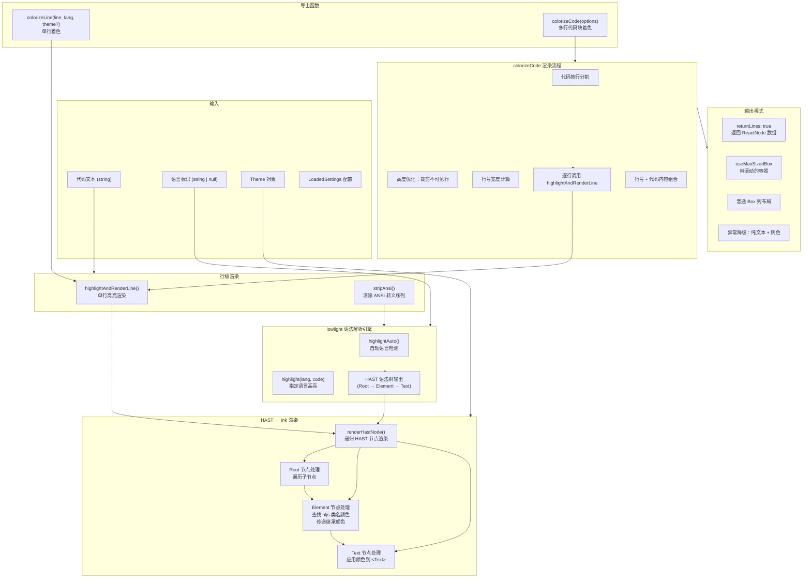

# CodeColorizer.tsx

## 概述

`CodeColorizer.tsx` 是 Gemini CLI 的代码语法高亮渲染模块，负责将代码文本转换为带有语法着色的 Ink（终端 React 框架）组件。它是 CLI 中所有代码块渲染的核心引擎。

主要功能：

1. **语法高亮**：使用 `lowlight`（highlight.js 的 AST 版本）进行语法解析，支持自动语言检测和指定语言高亮
2. **HAST 到 Ink 的转换**：将 lowlight 生成的 HAST（HTML Abstract Syntax Tree）递归转换为 Ink 的 `<Text>` 组件，应用主题颜色
3. **行号显示**：可选的行号展示，支持动态对齐
4. **高度优化**：当可用高度有限时，裁剪不可见的顶部行以避免不必要的高亮计算
5. **多种输出模式**：支持返回整体组件、行数组、或带有 `MaxSizedBox` 滚动容器的组件

该模块导出两个公开函数：
- `colorizeLine`：高亮渲染单行代码
- `colorizeCode`：高亮渲染多行代码块

## 架构图（Mermaid）



## 核心组件

### 1. lowlight 引擎初始化

```typescript
const lowlight = createLowlight(common);
```

使用 `lowlight` 库（highlight.js 的虚拟 DOM 版本）创建语法高亮引擎，加载 `common` 语言包（包含约 40 种常见编程语言）。`lowlight` 不直接输出 HTML，而是输出 HAST（HTML Abstract Syntax Tree），方便在非浏览器环境中使用。

### 2. `renderHastNode` 递归渲染函数

```typescript
function renderHastNode(
  node: Root | Element | HastText | RootContent,
  theme: Theme,
  inheritedColor: string | undefined,
): React.ReactNode
```

将 HAST 节点递归转换为 React/Ink 组件。这是整个语法高亮渲染的核心算法。

#### 处理三种节点类型：

**Text 节点**（叶子节点）：
- 使用从父元素继承的颜色，若无继承则使用主题默认前景色
- 直接渲染为 `<Text color={color}>{node.value}</Text>`

**Element 节点**（中间节点）：
- 从节点的 `className` 属性中提取 hljs 类名（如 `hljs-keyword`、`hljs-string`）
- 从**最后一个**类名开始向前查找，调用 `theme.getInkColor(className)` 获取颜色
- 如果找到颜色，使用该颜色；否则继续传递已继承的颜色
- 使用 `React.Fragment` 包裹子节点，不产生额外的 DOM 层级
- 递归渲染所有子节点

**Root 节点**（根节点）：
- 如果子节点为空（lowlight 无法检测语言），返回 `null`
- 否则遍历所有子节点，传递初始继承颜色（通常为 `undefined`）

#### 颜色继承机制

颜色通过 `inheritedColor` 参数自顶向下传递：
```
Root (undefined) → Element.hljs-keyword (AccentBlue) → Text (使用 AccentBlue)
Root (undefined) → Element.无匹配类 (undefined) → Text (使用 defaultColor)
```

### 3. `highlightAndRenderLine` 行级高亮函数

```typescript
function highlightAndRenderLine(
  line: string,
  language: string | null,
  theme: Theme,
): React.ReactNode
```

处理单行代码的高亮流程：
1. 使用 `stripAnsi` 清除行中的 ANSI 转义序列
2. 如果指定了语言且 lowlight 支持该语言 → 使用 `lowlight.highlight(language, line)`
3. 否则 → 使用 `lowlight.highlightAuto(line)` 自动检测语言
4. 将返回的 HAST 树传递给 `renderHastNode` 渲染
5. 如果渲染结果为 `null`，回退到纯文本（已清除 ANSI）
6. 捕获所有异常，异常时回退到纯文本

### 4. `colorizeLine` 导出函数

```typescript
export function colorizeLine(
  line: string,
  language: string | null,
  theme?: Theme,
  disableColor = false,
): React.ReactNode
```

单行代码着色的公开 API。功能简单直接：
- `disableColor = true` 时返回无色 `<Text>{line}</Text>`
- 否则使用传入的 `theme` 或从 `themeManager` 获取当前活动主题
- 调用 `highlightAndRenderLine` 进行渲染

### 5. `ColorizeCodeOptions` 接口

```typescript
export interface ColorizeCodeOptions {
  code: string;              // 要高亮的代码文本
  language?: string | null;  // 编程语言标识
  availableHeight?: number;  // 可用的终端高度（行数）
  maxWidth: number;          // 最大宽度
  theme?: Theme | null;      // 主题（可选，默认使用活动主题）
  settings: LoadedSettings;  // 用户设置
  hideLineNumbers?: boolean; // 强制隐藏行号
  disableColor?: boolean;    // 禁用颜色
  returnLines?: boolean;     // 是否以行数组形式返回
}
```

### 6. `colorizeCode` 导出函数

```typescript
export function colorizeCode(options: ColorizeCodeOptions): React.ReactNode | React.ReactNode[]
```

多行代码块的完整着色函数，支持函数重载：
- `returnLines: true` → 返回 `React.ReactNode[]`
- `returnLines: false` 或未指定 → 返回 `React.ReactNode`

#### 执行流程

**第一步：预处理**
- 移除代码末尾的换行符（`code.replace(/\n$/, '')`）
- 确定活动主题（传入的 theme 或 themeManager 的活动主题）
- 根据设置和参数决定是否显示行号

**第二步：是否使用 MaxSizedBox**
```typescript
const useMaxSizedBox = !settings.merged.ui.useAlternateBuffer && !returnLines;
```
当不使用备用缓冲区且不要求返回行数组时，使用 `MaxSizedBox` 容器。

**第三步：行分割与高度优化**
- 按 `\r?\n` 分割代码为行数组
- 计算行号的对齐宽度（`padWidth`）
- 如果指定了 `availableHeight` 且使用 `MaxSizedBox`：
  - 保证最小高度（`MINIMUM_MAX_HEIGHT`）
  - 如果行数超过可用高度，**裁剪顶部不可见行**，记录隐藏行数 `hiddenLinesCount`
  - 这是一个性能优化，避免对不可见行进行语法高亮计算

**第四步：逐行渲染**
每行渲染为一个 `<Box>` 容器，包含：
- 可选的行号列：右对齐、固定宽度、灰色文本，行号考虑了隐藏行数偏移
- 代码内容列：应用主题默认前景色、自动换行

**第五步：组装输出**

根据配置选择输出模式：

| 条件 | 输出方式 |
|---|---|
| `returnLines = true` | 直接返回行组件数组 |
| `useMaxSizedBox = true` | 包裹在 `<MaxSizedBox>` 中，设置 `overflowDirection="top"` 从顶部溢出 |
| 其他 | 包裹在 `<Box flexDirection="column">` 中 |

**第六步：异常降级**
如果高亮过程中发生异常：
- 输出警告日志
- 使用纯文本（`stripAnsi` 清除 ANSI）+ 灰色文本渲染
- 行号改用主题默认前景色
- 同样支持 `returnLines` 和 `useMaxSizedBox` 两种输出模式

## 依赖关系

### 内部依赖

| 模块 | 导入内容 | 用途 |
|---|---|---|
| `../themes/theme-manager.js` | `themeManager` | 获取当前活动主题 |
| `../themes/theme.js` | `Theme` (类型) | 主题类型定义 |
| `../components/shared/MaxSizedBox.js` | `MaxSizedBox`, `MINIMUM_MAX_HEIGHT` | 带最大高度限制的滚动容器组件 |
| `@google/gemini-cli-core` | `debugLogger` | 调试日志输出 |
| `../../config/settings.js` | `LoadedSettings` (类型) | 用户设置类型定义（行号开关、备用缓冲区开关等） |

### 外部依赖

| 模块 | 用途 |
|---|---|
| `react` | React 核心（JSX、Fragment） |
| `ink` | 终端 UI 框架（`Text`、`Box` 组件） |
| `lowlight` | 基于 highlight.js 的语法高亮引擎（生成 HAST 而非 HTML） |
| `hast` | HTML Abstract Syntax Tree 类型定义（`Root`、`Element`、`Text`、`ElementContent`、`RootContent`） |
| `strip-ansi` | 清除字符串中的 ANSI 转义序列 |

## 关键实现细节

### 1. lowlight vs highlight.js

模块使用 `lowlight` 而非直接使用 `highlight.js`，因为 `lowlight` 输出 HAST（抽象语法树）而非 HTML 字符串。这使得在非浏览器环境（终端/Ink）中可以精确控制每个节点的渲染方式，无需解析 HTML。

### 2. HAST 颜色继承机制

`renderHastNode` 实现了一个简洁的颜色继承模型：
- 只有 `Text` 节点实际应用颜色（通过 `<Text color={...}>`）
- `Element` 节点负责查找颜色并向下传递
- 颜色查找使用**最后一个匹配的类名**（`for` 循环从后向前），因为 hljs 可能为一个节点分配多个类名，最后一个通常最具体

### 3. 性能优化：不可见行裁剪

当终端高度有限时，从代码顶部裁剪不可见行：
```typescript
if (lines.length > availableHeight) {
  const sliceIndex = lines.length - availableHeight;
  hiddenLinesCount = sliceIndex;
  lines = lines.slice(sliceIndex);
}
```
这避免了对数百行不可见代码进行昂贵的语法高亮计算。`hiddenLinesCount` 用于正确偏移行号显示。

### 4. ANSI 序列清除

代码在语法高亮前会先通过 `stripAnsi` 清除已有的 ANSI 转义序列。这处理了代码中可能包含终端输出或日志内容的情况。

### 5. 语言自动检测回退

当未指定语言或指定的语言未注册时，使用 `lowlight.highlightAuto()` 自动检测语言。如果自动检测失败（返回空的 HAST 树），最终回退到纯文本渲染。

### 6. 行号对齐计算

行号宽度通过 `String(lines.length).length` 动态计算，确保在不同行数下（个位数 vs 千位数）行号列宽度一致对齐。行号列使用 `minWidth` + `justifyContent: 'flex-end'` 实现右对齐。

### 7. 函数重载签名

`colorizeCode` 使用 TypeScript 函数重载，根据 `returnLines` 参数的值返回不同类型：
```typescript
export function colorizeCode(options: ColorizeCodeOptions & { returnLines: true }): React.ReactNode[];
export function colorizeCode(options: ColorizeCodeOptions & { returnLines?: false }): React.ReactNode;
```
这提供了精确的类型推断，调用方根据 `returnLines` 的值可以获得正确的返回类型。

### 8. MaxSizedBox 与备用缓冲区的互斥

`useMaxSizedBox` 仅在不使用备用缓冲区（`settings.merged.ui.useAlternateBuffer = false`）时启用。当使用备用缓冲区时，终端本身处理滚动，不需要 `MaxSizedBox` 的虚拟滚动功能。
