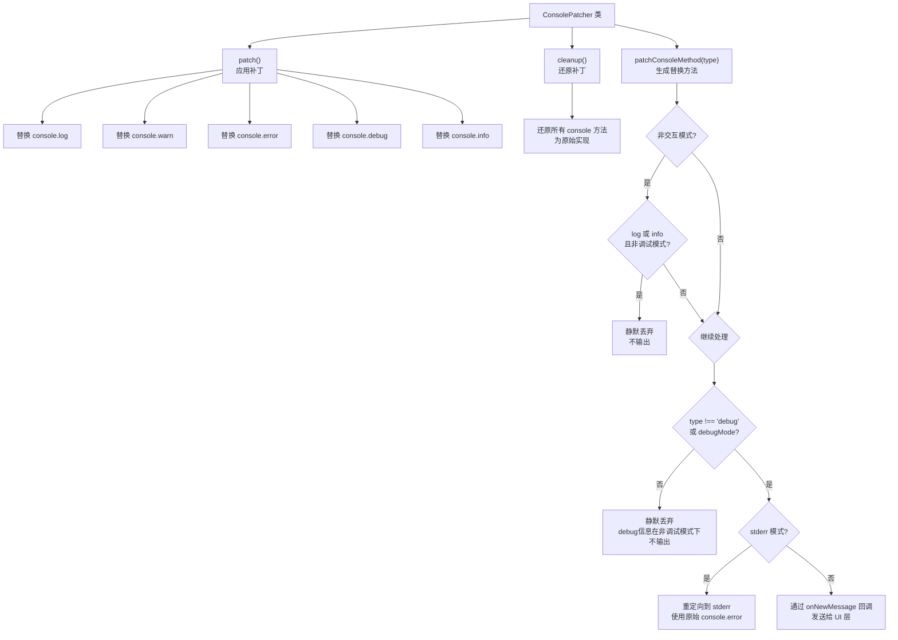
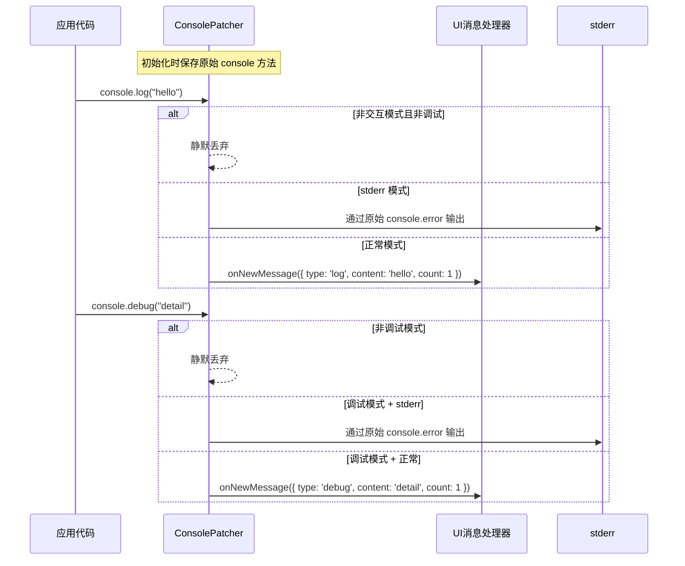

# ConsolePatcher.ts

## 概述

`ConsolePatcher.ts` 是 Gemini CLI 项目中的控制台拦截器模块。它通过猴子补丁（Monkey Patching）技术替换 `console` 对象的标准方法（`log`、`warn`、`error`、`debug`、`info`），将控制台输出重定向到自定义处理逻辑中。

这种拦截在 Ink（React 终端 UI 框架）环境中尤为重要，因为直接使用 `console.log` 会破坏 Ink 的渲染布局。通过 `ConsolePatcher`，所有控制台输出可以被捕获并以消息的形式传递给 UI 层，或者在特定模式下重定向到 stderr。

文件总计约 75 行，实现为一个可实例化的类，支持补丁应用与清除。

## 架构图（Mermaid）





## 核心组件

### `ConsolePatcher` 类

#### 构造函数

```typescript
constructor(params: ConsolePatcherParams)
```

接收一个配置参数对象 `ConsolePatcherParams`：

| 参数 | 类型 | 必填 | 说明 |
|------|------|------|------|
| `onNewMessage` | `(message: Omit<ConsoleMessageItem, 'id'>) => void` | 否 | 接收拦截到的控制台消息的回调函数 |
| `debugMode` | `boolean` | 是 | 是否启用调试模式（影响 debug 级别消息是否输出以及非交互模式下 log/info 是否输出） |
| `stderr` | `boolean` | 否 | 是否将所有输出重定向到 stderr（通过原始 `console.error`） |
| `interactive` | `boolean` | 否 | 是否为交互模式（默认视为 `true`） |

#### 私有属性

实例在创建时保存所有五个 `console` 方法的原始引用：

- `originalConsoleLog`
- `originalConsoleWarn`
- `originalConsoleError`
- `originalConsoleDebug`
- `originalConsoleInfo`

#### `patch()` 方法

将 `console` 的五个方法全部替换为经过 `patchConsoleMethod` 包装的版本。调用此方法后，全局的 `console.log`、`console.warn` 等方法都将被拦截。

#### `cleanup()` 方法

将所有五个 `console` 方法还原为实例化时保存的原始实现。该方法被定义为箭头函数属性，可以安全地作为回调传递而不丢失 `this` 上下文（例如用于 `process.on('exit', patcher.cleanup)`）。

#### `formatArgs(args: unknown[]): string` 私有方法

使用 Node.js 的 `util.format()` 将控制台方法接收到的多个参数格式化为单一字符串。这与 Node.js 原生 `console.log` 的行为一致（支持 `%s`、`%d`、`%j` 等格式化占位符以及对象的深度检查）。

#### `patchConsoleMethod(type)` 私有方法

核心工厂方法，为每种控制台方法类型生成对应的替换函数。替换函数的行为遵循以下决策逻辑：

**第一层判断 -- 非交互模式过滤**：
- 当 `interactive === false` 时，`log` 和 `info` 类型的消息在非调试模式下被静默丢弃
- 这是因为非交互模式（如管道输出、脚本调用）中，常规信息日志是不需要的

**第二层判断 -- debug 级别过滤**：
- `debug` 类型的消息仅在 `debugMode === true` 时才会被处理
- 其他类型的消息（`log`、`warn`、`error`、`info`）始终被处理（通过第一层过滤后）

**第三层判断 -- 输出目标选择**：
- 若 `stderr === true`：通过原始的 `console.error` 方法输出到 stderr
- 若 `stderr === false` 或未设置：通过 `onNewMessage` 回调将消息传递给 UI 层

**传递给 `onNewMessage` 的消息对象格式**：
```typescript
{
  type: 'log' | 'warn' | 'error' | 'debug' | 'info',
  content: string,  // 格式化后的字符串
  count: 1          // 始终为 1（表示单条消息）
}
```

## 依赖关系

### 内部依赖

| 导入 | 来源模块 | 用途 |
|------|---------|------|
| `ConsoleMessageItem` (类型) | `../types.js` | 控制台消息条目的类型定义，用于 `onNewMessage` 回调的参数类型 |

### 外部依赖

| 导入 | 包名 | 用途 |
|------|------|------|
| `util` | `node:util` | 使用 `util.format()` 进行控制台参数格式化 |

## 关键实现细节

### 猴子补丁模式

`ConsolePatcher` 采用经典的猴子补丁模式：先保存原始方法引用，再用自定义方法替换全局对象上的方法。这种模式的优势在于：
1. 可以完全控制输出行为
2. 可以通过 `cleanup()` 完全还原，不留痕迹
3. 对调用方透明——代码中使用 `console.log()` 的地方无需修改

### stderr 重定向策略

当 `stderr === true` 时，所有输出都通过保存的 `originalConsoleError` 输出到 stderr。这在以下场景中很有用：
- stdout 被用于结构化数据输出（如 JSON）时，日志信息需要走 stderr
- 管道化使用 CLI 时，避免日志污染 stdout 的数据流

### 非交互模式的分级静默

非交互模式下的静默规则精心设计：
- `log` 和 `info` 在非调试模式下被静默（这些通常是面向用户的信息提示）
- `warn` 和 `error` 始终输出（这些是重要的警告和错误信息，不应被忽略）
- `debug` 遵循自己的独立规则（仅在 debugMode 下输出）

### cleanup 的箭头函数绑定

`cleanup` 被定义为箭头函数属性（`cleanup = () => { ... }`）而非普通方法（`cleanup() { ... }`），这确保了 `this` 始终绑定到类实例。这是一个重要的设计选择，因为 `cleanup` 很可能被作为回调传递（例如在进程退出时调用），此时普通方法会丢失 `this` 上下文。

### count 字段始终为 1

传递给 `onNewMessage` 的消息对象中，`count` 字段始终为 `1`。这暗示消息的去重/合并计数功能在 UI 层的消息接收端实现，而非在 patcher 端。

### 导出清单

| 导出 | 类型 |
|------|------|
| `ConsolePatcher` | 具名导出类 |
