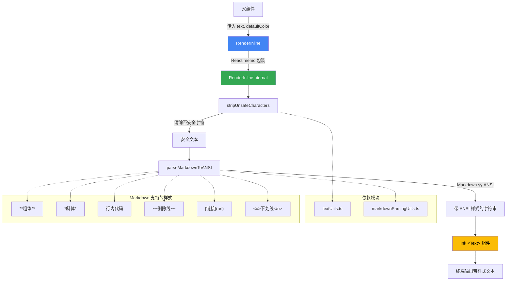

# InlineMarkdownRenderer.tsx

## 概述

`InlineMarkdownRenderer.tsx` 是 Gemini CLI 项目中用于 **终端内联 Markdown 渲染** 的 React 组件。它接收原始 Markdown 文本，先清除不安全字符，再将 Markdown 语法转换为 ANSI 转义序列（支持粗体、斜体、删除线、行内代码、链接、下划线等），最终通过 Ink 的 `<Text>` 组件在终端中输出带有样式的文本。该组件使用 `React.memo` 进行性能优化，避免不必要的重新渲染。

文件路径: `packages/cli/src/ui/utils/InlineMarkdownRenderer.tsx`

## 架构图（Mermaid）



## 核心组件

### 1. `RenderInlineProps` 接口

**定义:**
```typescript
interface RenderInlineProps {
  text: string;
  defaultColor?: string;
}
```

**属性说明:**
| 属性 | 类型 | 必填 | 说明 |
|------|------|------|------|
| `text` | `string` | 是 | 需要渲染的原始 Markdown 文本 |
| `defaultColor` | `string` | 否 | 默认文本颜色，支持命名颜色（如 `'red'`、`'cyan'`）和十六进制颜色（如 `'#ff00ff'`） |

### 2. `RenderInlineInternal` 组件

**签名:**
```typescript
const RenderInlineInternal: React.FC<RenderInlineProps> = ({
  text: rawText,
  defaultColor,
}) => { ... }
```

**功能:** 内部实际渲染组件，不直接导出。

**处理流程:**
1. **安全字符清洗**: 调用 `stripUnsafeCharacters(rawText)` 清除输入文本中的不安全字符，包括:
   - ANSI 转义序列（防止注入）
   - VT 控制字符
   - C0 控制字符（保留 TAB、LF、CR）
2. **Markdown 转 ANSI**: 调用 `parseMarkdownToANSI(text, defaultColor)` 将清洗后的 Markdown 文本转换为带有 ANSI 样式代码的字符串
3. **终端渲染**: 将 ANSI 字符串包裹在 Ink 的 `<Text>` 组件中返回，由 Ink 框架负责终端输出

### 3. `RenderInline` 导出组件

**定义:**
```typescript
export const RenderInline = React.memo(RenderInlineInternal);
```

**功能:** 使用 `React.memo` 高阶组件包装 `RenderInlineInternal`，当 `text` 和 `defaultColor` props 没有变化时，跳过重新渲染，提升性能。

## 依赖关系

### 内部依赖

| 依赖 | 来源 | 用途 |
|------|------|------|
| `parseMarkdownToANSI` | `./markdownParsingUtils.js` | 将 Markdown 语法转换为 ANSI 转义序列字符串。支持粗体、斜体、粗斜体、删除线、行内代码、链接、下划线等格式。递归解析，支持嵌套样式。 |
| `stripUnsafeCharacters` | `./textUtils.js` | 清除文本中的不安全字符，包括 ANSI 转义序列、VT 控制字符和其他 C0/C1 控制字符，防止恶意内容注入终端。 |

### 外部依赖

| 依赖 | 来源 | 用途 |
|------|------|------|
| `React` | `react` | React 核心库，提供组件定义、`React.FC` 类型和 `React.memo` 高阶组件 |
| `Text` | `ink` | Ink 框架的文本渲染组件，用于在终端中输出文本，支持 ANSI 样式 |

## 关键实现细节

1. **安全优先的处理管线**: 组件先调用 `stripUnsafeCharacters` 清除所有潜在的不安全字符（包括已有的 ANSI 转义码），然后再通过 `parseMarkdownToANSI` 生成新的、受控的 ANSI 样式。这确保了模型输出的文本不会包含恶意的终端控制序列。

2. **React.memo 优化**: 由于终端 UI 可能频繁刷新（例如流式输出时），使用 `React.memo` 可以避免在 props 未变化时的冗余渲染。对于 Ink 这种终端 UI 框架，减少不必要的渲染尤为重要。

3. **参数解构重命名**: `text: rawText` 的解构重命名清晰地表达了输入文本是"原始的"（raw），需要经过处理才能使用，增强了代码可读性。

4. **关注点分离**: 该组件本身非常轻量（仅 5 行函数体），将复杂的文本处理逻辑委托给了 `stripUnsafeCharacters` 和 `parseMarkdownToANSI` 两个专门的工具函数，职责清晰。

5. **Markdown 支持范围**: 通过 `parseMarkdownToANSI` 函数，该组件支持以下 Markdown 内联语法:
   - `**粗体**` -> ANSI 粗体
   - `*斜体*` 或 `_斜体_` -> ANSI 斜体
   - `***粗斜体***` -> ANSI 粗体+斜体
   - `` `行内代码` `` -> 高亮颜色（accent 色）
   - `~~删除线~~` -> ANSI 删除线
   - `[链接文本](URL)` -> 显示文本 + URL
   - 裸 URL 自动识别
   - `<u>下划线</u>` -> ANSI 下划线

6. **defaultColor 的应用**: 当指定了 `defaultColor` 时，所有非特殊格式的普通文本会使用该颜色渲染。如果未指定，则使用主题中定义的默认主色调（primary color）。

7. **与 TableRenderer 的对比**: 项目中的 `TableRenderer.tsx` 也使用了相同的 `parseMarkdownToANSI` 和 `stripUnsafeCharacters` 组合，但用途不同——`TableRenderer` 将结果进一步转换为 `StyledCharacter` 数组用于表格布局，而 `RenderInline` 直接输出为终端文本。
