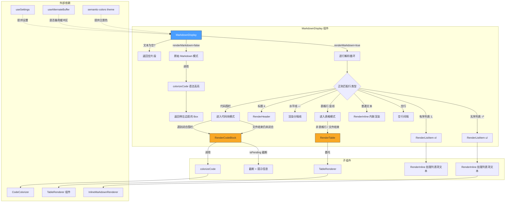

# MarkdownDisplay.tsx

## 概述

`MarkdownDisplay.tsx` 是 Gemini CLI 终端 UI 中的**核心 Markdown 渲染组件**。它接收原始 Markdown 文本，通过逐行解析将其转换为基于 [Ink](https://github.com/vadimdemedes/ink)（React for CLI）的终端可渲染组件树。该组件支持以下 Markdown 语法元素：

- 标题（H1-H4，不同层级有不同的颜色和样式）
- 代码块（围栏式，支持语法高亮和语言标识）
- 无序列表（`-`、`*`、`+` 标记）
- 有序列表（数字标记）
- 表格（带表头的 Markdown 表格）
- 水平分隔线（`---`、`***`、`___`）
- 内联 Markdown（粗体、斜体、代码、链接等，委托给 `RenderInline` 处理）
- 原始 Markdown 模式（语法高亮显示源码而非渲染）

此外，它还具备**流式渲染优化**——当内容正在生成（`isPending`）时，会智能截断超出终端高度的代码块并显示提示信息，避免终端闪烁。

**源文件路径**: `packages/cli/src/ui/utils/MarkdownDisplay.tsx`

## 架构图（Mermaid）

## 核心组件

### 1. `MarkdownDisplay`（主导出组件）

通过 `React.memo` 包装的 `MarkdownDisplayInternal`，是该模块唯一的公开导出。

#### Props 接口 `MarkdownDisplayProps`

| 属性 | 类型 | 必填 | 默认值 | 说明 |
|------|------|------|--------|------|
| `text` | `string` | 是 | - | 要渲染的原始 Markdown 文本 |
| `isPending` | `boolean` | 是 | - | 内容是否正在流式生成中 |
| `availableTerminalHeight` | `number` | 否 | `undefined` | 可用终端高度（行数），用于截断过长代码块 |
| `terminalWidth` | `number` | 是 | - | 终端宽度（列数），影响代码块和表格的渲染宽度 |
| `renderMarkdown` | `boolean` | 否 | `true` | 是否渲染 Markdown（`false` 则以语法高亮的源码形式展示） |

#### 解析逻辑

主组件使用**状态机模式**逐行处理 Markdown 文本。维护以下关键状态变量：

- `inCodeBlock` / `codeBlockContent` / `codeBlockLang` / `codeBlockFence`: 代码块解析状态
- `inTable` / `tableRows` / `tableHeaders`: 表格解析状态
- `lastLineEmpty`: 防止连续空行产生多余间距
- `contentBlocks`: 最终的 React 节点数组

使用以下正则表达式匹配不同的 Markdown 语法元素：

| 正则 | 匹配目标 |
|------|----------|
| `/^ *(#{1,4}) +(.*)/` | H1-H4 标题 |
| `` /^ *(`{3,}\|~{3,}) *(\w*?) *$/ `` | 代码围栏（反引号或波浪号） |
| `/^([ \t]*)([-*+]) +(.*)/` | 无序列表项 |
| `/^([ \t]*)(\d+)\. +(.*)/` | 有序列表项 |
| `/^ *([-*_] *){3,} *$/` | 水平分隔线 |
| `/^\s*\|(.+)\|\s*$/` | 表格行 |
| `/^\s*\|?\s*(:?-+:?)\s*(\|\s*(:?-+:?)\s*)+\|?\s*$/` | 表格分隔行 |

### 2. `RenderCodeBlock`（内部组件）

通过 `React.memo` 包装的代码块渲染组件。

#### Props 接口 `RenderCodeBlockProps`

| 属性 | 类型 | 说明 |
|------|------|------|
| `content` | `string[]` | 代码块的行数组 |
| `lang` | `string \| null` | 代码语言标识符 |
| `isPending` | `boolean` | 是否正在生成中 |
| `availableTerminalHeight` | `number?` | 可用终端高度 |
| `terminalWidth` | `number` | 终端宽度 |

#### 流式截断逻辑

当同时满足以下条件时，触发智能截断：
1. **不在** 备用缓冲区（alternate buffer）模式
2. 内容正在生成（`isPending === true`）
3. `availableTerminalHeight` 有定义
4. 代码行数超过 `availableTerminalHeight - 2`（2行预留给提示信息）

截断后显示 `"... generating more ..."` 提示。若可用空间连1行都不够，则显示 `"... code is being written ..."`。

### 3. `RenderListItem`（内部组件）

通过 `React.memo` 包装的列表项渲染组件。

#### Props 接口 `RenderListItemProps`

| 属性 | 类型 | 说明 |
|------|------|------|
| `itemText` | `string` | 列表项文本内容 |
| `type` | `'ul' \| 'ol'` | 无序或有序列表 |
| `marker` | `string` | 列表标记符号（`-`/`*`/`+` 或数字） |
| `leadingWhitespace` | `string` | 前导空白（用于嵌套缩进） |

布局采用 Flexbox 行布局：固定宽度的标记前缀 + 弹性增长的文本区域。

### 4. `RenderTable`（内部组件）

通过 `React.memo` 包装的表格渲染组件，本质上是对外部 `TableRenderer` 组件的简单委托包装。

### 5. 常量定义

| 常量 | 值 | 说明 |
|------|-----|------|
| `EMPTY_LINE_HEIGHT` | 1 | 空行间隔的高度 |
| `CODE_BLOCK_PREFIX_PADDING` | 1 | 代码块左侧内边距 |
| `LIST_ITEM_PREFIX_PADDING` | 1 | 列表项左侧内边距 |
| `LIST_ITEM_TEXT_FLEX_GROW` | 1 | 列表项文本区域的弹性增长系数 |

## 依赖关系

### 内部依赖

| 模块 | 导入 | 用途 |
|------|------|------|
| `../semantic-colors.js` | `theme` | 提供语义化颜色主题（标题色、响应文本色、次要色等） |
| `./CodeColorizer.js` | `colorizeCode` | 代码块和原始 Markdown 的语法高亮着色 |
| `./TableRenderer.js` | `TableRenderer` | Markdown 表格的终端渲染 |
| `./InlineMarkdownRenderer.js` | `RenderInline` | 内联 Markdown 语法渲染（粗体、斜体、代码、链接等） |
| `../contexts/SettingsContext.js` | `useSettings` | 获取用户设置（影响代码高亮等行为） |
| `../hooks/useAlternateBuffer.js` | `useAlternateBuffer` | 判断是否在备用缓冲区模式下运行 |

### 外部依赖

| 库 | 导入 | 用途 |
|----|------|------|
| `react` | `React` | React 框架核心（JSX、memo、FC） |
| `ink` | `Text`, `Box` | 终端 UI 渲染原语（Ink 框架） |

## 关键实现细节

1. **逐行状态机解析器**: 解析器并非使用完整的 AST 解析库（如 `marked` 或 `remark`），而是采用自定义的逐行正则匹配状态机。这种设计的优点是：
   - 轻量级，无需额外的 Markdown 解析器依赖
   - 适合流式渲染场景（文本可能不完整）
   - 可精确控制每种元素的终端渲染样式

2. **代码围栏匹配规则**: 闭合围栏必须以相同字符（反引号或波浪号）开头，且长度不少于开启围栏。这符合 CommonMark 规范。

3. **表格检测的前瞻机制**: 表格的识别需要"前瞻"——当检测到可能的表头行时，会检查下一行是否为分隔行（如 `|---|---|`），只有确认后才进入表格模式。这避免了将普通包含 `|` 的文本误识别为表格。

4. **连续空行合并**: 通过 `lastLineEmpty` 标志实现——只有在上一行不是空行时才插入空行间隔，防止多个连续空行产生过大的视觉间距。

5. **未闭合代码块处理**: 如果遍历完所有行后 `inCodeBlock` 仍为 `true`（代码块未闭合），仍然会渲染已收集的代码内容。这在流式输出场景中至关重要——LLM 可能还在生成代码块的结尾部分。

6. **备用缓冲区模式**: 当在备用缓冲区（alternate buffer）中运行时，不进行高度截断（`availableTerminalHeight` 传 `undefined`），因为备用缓冲区有自己的滚动机制，不会导致闪烁问题。

7. **React.memo 性能优化**: 所有子组件（`RenderCodeBlock`、`RenderListItem`、`RenderTable`）和主组件都使用 `React.memo` 包装，避免在 props 未变化时的不必要重渲染。这在流式输出场景下尤为重要，因为文本会频繁更新。

8. **标题层级样式区分**:
   - **H1/H2**: 粗体 + 链接色（`theme.text.link`）
   - **H3**: 粗体 + 响应色（`theme.text.response`）
   - **H4**: 斜体 + 次要色（`theme.text.secondary`）
   - **其他**: 响应色普通文本

9. **列表项缩进**: 通过 `leadingWhitespace.length` 计算缩进深度，支持嵌套列表的可视化层级展示。

10. **表格列数对齐**: 当数据行的列数与表头不匹配时，会自动补充空字符串或截断多余列，确保表格渲染的稳定性。
