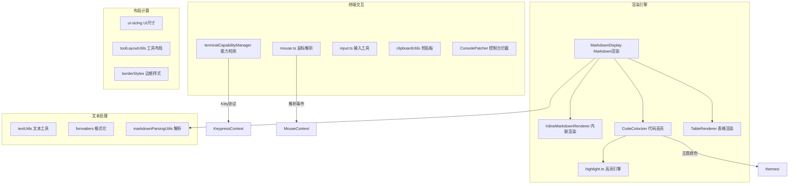

# utils

## 概述

`utils` 目录包含 UI 层的工具函数和辅助模块。这些模块提供了 Markdown 渲染、代码高亮、表格渲染、ANSI 处理、剪贴板操作、边框样式、终端能力检测、文本处理、鼠标事件解析等基础能力，是上层组件和 hooks 的基础支撑。

## 目录结构

```
utils/
├── MarkdownDisplay.tsx           # Markdown 到终端的渲染组件
├── InlineMarkdownRenderer.tsx    # 内联 Markdown 渲染（粗体、斜体、链接等）
├── CodeColorizer.tsx             # 代码语法高亮组件
├── TableRenderer.tsx             # 表格渲染组件
│
├── ConsolePatcher.ts             # console.log/warn/error 拦截和重定向
├── clipboardUtils.ts             # 剪贴板读写（支持 OSC 52 和 clipboardy）
├── borderStyles.ts               # 边框样式定义（圆角、普通等）
│
├── terminalCapabilityManager.ts  # 终端能力检测管理器（Kitty协议、OSC等）
├── terminalSetup.ts              # 终端初始化设置
├── terminalUtils.ts              # 终端工具函数
│
├── mouse.ts                      # 鼠标事件解析（SGR/X11 模式）
├── input.ts                      # 输入工具（ESC 常量、字符判断等）
│
├── textUtils.ts                  # 文本处理（截断、对齐、宽度计算）
├── textOutput.ts                 # 文本输出格式化
├── displayUtils.ts               # 显示工具函数
├── formatters.ts                 # 数字/时间格式化
│
├── highlight.ts                  # 代码高亮引擎封装
├── markdownParsingUtils.ts       # Markdown 解析工具
├── markdownUtilities.ts          # Markdown 通用工具
│
├── commandUtils.ts               # 命令工具（斜杠命令检测等）
├── computeStats.ts               # 统计计算
├── confirmingTool.ts             # 工具确认状态管理
├── contextUsage.ts               # 上下文使用量计算
├── directoryUtils.ts             # 目录路径工具
├── editorUtils.ts                # 编辑器工具
├── historyUtils.ts               # 历史记录工具（工具调用状态检查等）
├── historyExportUtils.ts         # 历史导出工具
├── inlineThinkingMode.ts         # 内联思考模式
├── isNarrowWidth.ts              # 窄宽度检测
│
├── pendingAttentionNotification.ts # 待处理注意通知
├── rewindFileOps.ts              # 文件操作回退
├── shortcutsHelp.ts              # 快捷键帮助文本生成
├── toolLayoutUtils.ts            # 工具布局计算
├── ui-sizing.ts                  # UI 尺寸计算
├── updateCheck.ts                # 版本更新检查
├── urlSecurityUtils.ts           # URL 安全验证
└── __snapshots__/                # 测试快照
```

## 架构图



## 核心组件

### Markdown 渲染系统

| 模块 | 职责 |
|------|------|
| `MarkdownDisplay` | 将 Markdown 文本渲染为 Ink 组件树，支持标题、列表、代码块、链接、引用等 |
| `InlineMarkdownRenderer` | 处理内联 Markdown（粗体、斜体、代码、链接等） |
| `CodeColorizer` | 基于 highlight.js 的代码语法高亮，将高亮结果转为带颜色的 Ink Text 组件 |
| `TableRenderer` | Markdown 表格的终端渲染，自动计算列宽 |
| `highlight.ts` | highlight.js 引擎封装，预注册常用语言 |

### 终端能力检测

| 模块 | 职责 |
|------|------|
| `terminalCapabilityManager` | 检测并启用终端特性：Kitty 键盘协议、鼠标事件、OSC 52 剪贴板、终端背景色查询 |
| `terminalSetup` | 终端初始化（交替缓冲区、行包装、鼠标事件等） |

### 鼠标和输入

| 模块 | 职责 |
|------|------|
| `mouse.ts` | 解析 SGR 和 X11 鼠标事件序列，支持点击、拖拽、滚轮、双击检测 |
| `input.ts` | ESC 字符常量、可打印字符判断等基础输入工具 |
| `clipboardUtils.ts` | 剪贴板操作，支持 OSC 52 协议（通过终端）和 `clipboardy`（系统剪贴板） |

### 控制台拦截

| 模块 | 职责 |
|------|------|
| `ConsolePatcher` | 拦截 `console.log/warn/error` 调用，将输出重定向到事件系统以在 UI 中展示 |

### 布局和样式

| 模块 | 职责 |
|------|------|
| `borderStyles` | 终端边框字符定义（圆角 `╭╮╰╯`、普通 `┌┐└┘` 等） |
| `ui-sizing` | 计算主区域宽度、控件高度等 |
| `toolLayoutUtils` | 工具结果展示的布局计算（最大高度、溢出处理等） |

### 文本工具

| 模块 | 职责 |
|------|------|
| `textUtils` | 文本截断、宽度计算（处理中文宽字符）、对齐 |
| `formatters` | 数字千分位、时间格式化（如 "2m 30s"）、百分比等 |

## 依赖关系

### 内部依赖
- `../themes/`: 主题颜色（代码高亮、边框、背景等）
- `../constants.ts`: UI 常量
- `@google/gemini-cli-core`: debugLogger、事件系统

### 外部依赖
- `lowlight`: 代码高亮引擎（highlight.js 的轻量版）
- `highlight.js`: 语言定义
- `string-width`: Unicode 字符宽度计算
- `strip-ansi`: 去除 ANSI 转义序列
- `ansi-escapes`: ANSI 转义序列生成
- `clipboardy`: 系统剪贴板操作
- `ink`: 终端渲染

## 数据流

### Markdown 渲染流程
1. Gemini 返回 Markdown 文本
2. `MarkdownDisplay` 使用 `markdownParsingUtils` 解析 Markdown AST
3. 遍历 AST 节点：
   - 代码块 -> `CodeColorizer` -> `highlight.ts` 高亮 -> 带颜色的 Text 组件
   - 表格 -> `TableRenderer` -> 自动列宽计算 -> Box 网格布局
   - 内联元素 -> `InlineMarkdownRenderer` -> 粗体/斜体/代码/链接等
   - 标题/列表/引用 -> 对应的 Ink 布局组件
4. 返回组件树交给 Ink 渲染

### 终端能力检测流程
1. 启动时 `terminalCapabilityManager` 发送探测序列到终端
2. 检测 Kitty 键盘协议支持
3. 检测 OSC 52 剪贴板支持
4. 通过 OSC 11 查询终端背景色
5. 结果缓存并传递给相关模块（KeypressContext、ThemeManager 等）
