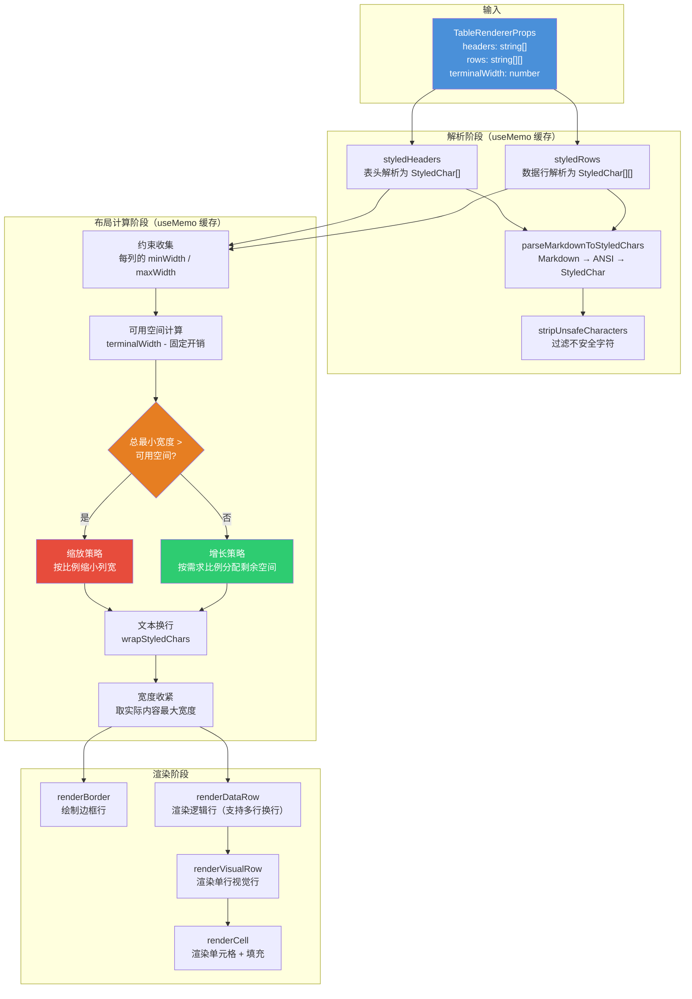
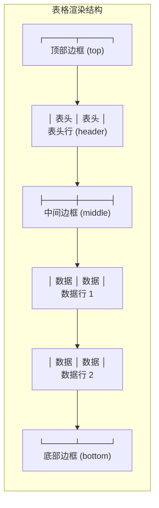

# TableRenderer.tsx

## 概述

`TableRenderer.tsx` 是 Gemini CLI 的**自定义终端表格渲染组件**，基于 React（Ink 框架）实现。由于 `ink-table` 第三方库存在模块兼容性问题，项目自行实现了这个表格渲染器。

该组件的核心能力包括：
- **Markdown 解析**：单元格内容支持 Markdown 格式（如粗体、斜体、链接等），自动转换为 ANSI 样式字符。
- **自适应列宽**：根据终端宽度和内容自动计算最优列宽，支持按比例缩放和增长分配。
- **文本自动换行**：在列宽受限时自动换行（word-break），保持可读性。
- **Unicode 边框**：使用 Box Drawing 字符（如 `┌─┬─┐`）绘制精美的表格边框。
- **缓存优化**：通过 `useMemo` 缓存样式化字符解析和布局计算结果，避免不必要的重复计算。

## 架构图（Mermaid）





## 核心组件

### 1. 接口与常量

#### `TableRendererProps`

```typescript
interface TableRendererProps {
  headers: string[];      // 表头文本数组
  rows: string[][];       // 数据行二维数组
  terminalWidth: number;  // 终端宽度（字符数）
}
```

#### `ProcessedLine`

```typescript
interface ProcessedLine {
  text: string;   // 已渲染的文本（含 ANSI 转义码）
  width: number;  // 显示宽度（不含 ANSI 码的可见字符宽度）
}
```

缓存了文本和宽度，避免重复解析。

#### 常量

| 常量 | 值 | 说明 |
|------|---|------|
| `MIN_COLUMN_WIDTH` | 5 | 列的最小宽度阈值，宽度不超过此值的列在缩放时保持不变 |
| `COLUMN_PADDING` | 2 | 每列两侧的内边距（左右各 1 字符） |
| `TABLE_MARGIN` | 2 | 表格整体的外边距 |

### 2. 辅助函数 `parseMarkdownToStyledChars`

```typescript
const parseMarkdownToStyledChars = (text: string, defaultColor?: string): StyledChar[]
```

将 Markdown 文本转换为 `StyledChar` 数组的两步管道：
1. `parseMarkdownToANSI`：Markdown 文本 → ANSI 转义序列字符串。
2. `toStyledCharacters`：ANSI 字符串 → `StyledChar[]`（Ink 的结构化样式字符数组）。

这种两步转换确保了字符宽度计算的准确性——Markdown 标记（如 `**`、`_`）被移除，样式信息被内化到每个字符对象中。

### 3. 辅助函数 `calculateWidths`

```typescript
const calculateWidths = (styledChars: StyledChar[]) =>
  { contentWidth: number, maxWordWidth: number }
```

计算一段 StyledChar 的两个关键宽度指标：
- `contentWidth`：内容的总显示宽度。
- `maxWordWidth`：最长单词的宽度（用于确定换行时的最小列宽）。

### 4. 主组件 `TableRenderer`

React 函数组件，整体流程分为三个阶段：

#### 阶段一：解析（两个 `useMemo`）

- **`styledHeaders`**：将表头字符串数组解析为 `StyledChar[][]`，使用 `theme.text.link` 颜色。
- **`styledRows`**：将数据行二维数组解析为 `StyledChar[][][]`，使用 `theme.text.primary` 颜色。
- 解析前均调用 `stripUnsafeCharacters` 过滤不安全字符。

#### 阶段二：布局计算（核心 `useMemo`）

**约束收集：** 遍历每一列，计算 `minWidth`（最大单词宽度）和 `maxWidth`（最大内容宽度）。

**可用空间计算：**
```
availableWidth = terminalWidth - (numColumns + 1) - numColumns * 2 - 2
                                 └─ 边框数量 ─┘   └─ 内边距 ─┘  └─ 外边距
```

**列宽分配算法（两种策略）：**

| 场景 | 策略 | 详细逻辑 |
|------|------|----------|
| 总最小宽度 > 可用空间 | **缩放策略** | 保持极短列（maxWidth <= 5）不缩放，其余列按比例缩小 |
| 总最小宽度 <= 可用空间 | **增长策略** | 按各列"增长需求"（maxWidth - minWidth）的比例分配剩余空间 |

**文本换行与宽度收紧：** 分配列宽后，对每个单元格执行 `wrapStyledChars` 换行，然后取实际渲染后的最大行宽作为最终列宽（`adjustedWidths`），避免浪费空间。

#### 阶段三：渲染

由四个渲染辅助函数组成：

| 函数 | 职责 |
|------|------|
| `renderCell` | 渲染单个单元格：内容 + 右侧空白填充，表头使用粗体和链接颜色 |
| `renderBorder` | 渲染边框行（top/middle/bottom），使用 Unicode Box Drawing 字符 |
| `renderVisualRow` | 渲染一行视觉行（单行），用 `│` 分隔各单元格 |
| `renderDataRow` | 渲染一行逻辑行（可能包含多行视觉行，因为单元格内换行） |

**最终 JSX 结构：**
```
Box (flexDirection="column", marginY=1)
  ├── 顶部边框 (top)
  ├── 表头行 (header, rowIndex=-1)
  ├── 中间边框 (middle)
  ├── 数据行 1..N
  └── 底部边框 (bottom)
```

## 依赖关系

### 内部依赖

| 模块 | 导入内容 | 用途 |
|------|----------|------|
| `../semantic-colors.js` | `theme` | 语义化颜色主题，提供 `text.link`、`text.primary`、`border.default` 等颜色值 |
| `./markdownParsingUtils.js` | `parseMarkdownToANSI` | Markdown 转 ANSI 转义序列 |
| `./textUtils.js` | `stripUnsafeCharacters` | 过滤不安全/不可打印字符 |

### 外部依赖

| 包 | 导入内容 | 用途 |
|---|----------|------|
| `react` | `React`, `useMemo` | React 框架核心，函数组件和缓存优化 |
| `@alcalzone/ansi-tokenize` | `styledCharsToString` | 将 StyledChar 数组转回包含 ANSI 转义码的字符串 |
| `ink` | `Text`, `Box`, `StyledChar`, `toStyledCharacters`, `styledCharsWidth`, `wordBreakStyledChars`, `wrapStyledChars`, `widestLineFromStyledChars` | Ink 终端 UI 框架：组件、样式字符处理和文本布局工具函数 |

## 关键实现细节

1. **列宽分配的双策略设计**：当终端宽度不足以容纳所有列的最小宽度时，采用缩放策略按比例缩小；宽度充裕时，采用增长策略按需分配剩余空间。这种设计确保表格在各种终端宽度下都能良好展示。

2. **极短列保护**：在缩放策略中，`maxWidth <= MIN_COLUMN_WIDTH`（5 个字符）的列不参与缩放，保持其原始最小宽度。这避免了极短列被进一步压缩到不可读的程度。但如果极短列的总宽度已经超过可用空间，则放弃保护（`finalTotalShortColumnWidth` 置为 0）。

3. **宽度收紧优化**：布局计算的最后一步会用实际渲染后的最大行宽替换分配的列宽。这意味着如果分配了 20 字符宽度但实际内容换行后最宽只有 15 字符，最终列宽会收紧为 15 + COLUMN_PADDING，避免不必要的空白。

4. **多行单元格处理**：`renderDataRow` 通过计算 `maxHeight`（该行所有单元格换行后的最大行数）来确定逻辑行的视觉高度。不足最大高度的单元格用空白行填充（`{ text: '', width: 0 }`），确保行对齐。

5. **三层 `useMemo` 缓存**：
   - 第一层：表头解析（依赖 `headers`）
   - 第二层：数据行解析（依赖 `rows`）
   - 第三层：布局计算（依赖 `styledHeaders`、`styledRows`、`terminalWidth`）

   这种分层缓存确保了当只有 `terminalWidth` 变化时，不需要重新解析 Markdown。

6. **边框字符映射**：使用对象字面量 `chars` 存储三种边框类型（top/middle/bottom）的四种字符（left/middle/right/horizontal），通过索引访问简化了边框渲染逻辑。

7. **为什么不用 `ink-table`**：代码注释明确说明了原因——"module compatibility issues"（模块兼容性问题）。自定义实现不仅解决了兼容性问题，还提供了更灵活的 Markdown 支持和自适应布局能力。
