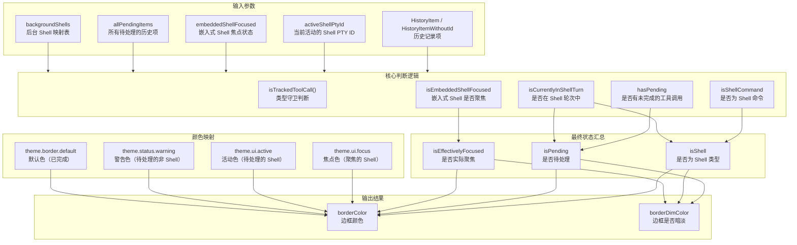

# borderStyles.ts

## 概述

`borderStyles.ts` 是 Gemini CLI UI 层的一个工具模块，专门负责计算工具调用分组（tool group）消息的**边框颜色和边框暗淡状态**。在 CLI 的交互界面中，当 AI 模型调用工具（如 Shell 命令、文件操作等）时，这些工具调用会被分组展示，并使用不同颜色的边框来反映当前的执行状态。

该模块核心导出了一个函数 `getToolGroupBorderAppearance`，根据以下因素动态决定边框样式：
- 工具调用的执行状态（待处理、执行中、完成、错误、已取消）
- 是否为 Shell 命令工具
- 嵌入式 Shell 是否处于焦点状态
- 当前活动的 Shell PTY 信息
- 后台 Shell 状态

## 架构图（Mermaid）



## 核心组件

### 1. `isTrackedToolCall` 类型守卫函数

```typescript
function isTrackedToolCall(
  tool: IndividualToolCallDisplay | TrackedToolCall,
): tool is TrackedToolCall {
  return 'request' in tool;
}
```

私有类型守卫函数，用于区分两种不同的工具调用数据结构：
- **`TrackedToolCall`**：来自 `useToolScheduler` hook，包含 `request` 属性、`status` 为字符串字面量（`'executing'`、`'success'` 等）、`pid` 属性
- **`IndividualToolCallDisplay`**：来自历史记录类型，包含 `name` 属性、`status` 为 `CoreToolCallStatus` 枚举值、`ptyId` 属性

### 2. `getToolGroupBorderAppearance` 函数

这是模块唯一的导出函数，签名如下：

```typescript
export function getToolGroupBorderAppearance(
  item: HistoryItem | HistoryItemWithoutId | { type: 'tool_group'; tools: TrackedToolCall[] },
  activeShellPtyId: number | null | undefined,
  embeddedShellFocused: boolean | undefined,
  allPendingItems: HistoryItemWithoutId[] = [],
  backgroundShells: Map<number, BackgroundShell> = new Map(),
): { borderColor: string; borderDimColor: boolean }
```

#### 参数说明

| 参数 | 类型 | 说明 |
|---|---|---|
| `item` | 联合类型 | 当前要渲染的历史记录项 |
| `activeShellPtyId` | `number \| null \| undefined` | 当前活动的 Shell PTY 进程 ID |
| `embeddedShellFocused` | `boolean \| undefined` | 嵌入式 Shell 面板是否获得焦点 |
| `allPendingItems` | `HistoryItemWithoutId[]` | 所有待处理的历史项（默认空数组） |
| `backgroundShells` | `Map<number, BackgroundShell>` | 后台运行的 Shell 进程映射（默认空 Map） |

#### 返回值

```typescript
{ borderColor: string; borderDimColor: boolean }
```

- `borderColor`：边框颜色字符串
- `borderDimColor`：边框是否应用暗淡效果

#### 执行逻辑详解

**第一步：前置检查**
- 如果 `item.type` 不是 `'tool_group'`，直接返回 `{ borderColor: '', borderDimColor: false }`

**第二步：确定待检查的工具列表**
- 如果当前项有工具 (`item.tools.length > 0`)，直接使用它们
- 否则（说明是当前批次的关闭切片），从 `allPendingItems` 中取最后一个有工具的 tool_group 的工具列表

**第三步：计算各类状态标记**

1. **`hasPending`**：是否存在未完成的工具调用（状态不是 success/error/cancelled）
2. **`isEmbeddedShellFocused`**：是否有正在执行的 Shell 工具且其 PTY 与活动 Shell 匹配且嵌入 Shell 已聚焦
3. **`isShellCommand`**：工具列表中是否包含 Shell 工具
4. **`isCurrentlyInShellTurn`**：是否存在活动的 PTY ID 且该 PTY 不是后台 Shell

**第四步：汇总最终状态**
- `isShell = isShellCommand || (无工具 && 在 Shell 轮次中)`
- `isPending = hasPending || (无工具 && 在 Shell 轮次中)`
- `isEffectivelyFocused = isEmbeddedShellFocused || (无工具 && 在 Shell 轮次中 && 嵌入 Shell 已聚焦)`

**第五步：决定边框颜色**

优先级从高到低：

| 条件 | 边框颜色 | 含义 |
|---|---|---|
| `isEffectivelyFocused` | `theme.ui.focus` | 用户正在聚焦交互的 Shell |
| `isShell && isPending` | `theme.ui.active` | Shell 命令正在执行 |
| `isPending` | `theme.status.warning` | 非 Shell 工具正在执行 |
| 默认 | `theme.border.default` | 所有工具已完成 |

**第六步：决定暗淡状态**
```typescript
borderDimColor = isPending && (!isShell || !isEffectivelyFocused);
```
含义：待处理中的工具边框暗淡，除非是已聚焦的 Shell 命令。

## 依赖关系

### 内部依赖

| 模块 | 导入内容 | 用途 |
|---|---|---|
| `@google/gemini-cli-core` | `CoreToolCallStatus` | 工具调用状态枚举（`Success`, `Error`, `Cancelled`, `Executing`） |
| `../components/messages/ToolShared.js` | `isShellTool` | 判断工具名称是否为 Shell 类型工具 |
| `../semantic-colors.js` | `theme` | 语义颜色主题对象（包含 `ui.focus`、`ui.active`、`status.warning`、`border.default`） |
| `../types.js` | `HistoryItem`, `HistoryItemWithoutId`, `HistoryItemToolGroup`, `IndividualToolCallDisplay` | 历史记录相关类型定义 |
| `../hooks/shellReducer.js` | `BackgroundShell` | 后台 Shell 类型定义 |
| `../hooks/useToolScheduler.js` | `TrackedToolCall` | 工具调度器中跟踪的工具调用类型 |

### 外部依赖

无外部第三方依赖。

## 关键实现细节

### 1. 空工具列表的处理

当 `item.tools` 为空时（`item.tools.length === 0`），表示这是当前批次的"关闭切片"。此时会回溯 `allPendingItems`，找到最后一个包含工具的 `tool_group` 项的工具列表，以此确定该批次整体的视觉外观。这种设计确保了批次的最后一个渲染帧仍能正确显示状态。

### 2. 双数据结构兼容

由于工具调用数据在不同上下文中有两种表示形式（`TrackedToolCall` 用于实时调度、`IndividualToolCallDisplay` 用于历史记录），每个状态检查都通过 `isTrackedToolCall` 类型守卫进行分支处理，访问各自对应的属性和状态枚举。

### 3. 后台 Shell 排除

`isCurrentlyInShellTurn` 判断中特意排除了后台 Shell（`!backgroundShells.has(activeShellPtyId)`），确保后台 Shell 的执行不会影响前台 UI 的边框样式。

### 4. 焦点状态的传递

`isEffectivelyFocused` 的设计兼顾了两种场景：
- 直接聚焦：某个工具调用的 PTY 恰好是活动的 Shell 且嵌入 Shell 已聚焦
- 间接聚焦：空工具列表项在 Shell 轮次中且嵌入 Shell 已聚焦（延续上一批次的状态）
