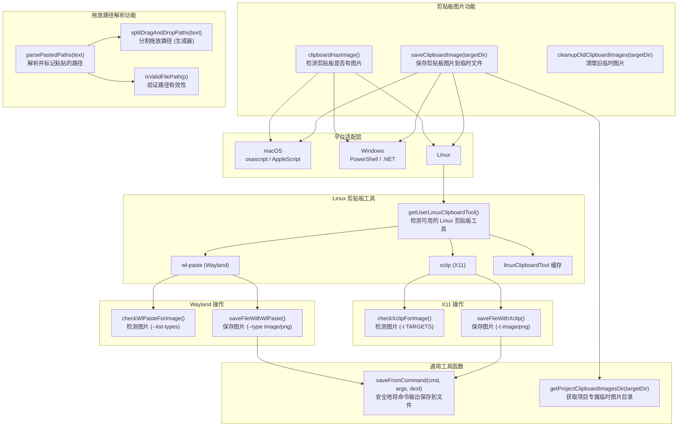

# clipboardUtils.ts

## 概述

`clipboardUtils.ts` 是 Gemini CLI 的跨平台剪贴板工具模块，提供了完整的剪贴板图片处理和文件路径拖放解析功能。它是 CLI 支持多模态输入（文本 + 图片）的关键基础设施。

主要功能分为两大类：

### 1. 剪贴板图片处理
- **检测**：判断系统剪贴板是否包含图片内容
- **保存**：将剪贴板中的图片保存为临时文件
- **清理**：自动清理超过 1 小时的旧临时图片文件

跨平台支持：
- **macOS**：通过 `osascript`（AppleScript）操作剪贴板
- **Windows**：通过 `powershell` 调用 .NET 的 `System.Windows.Forms.Clipboard`
- **Linux (Wayland)**：通过 `wl-paste` 工具
- **Linux (X11)**：通过 `xclip` 工具

### 2. 文件路径拖放解析
- 解析用户拖拽文件到终端时产生的各种格式的路径字符串
- 支持裸路径、双引号包裹、单引号包裹、反斜杠转义等多种格式
- 验证路径有效性并添加 `@` 前缀标记

## 架构图（Mermaid）



## 核心组件

### 1. 常量与模块级变量

#### `IMAGE_EXTENSIONS`
```typescript
export const IMAGE_EXTENSIONS = ['.png', '.jpg', '.jpeg', '.webp', '.heic', '.heif'];
```
Gemini API 支持的图片文件扩展名列表。

#### `PATH_PREFIX_PATTERN`
```typescript
const PATH_PREFIX_PATTERN = /^([/~.]|[a-zA-Z]:|\\\\)/;
```
匹配路径前缀的正则表达式，支持：
- `/` - Unix 绝对路径
- `~` - 用户主目录
- `.` - 相对路径
- `X:` - Windows 驱动器号
- `\\` - UNC 路径

#### `linuxClipboardTool`
模块级缓存变量，记录 Linux 系统上可用的剪贴板工具名称（`'wl-paste'` 或 `'xclip'`），避免重复检测。

### 2. Linux 剪贴板工具检测

#### `getUserLinuxClipboardTool()`

检测当前 Linux 系统使用的显示服务器及对应的剪贴板工具：

| 显示服务器 (`XDG_SESSION_TYPE`) | 剪贴板工具 |
|---|---|
| `wayland` | `wl-paste` |
| `x11` | `xclip` |
| 其他 | `null`（不支持） |

通过 `execSync('command -v <tool>')` 检查工具是否已安装，结果缓存在 `linuxClipboardTool` 模块变量中。

### 3. 命令输出保存工具

#### `saveFromCommand(command, args, destination): Promise<boolean>`

安全地将外部命令的 stdout 保存到文件。使用 `spawn` 而非 `exec` 来防止 Shell 注入攻击。

关键设计：
- 使用 `child.stdout.pipe(fileStream)` 实现流式传输
- 通过 `safeResolve` 函数确保 Promise 只 resolve 一次，防止竞态条件
- 在命令关闭后检查输出文件大小，确保文件有实际内容
- 处理 `fileStream` 可能尚未完成写入的情况（监听 `finish` 和 `close` 事件）

### 4. 剪贴板图片检测函数

#### `clipboardHasImage(): Promise<boolean>`

跨平台检测剪贴板是否包含图片。

**macOS 实现**：
```
osascript -e 'clipboard info'
```
检查输出中是否包含 `PNGf`、`TIFF picture`、`JPEG picture`、`GIF picture` 等关键字。

**Windows 实现**：
```powershell
[System.Windows.Forms.Clipboard]::ContainsImage()
```
检查输出是否为 `"True"`。

**Linux (Wayland) 实现**：
```
wl-paste --list-types
```
检查输出是否包含 `image/`。

**Linux (X11) 实现**：
```
xclip -selection clipboard -t TARGETS -o
```
检查输出是否包含 `image/`。

### 5. 剪贴板图片保存函数

#### `saveClipboardImage(targetDir): Promise<string | null>`

将剪贴板中的图片保存为临时文件，返回保存的文件路径，失败返回 `null`。

**文件命名**：`clipboard-{timestamp}.{ext}`（使用时间戳确保唯一性）

**存储位置**：通过 `getProjectClipboardImagesDir` 获取基于项目哈希的专属临时目录（避免不同项目间的路径冲突）。

各平台实现：

| 平台 | 命令 | 输出格式 |
|---|---|---|
| macOS | AppleScript（尝试 PNGf → JPEG 两种格式） | `.png` 或 `.jpg` |
| Windows | PowerShell + .NET（`Clipboard.GetImage().Save()`） | `.png` |
| Linux (Wayland) | `wl-paste --no-newline --type image/png` | `.png` |
| Linux (X11) | `xclip -selection clipboard -t image/png -o` | `.png` |

macOS 实现特色：按优先级依次尝试 PNG 和 JPEG 格式，每次失败后清理临时文件。

### 6. 临时图片清理函数

#### `cleanupOldClipboardImages(targetDir): Promise<void>`

清理超过 1 小时的旧剪贴板临时图片文件。只清理文件名以 `clipboard-` 开头且扩展名在 `IMAGE_EXTENSIONS` 列表中的文件。静默处理所有错误。

### 7. 拖放路径分割生成器

#### `splitDragAndDropPaths(text): Generator<string>`

一个 **Generator 函数**，用于将拖拽到终端的文本分割为独立的文件路径。支持四种路径格式：

| 格式 | 示例 | 平台 |
|---|---|---|
| 裸路径 | `/path/to/file.png` | 所有 |
| 双引号包裹 | `"/path/to/my file.png"` | 主要在 Windows |
| 单引号包裹 | `'/path/to/my file.png'` | 所有 |
| 反斜杠转义 | `/path/to/my\ file.png` | POSIX（非 Windows） |

**状态机实现**：使用三种模式（`NORMAL`、`DOUBLE`、`SINGLE`）逐字符解析：

- `NORMAL` 模式：空格分隔路径；双引号进入 `DOUBLE` 模式；单引号进入 `SINGLE` 模式；反斜杠转义下一字符（仅非 Windows）
- `DOUBLE` 模式：遇到双引号退回 `NORMAL` 模式，其他字符追加到当前路径
- `SINGLE` 模式：遇到单引号退回 `NORMAL` 模式，其他字符追加到当前路径

### 8. 路径验证与解析

#### `isValidFilePath(p): boolean`
验证路径是否有效：必须匹配路径前缀模式、文件必须存在、且必须是文件（非目录）。

#### `parsePastedPaths(text): string | null`
解析用户粘贴的文本。流程：
1. 先检查整个文本是否为单个有效路径
2. 否则使用 `splitDragAndDropPaths` 分割后逐一验证
3. 每个有效路径添加 `@` 前缀并使用 `escapePath` 转义
4. 如果任何一个段不是有效路径，返回 `null`（全有或全无策略）
5. 最终结果末尾追加一个空格

返回格式示例：`@/path/to/file1.png @/path/to/file2.jpg `

## 依赖关系

### 内部依赖

| 模块 | 导入内容 | 用途 |
|---|---|---|
| `@google/gemini-cli-core` | `debugLogger` | 调试日志输出 |
| `@google/gemini-cli-core` | `spawnAsync` | 异步执行外部命令并获取 stdout |
| `@google/gemini-cli-core` | `escapePath` | 路径转义（用于生成 `@path` 格式的引用） |
| `@google/gemini-cli-core` | `Storage` | 存储管理类（获取项目专属临时目录） |

### 外部依赖

| 模块 | 用途 |
|---|---|
| `node:fs/promises` | 异步文件操作（mkdir, stat, readdir, unlink） |
| `node:fs` | 同步文件操作（createWriteStream, existsSync, statSync） |
| `node:child_process` | 进程管理（execSync 检查命令、spawn 执行剪贴板工具） |
| `node:path` | 路径处理（join, extname） |

### 系统命令依赖

| 命令 | 平台 | 用途 |
|---|---|---|
| `osascript` | macOS | 通过 AppleScript 操作剪贴板 |
| `powershell` | Windows | 通过 .NET 框架操作剪贴板 |
| `wl-paste` | Linux (Wayland) | Wayland 剪贴板工具 |
| `xclip` | Linux (X11) | X11 剪贴板工具 |

## 关键实现细节

### 1. 安全性：防止 Shell 注入

`saveFromCommand` 使用 `spawn` 而非 `exec`，直接传递参数数组而非拼接命令字符串，有效防止 Shell 注入攻击。Windows 平台的 PowerShell 脚本中，文件路径通过 `replace(/'/g, "''")` 转义单引号。

### 2. 竞态条件防护

`saveFromCommand` 中的 `safeResolve` 函数使用 `resolved` 布尔标志确保 Promise 只被 resolve 一次。这防止了以下竞态场景：
- `child.on('error')` 和 `fileStream.on('error')` 同时触发
- `fileStream.on('finish')` 和 `fileStream.on('close')` 先后触发

### 3. Linux 工具缓存

Linux 剪贴板工具检测结果缓存在模块级变量 `linuxClipboardTool` 中，避免每次操作都执行 `command -v` 检查。注意这是惰性初始化，首次使用时才检测。

### 4. macOS 多格式回退

macOS 保存图片时依次尝试 PNG 和 JPEG 两种格式，因为不同来源的剪贴板图片可能只支持特定格式。每种格式失败后会清理临时文件。

### 5. 项目级隔离的临时目录

通过 `Storage.getProjectTempDir()` 获取基于项目路径哈希的临时目录，确保不同项目的剪贴板图片不会互相冲突，同时将文件存放在用户项目目录之外，避免污染项目文件结构。

### 6. Generator 模式的路径分割

`splitDragAndDropPaths` 使用 Generator 函数实现惰性求值，对于大量路径的情况可以按需消费，避免一次性创建大数组。配合 `parsePastedPaths` 中的 for...of 循环使用。

### 7. 全有或全无的路径验证策略

`parsePastedPaths` 对分割后的路径段采用全有或全无的验证策略：只要有任何一个段不是有效文件路径，就返回 `null`，视整个输入为普通文本而非拖放路径。这避免了将普通文本中碰巧像路径的部分误识别为文件引用。
