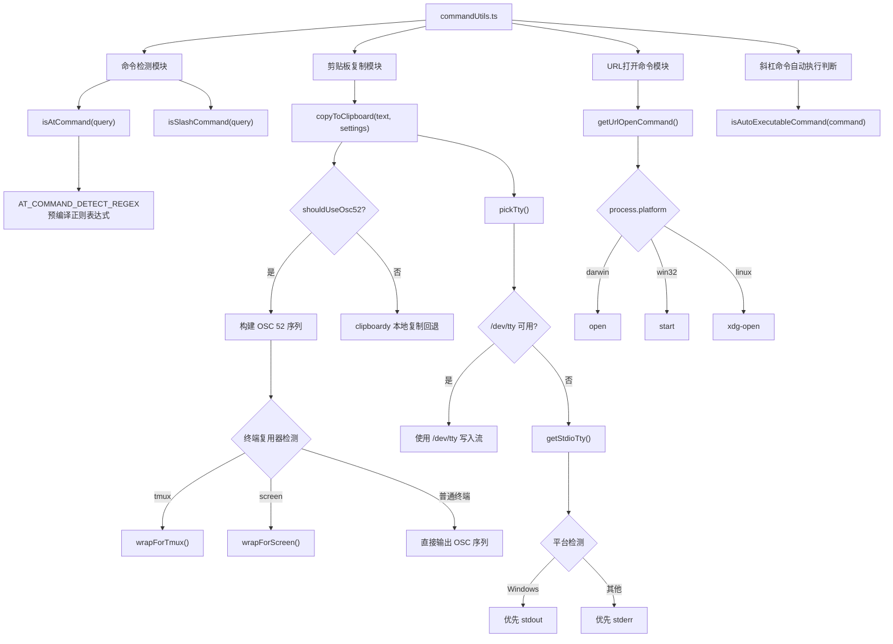

# commandUtils.ts

## 概述

`commandUtils.ts` 是 Gemini CLI 项目中的一个核心工具模块，位于 UI 工具层。该文件提供了三大类功能：

1. **命令检测**：识别用户输入是否为 `@` 命令（文件引用）或 `/` 斜杠命令。
2. **剪贴板复制**：实现了跨平台、跨终端环境（包括 SSH、WSL、tmux、screen）的剪贴板复制能力，核心采用 OSC 52 转义序列协议。
3. **URL 打开与命令自动执行判断**：提供获取操作系统对应 URL 打开命令的工具函数，以及斜杠命令自动执行的判断逻辑。

文件总计约 330 行，包含大量针对不同终端环境的适配逻辑，体现了对跨平台兼容性的重视。

## 架构图（Mermaid）

## 核心组件

### 1. 命令检测函数

#### `isAtCommand(query: string): boolean`

- **功能**：检测输入字符串中是否包含 `@<路径>` 模式的命令。
- **实现**：使用预编译的正则表达式 `AT_COMMAND_DETECT_REGEX`，该正则来源于 `AT_COMMAND_PATH_REGEX_SOURCE`，确保与 `parseAllAtCommands` 的识别逻辑保持一致。
- **特殊处理**：支持转义（`\@` 不会被识别为命令），且不关心 `@` 前面的字符（支持外部编辑器中 `:@` 或 `(@` 等形式）。

#### `isSlashCommand(query: string): boolean`

- **功能**：检测输入字符串是否为 `/` 斜杠命令。
- **排除规则**：
  - 以 `//` 开头的行注释不被识别为命令
  - 以 `/*` 开头的块注释不被识别为命令
- **返回**：仅当以单个 `/` 开头且不是注释时返回 `true`。

### 2. 剪贴板复制系统

#### `copyToClipboard(text: string, settings?: Settings): Promise<void>`

这是文件中最复杂的功能，实现了一个健壮的跨平台剪贴板复制方案。

**执行流程**：
1. 若文本为空，直接返回
2. 调用 `pickTty()` 获取可写 TTY 流
3. 判断是否应使用 OSC 52 协议（`shouldUseOsc52`）
4. 若使用 OSC 52：构建序列 -> 根据终端复用器类型包装 -> 写入 TTY
5. 若不使用 OSC 52：回退到 `clipboardy` 库进行本地复制

#### TTY 选择策略 `pickTty(): Promise<TtyTarget>`

- **Unix 系统**：优先尝试打开 `/dev/tty`（控制终端），带 100ms 超时保护，失败后回退到 stdio
- **Windows 系统**：优先使用 `stdout`（避免 PowerShell 的红色 stderr 格式化破坏转义序列）
- **非 Windows 系统**：优先使用 `stderr`（避免污染 stdout 的管道或重定向输出）

#### 环境检测函数

| 函数 | 检测环境 | 检测方法 |
|------|---------|---------|
| `inTmux()` | tmux 终端复用器 | 检查 `TMUX` 环境变量或 `TERM` 以 `tmux` 开头 |
| `inScreen()` | GNU Screen | 检查 `STY` 环境变量或 `TERM` 以 `screen` 开头 |
| `isSSH()` | SSH 远程会话 | 检查 `SSH_TTY`、`SSH_CONNECTION`、`SSH_CLIENT` |
| `isWSL()` | Windows Subsystem for Linux | 检查 `WSL_DISTRO_NAME`、`WSLENV`、`WSL_INTEROP` |
| `isWindowsTerminal()` | Windows Terminal | 检查 `WT_SESSION` 且为 `win32` 平台 |
| `isDumbTerm()` | 哑终端 | `TERM === 'dumb'` |

#### `shouldUseOsc52(tty, settings): boolean`

决定是否使用 OSC 52 的条件（需全部满足）：
1. TTY 可用（非 null）
2. 非哑终端
3. 满足以下任一条件：
   - 用户设置中启用了 `experimental.useOSC52Copy`
   - 在 SSH 环境中
   - 在 WSL 环境中
   - 在 Windows Terminal 中

#### OSC 52 协议相关

- **最大序列字节数**：`MAX_OSC52_SEQUENCE_BYTES = 100,000` 字节
- **序列格式**：`ESC]52;c;<base64数据>BEL`
- **UTF-8 安全截断**：`safeUtf8Truncate` 确保不在多字节字符中间截断
- **tmux 包装**：`wrapForTmux` 使用 DCS（`ESC P`）透传，将 ESC 字节加倍
- **screen 包装**：`wrapForScreen` 按 240 字节分块，每块用 DCS 包装

#### `writeAll(stream, data): Promise<void>`

向流中写入全部数据的 Promise 封装：
- **Windows 特殊处理**：对 stdout/stderr 使用 `fs.writeSync` 直接写入文件描述符，绕过 Ink UI 框架的流拦截
- **通用路径**：使用 `stream.write` 并监听 `drain` 和 `error` 事件

### 3. URL 打开命令

#### `getUrlOpenCommand(): string`

根据操作系统返回对应的 URL 打开命令：
- macOS：`open`
- Windows：`start`
- Linux 及其他：`xdg-open`

### 4. 斜杠命令自动执行判断

#### `isAutoExecutableCommand(command: SlashCommand | undefined | null): boolean`

- 检查斜杠命令是否设置了 `autoExecute` 标志
- 内建命令都已显式设置该标志
- 自定义命令（`.toml` 文件）和扩展命令默认为 `false`（安全默认值）

## 依赖关系

### 内部依赖

| 导入 | 来源模块 | 用途 |
|------|---------|------|
| `debugLogger` | `@google/gemini-cli-core` | 调试日志输出（在 URL 命令和 TTY 写入失败时记录警告） |
| `SlashCommand` (类型) | `../commands/types.js` | 斜杠命令的类型定义 |
| `Settings` (类型) | `../../config/settingsSchema.js` | 用户设置的类型定义（用于判断是否启用 OSC 52） |
| `AT_COMMAND_PATH_REGEX_SOURCE` | `../hooks/atCommandProcessor.js` | `@` 命令路径匹配的正则表达式源字符串 |

### 外部依赖

| 导入 | 包名 | 用途 |
|------|------|------|
| `clipboardy` | `clipboardy` | 本地剪贴板读写（作为 OSC 52 不可用时的回退方案） |
| `fs` | `node:fs` | 文件系统操作（打开 `/dev/tty`、`writeSync`） |
| `Writable` (类型) | `node:stream` | 可写流类型定义 |

## 关键实现细节

### OSC 52 转义序列协议

OSC 52 是终端操作系统命令（Operating System Command）的第 52 号，用于设置/获取终端剪贴板内容。该实现通过向终端直接写入转义序列来设置剪贴板，这在 SSH 远程会话中尤其重要，因为此时 `clipboardy` 等本地方案无法访问客户端的剪贴板。

序列格式为 `ESC ] 52 ; c ; <base64编码的文本> BEL`，其中 `c` 表示系统剪贴板。

### 终端复用器透传

- **tmux**：需要将 OSC 序列包装在 DCS（设备控制字符串）中，格式为 `ESC P tmux; <payload> ESC \`，且 payload 中的所有 `ESC` 字节需要加倍。
- **GNU Screen**：同样需要 DCS 包装，但有 240 字节的分块限制，每块独立包装。

### TTY 选择的精细策略

文件实现了一个精心设计的 TTY 选择策略：
1. 优先使用 `/dev/tty`（控制终端），因为它能避免与管道化的 stdout 产生序列交错。
2. 带有 100ms 超时保护，防止在沙箱环境中 `/dev/tty` 无响应导致挂起。
3. 打开成功后注册空的 `error` 处理器，防止后续未处理的错误事件导致进程崩溃。
4. Windows 和非 Windows 平台对 stdout/stderr 的优先级不同，各有其原因（详见上文）。

### 正则表达式复用

`isAtCommand` 使用从 `atCommandProcessor.js` 导入的 `AT_COMMAND_PATH_REGEX_SOURCE` 构建检测正则，确保命令检测逻辑与命令解析逻辑的一致性。正则包含负向后行断言 `(?<!\\)` 以支持转义 `@` 符号。

### 导出清单

| 导出函数 | 类型 |
|---------|------|
| `isAtCommand` | 具名导出 |
| `isSlashCommand` | 具名导出 |
| `copyToClipboard` | 具名导出 |
| `getUrlOpenCommand` | 具名导出 |
| `isAutoExecutableCommand` | 具名导出 |
