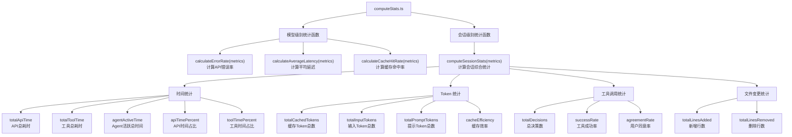
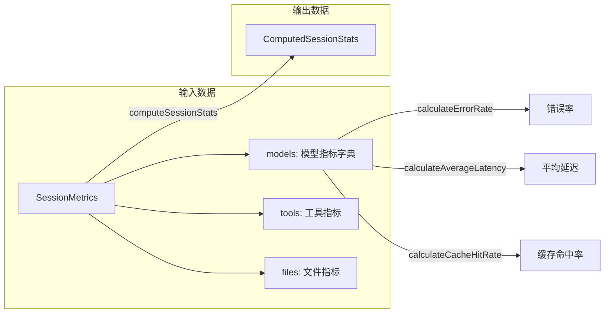

# computeStats.ts

## 概述

`computeStats.ts` 是 Gemini CLI 项目中用于计算会话统计数据的工具模块。它负责对整个用户会话期间收集的原始指标（metrics）数据进行聚合计算，生成可展示的统计摘要。

该文件包含四个导出函数，涵盖三大统计维度：
1. **模型级别统计**：单个模型的错误率、平均延迟、缓存命中率
2. **会话级别统计**：跨所有模型的综合统计，包括时间分布、Token 使用、工具调用效率等

文件总计约 95 行，逻辑清晰，是典型的纯计算型工具模块，不涉及任何副作用。

## 架构图（Mermaid）





## 核心组件

### 1. `calculateErrorRate(metrics: ModelMetrics): number`

**功能**：计算单个模型的 API 错误率（百分比）。

**计算公式**：
```
错误率 = (totalErrors / totalRequests) * 100
```

**边界处理**：当 `totalRequests === 0` 时返回 `0`，避免除零错误。

---

### 2. `calculateAverageLatency(metrics: ModelMetrics): number`

**功能**：计算单个模型的平均 API 请求延迟（毫秒）。

**计算公式**：
```
平均延迟 = totalLatencyMs / totalRequests
```

**边界处理**：当 `totalRequests === 0` 时返回 `0`。

---

### 3. `calculateCacheHitRate(metrics: ModelMetrics): number`

**功能**：计算单个模型的缓存命中率（百分比）。

**计算公式**：
```
缓存命中率 = (cached / prompt) * 100
```

**说明**：此处 `cached` 是缓存的 Token 数，`prompt` 是提示 Token 总数。当 `prompt === 0` 时返回 `0`。

---

### 4. `computeSessionStats(metrics: SessionMetrics): ComputedSessionStats`

**功能**：根据整个会话的原始指标数据，计算出一个完整的会话统计摘要。

这是文件中最核心的函数，它从 `SessionMetrics` 的三个维度（`models`、`tools`、`files`）中提取数据并进行聚合计算。

#### 时间统计

| 字段 | 计算方式 | 说明 |
|------|---------|------|
| `totalApiTime` | 所有模型的 `api.totalLatencyMs` 之和 | API 调用总耗时 |
| `totalToolTime` | `tools.totalDurationMs` | 工具执行总耗时 |
| `agentActiveTime` | `totalApiTime + totalToolTime` | Agent 活跃总时间（不含用户等待时间） |
| `apiTimePercent` | `(totalApiTime / agentActiveTime) * 100` | API 时间占活跃时间的百分比 |
| `toolTimePercent` | `(totalToolTime / agentActiveTime) * 100` | 工具时间占活跃时间的百分比 |

#### Token 统计

| 字段 | 计算方式 | 说明 |
|------|---------|------|
| `totalCachedTokens` | 所有模型的 `tokens.cached` 之和 | 跨模型的缓存 Token 总数 |
| `totalInputTokens` | 所有模型的 `tokens.input` 之和 | 跨模型的输入 Token 总数 |
| `totalPromptTokens` | 所有模型的 `tokens.prompt` 之和 | 跨模型的提示 Token 总数 |
| `cacheEfficiency` | `(totalCachedTokens / totalPromptTokens) * 100` | 缓存效率百分比 |

#### 工具调用统计

| 字段 | 计算方式 | 说明 |
|------|---------|------|
| `totalDecisions` | `accept + reject + modify + auto_accept` | 用户对工具调用的总决策次数 |
| `successRate` | `(totalSuccess / totalCalls) * 100` | 工具调用成功率 |
| `agreementRate` | `((accept + auto_accept) / totalDecisions) * 100` | 用户同意（含自动同意）率 |

#### 文件变更统计

| 字段 | 来源 | 说明 |
|------|------|------|
| `totalLinesAdded` | `files.totalLinesAdded` | 会话中新增的代码行数 |
| `totalLinesRemoved` | `files.totalLinesRemoved` | 会话中删除的代码行数 |

## 依赖关系

### 内部依赖

| 导入 | 来源模块 | 用途 |
|------|---------|------|
| `SessionMetrics` (类型) | `../contexts/SessionContext.js` | 会话原始指标数据的类型定义 |
| `ComputedSessionStats` (类型) | `../contexts/SessionContext.js` | 计算后的会话统计数据的类型定义 |
| `ModelMetrics` (类型) | `../contexts/SessionContext.js` | 单个模型指标数据的类型定义 |

### 外部依赖

无外部第三方依赖。本文件为纯计算模块，仅依赖 TypeScript 内建类型和内部类型定义。

## 关键实现细节

### 纯函数设计

所有四个函数都是纯函数，无副作用，仅依赖输入参数进行计算并返回结果。这使得函数易于测试和复用。

### 除零保护

每个涉及除法运算的函数都在计算前检查分母是否为零：
- `calculateErrorRate`：检查 `totalRequests === 0`
- `calculateAverageLatency`：检查 `totalRequests === 0`
- `calculateCacheHitRate`：检查 `prompt === 0`
- `computeSessionStats` 中：检查 `agentActiveTime > 0`、`totalPromptTokens > 0`、`totalCalls > 0`、`totalDecisions > 0`

### 跨模型聚合

`computeSessionStats` 使用 `Object.values(models).reduce(...)` 模式对模型字典中所有模型的指标进行聚合求和，支持多模型场景下的统计。

### 同意率的定义

`agreementRate`（同意率）将 `accept`（用户手动同意）和 `auto_accept`（自动同意）都视为"同意"，体现了从用户工作流角度衡量工具调用被接受的比例。这与 `successRate`（成功率，基于工具调用结果）是两个不同维度的指标。

### 导出清单

| 导出函数 | 类型 |
|---------|------|
| `calculateErrorRate` | 具名导出 |
| `calculateAverageLatency` | 具名导出 |
| `calculateCacheHitRate` | 具名导出 |
| `computeSessionStats` | 具名导出 |
