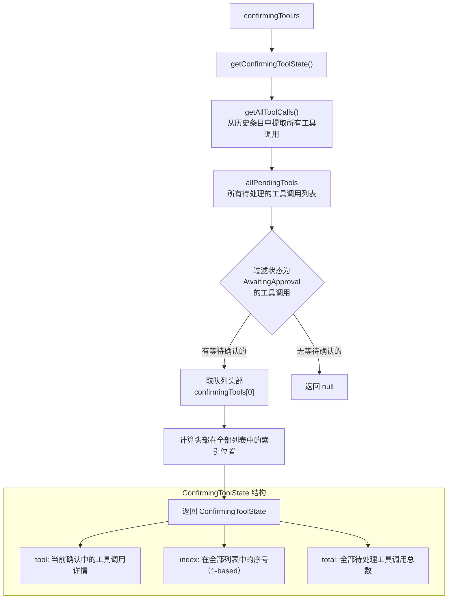
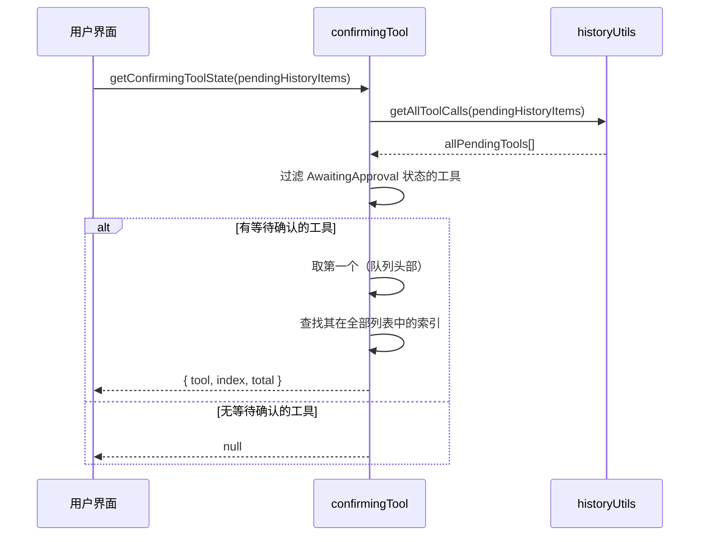

# confirmingTool.ts

## 概述

`confirmingTool.ts` 是 Gemini CLI 项目中用于管理工具调用确认队列的工具模块。当 AI Agent 请求调用需要用户批准的工具时（例如执行 shell 命令、修改文件等），这些工具调用会进入一个"待确认"队列。本模块负责从待处理的历史条目中提取出当前需要用户确认的工具调用（即队列头部），并提供其在整体待处理队列中的位置信息。

文件总计约 47 行，结构简洁，包含一个接口定义和一个核心函数。

## 架构图（Mermaid）





## 核心组件

### 1. `ConfirmingToolState` 接口

定义了确认中的工具调用状态信息：

```typescript
interface ConfirmingToolState {
  tool: IndividualToolCallDisplay;  // 当前待确认的工具调用显示对象
  index: number;                     // 在全部待处理工具列表中的序号（1-based）
  total: number;                     // 全部待处理工具调用的总数
}
```

**字段说明**：
- `tool`：包含工具调用的完整显示信息（工具名称、参数、状态、callId 等）
- `index`：从 1 开始的序号，表示当前确认的工具是全部待处理工具中的第几个。例如若有 5 个待处理工具，当前确认的是第 3 个，则 `index = 3`
- `total`：全部待处理工具调用的总数量（不仅仅是等待确认的，而是所有待处理的）

这两个数值配合使用，可在 UI 中显示类似 "确认工具调用 (3/5)" 的进度提示。

---

### 2. `getConfirmingToolState(pendingHistoryItems: HistoryItemWithoutId[]): ConfirmingToolState | null`

**功能**：从待处理的历史条目中选出确认队列的"头部"——即第一个等待用户批准的工具调用。

**处理流程**：

1. **提取全部工具调用**：调用 `getAllToolCalls(pendingHistoryItems)` 从所有待处理的历史条目中提取出全部工具调用列表 `allPendingTools`。
2. **过滤等待确认的工具**：从中过滤出状态为 `CoreToolCallStatus.AwaitingApproval` 的工具调用，得到 `confirmingTools` 列表。
3. **边界检查**：若没有等待确认的工具调用，返回 `null`。
4. **取队列头部**：取 `confirmingTools[0]` 作为当前需要确认的工具调用 `head`。
5. **计算位置**：在全部待处理工具列表 `allPendingTools` 中查找 `head` 的索引（通过 `callId` 匹配），并加 1 转为 1-based 序号。
6. **返回结果**：返回包含 `tool`、`index`、`total` 的 `ConfirmingToolState` 对象。

**设计要点**：
- `index` 基于全部待处理工具列表而非仅等待确认的列表，这样用户能看到当前确认的工具在整体流程中的位置
- 使用 `callId` 而非数组引用进行匹配，确保在复杂数据结构中准确定位

## 依赖关系

### 内部依赖

| 导入 | 来源模块 | 用途 |
|------|---------|------|
| `CoreToolCallStatus` | `@google/gemini-cli-core` | 工具调用状态枚举，用于识别 `AwaitingApproval` 状态 |
| `HistoryItemWithoutId` (类型) | `../types.js` | 不含 ID 的历史条目类型定义 |
| `IndividualToolCallDisplay` (类型) | `../types.js` | 单个工具调用的显示信息类型定义 |
| `getAllToolCalls` | `./historyUtils.js` | 从历史条目中提取所有工具调用的工具函数 |

### 外部依赖

无外部第三方依赖。

## 关键实现细节

### 确认队列的"头部"语义

函数名中的"head"指的是确认队列的第一个元素。在 Gemini CLI 中，工具调用确认采用顺序处理模型——用户一次只确认一个工具调用。`getConfirmingToolState` 始终返回第一个等待确认的工具，UI 层根据此信息显示确认对话框。

### 两层列表的区分

函数内部维护两个概念不同的列表：
1. `allPendingTools`：所有待处理的工具调用（包含各种状态，如运行中、等待确认、已完成等）
2. `confirmingTools`：仅包含状态为 `AwaitingApproval` 的工具调用子集

`index` 和 `total` 基于第一个列表（全部待处理工具），而实际返回的 `tool` 来自第二个列表（仅等待确认的工具）。这种设计让用户能同时了解"当前确认的是哪个工具"以及"整体还有多少个工具在处理"。

### 空队列的安全处理

当没有工具调用处于等待确认状态时，函数返回 `null`。调用方应据此判断是否显示确认 UI。

### 导出清单

| 导出 | 类型 |
|------|------|
| `ConfirmingToolState` | 接口（类型导出） |
| `getConfirmingToolState` | 具名导出函数 |
