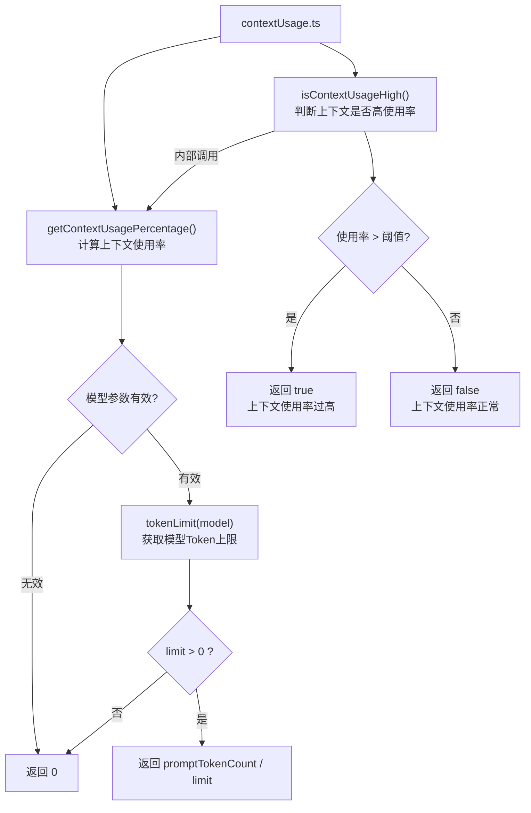
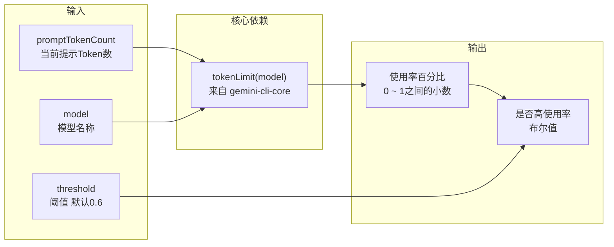

# contextUsage.ts

## 概述

`contextUsage.ts` 是 Gemini CLI 项目中用于计算和判断上下文窗口（Context Window）使用情况的工具模块。大型语言模型（LLM）具有固定的上下文窗口大小限制（Token 上限），本模块提供了两个函数来计算当前的上下文使用率以及判断是否已达到高使用率阈值。

该模块在 UI 层被用于向用户展示上下文使用进度，并在接近上限时给出警告提示，帮助用户了解当前会话还有多少可用的上下文空间。

文件总计约 30 行，极为精简，包含两个紧密关联的导出函数。

## 架构图（Mermaid）





## 核心组件

### 1. `getContextUsagePercentage(promptTokenCount: number, model: string | undefined): number`

**功能**：计算当前上下文窗口的使用率。

**参数**：
| 参数 | 类型 | 说明 |
|------|------|------|
| `promptTokenCount` | `number` | 当前提示（prompt）中使用的 Token 数量 |
| `model` | `string \| undefined` | 当前使用的模型名称（如 `"gemini-2.0-flash"` 等） |

**返回值**：`number`，取值范围为 `0` 到接近 `1` 的小数（0 表示未使用或无法计算，1 表示完全用满）。

**注意**：返回值是小数比例（如 `0.75`），而非百分比数值（如 `75`）。

**边界处理**：
1. 若 `model` 为 `undefined`、非字符串类型或空字符串，返回 `0`
2. 若 `tokenLimit(model)` 返回 `0` 或负数，返回 `0`（避免除零和无意义结果）

**计算公式**：
```
使用率 = promptTokenCount / tokenLimit(model)
```

---

### 2. `isContextUsageHigh(promptTokenCount: number, model: string | undefined, threshold?: number): boolean`

**功能**：判断当前上下文使用率是否超过指定阈值。

**参数**：
| 参数 | 类型 | 默认值 | 说明 |
|------|------|--------|------|
| `promptTokenCount` | `number` | - | 当前提示中使用的 Token 数量 |
| `model` | `string \| undefined` | - | 当前使用的模型名称 |
| `threshold` | `number` | `0.6` | 高使用率判定阈值（0 到 1 之间） |

**返回值**：`boolean`
- `true`：上下文使用率超过阈值，建议向用户发出警告
- `false`：上下文使用率在阈值以内

**默认阈值**：`0.6`（60%），即当上下文窗口使用超过 60% 时视为高使用率。

**实现**：内部直接调用 `getContextUsagePercentage` 并与阈值比较，判断使用严格大于（`>`）比较。

## 依赖关系

### 内部依赖

| 导入 | 来源模块 | 用途 |
|------|---------|------|
| `tokenLimit` | `@google/gemini-cli-core` | 根据模型名称获取该模型的 Token 上限值 |

### 外部依赖

无外部第三方依赖。唯一的依赖 `@google/gemini-cli-core` 是项目内部的核心包。

## 关键实现细节

### 返回值是比例而非百分比

`getContextUsagePercentage` 函数虽然名为 "Percentage"（百分比），但实际返回的是 `0` 到 `1` 之间的小数比例（如 `0.75`），而非 `0` 到 `100` 之间的百分比数值（如 `75`）。这一点从 `isContextUsageHigh` 的默认阈值 `0.6`（而非 `60`）可以得到验证。调用方在显示百分比时需要自行乘以 100。

### 防御性参数校验

`getContextUsagePercentage` 对 `model` 参数进行了三重校验：
1. 非 falsy 值检查（`!model`）
2. 类型检查（`typeof model !== 'string'`）
3. 非空字符串检查（`model.length === 0`）

这种防御性编程方式确保了即使在类型系统被绕过的情况下（如 JavaScript 调用），函数也不会抛出异常。

### tokenLimit 的依赖

核心计算依赖 `@google/gemini-cli-core` 包提供的 `tokenLimit` 函数。该函数负责维护不同 Gemini 模型的 Token 上限映射。当传入未知模型名称时，`tokenLimit` 可能返回 `0` 或默认值，此时 `getContextUsagePercentage` 通过 `limit <= 0` 的检查进行保护。

### 60% 默认阈值的设计含义

默认阈值设置为 `0.6`（60%）而非更高的值（如 80% 或 90%），这体现了一种保守策略：在上下文窗口使用过半时就提早提醒用户，给予充足的缓冲空间。这是因为：
1. 随着对话深入，Token 使用会快速增长
2. 接近上限时可能导致截断或降级行为
3. 提前警告让用户有时间调整策略（如开启新会话或精简上下文）

### 导出清单

| 导出函数 | 类型 |
|---------|------|
| `getContextUsagePercentage` | 具名导出 |
| `isContextUsageHigh` | 具名导出 |
