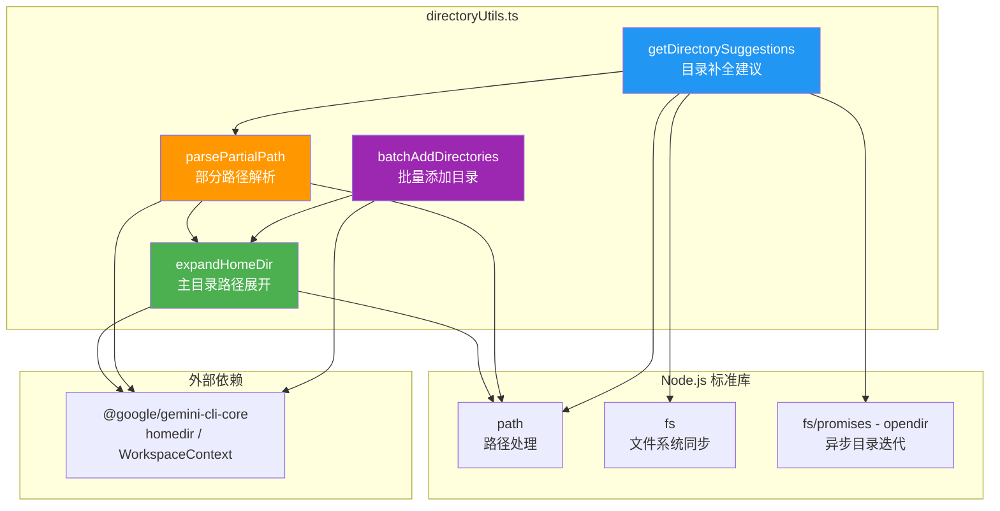

# directoryUtils.ts

## 概述

`directoryUtils.ts` 是 Gemini CLI 的目录工具模块，提供与文件系统目录操作相关的实用函数。主要功能包括：

1. **主目录路径展开**：将 `~` 或 `%USERPROFILE%` 前缀的路径展开为完整的绝对路径，兼容 macOS/Linux 和 Windows 平台。
2. **目录自动补全建议**：根据用户输入的部分路径，异步扫描文件系统并返回匹配的目录列表，支持大目录的高效处理和提前终止。
3. **批量添加工作区目录**：将多个目录路径批量添加到工作区上下文（`WorkspaceContext`），并统一处理错误。

该模块是 CLI 用户界面（UI）层的一部分，为命令行交互中的路径输入、目录切换、工作区管理等场景提供底层支持。

## 架构图（Mermaid）



## 核心组件

### 1. `expandHomeDir(p: string): string`

**功能**：将路径中的主目录缩写展开为完整的绝对路径。

**参数**：
| 参数 | 类型 | 说明 |
|------|------|------|
| `p` | `string` | 待展开的路径字符串 |

**返回值**：展开并规范化后的路径字符串。

**实现逻辑**：
- 如果路径为空，返回空字符串。
- 如果路径以 `%USERPROFILE%`（不区分大小写）开头，替换为 `homedir()` 的返回值（Windows 兼容）。
- 如果路径为 `~` 或以 `~/` 开头，替换 `~` 为 `homedir()` 的返回值（Unix 风格）。
- 最终使用 `path.normalize()` 规范化路径。

**示例**：
```
expandHomeDir("~/Documents") → "/Users/username/Documents"
expandHomeDir("%USERPROFILE%\\Desktop") → "C:\\Users\\username\\Desktop"
expandHomeDir("") → ""
```

---

### 2. `parsePartialPath(partialPath: string): ParsedPath`（内部函数）

**功能**：解析用户输入的部分路径，拆分为搜索目录、过滤条件、前缀等信息，为目录建议功能提供结构化数据。

**接口定义**：
```typescript
interface ParsedPath {
  searchDir: string;      // 需要搜索的目录路径
  filter: string;         // 用于过滤条目的前缀字符串
  isHomeExpansion: boolean; // 是否包含主目录展开（~）
  resultPrefix: string;   // 补全结果的前缀
}
```

**实现逻辑**：
1. **搜索目录与过滤条件确定**：
   - 如果输入为空或以 `/` / `path.sep` 结尾 → `searchDir` 为展开后的完整路径，`filter` 为空（列出所有内容）。
   - 否则 → `searchDir` 为路径的父目录（`path.dirname`），`filter` 为最后一段文件名（`path.basename`）。
   - 特殊情况：当输入以 `~` 开头但不包含路径分隔符时（如 `~Doc`），`searchDir` 设为主目录，`filter` 为 `~` 之后的字符。

2. **结果前缀计算**：
   - 输入为空或以分隔符结尾 → 前缀为原始输入。
   - 包含分隔符 → 前缀为最后一个分隔符及之前的部分。
   - 以 `~` 开头且无分隔符 → 前缀为 `~` + 系统路径分隔符。

---

### 3. `getDirectorySuggestions(partialPath: string): Promise<string[]>`

**功能**：根据部分路径获取目录补全建议。使用 `fs.opendir` 的异步迭代器高效处理大目录。

**参数**：
| 参数 | 类型 | 说明 |
|------|------|------|
| `partialPath` | `string` | 用户输入的部分路径 |

**返回值**：`Promise<string[]>` — 目录路径建议数组。

**实现逻辑**：
1. 调用 `parsePartialPath` 解析输入。
2. 验证 `searchDir` 是否存在且为目录，否则返回空数组。
3. 使用 `opendir` 打开目录，通过 `for await...of` 异步迭代目录条目：
   - 跳过非目录条目。
   - 跳过以 `.` 开头的隐藏目录（除非 `filter` 本身以 `.` 开头）。
   - 匹配条件：条目名称（小写）以 `filter`（小写）开头 → 不区分大小写匹配。
   - **提前终止**：当匹配数达到 `MAX_SUGGESTIONS * MATCH_BUFFER_MULTIPLIER`（50 * 3 = 150）时停止迭代，避免在超大目录中遍历所有条目。
4. 在 `finally` 块中关闭目录句柄（忽略关闭错误）。
5. 对匹配结果排序，截取前 `MAX_SUGGESTIONS`（50）个，并拼接路径前缀和用户使用的分隔符风格。
6. 外层 `try-catch` 捕获所有异常，出错时返回空数组。

**性能优化**：
- 使用 `opendir` 异步迭代器替代 `readdir`，避免一次性将所有目录条目加载到内存。
- `MATCH_BUFFER_MULTIPLIER = 3` 提供排序缓冲区：收集 150 个匹配项后排序取前 50 个，确保排序后的结果在大多数情况下与全量排序一致。

**常量**：
| 常量 | 值 | 说明 |
|------|------|------|
| `MAX_SUGGESTIONS` | `50` | 最终返回的最大建议数 |
| `MATCH_BUFFER_MULTIPLIER` | `3` | 匹配缓冲区倍数，用于提前终止策略 |

---

### 4. `batchAddDirectories(workspaceContext: WorkspaceContext, paths: string[]): BatchAddResult`

**功能**：批量将目录添加到工作区上下文中，统一处理路径展开和错误格式化。

**参数**：
| 参数 | 类型 | 说明 |
|------|------|------|
| `workspaceContext` | `WorkspaceContext` | 工作区上下文对象 |
| `paths` | `string[]` | 待添加的目录路径数组 |

**返回值**：
```typescript
interface BatchAddResult {
  added: string[];   // 成功添加的路径列表
  errors: string[];  // 错误信息列表
}
```

**实现逻辑**：
1. 对每个路径进行 `trim()` 去除首尾空白，然后通过 `expandHomeDir` 展开主目录缩写。
2. 调用 `workspaceContext.addDirectories()` 批量添加。
3. 遍历 `result.failed` 列表，将每个失败项格式化为错误消息字符串。
4. 返回包含成功列表和错误列表的结果对象。

## 依赖关系

### 内部依赖

| 依赖模块 | 导入内容 | 用途 |
|----------|----------|------|
| `@google/gemini-cli-core` | `homedir` | 获取当前用户的主目录路径 |
| `@google/gemini-cli-core` | `WorkspaceContext`（类型） | 工作区上下文类型定义，用于 `batchAddDirectories` 的参数类型 |

### 外部依赖

| 依赖模块 | 导入内容 | 用途 |
|----------|----------|------|
| `node:path` | `*`（整体导入） | 路径操作：`normalize`、`dirname`、`basename`、`sep` |
| `node:fs` | `*`（整体导入） | 同步文件系统操作：`existsSync`、`statSync` |
| `node:fs/promises` | `opendir` | 异步打开目录，获取目录迭代器 |

## 关键实现细节

### 1. 跨平台路径兼容

模块同时处理 Unix 风格（`~`、`/`）和 Windows 风格（`%USERPROFILE%`、`\`）的路径。`expandHomeDir` 函数对 `%USERPROFILE%` 进行了不区分大小写的匹配（`toLowerCase()`），确保 Windows 环境下的兼容性。在生成补全结果时，通过检测用户输入中使用的分隔符风格（`/` 或 `path.sep`）来保持输出的一致性。

### 2. 异步迭代与提前终止策略

`getDirectorySuggestions` 使用 `opendir` 返回的异步迭代器（`AsyncIterable<fs.Dirent>`），而不是 `readdir` 一次性读取所有条目。这在处理包含大量文件的目录时有显著的内存和性能优势。

提前终止策略的设计考量：
- 直接取前 50 个匹配可能导致排序不准确（字母序靠后的条目可能比靠前的更早被扫描到）。
- 使用 3 倍缓冲区（收集 150 个匹配后截断），在排序后取前 50 个，大幅降低排序偏差的概率。
- 这是一个在准确性和性能之间的工程折衷。

### 3. 隐藏目录的智能处理

默认情况下跳过以 `.` 开头的隐藏目录。但当用户的过滤条件本身以 `.` 开头时（表明用户有意查找隐藏目录），则会显示这些目录。这个行为通过 `const showHidden = filter.startsWith('.')` 实现。

### 4. 健壮的错误处理

- `getDirectorySuggestions` 的外层 `try-catch` 确保任何文件系统错误都不会导致异常冒泡，而是优雅地返回空数组。
- `dir.close()` 在 `finally` 块中执行，并附加 `.catch(() => {})` 忽略关闭错误，确保资源被正确释放。
- `batchAddDirectories` 将失败信息结构化为人类可读的错误消息，便于上层 UI 展示。

### 5. `parsePartialPath` 的 `~` 特殊处理

当用户输入类似 `~Doc` 时（以 `~` 开头但不包含路径分隔符），`path.dirname('~Doc')` 会返回 `'.'`（当前目录），这不是期望的行为。模块对此进行了特殊处理：检测到这种情况后，将 `searchDir` 设为 `homedir()`，`filter` 设为 `~` 之后的字符串（如 `Doc`），从而在主目录下搜索以 `Doc` 开头的目录。
