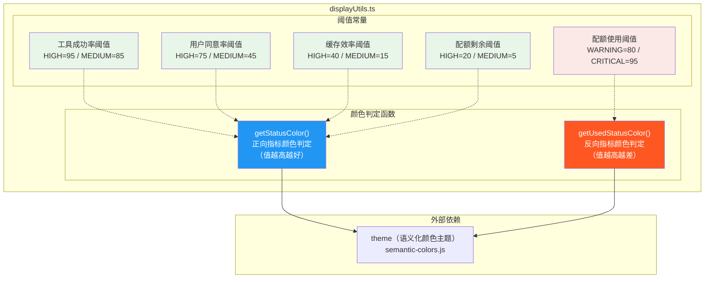

# displayUtils.ts

## 概述

`displayUtils.ts` 是 Gemini CLI 的显示工具模块，负责根据数值指标和预设阈值确定 UI 中使用的状态颜色。该模块定义了一系列阈值常量（涵盖工具成功率、用户同意率、缓存效率、配额使用等维度）以及两个核心颜色判定函数，是 CLI 状态可视化系统的基础组件。

该模块的设计哲学是将"数据→颜色"的映射逻辑集中管理，使得上层 UI 组件只需传入数值和阈值即可获得语义化的颜色，无需关心具体的颜色值或判定规则。

## 架构图（Mermaid）



## 核心组件

### 1. 阈值常量

模块定义了 5 组共 10 个阈值常量，用于不同维度的状态评估：

#### 工具成功率（Tool Success Rate）
| 常量 | 值 | 含义 |
|------|------|------|
| `TOOL_SUCCESS_RATE_HIGH` | `95` | 工具调用成功率 >= 95% 为高（绿色） |
| `TOOL_SUCCESS_RATE_MEDIUM` | `85` | 工具调用成功率 >= 85% 为中（黄色） |

#### 用户同意率（User Agreement Rate）
| 常量 | 值 | 含义 |
|------|------|------|
| `USER_AGREEMENT_RATE_HIGH` | `75` | 用户同意率 >= 75% 为高（绿色） |
| `USER_AGREEMENT_RATE_MEDIUM` | `45` | 用户同意率 >= 45% 为中（黄色） |

#### 缓存效率（Cache Efficiency）
| 常量 | 值 | 含义 |
|------|------|------|
| `CACHE_EFFICIENCY_HIGH` | `40` | 缓存命中率 >= 40% 为高（绿色） |
| `CACHE_EFFICIENCY_MEDIUM` | `15` | 缓存命中率 >= 15% 为中（黄色） |

#### 配额剩余（Quota Remaining）
| 常量 | 值 | 含义 |
|------|------|------|
| `QUOTA_THRESHOLD_HIGH` | `20` | 配额剩余 >= 20% 为充足（绿色） |
| `QUOTA_THRESHOLD_MEDIUM` | `5` | 配额剩余 >= 5% 为警告（黄色） |

#### 配额已用（Quota Used）— 反向指标
| 常量 | 值 | 含义 |
|------|------|------|
| `QUOTA_USED_WARNING_THRESHOLD` | `80` | 配额已用 >= 80% 为警告（黄色） |
| `QUOTA_USED_CRITICAL_THRESHOLD` | `95` | 配额已用 >= 95% 为严重（红色） |

---

### 2. `getStatusColor(value, thresholds, options?)`

**功能**：根据正向指标的值和阈值，返回对应的语义颜色。适用于"值越高越好"的场景（如成功率、效率等）。

**参数**：
| 参数 | 类型 | 说明 |
|------|------|------|
| `value` | `number` | 当前指标值 |
| `thresholds` | `{ green: number; yellow: number; red?: number }` | 颜色阈值配置 |
| `options` | `{ defaultColor?: string }` | 可选配置，指定默认颜色 |

**返回值**：`string` — 颜色值字符串。

**判定逻辑**（按优先级从高到低）：

```
value >= green  → theme.status.success  （绿色/成功）
value >= yellow → theme.status.warning  （黄色/警告）
value >= red    → theme.status.error    （红色/错误，仅当 red 已定义）
其他情况       → defaultColor 或 theme.status.error
```

**特点**：
- `thresholds.red` 是可选的，允许只定义两级阈值（绿/黄）。
- 使用 `!= null` 检查 `red` 是否已定义（同时排除 `null` 和 `undefined`）。
- `defaultColor` 提供了灵活的降级策略，默认为红色。

---

### 3. `getUsedStatusColor(usedPercentage, thresholds)`

**功能**：根据反向指标（已使用百分比）的值和阈值，返回对应的语义颜色。适用于"值越高越差"的场景（如配额使用率、磁盘占用率等）。

**参数**：
| 参数 | 类型 | 说明 |
|------|------|------|
| `usedPercentage` | `number` | 已使用百分比 |
| `thresholds` | `{ warning: number; critical: number }` | 阈值配置 |

**返回值**：`string | undefined` — 颜色值字符串，或 `undefined` 表示正常状态（无需特殊着色）。

**判定逻辑**：

```
usedPercentage >= critical → theme.status.error    （红色/严重）
usedPercentage >= warning  → theme.status.warning  （黄色/警告）
其他情况                   → undefined              （正常，不着色）
```

**特点**：
- 与 `getStatusColor` 不同，此函数返回 `undefined` 而非默认颜色，表示正常状态不需要特殊的视觉提示。
- 判定顺序为从严重到轻微（先检查 `critical`，再检查 `warning`），这是反向指标的标准模式。

## 依赖关系

### 内部依赖

| 依赖模块 | 导入内容 | 用途 |
|----------|----------|------|
| `../semantic-colors.js` | `theme` | 提供语义化颜色主题对象，包含 `status.success`、`status.warning`、`status.error` 等颜色定义 |

### 外部依赖

无外部依赖。该模块仅依赖项目内部的主题颜色模块。

## 关键实现细节

### 1. 正向与反向指标的分离设计

模块将指标分为两类并提供独立的判定函数：
- **正向指标**（`getStatusColor`）：值越高越好，如成功率、缓存命中率。颜色从绿到红递减。
- **反向指标**（`getUsedStatusColor`）：值越高越差，如资源使用率。颜色从正常到红递增。

这种分离避免了在单一函数中处理正反逻辑的复杂性，使调用方的语义更清晰。

### 2. 三级颜色体系

两个函数都基于 `theme.status` 的三级颜色体系：
- `success`（绿色）— 良好状态
- `warning`（黄色）— 需要注意
- `error`（红色）— 需要干预

这与常见的交通灯模型一致，用户无需学习即可理解状态含义。

### 3. `getUsedStatusColor` 返回 `undefined` 的设计意图

当使用率处于正常范围时，函数返回 `undefined` 而非绿色。这允许调用方使用默认的文本颜色，避免在正常情况下过度着色。这是一种"只在异常时才提醒"的设计理念，减少视觉噪音。

### 4. 阈值常量的导出

所有阈值常量均使用 `export const` 导出，使得：
- 上层组件可以直接引用这些阈值（如在构建阈值对象时使用 `{ green: TOOL_SUCCESS_RATE_HIGH, yellow: TOOL_SUCCESS_RATE_MEDIUM }`）。
- 测试代码可以引用相同的常量，避免魔法数字。
- 阈值的调整只需修改一处，所有使用点自动更新。
