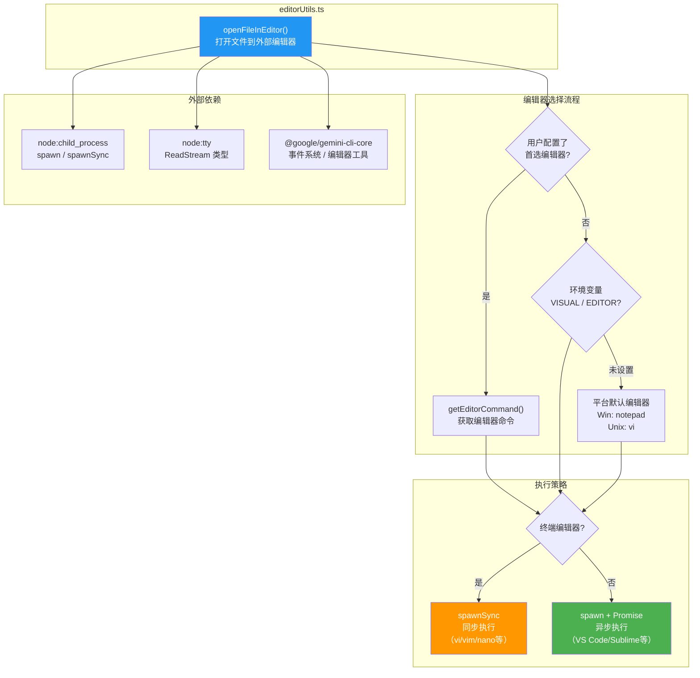

# editorUtils.ts

## 概述

`editorUtils.ts` 是 Gemini CLI 的外部编辑器集成模块，提供在命令行环境中打开外部编辑器编辑文件的能力。该模块的核心函数 `openFileInEditor` 处理了编辑器选择、终端原始模式切换、同步/异步进程管理、跨平台兼容等一系列复杂问题。

典型使用场景包括：用户需要在 CLI 交互过程中编辑配置文件、撰写较长的提示词（prompt）、或修改代码片段时，临时调起外部编辑器（如 VS Code、Vim、Nano 等），编辑完成后返回 CLI 继续操作。

## 架构图（Mermaid）



## 核心组件

### `openFileInEditor(filePath, stdin, setRawMode, preferredEditorType?): Promise<void>`

**功能**：打开指定文件到外部编辑器，等待编辑器关闭后返回。自动处理终端原始模式的保存与恢复。

**参数**：
| 参数 | 类型 | 说明 |
|------|------|------|
| `filePath` | `string` | 要编辑的文件路径 |
| `stdin` | `ReadStream \| null \| undefined` | Ink/Node 的标准输入流 |
| `setRawMode` | `(mode: boolean) => void \| undefined` | 切换终端原始模式的函数 |
| `preferredEditorType` | `EditorType`（可选） | 用户配置的首选编辑器类型 |

**返回值**：`Promise<void>` — 编辑器关闭后解析。

---

#### 编辑器选择流程（三级回退策略）

函数采用三级回退策略确定要使用的编辑器：

**第一级：用户首选编辑器（`preferredEditorType`）**
- 通过 `getEditorCommand(preferredEditorType)` 获取编辑器命令。
- 如果是 GUI 编辑器（通过 `isGuiEditor()` 判断），自动添加 `--wait` 参数，确保命令行等待编辑器窗口关闭。

**第二级：环境变量**
- 依次检查 `VISUAL` 和 `EDITOR` 环境变量（`VISUAL` 优先，遵循 Unix 惯例）。
- 智能检测 GUI 编辑器：检查命令中是否包含 `code`（VS Code）、`cursor`、`subl`（Sublime Text）、`zed`、`atom` 等关键字。
- 如果检测到 GUI 编辑器且命令中未包含 `--wait` 或 `-w` 参数，自动补充等待参数（Sublime Text 使用 `-w`，其他使用 `--wait`）。

**第三级：平台默认编辑器**
- Windows：`notepad`
- 其他平台（macOS/Linux）：`vi`

---

#### 终端编辑器检测

判断编辑器是否为终端编辑器（在终端内直接运行，如 vi、vim、nano）：

```typescript
const terminalEditors = ['vi', 'vim', 'nvim', 'emacs', 'hx', 'nano'];
```

- 如果提供了 `preferredEditorType`，使用 `isTerminalEditor()` 函数精确判断。
- 否则，通过检查可执行文件名是否包含已知终端编辑器名称来推断。

---

#### Vim 特殊处理

对于 vi/vim/nvim 编辑器，自动添加 `-i NONE` 参数：
- 禁用 viminfo 文件的读写。
- 防止在受限环境（如容器、CI）中出现 `E138: Can't write viminfo file` 错误。

---

#### 执行策略

根据编辑器类型选择不同的进程管理策略：

**终端编辑器 → `spawnSync`（同步执行）**
- 使用 `spawnSync` 同步阻塞当前进程，直到编辑器退出。
- 终端编辑器需要直接控制终端 I/O，同步执行确保不会与 Ink 的渲染循环冲突。
- `stdio: 'inherit'` 继承父进程的标准输入/输出/错误流。
- Windows 上使用 `shell: true`。

**GUI 编辑器 → `spawn` + `Promise`（异步执行）**
- 使用 `spawn` 异步启动编辑器进程。
- 返回 Promise，监听 `close` 事件等待编辑器关闭。
- 监听 `error` 事件处理启动失败的情况。
- 非零退出码视为错误。

---

#### 终端原始模式管理

```
1. 保存当前原始模式状态 → wasRaw = stdin?.isRaw
2. 关闭原始模式 → setRawMode(false)
3. 执行编辑器操作
4. [finally] 如果之前处于原始模式，恢复 → setRawMode(true)
5. [finally] 发射 ExternalEditorClosed 事件
```

这个流程确保：
- 编辑器在非原始模式下运行（可以正常接收键盘输入，包括方向键、Ctrl 组合键等）。
- 编辑器关闭后，终端模式恢复到编辑器打开前的状态。
- 无论编辑器是否成功退出，清理操作都会执行（`finally` 块）。

## 依赖关系

### 内部依赖

| 依赖模块 | 导入内容 | 用途 |
|----------|----------|------|
| `@google/gemini-cli-core` | `coreEvents` | 核心事件发射器，用于发送反馈事件和编辑器关闭事件 |
| `@google/gemini-cli-core` | `CoreEvent` | 事件枚举，使用 `CoreEvent.ExternalEditorClosed` |
| `@google/gemini-cli-core` | `EditorType`（类型） | 编辑器类型的类型定义 |
| `@google/gemini-cli-core` | `getEditorCommand` | 根据编辑器类型获取对应的命令字符串 |
| `@google/gemini-cli-core` | `isGuiEditor` | 判断编辑器类型是否为 GUI 编辑器 |
| `@google/gemini-cli-core` | `isTerminalEditor` | 判断编辑器类型是否为终端编辑器 |

### 外部依赖

| 依赖模块 | 导入内容 | 用途 |
|----------|----------|------|
| `node:child_process` | `spawn` | 异步启动子进程（用于 GUI 编辑器） |
| `node:child_process` | `spawnSync` | 同步启动子进程（用于终端编辑器） |
| `node:tty` | `ReadStream`（类型） | stdin 流的类型定义 |

## 关键实现细节

### 1. 同步 vs 异步执行的选择

这是该模块最关键的设计决策。终端编辑器（如 vim）需要完全接管终端的标准输入输出，如果使用异步 `spawn`，Ink 的渲染循环可能会与编辑器的终端操作冲突，导致显示异常或输入被截获。因此终端编辑器使用 `spawnSync` 阻塞 Node.js 事件循环，确保编辑器独占终端。

GUI 编辑器（如 VS Code）在独立窗口中运行，不需要终端 I/O，使用异步 `spawn` 可以避免阻塞事件循环。

### 2. `--wait` 参数的自动注入

GUI 编辑器默认在后台运行（命令立即返回），这会导致 CLI 在用户开始编辑之前就继续执行。通过自动注入 `--wait` 参数，CLI 会等待编辑器窗口关闭后才继续。模块对不同编辑器的等待参数进行了区分处理：
- Sublime Text：使用 `-w`（其较早版本不支持 `--wait`）
- 其他 GUI 编辑器：使用 `--wait`

### 3. 命令字符串的解析

编辑器命令可能包含空格分隔的参数（如 `code --new-window`）。函数使用 `command.split(' ')` 将命令拆分为可执行文件和初始参数：

```typescript
const [executable = '', ...initialArgs] = command.split(' ');
```

然后将初始参数与文件路径参数合并：`[...initialArgs, ...args]`。

### 4. 错误处理与事件通知

所有错误路径都通过 `coreEvents.emitFeedback('error', ...)` 发送反馈事件，使得上层组件可以捕获并显示编辑器相关的错误信息。错误信息包含 `[editorUtils]` 前缀，便于日志筛选和问题定位。

`finally` 块中发射的 `CoreEvent.ExternalEditorClosed` 事件，通知其他组件编辑器已关闭，可以进行后续操作（如重新读取文件内容、刷新 UI 等）。

### 5. Windows 兼容性

在 Windows 平台上，`spawn` 和 `spawnSync` 均设置 `shell: true`，通过 `cmd.exe` 执行命令。这确保了系统命令（如 `notepad`）能够正确解析和执行，同时支持 `PATH` 环境变量中的命令查找。
