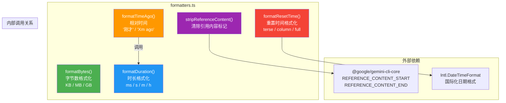

# formatters.ts

## 概述

`formatters.ts` 是 Gemini CLI 的格式化工具模块，提供一系列将原始数据（字节数、时间戳、时长等）转换为人类可读字符串的纯函数。该模块是 CLI 用户界面中数据展示层的核心组件，确保所有数据以统一、简洁、易读的格式呈现给用户。

模块包含 5 个导出函数：
1. **`formatBytes`** — 字节数格式化（KB/MB/GB）
2. **`formatDuration`** — 时长格式化（ms/s/m/h）
3. **`formatTimeAgo`** — 相对时间格式化（"刚才" / "5m 前"）
4. **`formatResetTime`** — 重置时间格式化（支持多种显示格式）
5. **`stripReferenceContent`** — 引用内容标记清除

## 架构图（Mermaid）

## 核心组件

### 1. `formatBytes(bytes: number): string`

**功能**：将字节数格式化为带单位的可读字符串。

**参数**：
| 参数 | 类型 | 说明 |
|------|------|------|
| `bytes` | `number` | 字节数 |

**返回值**：格式化后的字符串（如 `"1.5 MB"`）。

**转换规则**：
| 条件 | 输出格式 | 精度 | 示例 |
|------|----------|------|------|
| `bytes < 1 MB`（1,048,576） | `X.X KB` | 1 位小数 | `512.0 KB` |
| `bytes < 1 GB`（1,073,741,824） | `X.X MB` | 1 位小数 | `25.3 MB` |
| `bytes >= 1 GB` | `X.XX GB` | 2 位小数 | `1.50 GB` |

**注意**：使用二进制单位（1 KB = 1024 bytes），非十进制单位（1 KB = 1000 bytes）。

---

### 2. `formatDuration(milliseconds: number): string`

**功能**：将毫秒时长格式化为简洁的人类可读字符串，省略值为零的时间单位。

**参数**：
| 参数 | 类型 | 说明 |
|------|------|------|
| `milliseconds` | `number` | 时长（毫秒） |

**返回值**：格式化后的时长字符串。

**转换规则**（按优先级）：

| 条件 | 输出格式 | 示例 |
|------|----------|------|
| `<= 0` | `"0s"` | `0s` |
| `< 1000 ms` | `Xms`（取整） | `450ms` |
| `< 60 s` | `X.Xs`（1 位小数） | `12.5s` |
| `>= 60 s` | 组合格式，省略零值单位 | `1h 5s`、`2m 30s`、`1h 15m 3s` |

**实现细节**：
- 对于 >= 60 秒的时长，时/分/秒均使用 `Math.floor` 取整。
- 空部分（值为 0）不参与拼接。
- 特殊情况：如果所有部分在取整后均为 0（理论上不应发生，因为 `totalSeconds >= 60`），返回最大非零单位。

---

### 3. `formatTimeAgo(date: string | number | Date): string`

**功能**：将日期/时间转换为相对于当前时间的描述字符串。

**参数**：
| 参数 | 类型 | 说明 |
|------|------|------|
| `date` | `string \| number \| Date` | 过去的时间点，支持多种格式 |

**返回值**：相对时间描述字符串。

**转换规则**：

| 条件 | 输出 | 示例 |
|------|------|------|
| 无效日期 | `"invalid date"` | — |
| 差值 < 60 秒 | `"just now"` | — |
| 差值 >= 60 秒 | `"{formatDuration(diff)} ago"` | `"5m 30s ago"`、`"2h 15m ago"` |

**特点**：
- 接受多种输入格式（字符串、Unix 时间戳、Date 对象），通过 `new Date(date)` 统一解析。
- 复用 `formatDuration` 函数格式化时长部分，保持输出风格一致。
- 使用 `isNaN(past.getTime())` 检测无效日期输入。

---

### 4. `stripReferenceContent(text: string): string`

**功能**：从文本中移除引用内容标记及其包裹的内容。

**参数**：
| 参数 | 类型 | 说明 |
|------|------|------|
| `text` | `string` | 可能包含引用内容块的文本 |

**返回值**：移除引用内容块并 `trim()` 后的文本。

**实现逻辑**：
- 构建正则表达式：`\n?{REFERENCE_CONTENT_START}[\s\S]*?{REFERENCE_CONTENT_END}`
  - `\n?` — 可选的前导换行符
  - `[\s\S]*?` — 非贪婪匹配任意内容（包括换行符）
  - `g` 标志 — 全局匹配，移除所有引用块
- 使用 `String.prototype.replace()` 将匹配到的内容替换为空字符串。
- 最终对结果调用 `trim()` 去除首尾空白。

**用途**：在向用户展示模型响应时，移除内部使用的引用内容标记，避免暴露内部格式。

---

### 5. `formatResetTime(resetTime, format?): string`

**功能**：将配额/限额的重置时间格式化为人类可读的字符串，支持三种显示格式。

**参数**：
| 参数 | 类型 | 默认值 | 说明 |
|------|------|--------|------|
| `resetTime` | `string \| undefined` | — | 重置时间的 ISO 字符串 |
| `format` | `'terse' \| 'column' \| 'full'` | `'full'` | 输出格式 |

**返回值**：格式化后的字符串，或空字符串（如果输入无效或已过期）。

**前置检查**：
- `resetTime` 为空 → 返回 `""`
- 解析后的日期无效 → 返回 `""`
- 重置时间已过（`diff <= 0`） → 返回 `""`

**三种输出格式**：

| 格式 | 说明 | 示例 |
|------|------|------|
| `terse` | 仅显示剩余时长的简短格式 | `"1h 30m"`、`"45m"` |
| `column` | 显示具体时间和剩余时长 | `"3:30 PM (1h 30m)"` |
| `full` | 完整格式，包含时长、时间和时区 | `"1 hour 30 minutes at 3:30 PM EST"` |

**`terse` 格式**：
- 拼接小时（如有）和分钟（如有），用空格分隔。
- 示例：`"1h 30m"`、`"2h"`、`"15m"`。

**`column` 格式**：
- 使用 `Intl.DateTimeFormat('en-US', { hour: 'numeric', minute: 'numeric' })` 格式化具体时间。
- 如果有剩余时长，附加在括号中：`"3:30 PM (1h 30m)"`。
- 如果无剩余时长，仅显示时间：`"3:30 PM"`。

**`full` 格式**：
- 使用完整的英文单词（`hour/hours`、`minute/minutes`），带复数处理。
- 使用 `Intl.DateTimeFormat` 格式化时间，包含时区缩写（`timeZoneName: 'short'`）。
- 格式：`"{duration} at {time}"`，如 `"1 hour 30 minutes at 3:30 PM EST"`。

**实现细节**：
- 使用 `Math.ceil` 向上取整分钟数（对用户更友好，避免显示"0 分钟"）。
- `Intl.DateTimeFormat` 提供国际化支持和平台一致的时间格式化。

## 依赖关系

### 内部依赖

| 依赖模块 | 导入内容 | 用途 |
|----------|----------|------|
| `@google/gemini-cli-core` | `REFERENCE_CONTENT_START` | 引用内容的开始标记字符串 |
| `@google/gemini-cli-core` | `REFERENCE_CONTENT_END` | 引用内容的结束标记字符串 |

### 外部依赖

| 依赖 | 用途 |
|------|------|
| `Intl.DateTimeFormat`（JavaScript 内置） | 国际化日期/时间格式化，用于 `formatResetTime` 中的时间显示 |

该模块无第三方外部依赖，仅依赖 JavaScript 内置 API 和项目内部的常量定义。

## 关键实现细节

### 1. 纯函数设计

模块中的所有函数都是纯函数（`stripReferenceContent`、`formatBytes`、`formatDuration`）或接近纯函数（`formatTimeAgo` 和 `formatResetTime` 依赖当前时间 `new Date()`）。纯函数的特性使得这些工具函数：
- 易于单元测试（输入确定则输出确定）。
- 无副作用，可在任何上下文中安全调用。
- 可组合使用（如 `formatTimeAgo` 内部调用 `formatDuration`）。

### 2. 二进制 vs 十进制单位

`formatBytes` 使用二进制单位（1 KB = 1024 bytes），这是操作系统和开发工具中的常见约定。但需注意，严格来说二进制单位应使用 KiB/MiB/GiB 后缀。模块选择了更广泛使用的 KB/MB/GB 后缀，符合大多数 CLI 工具的习惯。

### 3. `formatDuration` 的分段策略

函数针对不同量级采用不同的格式化策略：
- **亚秒级**（< 1s）：显示毫秒，取整（`Math.round`），适用于性能计量。
- **秒级**（1s - 60s）：显示到小数点后 1 位的秒数（`toFixed(1)`），提供精确的短时间度量。
- **分钟级以上**（>= 60s）：使用时/分/秒组合格式，仅显示整数，省略零值单位。

这种分段策略确保在不同量级下都能提供最合适的精度和可读性。

### 4. `formatResetTime` 的防御性编程

函数对多种异常输入进行了防御：
- `undefined` 或空字符串输入 → 早期返回空字符串。
- 无法解析的日期字符串 → `isNaN` 检测后返回空字符串。
- 已过期的重置时间（`diff <= 0`） → 返回空字符串。

这些检查确保函数在任何输入下都不会抛出异常或返回误导性的信息。

### 5. `stripReferenceContent` 的正则表达式设计

- 使用 `[\s\S]*?` 而非 `.*?` 来匹配任意内容，因为 `.` 默认不匹配换行符，而引用内容块通常跨越多行。
- `*?` 非贪婪量词确保在存在多个引用块时，每个块被独立匹配和移除，而不是从第一个开始标记到最后一个结束标记的全部内容被当作一个整体移除。
- `\n?` 可选前导换行符的匹配，避免移除引用块后在文本中留下多余的空行。
