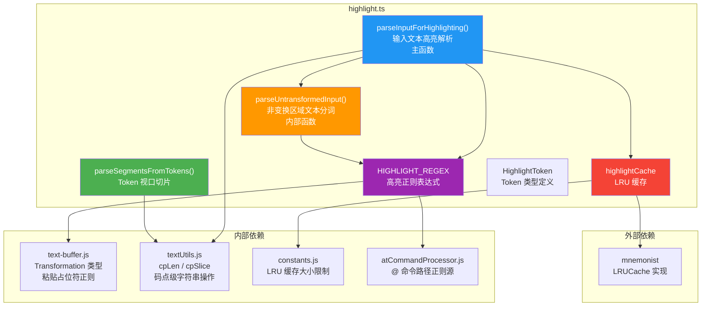

# highlight.ts

## 概述

`highlight.ts` 是 Gemini CLI 的输入文本语法高亮模块，负责将用户在命令行中输入的文本解析为带有类型标记的 token 序列，以便 UI 渲染层对不同类型的内容（命令、文件引用、粘贴占位符、普通文本）施加不同的颜色样式。

该模块的核心能力包括：
1. **输入文本分词**：使用正则表达式将文本拆分为斜杠命令（`/help`）、`@` 文件引用（`@file.ts`）、粘贴文本占位符（`[Pasted Text: 6 lines]`）和普通文本。
2. **Transformation 处理**：支持文本变换（如文件路径折叠/展开），当光标位于变换区域内时显示完整文本，否则显示折叠后的文本。
3. **视口切片**：从 token 序列中提取指定码点范围的片段，用于水平滚动场景下仅渲染可见区域。
4. **LRU 缓存**：对解析结果进行缓存，避免频繁重复解析带来的性能开销。

## 架构图（Mermaid）



## 核心组件

### 1. `HighlightToken` 类型

```typescript
type HighlightToken = {
  text: string;
  type: 'default' | 'command' | 'file' | 'paste';
};
```

每个 token 包含文本内容和类型标记：

| 类型 | 含义 | 匹配规则 | 示例 |
|------|------|----------|------|
| `default` | 普通文本 | 不匹配任何特殊模式的文本 | `hello world` |
| `command` | 斜杠命令 | 以 `/` 开头，后跟字母、数字、下划线或连字符 | `/help`、`/clear` |
| `file` | 文件/资源引用 | 以 `@` 开头（非转义），或 Transformation 区域 | `@file.ts`、`@file:///path` |
| `paste` | 粘贴文本占位符 | 匹配 `[Pasted Text: N lines]` 模式 | `[Pasted Text: 6 lines]` |

---

### 2. `HIGHLIGHT_REGEX` — 高亮正则表达式

```typescript
const HIGHLIGHT_REGEX = new RegExp(
  `(^/[a-zA-Z0-9_-]+|(?<!\\\\)@${AT_COMMAND_PATH_REGEX_SOURCE}|${PASTED_TEXT_PLACEHOLDER_REGEX.source})`,
  'g',
);
```

该正则表达式由三部分通过 `|`（或）连接：

| 部分 | 模式 | 说明 |
|------|------|------|
| 斜杠命令 | `^/[a-zA-Z0-9_-]+` | 行首的 `/` 后跟一个或多个字母/数字/下划线/连字符 |
| @ 文件引用 | `(?<!\\)@{AT_COMMAND_PATH_REGEX_SOURCE}` | 非转义的 `@` 后跟路径模式（与命令处理器共享正则源） |
| 粘贴占位符 | `{PASTED_TEXT_PLACEHOLDER_REGEX.source}` | 匹配 `[Pasted Text: N lines]` 格式 |

**设计要点**：
- `@` 引用使用 `(?<!\\\\)` 负向后行断言，允许用户通过 `\@` 转义来避免触发高亮。
- `@` 路径模式复用 `AT_COMMAND_PATH_REGEX_SOURCE`，确保高亮与命令处理逻辑的匹配规则完全一致。
- 支持 URI 格式（如 `@file:///example.txt`）和包含 Unicode 空格（如 NNBSP）的文件名。

---

### 3. `highlightCache` — LRU 缓存

```typescript
const highlightCache = new LRUCache<string, readonly HighlightToken[]>(
  LRU_BUFFER_PERF_CACHE_LIMIT,
);
```

基于 `mnemonist` 库的 LRU（最近最少使用）缓存，缓存解析结果以避免重复计算。

**缓存键格式**：
```
{行标记}:{光标标记}:{文本内容}
```

| 部分 | 值 | 说明 |
|------|------|------|
| 行标记 | `F` 或 `N` | `F`（First）表示第一行（`index === 0`），`N` 表示非第一行 |
| 光标标记 | `{cursorCol}` 或 `NC` | 光标在 Transformation 内时为光标列号，否则为 `NC`（No Cursor） |
| 文本内容 | 原始文本 | 输入的文本字符串 |

**设计考量**：
- 行标记的区分是因为斜杠命令只在第一行有效（`index === 0`），非首行的 `/help` 被视为普通文本。
- 光标位置影响 Transformation 的展示方式（折叠 vs 展开），因此需要纳入缓存键。
- 当光标不在任何 Transformation 内时使用统一标记 `NC`，提高缓存命中率。

---

### 4. `parseInputForHighlighting(text, index, transformations?, cursorCol?): readonly HighlightToken[]`

**功能**：将输入文本解析为高亮 token 序列，是该模块的主函数。

**参数**：
| 参数 | 类型 | 默认值 | 说明 |
|------|------|--------|------|
| `text` | `string` | — | 输入文本 |
| `index` | `number` | — | 行索引（0 表示第一行） |
| `transformations` | `Transformation[]` | `[]` | 文本变换列表（如路径折叠） |
| `cursorCol` | `number`（可选） | — | 当前光标列位置（码点单位） |

**返回值**：`readonly HighlightToken[]` — 不可变的 token 数组。

**处理流程**：

```
1. 检查光标是否在某个 Transformation 内部
2. 构建缓存键，查询缓存 → 命中则直接返回
3. 文本为空 → 返回 [{ text: '', type: 'default' }]
4. 对 Transformation 列表按 logStart 排序
5. 遍历每个 Transformation：
   a. 对 Transformation 前的普通文本调用 parseUntransformedInput() 分词
   b. 根据光标位置决定显示 Transformation 的完整文本或折叠文本
   c. Transformation 区域标记为 'file' 类型
6. 对最后一个 Transformation 之后的文本调用 parseUntransformedInput()
7. 将结果存入缓存并返回
```

**内部函数 `parseUntransformedInput(text)`**：
- 对非 Transformation 区域的文本进行正则分词。
- 使用 `HIGHLIGHT_REGEX.exec()` 循环匹配。
- 匹配间隔的文本标记为 `default` 类型。
- 斜杠命令在非首行（`index !== 0`）时降级为 `default` 类型。
- 根据匹配文本的首字符确定类型：`/` → `command`，`@` → `file`，其他 → `paste`。

---

### 5. `parseSegmentsFromTokens(tokens, sliceStart, sliceEnd): readonly HighlightToken[]`

**功能**：从 token 序列中提取指定码点范围的片段，用于水平滚动时仅渲染可见区域。

**参数**：
| 参数 | 类型 | 说明 |
|------|------|------|
| `tokens` | `readonly HighlightToken[]` | 完整的 token 序列 |
| `sliceStart` | `number` | 切片起始位置（码点索引） |
| `sliceEnd` | `number` | 切片结束位置（码点索引，不包含） |

**返回值**：`readonly HighlightToken[]` — 切片后的 token 数组。

**实现逻辑**：
1. 如果 `sliceStart >= sliceEnd`，返回空数组。
2. 遍历每个 token，计算其在码点坐标系中的起止位置。
3. 计算 token 与切片范围的重叠区域（`overlapStart` / `overlapEnd`）。
4. 如果存在重叠，使用 `cpSlice` 提取 token 内的对应片段。
5. **合并优化**：如果相邻的片段类型相同，合并为一个 token（避免产生过多的小 token）。
6. 使用 `cpLen` 和 `cpSlice` 进行码点级操作，正确处理多字节 Unicode 字符（如 emoji、中文）。

## 依赖关系

### 内部依赖

| 依赖模块 | 导入内容 | 用途 |
|----------|----------|------|
| `../components/shared/text-buffer.js` | `Transformation`（类型） | 文本变换的类型定义，包含 `logStart`、`logEnd`、`logicalText`、`collapsedText` 等字段 |
| `../components/shared/text-buffer.js` | `PASTED_TEXT_PLACEHOLDER_REGEX` | 粘贴文本占位符的正则表达式，用于构建 `HIGHLIGHT_REGEX` |
| `./textUtils.js` | `cpLen` | 计算字符串的码点长度（而非 UTF-16 编码单元长度） |
| `./textUtils.js` | `cpSlice` | 按码点范围切片字符串 |
| `../constants.js` | `LRU_BUFFER_PERF_CACHE_LIMIT` | LRU 缓存的容量上限 |
| `../hooks/atCommandProcessor.js` | `AT_COMMAND_PATH_REGEX_SOURCE` | `@` 命令路径匹配的正则表达式源字符串 |

### 外部依赖

| 依赖模块 | 导入内容 | 用途 |
|----------|----------|------|
| `mnemonist` | `LRUCache` | 高性能 LRU 缓存实现，用于缓存高亮解析结果 |

## 关键实现细节

### 1. 码点级字符串操作

JavaScript 的 `String.prototype.length` 和 `String.prototype.slice()` 基于 UTF-16 编码单元，对于 BMP 之外的 Unicode 字符（如 emoji）会给出错误的长度和切片结果。该模块通过 `cpLen` 和 `cpSlice`（来自 `textUtils.js`）在码点（code point）级别操作字符串，确保：
- 多字节字符不会被错误拆分。
- 切片范围准确对应视觉上的字符位置。
- 中文、日文等 CJK 字符和 emoji 被正确处理。

### 2. Transformation 的折叠/展开机制

Transformation 是一种文本替换机制，典型用例是将长文件路径折叠为短标签：
- `logicalText`：原始的完整文本（如 `/Users/user/project/src/components/App.tsx`）
- `collapsedText`：折叠后的显示文本（如 `App.tsx`）
- `logStart` / `logEnd`：在逻辑文本中的起止位置

当光标位于 Transformation 区域内（`cursorCol >= logStart && cursorCol <= logEnd`）时，显示 `logicalText`（用户可能正在编辑该路径）；否则显示 `collapsedText`（节省空间）。

### 3. 正则表达式的 `lastIndex` 重置

由于 `HIGHLIGHT_REGEX` 使用了 `g`（全局）标志，`exec()` 方法会在连续调用间维护 `lastIndex` 状态。如果不在每次使用前重置 `lastIndex = 0`，可能会导致：
- 从上次匹配的位置开始搜索，漏掉开头的匹配。
- 在缓存命中后直接返回，`lastIndex` 残留影响下次调用。

代码在两处进行了重置：
- `parseInputForHighlighting` 函数开头。
- `parseUntransformedInput` 内部函数开头。

### 4. 缓存键的设计与命中率优化

缓存键 `{F|N}:{cursorCol|NC}:{text}` 的设计体现了几个权衡：
- **行索引简化为布尔标记**（首行/非首行）：因为行索引只影响斜杠命令是否被高亮，实际上只有"首行"和"非首行"两种情况。
- **光标位置的条件纳入**：只有当光标在 Transformation 内部时才将光标列号纳入缓存键，否则统一使用 `NC`。这避免了用户在普通文本区域移动光标时产生大量不同的缓存条目。
- **文本内容直接作为缓存键的一部分**：简单直接，适用于通常较短的输入文本。

### 5. 斜杠命令的首行限制

斜杠命令（如 `/help`、`/clear`）只在输入的第一行生效。在 `parseUntransformedInput` 中，当 `index !== 0` 时，即使正则匹配到了 `/` 开头的模式，也会将其类型设为 `default` 而非 `command`。这确保了高亮行为与命令解析器的行为一致：用户在多行输入的非首行中的 `/` 开头文本不会被错误地高亮为命令。

### 6. `parseSegmentsFromTokens` 的合并优化

在对 token 进行切片时，一个 token 可能跨越切片边界，被拆分为两部分。如果相邻的两个切片结果类型相同（例如一个 `default` token 被切片后与下一个 `default` token 相邻），函数会将它们合并为一个 token：

```typescript
const last = segments[segments.length - 1];
if (last && last.type === token.type) {
  last.text += rawSlice;  // 合并到上一个 token
} else {
  segments.push({ type: token.type, text: rawSlice });  // 新建 token
}
```

这减少了渲染层需要处理的 token 数量，有助于提升渲染性能。
