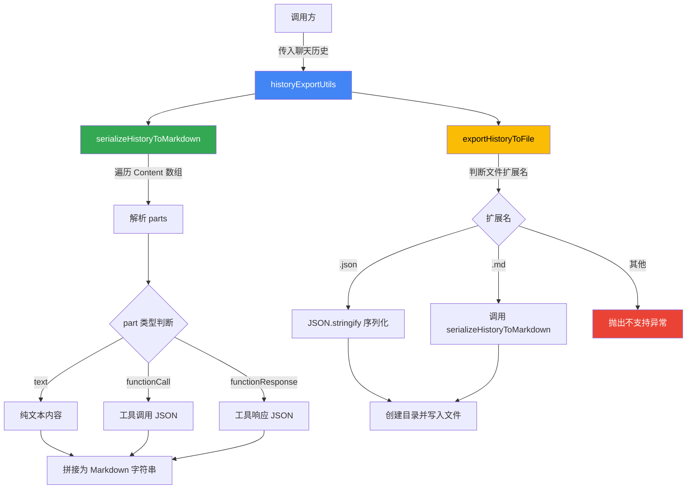

# historyExportUtils.ts

## 概述

`historyExportUtils.ts` 是 Gemini CLI 项目中负责 **聊天历史记录导出** 的工具模块。它提供了将聊天历史序列化为 Markdown 格式字符串，以及将聊天历史导出到文件（支持 JSON 和 Markdown 两种格式）的功能。该模块是用户导出对话记录的核心实现。

文件路径: `packages/cli/src/ui/utils/historyExportUtils.ts`

## 架构图（Mermaid）



## 核心组件

### 1. `serializeHistoryToMarkdown` 函数

**签名:**
```typescript
export function serializeHistoryToMarkdown(
  history: readonly Content[],
): string
```

**功能:** 将聊天历史记录数组序列化为 Markdown 格式的字符串。

**处理逻辑:**
- 遍历 `history` 数组中的每一个 `Content` 对象
- 对每个 `Content` 的 `parts` 数组进行映射处理:
  - **纯文本 (`part.text`)**: 直接返回文本内容
  - **工具调用 (`part.functionCall`)**: 格式化为 `**Tool Command**` 标题 + JSON 代码块
  - **工具响应 (`part.functionResponse`)**: 格式化为 `**Tool Response**` 标题 + JSON 代码块
  - **其他情况**: 返回空字符串
- 根据角色添加图标: 用户角色使用 `🧑‍💻`，模型角色使用 `✨`
- 每条消息格式化为 `## ROLE icon` 的二级标题
- 消息之间使用 `---` 水平分割线连接

**输出示例:**
```markdown
## USER 🧑‍💻

用户的问题内容

---

## MODEL ✨

模型的回答内容

**Tool Command**:
```json
{ "name": "tool_name", "args": {} }
```
```

### 2. `ExportHistoryOptions` 接口

**定义:**
```typescript
export interface ExportHistoryOptions {
  history: readonly Content[];
  filePath: string;
}
```

**字段说明:**
| 字段 | 类型 | 说明 |
|------|------|------|
| `history` | `readonly Content[]` | 只读的聊天历史内容数组 |
| `filePath` | `string` | 导出文件的目标路径 |

### 3. `exportHistoryToFile` 函数

**签名:**
```typescript
export async function exportHistoryToFile(
  options: ExportHistoryOptions,
): Promise<void>
```

**功能:** 将聊天历史导出到指定路径的文件中。

**处理逻辑:**
1. 从 `options` 中解构获取 `history` 和 `filePath`
2. 使用 `path.extname` 获取文件扩展名并转为小写
3. 根据扩展名选择序列化方式:
   - `.json`: 使用 `JSON.stringify` 以 2 空格缩进格式化
   - `.md`: 调用 `serializeHistoryToMarkdown` 函数
   - 其他扩展名: 抛出 `Error`，提示仅支持 `.json` 或 `.md`
4. 使用 `fsPromises.mkdir` 递归创建目标目录（确保目录存在）
5. 使用 `fsPromises.writeFile` 以 UTF-8 编码写入文件

**错误处理:**
- 不支持的文件扩展名会抛出明确的错误信息: `Unsupported file extension: ${extension}. Use .json or .md.`

## 依赖关系

### 内部依赖

无内部模块依赖。该模块是一个纯工具模块，不依赖项目内的其他模块。

### 外部依赖

| 依赖 | 来源 | 用途 |
|------|------|------|
| `fsPromises` | `node:fs/promises` | 异步文件系统操作（创建目录、写入文件） |
| `path` | `node:path` | 路径处理（获取扩展名、获取目录名） |
| `Content` (类型) | `@google/genai` | Google Generative AI SDK 提供的聊天内容类型定义 |

## 关键实现细节

1. **只读数组约束**: `history` 参数使用 `readonly Content[]` 类型，确保函数不会修改传入的聊天历史数据，体现了不可变数据的设计原则。

2. **Part 类型的优先级处理**: 在解析 `parts` 时，按照 `text` -> `functionCall` -> `functionResponse` 的顺序进行判断。如果一个 part 同时包含多种属性，只会返回第一个匹配的内容。

3. **自动创建目录**: `exportHistoryToFile` 在写入文件前会使用 `recursive: true` 选项自动创建所有必需的父目录，避免因目录不存在而导致写入失败。

4. **角色标识**: 使用 emoji 图标区分用户（`🧑‍💻`）和模型（`✨`）角色。当 `role` 为空时，默认显示为 `model`。

5. **JSON 格式化**: 工具调用和响应的 JSON 数据使用 2 空格缩进进行美化输出，包裹在 Markdown 代码块中以便阅读。导出为 `.json` 格式时同样使用 2 空格缩进。

6. **分隔符设计**: 各消息之间使用 `\n\n---\n\n` 分隔，即空行 + 水平线 + 空行，在 Markdown 渲染时能清晰地分隔每条消息。

7. **同步与异步分离**: `serializeHistoryToMarkdown` 是同步函数（纯数据转换），而 `exportHistoryToFile` 是异步函数（涉及文件 I/O），职责划分清晰。
