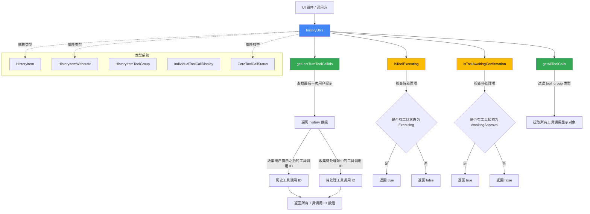

# historyUtils.ts

## 概述

`historyUtils.ts` 是 Gemini CLI 项目中负责 **聊天历史记录查询与状态判断** 的工具模块。它提供了一组纯函数，用于从聊天历史和待处理历史项目中提取工具调用信息、判断工具执行状态（正在执行、等待确认等）。该模块是 UI 层与核心工具调用状态之间的桥梁。

文件路径: `packages/cli/src/ui/utils/historyUtils.ts`

## 架构图（Mermaid）



## 核心组件

### 1. `getLastTurnToolCallIds` 函数

**签名:**
```typescript
export function getLastTurnToolCallIds(
  history: HistoryItem[],
  pendingHistoryItems: HistoryItemWithoutId[],
): string[]
```

**功能:** 获取最后一轮对话中所有工具调用的 ID 列表。

**处理逻辑:**
1. **查找最后一次用户提示的位置**: 从 `history` 数组末尾向前遍历，找到类型为 `'user'` 或 `'user_shell'` 的最后一个条目索引 (`lastUserPromptIndex`)。
2. **收集历史中的工具调用 ID**: 遍历 `history`，对于索引大于 `lastUserPromptIndex` 且类型为 `'tool_group'` 的条目，提取其中每个工具的 `callId`。
3. **收集待处理项中的工具调用 ID**: 遍历 `pendingHistoryItems`，对于类型为 `'tool_group'` 的条目，同样提取 `callId`。
4. 返回合并后的所有工具调用 ID 数组。

**使用场景:** 用于确定当前轮次（从用户最后一次输入到现在）有哪些工具调用正在进行或已完成，以便 UI 可以定位和渲染这些工具调用的状态。

### 2. `isToolExecuting` 函数

**签名:**
```typescript
export function isToolExecuting(
  pendingHistoryItems: HistoryItemWithoutId[],
): boolean
```

**功能:** 判断待处理的历史项目中是否有工具正在执行。

**处理逻辑:**
- 使用 `Array.some` 遍历 `pendingHistoryItems`
- 对于类型为 `'tool_group'` 的条目，检查其 `tools` 数组中是否有任一工具的 `status` 等于 `CoreToolCallStatus.Executing`
- 只要有一个工具正在执行就返回 `true`

**使用场景:** UI 可以根据此函数判断是否需要显示加载动画或禁止用户输入。

### 3. `isToolAwaitingConfirmation` 函数

**签名:**
```typescript
export function isToolAwaitingConfirmation(
  pendingHistoryItems: HistoryItemWithoutId[],
): boolean
```

**功能:** 判断待处理的历史项目中是否有工具正在等待用户确认。

**处理逻辑:**
- 先使用 `filter` 配合类型守卫 `(item): item is HistoryItemToolGroup` 过滤出所有 `'tool_group'` 类型的条目
- 再使用 `some` 检查是否有工具的 `status` 等于 `CoreToolCallStatus.AwaitingApproval`

**使用场景:** UI 可以根据此函数判断是否需要弹出确认对话框，让用户批准某些需要授权的工具操作（如文件写入、命令执行等）。

### 4. `getAllToolCalls` 函数

**签名:**
```typescript
export function getAllToolCalls(
  historyItems: HistoryItemWithoutId[],
): IndividualToolCallDisplay[]
```

**功能:** 从历史项目中提取所有工具调用的显示对象。

**处理逻辑:**
- 使用 `filter` 配合类型守卫过滤出所有 `'tool_group'` 类型的条目
- 使用 `flatMap` 将每个工具组的 `tools` 数组展平为一个一维数组
- 返回 `IndividualToolCallDisplay[]` 类型的工具调用显示对象数组

**使用场景:** 当需要在 UI 中展示所有工具调用的汇总视图时使用。

## 依赖关系

### 内部依赖

| 依赖 | 来源 | 用途 |
|------|------|------|
| `CoreToolCallStatus` | `../types.js` (re-exported from `@google/gemini-cli-core`) | 工具调用状态枚举，用于状态判断 |
| `HistoryItem` | `../types.js` | 带 ID 的历史记录条目类型 |
| `HistoryItemWithoutId` | `../types.js` | 不带 ID 的历史记录条目类型（联合类型） |
| `HistoryItemToolGroup` | `../types.js` | 工具组类型的历史记录条目 |
| `IndividualToolCallDisplay` | `../types.js` | 单个工具调用的显示信息接口 |

### 外部依赖

无直接外部依赖。所有类型和枚举均通过 `../types.js` 间接引入，最终来源于 `@google/gemini-cli-core`。

## 关键实现细节

1. **"最后一轮"的定义**: `getLastTurnToolCallIds` 通过查找最后一个 `'user'` 或 `'user_shell'` 类型的历史条目来界定"当前轮次"。所有在该条目之后的工具调用都被视为当前轮次的一部分。这意味着如果用户连续发送多条消息，只有最后一条消息之后的工具调用会被收集。

2. **双数据源合并**: `getLastTurnToolCallIds` 同时从 `history`（已确认的历史记录）和 `pendingHistoryItems`（尚未提交到历史记录的待处理项）中收集工具调用 ID，确保了完整性——既包含已完成的工具调用，也包含正在进行中的工具调用。

3. **类型守卫的使用**: `isToolAwaitingConfirmation` 和 `getAllToolCalls` 使用了 TypeScript 类型守卫 `(item): item is HistoryItemToolGroup`，在过滤的同时完成类型收窄，使后续代码可以安全地访问 `HistoryItemToolGroup` 特有的 `tools` 属性。

4. **CoreToolCallStatus 枚举值**: 该模块使用了两个关键的状态值:
   - `CoreToolCallStatus.Executing`: 工具正在执行中
   - `CoreToolCallStatus.AwaitingApproval`: 工具等待用户批准

   完整的枚举还包括 `Validating`、`Success`、`Cancelled`、`Error`、`Scheduled` 等状态。

5. **纯函数设计**: 所有四个函数都是纯函数，不产生副作用，仅根据输入数据计算并返回结果。这使得它们易于测试和组合使用。

6. **HistoryItem vs HistoryItemWithoutId**: `HistoryItem` 是带有 `id: number` 属性的完整历史条目，而 `HistoryItemWithoutId` 是不含 ID 的联合类型。`getLastTurnToolCallIds` 需要 `HistoryItem[]`（因为需要通过索引定位），而其他函数只需要 `HistoryItemWithoutId[]`（不需要 ID 信息）。
