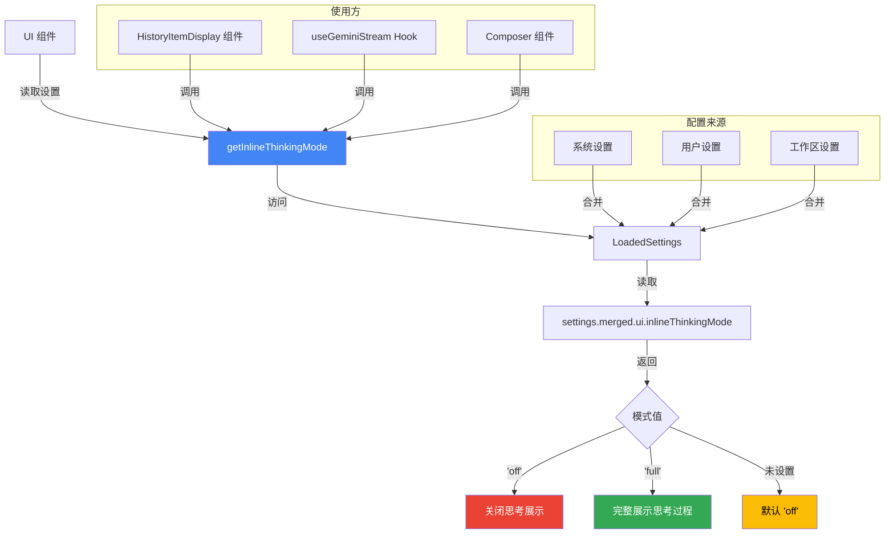

# inlineThinkingMode.ts

## 概述

`inlineThinkingMode.ts` 是 Gemini CLI 项目中负责 **内联思考模式配置读取** 的工具模块。它定义了内联思考模式的类型，并提供了一个从用户设置中获取当前内联思考模式的函数。"内联思考"指的是模型在生成回答过程中的中间思考过程是否在终端 UI 中直接显示给用户。

文件路径: `packages/cli/src/ui/utils/inlineThinkingMode.ts`

## 架构图（Mermaid）



## 核心组件

### 1. `InlineThinkingMode` 类型

**定义:**
```typescript
export type InlineThinkingMode = 'off' | 'full';
```

**说明:** 一个字面量联合类型，表示内联思考模式的两种可选值:

| 值 | 含义 | 效果 |
|------|------|------|
| `'off'` | 关闭 | 不在终端中显示模型的思考过程，用户只能看到最终生成的回答 |
| `'full'` | 完整显示 | 在终端中完整展示模型的中间思考过程（Thinking Message），让用户可以观察模型的推理链路 |

### 2. `getInlineThinkingMode` 函数

**签名:**
```typescript
export function getInlineThinkingMode(
  settings: LoadedSettings,
): InlineThinkingMode
```

**功能:** 从加载的设置对象中读取内联思考模式配置。

**处理逻辑:**
- 访问 `settings.merged.ui?.inlineThinkingMode` 获取用户配置的模式值
- 使用空值合并运算符 `??` 提供默认值 `'off'`
- 如果 `settings.merged.ui` 为 `undefined` 或 `inlineThinkingMode` 未设置，均返回 `'off'`

**参数说明:**
| 参数 | 类型 | 说明 |
|------|------|------|
| `settings` | `LoadedSettings` | 已加载的设置对象，包含系统、用户和工作区设置的合并结果 |

**返回值:** `InlineThinkingMode` —— `'off'` 或 `'full'`

## 依赖关系

### 内部依赖

| 依赖 | 来源 | 用途 |
|------|------|------|
| `LoadedSettings` (类型) | `../../config/settings.js` | 已加载的设置类，包含 `merged` 属性，其中存放了系统、用户、工作区三层设置合并后的最终配置 |

### 外部依赖

无外部依赖。

## 关键实现细节

1. **设置合并机制**: `LoadedSettings` 类会将三层配置（系统默认设置 `systemDefaults`、用户设置 `user`、工作区设置 `workspace`）合并为 `merged` 对象。`getInlineThinkingMode` 直接读取合并后的结果，因此遵循设置的优先级规则（工作区 > 用户 > 系统默认）。

2. **默认值策略**:
   - 代码层面: 使用 `??` 运算符设置默认值为 `'off'`
   - 配置 Schema 层面: 在 `settingsSchema.ts` 中，`inlineThinkingMode` 配置项的 `default` 也是 `'off'`
   - 两层防御确保无论配置缺失还是未定义，行为都一致

3. **配置 Schema 定义** (来自 `settingsSchema.ts`):
   ```typescript
   inlineThinkingMode: {
     type: 'enum',
     label: 'Inline Thinking',
     category: 'UI',
     requiresRestart: false,
     default: 'off',
     description: 'Display model thinking inline: off or full.',
     showInDialog: true,
     options: [
       { value: 'off', label: 'Off' },
       { value: 'full', label: 'Full' },
     ],
   }
   ```
   - 该设置不需要重启 (`requiresRestart: false`)，修改后立即生效
   - 在设置对话框中可见 (`showInDialog: true`)
   - 属于 UI 类别 (`category: 'UI'`)

4. **使用场景**:
   - **`HistoryItemDisplay` 组件**: 根据 `inlineThinkingMode` 决定是否渲染 `ThinkingMessage` 组件。当模式为 `'off'` 时，类型为 `'thinking'` 的历史条目不会被渲染。同时还影响思考消息后面的第一条消息是否需要额外的顶部外边距。
   - **`useGeminiStream` Hook**: 在处理流式响应时，根据模式决定是否将模型的思考过程推送到历史记录中。
   - **`Composer` 组件**: 在组合器中根据模式调整显示行为。

5. **可选链的防御性编程**: `settings.merged.ui?.inlineThinkingMode` 使用了可选链 (`?.`)，即使 `ui` 对象不存在也不会抛出错误，而是安全地返回 `undefined`，随后被 `??` 捕获为默认值。

6. **模块设计极简**: 整个模块仅有 1 个类型定义和 1 个函数，职责极其单一——只负责读取内联思考模式配置。这种设计使得该逻辑可被多个 UI 组件和 Hook 复用，避免了配置读取逻辑的重复。
