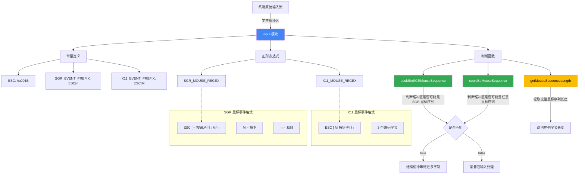

# input.ts

## 概述

`input.ts` 是 Gemini CLI 项目中负责 **终端鼠标输入事件解析** 的底层工具模块。它定义了用于识别和解析终端鼠标转义序列的常量、正则表达式和工具函数。该模块支持两种主要的终端鼠标事件编码协议：**SGR（Select Graphic Rendition）模式** 和 **X11 传统模式**，用于在终端 UI 中实现鼠标交互功能（如点击、滚动等）。

文件路径: `packages/cli/src/ui/utils/input.ts`

## 架构图（Mermaid）



## 核心组件

### 1. 转义序列常量

```typescript
export const ESC = '\u001B';
export const SGR_EVENT_PREFIX = `${ESC}[<`;
export const X11_EVENT_PREFIX = `${ESC}[M`;
```

| 常量 | 值 | 说明 |
|------|------|------|
| `ESC` | `\u001B` (即 `\x1b`) | ASCII 转义字符，所有终端转义序列的起始字符 |
| `SGR_EVENT_PREFIX` | `ESC[<` | SGR 编码鼠标事件的前缀。SGR 模式是现代终端推荐的鼠标报告方式 |
| `X11_EVENT_PREFIX` | `ESC[M` | X11 传统编码鼠标事件的前缀。X11 模式是较老的鼠标报告方式 |

### 2. 鼠标事件正则表达式

```typescript
export const SGR_MOUSE_REGEX = /^\x1b\[<(\d+);(\d+);(\d+)([mM])/;
export const X11_MOUSE_REGEX = /^\x1b\[M([\s\S]{3})/;
```

#### SGR_MOUSE_REGEX

**格式:** `ESC [ < 按钮编号 ; 列号 ; 行号 终止符`

| 捕获组 | 内容 | 说明 |
|--------|------|------|
| `(\d+)` 第 1 组 | 按钮编号 | 编码了按钮类型和修饰键信息（左键=0, 中键=1, 右键=2, 滚轮上=64, 滚轮下=65 等） |
| `(\d+)` 第 2 组 | 列号 | 鼠标位置的列（从 1 开始） |
| `(\d+)` 第 3 组 | 行号 | 鼠标位置的行（从 1 开始） |
| `([mM])` 第 4 组 | 终止符 | `M` 表示按下事件，`m` 表示释放事件 |

**示例:** `\x1b[<0;15;3M` 表示在第 3 行第 15 列按下左键

#### X11_MOUSE_REGEX

**格式:** `ESC [ M 按钮字节 列字节 行字节`

| 捕获组 | 内容 | 说明 |
|--------|------|------|
| `([\s\S]{3})` | 3 个编码字节 | 分别编码按钮、列、行信息。每个字节的值 = 实际值 + 32（空格的 ASCII 码），以避免产生控制字符 |

**局限性:** X11 模式的每个字节最多表示 223 的值（255-32），因此在超过 223 列/行时会出现问题。SGR 模式无此限制。

### 3. `couldBeSGRMouseSequence` 函数

**签名:**
```typescript
export function couldBeSGRMouseSequence(buffer: string): boolean
```

**功能:** 判断缓冲区内容是否**有可能是**一个 SGR 鼠标事件序列（完整或部分）。

**处理逻辑:**
1. 空缓冲区 -> 返回 `true`（空缓冲区可以成为任何序列的开头）
2. `SGR_EVENT_PREFIX.startsWith(buffer)` -> 检查缓冲区是否是 SGR 前缀的**前几个字符**（如 `\x1b`、`\x1b[`）
3. `buffer.startsWith(SGR_EVENT_PREFIX)` -> 检查缓冲区是否**以** SGR 前缀开头（已接收到完整前缀，可能正在等待后续数据）

**使用场景:** 在逐字符接收终端输入时，用于判断是否需要继续缓冲等待更多字符（而不是将部分转义序列当作普通输入处理）。

### 4. `couldBeMouseSequence` 函数

**签名:**
```typescript
export function couldBeMouseSequence(buffer: string): boolean
```

**功能:** 判断缓冲区内容是否**有可能是**任意类型的鼠标事件序列（SGR 或 X11）。

**处理逻辑:**
1. 空缓冲区 -> 返回 `true`
2. 检查是否是 SGR 鼠标序列的前缀/开头
3. 检查是否是 X11 鼠标序列的前缀/开头
4. 两者都不匹配 -> 返回 `false`

**与 `couldBeSGRMouseSequence` 的区别:** 该函数同时检查 SGR 和 X11 两种协议，而 `couldBeSGRMouseSequence` 仅检查 SGR。

### 5. `getMouseSequenceLength` 函数

**签名:**
```typescript
export function getMouseSequenceLength(buffer: string): number
```

**功能:** 检查缓冲区**开头**是否包含一个完整的鼠标事件序列，如果是则返回该序列的长度。

**处理逻辑:**
1. 先尝试用 `SGR_MOUSE_REGEX` 匹配缓冲区
2. 如果 SGR 匹配成功，返回匹配到的序列长度
3. 否则尝试用 `X11_MOUSE_REGEX` 匹配
4. 如果 X11 匹配成功，返回匹配到的序列长度
5. 都不匹配，返回 `0`

**返回值说明:**
| 返回值 | 含义 |
|--------|------|
| `> 0` | 缓冲区开头包含一个完整的鼠标序列，值为序列的字符长度 |
| `0` | 缓冲区开头不是一个完整的鼠标序列 |

**使用场景:** 在解析输入流时，用于确定需要消耗多少字符来处理一个鼠标事件，剩余字符可以继续作为后续输入处理。

## 依赖关系

### 内部依赖

无内部依赖。该模块是一个完全独立的底层工具模块。

### 外部依赖

无外部依赖。该模块仅使用 JavaScript/TypeScript 原生功能（字符串操作、正则表达式）。

## 关键实现细节

1. **双协议支持**: 模块同时支持 SGR 和 X11 两种鼠标报告协议:
   - **SGR (Select Graphic Rendition)**: 现代终端推荐的方式，数字以十进制 ASCII 表示，没有坐标上限，能区分按下和释放事件
   - **X11**: 传统方式，使用单字节编码，坐标上限为 223，更加紧凑但有局限性

   大多数现代终端模拟器（如 iTerm2、GNOME Terminal、Windows Terminal 等）都优先使用 SGR 模式。

2. **前缀匹配的双向检查**: `couldBeSGRMouseSequence` 和 `couldBeMouseSequence` 中使用了两种互补的检查方式:
   - `SGR_EVENT_PREFIX.startsWith(buffer)`: 缓冲区比前缀短，检查它是否是前缀的开头部分
   - `buffer.startsWith(SGR_EVENT_PREFIX)`: 缓冲区比前缀长或相等，检查它是否以前缀开头

   这种双向检查覆盖了输入流的所有中间状态。

3. **正则表达式的锚定**: 两个正则表达式都使用了 `^` 锚定在字符串开头，确保只匹配缓冲区开头的鼠标序列，而不是中间位置的。这对于正确解析混合了鼠标事件和普通输入的缓冲区至关重要。

4. **X11 正则中的 `[\s\S]`**: `X11_MOUSE_REGEX` 使用 `[\s\S]{3}` 而非 `.{3}` 来匹配 3 个字节，因为 `.` 在默认模式下不匹配换行符，而鼠标事件的编码字节可能包含任意值（包括值为 10 的换行符）。

5. **ESLint 抑制注释**: 两个正则表达式前都有 `// eslint-disable-next-line no-control-regex` 注释，因为正则中包含了控制字符 `\x1b`，ESLint 默认会对此发出警告，但在终端输入解析场景中这是必要且正确的。

6. **缓冲区策略**: 这些函数的设计体现了终端输入处理中常见的"缓冲-判断-消费"模式:
   - 当收到字符时，先用 `couldBeMouseSequence` 判断是否可能是鼠标序列的一部分
   - 如果可能，继续缓冲等待更多字符
   - 当缓冲区足够长时，用 `getMouseSequenceLength` 尝试提取完整的鼠标事件
   - 如果提取成功，消费相应长度的字符；如果确定不是鼠标序列，将缓冲区作为普通输入处理

7. **纯函数设计**: 所有函数都是无状态的纯函数，不维护任何内部状态。缓冲区的管理由调用方负责。这种设计使得函数易于测试和在不同上下文中复用。
